# 📚 รวมสกิลทุกอาชีพ (All Class Skills Database)

รวบรวมข้อมูลสกิลของทุกอาชีพใน **Clover Idle Story (KMS v232.2)** อย่างละเอียดครบถ้วนทั้ง **50 อาชีพ** ตั้งแต่ **คลาส 1 ถึง คลาส 5 (5th Job V-Matrix)** พร้อมภาพไอคอนสกิลแท้, ค่าดาเมจเปอร์เซ็นต์ (Damage %), จำนวนครั้งที่โจมตี (Hit), คูลดาวน์ (Cooldown), และจำนวนเป้าหมายสูงสุด เพื่อใช้เป็นคู่มืออ้างอิงสำหรับการอัปเกรดตัวละครและการจัดปุ่มสกิลบอทอัตโนมัติ (`@bot` / `@autoplay`)

> 💡 **หมายเหตุเกี่ยวกับค่าดาเมจและสเตตัสในตาราง:**  
> * ค่า **ดาเมจ (%)**, **จำนวน Hit**, และ **คูลดาวน์** ทั้งหมดในตารางนี้ คำนวณที่ **เลเวลสูงสุด (Max Level)** ของแต่ละสกิลตามข้อมูลจริงในไฟล์เกม Client WZ
>   * **คลาส 1 - 3:** คำนวณที่ Max Level ของแต่ละสกิล (เวล 10 - 20)
>   * **คลาส 4:** คำนวณที่ Max Level 30 (อัป Master Book เต็ม)
>   * **Hyper Skills:** คำนวณที่ Max Level 1
>   * **คลาส 5 (V-Matrix):** คำนวณที่ Node Level 25 - 30 (เลเวลเมทริกซ์เต็ม)
> * ผู้เล่นจึงสามารถใช้เป็นค่าอ้างอิงของพลังทำลายล้างสูงสุดจริงของแต่ละสกิลได้ทันที

---

## 🧭 สารบัญด่วนเลือกดูตามสายอาชีพ (Quick Navigation)

* [🛡️ สายนักรบ (Warriors - 13 อาชีพ)](#-1-สายนักรบ-warriors---13-อาชีพ)
* [🔮 สายนักเวท (Magicians - 12 อาชีพ)](#-2-สายนักเวท-magicians---12-อาชีพ)
* [🏹 สายนักธนู (Archers - 7 อาชีพ)](#-3-สายนักธนู-archers---7-อาชีพ)
* [🗡️ สายโจร (Thieves - 8 อาชีพ)](#-4-สายโจร-thieves---8-อาชีพ)
* [⚓ สายโจรสลัด (Pirates - 10 อาชีพ)](#-5-สายโจรสลัด-pirates---10-อาชีพ)

---

## 🛡️ 1. สายนักรบ (Warriors - 13 อาชีพ)

### 1. Hero (ฮีโร่) (Explorer)
* **สเตตัสหลัก:** STR | **อาวุธประจำตัว:** ดาบสองมือ / ขวานสองมือ

| ไอคอน | คลาส | ชื่อสกิล | ดาเมจ (%) | Hit | คูลดาวน์ | เป้าหมาย | บทบาท & จุดเด่น |
| :---: | :---: | :--- | :---: | :---: | :---: | :---: | :--- |
|  | **คลาส 1** | **Slash Blast** | 415% | 1 Hit | ไม่มี (0s) | 6 ตัว | สกิลฟันกวาดระยะประชิดรอบตัว |
|  | **คลาส 2** | **Combo Attack** | - | - | ไม่มี (0s) | - | เปิดใช้งานระบบเก็บลูกแก้วคอมโบเพื่อเพิ่มพลังโจมตี |
|  | **คลาส 2** | **Combo Fury** | 203% | 2 Hit | 8 วิ | 8 ตัว | พุ่งลากมอนสเตอร์เข้ามาฟันพร้อมสะสมคอมโบ |
|  | **คลาส 3** | **Panic** | 1300% | 1 Hit | 100 วิ | 6 ตัว | ฟาดดาบระเบิดคอมโบ ลดพลังโจมตีศัตรูและตาบอด |
|  | **คลาส 3** | **Shout** | 250% | 6 Hit | 10 วิ | 12 ตัว | คำรามคลื่นเสียงสตั๊นมอนสเตอร์รอบตัวเป็นวงกว้าง |
|  | **คลาส 4** | **Raging Blow** | 200% | 7 Hit | ไม่มี (0s) | 8 ตัว | สกิลฟาร์มและโจมตีหลัก ฟันต่อเนื่องรวดเร็ว (ติดคริ 100% ในฮิตสุดท้าย) |
|  | **คลาส 4** | **Puncture** | 576% | 4 Hit | 30 วิ | 8 ตัว | แทงทะลวงเกราะ ทำให้ศัตรูติดดีบัฟรับดาเมจคริติคอลแรงขึ้น |
|  | **คลาส 4** | **Enrage** | - | - | 21000000 วิ | 2 ตัว | เปลี่ยนการโจมตีทั้งหมดเป็นเป้าเดี่ยวเพื่อสังหารบอสอย่างรุนแรง |
|  | **Hyper** | **Rising Rage** | 500% | 8 Hit | 10 วิ | 10 ตัว | สกิลเสาดาบเพลิงทะลวงฟ้า คูลดาวน์สั้น กวาดมอนสเตอร์ทั้งฉาก |
|  | **Hyper** | **Cry Valhalla** | - | - | 150 วิ | - | ปลุกพลังวัลฮัลลา เพิ่มพลังโจมตีและต้านทานสถานะผิดปกติ 100% |
|  | **คลาส 5** | **Burning Soul Blade** | - | - | 180 วิ | 10 ตัว | ดาบเพลิงวิญญาณ ปักลงพื้นช่วยโจมตีอัตโนมัติหรือถือฟัน |
|  | **คลาส 5** | **Worldreaver** | 880% | 14 Hit | 20 วิ | 15 ตัว | ผ่ามิติฟันทำลายล้างทั้งหน้าจอ มอบสถานะอมตะชั่วขณะ |
|  | **คลาส 5** | **Combo Instinct** | 440% | 6 Hit | ไม่มี (0s) | 6 ตัว | ปลดปล่อยสัญชาตญาณดาบฟันรอยแยกมิติโจมตีต่อเนื่อง |
|  | **คลาส 5** | **Sword Illusion** | 275% | 4 Hit | 30 วิ | 8 ตัว | ภาพลวงตาดาบฟันทะลุเกราะอย่างรวดเร็วก่อนระเบิดรอบทิศ |

---

### 2. Paladin (พาลาดิน) (Explorer)
* **สเตตัสหลัก:** STR | **อาวุธประจำตัว:** ดาบ / กระบอง

| ไอคอน | คลาส | ชื่อสกิล | ดาเมจ (%) | Hit | คูลดาวน์ | เป้าหมาย | บทบาท & จุดเด่น |
| :---: | :---: | :--- | :---: | :---: | :---: | :---: | :--- |
|  | **คลาส 1** | **Slash Blast** | 415% | 1 Hit | ไม่มี (0s) | 6 ตัว | สกิลฟันกวาดระยะประชิดรอบตัว |
| 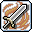 | **คลาส 2** | **Flame Charge** | 160% | 3 Hit | 8 วิ | 4 ตัว | เคลือบอาวุธด้วยธาตุไฟ เผาไหม้เป้าหมายต่อเนื่อง |
|  | **คลาส 2** | **Blizzard Charge** | 160% | 3 Hit | 8 วิ | 4 ตัว | เคลือบอาวุธด้วยธาตุน้ำแข็ง ชะลอความเร็วศัตรู |
|  | **คลาส 3** | **Lightning Charge** | 280% | 3 Hit | 8 วิ | 6 ตัว | เคลือบอาวุธด้วยสายฟ้า สตั๊นและโจมตีสายฟ้าฟาด |
|  | **คลาส 3** | **Threaten** | - | - | 260 วิ | - | คำรามข่มขวัญ ลดพลังป้องกัน (DEF) และพลังโจมตีของบอส |
|  | **คลาส 4** | **Divine Charge** | 454% | 3 Hit | 10 วิ | 6 ตัว | เคลือบอาวุธด้วยพลังศักดิ์สิทธิ์ กวาดมอนสเตอร์วงกว้างมาก |
|  | **คลาส 4** | **Blast** | 285% | 9 Hit | ไม่มี (0s) | 1 ตัว | สกิลแทงบอสเดี่ยว 9 Hit รุนแรงที่สุด พร้อมรับบัฟพลังป้องกัน |
|  | **คลาส 4** | **Heaven's Hammer** | 570% | 8 Hit | 15 วิ | 15 ตัว | ค้อนยักษ์จากสวรรค์ฟาดทำลายมอนสเตอร์ทั้งจอ |
|  | **Hyper** | **Smite Shield** | 500% | 6 Hit | 120 วิ | 15 ตัว | ปาโล่แสงศักดิ์สิทธิ์ บังคับติดสถานะ Bind หยุดบอส 10 วินาที |
|  | **Hyper** | **Sacrosanctity** | - | - | 300 วิ | - | ร่างศักดิ์สิทธิ์อมตะ 100% ไม่รับดาเมจใดๆ เป็นเวลา 30 วินาที |
| 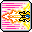 | **คลาส 5** | **Divine Echo** | 680% | 6 Hit | 75 วิ | 8 ตัว | สะท้อนสกิลทั้งหมดไปยังเพื่อนในปาร์ตี้เพื่อช่วยทำดาเมจ |
|  | **คลาส 5** | **Hammers of the Righteous** | 1155% | 3 Hit | 60 วิ | 8 ตัว | ค้อนศักดิ์สิทธิ์ 3 อันหมุนรอบตัวกวาดมอนสเตอร์รอบทิศ |
|  | **คลาส 5** | **Grand Cross** | 385% | 12 Hit | 150 วิ | 12 ตัว | กางเขนแสงศักดิ์สิทธิ์ขนาดยักษ์ระเบิดดาเมจมหาศาล |
|  | **คลาส 5** | **Mighty Mjolnir** | 495% | 6 Hit | ไม่มี (0s) | 4 ตัว | ปาค้อนมยอลเนียร์สายฟ้า เด้งทะลวงไปมาระหว่างศัตรู |

---

### 3. Dark Knight (ดาร์กไนท์) (Explorer)
* **สเตตัสหลัก:** STR | **อาวุธประจำตัว:** หอก / โพลอาร์ม

| ไอคอน | คลาส | ชื่อสกิล | ดาเมจ (%) | Hit | คูลดาวน์ | เป้าหมาย | บทบาท & จุดเด่น |
| :---: | :---: | :--- | :---: | :---: | :---: | :---: | :--- |
|  | **คลาส 1** | **Slash Blast** | 415% | 1 Hit | ไม่มี (0s) | 6 ตัว | สกิลฟันกวาดระยะประชิดรอบตัว |
|  | **คลาส 2** | **Piercing Drive** | 221% | 2 Hit | ไม่มี (0s) | 8 ตัว | แทงหอกทะลวงมอนสเตอร์ด้านหน้าอย่างรวดเร็ว |
|  | **คลาส 3** | **La Mancha Spear** | 161% | 1 Hit | 8 วิ | 10 ตัว | ควงหอกกังหันลมต่อเนื่องรอบทิศทาง |
| 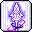 | **คลาส 3** | **Cross Surge** | - | - | 260 วิ | - | บัฟเพิ่มพลังโจมตีตามสัดส่วน HP ที่มีอยู่สูงสุด |
|  | **คลาส 4** | **Dark Impale** | 280% | 7 Hit | ไม่มี (0s) | 8 ตัว | แทงหอกความมืดวงกว้างและรวดเร็ว สกิลฟาร์มหลัก |
|  | **คลาส 4** | **Gungnir's Descent** | 225% | 12 Hit | 8 วิ | 1 ตัว | ทวนกุงเนียร์ตกจากฟ้า สกิลโจมตีบอสเดี่ยวอันทรงพลัง |
|  | **คลาส 4** | **Sacrifice** | - | - | 70 วิ | - | สละวิญญาณแห่งความมืดเพื่อขจัดคูลดาวน์ของ Gungnir |
|  | **Hyper** | **Dark Synthesis** | 330% | 10 Hit | 10 วิ | 10 ตัว | ระเบิดคลื่นพลังมืดกวาดล้างศัตรูทั้งหน้าจอ |
|  | **Hyper** | **Dark Thirst** | - | - | 120 วิ | - | กระหายเลือด เพิ่มพลังโจมตีสูงมากและดูดเลือดทุกการโจมตี |
|  | **คลาส 5** | **Spear of Darkness** | 715% | 7 Hit | 10 วิ | 12 ตัว | พุ่งหอกยักษ์แห่งความมืด ทะลวงมอนสเตอร์เป็นทางยาว |
|  | **คลาส 5** | **Radiant Evil** | 130% | 6 Hit | 20 วิ | 10 ตัว | เสาดำแห่งความมืดกลืนกินพื้นดิน ทำดาเมจต่อเนื่อง |
|  | **คลาส 5** | **Calamitous Cyclones** | 880% | 12 Hit | 180 วิ | 12 ตัว | พายุหมุนเคียวแห่งความตาย ดึงมอนสเตอร์เข้ามารับดาเมจ |
|  | **คลาส 5** | **Darkness Aura** | 550% | 9 Hit | ไม่มี (0s) | 6 ตัว | ออร่าความมืดสะสมพลังและระเบิดสร้างดาเมจรอบตัว |

---

### 4. Dawn Warrior (ดอว์น วอริเออร์) (Cygnus Knights)
* **สเตตัสหลัก:** STR | **อาวุธประจำตัว:** ดาบสองมือ

| ไอคอน | คลาส | ชื่อสกิล | ดาเมจ (%) | Hit | คูลดาวน์ | เป้าหมาย | บทบาท & จุดเด่น |
| :---: | :---: | :--- | :---: | :---: | :---: | :---: | :--- |
|  | **คลาส 1** | **Triple Slash** | 240% | - | 400 วิ | - | ฟันดาบ 3 จังหวะไปด้านหน้า |
|  | **คลาส 2** | **Moon Strike** | - | - | - | - | ฟันดาบจันทราลอยตัวขึ้นสู่ท้องฟ้า |
|  | **คลาส 3** | **Moon Shadow** | - | - | ไม่มี (0s) | - | ควงดาบจันทร์เสี้ยวกวาดมอนสเตอร์รอบตัว |
|  | **คลาส 4** | **Lunar Divide** | 295% | 6 Hit | ไม่มี (0s) | 7 ตัว | ฟันดาบจันทร์ดับวงกว้างมาก เคลียร์มอนสเตอร์ยอดเยี่ยม |
|  | **คลาส 4** | **Solar Slash** | 295% | 6 Hit | ไม่มี (0s) | 7 ตัว | ฟันดาบสุริยันระเบิดไฟอย่างรวดเร็ว |
|  | **คลาส 4** | **Cosmic Shower** | 240% | 6 Hit | 5 วิ | 7 ตัว | เรียกอุกกาบาตดาวตกลงมาสร้างอาณาเขตทำดาเมจ |
|  | **Hyper** | **Cosmic Burst** | 160% | 5 Hit | 20 วิ | 15 ตัว | ระเบิดอัญมณีจักรวาลสร้างความเสียหายรอบทิศทาง |
|  | **Hyper** | **Soul Forge** | - | - | 180 วิ | - | หลอมรวมจิตวิญญาณแห่งดาบ เพิ่มดาเมจและพลังโจมตี |
|  | **คลาส 5** | **Celestial Dance** | - | - | 180 วิ | - | ระบำสุริยันจันทรา โจมตีประสานเงาทั้งสองขั้ว |
|  | **คลาส 5** | **Rift of Damnation** | 1150% | 6 Hit | 180 วิ | 15 ตัว | ฟันรอยแยกมิติแห่งจักรวาล ฟาดฟันมอนสเตอร์ทั้งจอ |
|  | **คลาส 5** | **Soul Eclipse** | 990% | 7 Hit | 180 วิ | 15 ตัว | สุริยุปราคาบดบังท้องฟ้าและระเบิดคลื่นแสงสุริยัน |
|  | **คลาส 5** | **Flare Slash** | - | - | 25 วิ | - | ดาบสุริยเพลิงปะทุอัตโนมัติทุกครั้งที่โจมตี |

---

### 5. Mihile (มิฮาเอล) (Cygnus Knights)
* **สเตตัสหลัก:** STR | **อาวุธประจำตัว:** ดาบมือเดียว + โล่ Soul Shield

| ไอคอน | คลาส | ชื่อสกิล | ดาเมจ (%) | Hit | คูลดาวน์ | เป้าหมาย | บทบาท & จุดเด่น |
| :---: | :---: | :--- | :---: | :---: | :---: | :---: | :--- |
|  | **คลาส 1** | **Royal Guard** | 390% | - | ไม่มี (0s) | 5 ตัว | ยกโล่เคาน์เตอร์ดาเมจสวนกลับ 100% พร้อมมอบบัฟอมตะ |
|  | **คลาส 2** | **Radiant Driver** | 673% | 1 Hit | ไม่มี (0s) | 6 ตัว | พุ่งแทงโล่ผลักมอนสเตอร์เป็นกลุ่มไปข้างหน้า |
|  | **คลาส 3** | **Trinity** | - | - | 60 วิ | 10 ตัว | แทงดาบแสงศักดิ์สิทธิ์ 3 จังหวะต่อเนื่อง |
|  | **คลาส 4** | **Radiant Cross** | 210% | 11 Hit | 10 วิ | 2 ตัว | ดาบกางเขนแสงขนาดใหญ่ ฟันกวาดทั้งหน้าจอ สกิลฟาร์มหลัก |
|  | **คลาส 4** | **Deadly Charge** | 440% | 4 Hit | 10 วิ | 7 ตัว | เรียกอัศวินพุ่งชนสร้างความเสียหายและบัฟปาร์ตี้ |
|  | **Hyper** | **Sacred Cube** | 600% | 10 Hit | 15 วิ | 15 ตัว | ลูกบาศก์แสงศักดิ์สิทธิ์ เสริมพลังป้องกันและดาเมจ |
|  | **Hyper** | **Queen of Tomorrow** | - | - | 180 วิ | - | ขอพรอัศวินแห่งซิกนัส เพิ่มความทนทานต่อดาเมจรุนแรง |
|  | **คลาส 5** | **Shield of Light** | - | 7 Hit | 12 วิ | 12 ตัว | สร้างกำแพงโล่แสงศักดิ์สิทธิ์ปกป้องเพื่อนทั้งปาร์ตี้ |
|  | **คลาส 5** | **Sword of Light** | 2200% | 6 Hit | ไม่มี (0s) | 12 ตัว | ดาบแห่งแสงฟาดลงมาทำลายล้างมอนสเตอร์รอบตัว |
|  | **คลาส 5** | **Radiant Soul** | 1870% | 8 Hit | 120 วิ | 8 ตัว | ปลดปล่อยวิญญาณแห่งแสง เพิ่มระยะดาบ Radiant Cross |
|  | **คลาส 5** | **Light of Courage** | - | - | ไม่มี (0s) | - | แสงแห่งความกล้าหาญ บัฟพลังโจมตีและเพิ่มดาเมจปาร์ตี้ |

---

### 6. Adele (อเดล) (Flora)
* **สเตตัสหลัก:** STR | **อาวุธประจำตัว:** Bladecaster (ดาบลอย)

| ไอคอน | คลาส | ชื่อสกิล | ดาเมจ (%) | Hit | คูลดาวน์ | เป้าหมาย | บทบาท & จุดเด่น |
| :---: | :---: | :--- | :---: | :---: | :---: | :---: | :--- |
|  | **คลาส 1** | **Plain** | 105% | 4 Hit | ไม่มี (0s) | 5 ตัว | ฟันดาบอีเธอร์พื้นฐานไปด้านหน้า |
|  | **คลาส 2** | **Puncture** | 90% | 8 Hit | ไม่มี (0s) | 6 ตัว | แทงดาบพุ่งทะลวงกลุ่มศัตรู |
|  | **คลาส 3** | **Cross** | 240% | 6 Hit | ไม่มี (0s) | 6 ตัว | ฟันดาบกากบาทอีเธอร์วงกว้าง |
|  | **คลาส 3** | **Hunting Decree** | 260% | 2 Hit | ไม่มี (0s) | 1 ตัว | สั่งดาบอีเธอร์ลอยบินไล่ล่าโจมตีมอนสเตอร์ทั่วแมพ |
|  | **คลาส 4** | **Cleave** | 375% | 6 Hit | ไม่มี (0s) | 7 ตัว | ดาบยักษ์ฟันกวาดหน้าจอรุนแรง สกิลฟาร์มและบอสหลัก |
|  | **คลาส 4** | **Grave** | 600% | 6 Hit | ไม่มี (0s) | 6 ตัว | สลักดาบผนึกเป้าหมายบอส เพิ่มดาเมจจากดาบลอยทั้งหมด |
|  | **Hyper** | **Shardbreaker** | - | - | - | - | ระเบิดเศษผลึกดาบอีเธอร์สร้างความเสียหายทั่วจอ |
|  | **Hyper** | **Legacy** | - | - | - | - | ปลดปล่อยสายเลือดขุนนาง ฟื้นฟูเกจ Ether เต็มทันที |
|  | **คลาส 5** | **Ruin** | 550% | 6 Hit | 60 วิ | 15 ตัว | ดาบโบราณยักษ์ตกลงมาจากฟากฟ้า ระเบิดดาเมจมหาศาล |
|  | **คลาส 5** | **Infinity** | 550% | 6 Hit | ไม่มี (0s) | 15 ตัว | เสกดงดาบอีเธอร์นับร้อยเล่มพุ่งกระหน่ำโจมตีรอบตัว |
|  | **คลาส 5** | **Restore** | 990% | 9 Hit | ไม่มี (0s) | 15 ตัว | เปิดมิติฟื้นฟูอีเธอร์ สร้างออร่าดาเมจและเพิ่มจำนวนดาบบิน |
|  | **คลาส 5** | **Storm** | 550% | 2 Hit | 90 วิ | 7 ตัว | สั่งดาบบินทั้งหมดหมุนวนเป็นพายุตัดรอบตัวอเดล |

---

### 7. Kaiser (ไคเซอร์) (Nova)
* **สเตตัสหลัก:** STR | **อาวุธประจำตัว:** ดาบสองมือ

| ไอคอน | คลาส | ชื่อสกิล | ดาเมจ (%) | Hit | คูลดาวน์ | เป้าหมาย | บทบาท & จุดเด่น |
| :---: | :---: | :--- | :---: | :---: | :---: | :---: | :--- |
|  | **คลาส 1** | **Flame Surge** | 80% | 3 Hit | ไม่มี (0s) | 8 ตัว | ยิงคลื่นดาบเพลิงมังกรไปข้างหน้า |
|  | **คลาส 2** | **Tempest Blades** | - | - | - | - | เสกดาบมังกร 3 เล่มบินหมุนรอบตัว |
|  | **คลาส 3** | **Wingbeat** | - | - | - | - | ปล่อยพายุปีกมังกรหมุนปั่นมอนสเตอร์ต่อเนื่อง |
|  | **คลาส 4** | **Blade Burst** | 380% | 5 Hit | ไม่มี (0s) | 12 ตัว | ระเบิดดาบมังกร 6 เล่มกวาดรอบทิศ สกิลฟาร์มหลัก |
|  | **คลาส 4** | **Gigas Wave** | 330% | 9 Hit | 3 วิ | 1 ตัว | ฟันคลื่นดาบมังกร 9 Hit รัวใส่เป้าหมายเดียวสำหรับบอส |
|  | **คลาส 4** | **Final Form** | - | - | 60 วิ | - | แปลงร่างเป็นนักรบมังกรขั้นสูงสุด เพิ่มพลังโจมตีและความเร็ว |
|  | **Hyper** | **Prominence** | 1000% | 15 Hit | 60 วิ | 15 ตัว | เรียกพญามังกรเพลิงเผาผลาญศัตรูทั้งหน้าจอ |
|  | **Hyper** | **Final Trance** | - | - | 300 วิ | - | แปลงร่าง Final Form ทันทีโดยไม่ต้องสะสม Morph Gauge |
|  | **คลาส 5** | **Guardian of Nova** | 990% | 5 Hit | ไม่มี (0s) | 10 ตัว | เรียกวิญญาณ 3 อดีตไคเซอร์ออกมาช่วยฟาดฟัน |
|  | **คลาส 5** | **Draco Surge** | 650% | 10 Hit | 5 วิ | 8 ตัว | ฟันคลื่นพลังมังกรเพลิงพุ่งทะลุหน้าจออย่างทรงพลัง |
|  | **คลาส 5** | **Dragonfall** | 650% | 12 Hit | 5 วิ | 8 ตัว | มังกรอัศวินดิ่งลงมาจากฟากฟ้ากระแทกพื้นทลายโลก |
|  | **คลาส 5** | **Bladefall** | 825% | 5 Hit | ไม่มี (0s) | 10 ตัว | ดาบยักษ์ปักลงพื้นสร้างเพลิงมังกรระเบิดต่อเนื่อง |

---

### 8. Demon Slayer (เดมอน สเลเยอร์) (Demon)
* **สเตตัสหลัก:** STR | **อาวุธประจำตัว:** กระบองมือเดียว / ขวานมือเดียว

| ไอคอน | คลาส | ชื่อสกิล | ดาเมจ (%) | Hit | คูลดาวน์ | เป้าหมาย | บทบาท & จุดเด่น |
| :---: | :---: | :--- | :---: | :---: | :---: | :---: | :--- |
|  | **คลาส 1** | **Demon Slash** | 130% | 3 Hit | ไม่มี (0s) | 8 ตัว | การโจมตีพื้นฐานสะสม Demon Force (DF) |
|  | **คลาส 2** | **Soul Eater** | 140% | 5 Hit | ไม่มี (0s) | 8 ตัว | กลืนกินวิญญาณ ดึงมอนสเตอร์เข้ามาทำดาเมจ |
|  | **คลาส 3** | **Judgement** | 220% | 5 Hit | ไม่มี (0s) | 10 ตัว | ตัดสินโทษบาป ฟาดดาบปีศาจกวาดรอบตัว |
|  | **คลาส 4** | **Demon Infernal Concussion** | 400% | 1 Hit | ไม่มี (0s) | 10 ตัว | ทุบพื้นระเบิดเสาเพลิงปีศาจกว้างทั้งจอ สกิลฟาร์มหลัก |
|  | **คลาส 4** | **Demon Impact** | 460% | 6 Hit | 3 วิ | 4 ตัว | กระแทกตราปีศาจ ดาเมจคริ 100% เจาะเกราะบอส |
|  | **Hyper** | **Cerberus Chomp** | 450% | 6 Hit | 5 วิ | 8 ตัว | เรียกหมาสามหัวเคอร์เบรอสกัดขย้ำ ฟื้นฟูเกจ DF เต็ม |
|  | **Hyper** | **Blue Blood** | - | - | 120 วิ | - | เลือดสีน้ำเงิน เพิ่มการโจมตีซ้ำเป็นสองเท่า (Shadow Partner) |
|  | **คลาส 5** | **Demon Awakening** | 2400% | 3 Hit | 150 วิ | 10 ตัว | ปลุกพลังปีศาจขั้นสูงสุด เสริมพลัง Demon Slash ติดคริ 100% |
|  | **คลาส 5** | **Spirit of Rage** | 1210% | 7 Hit | ไม่มี (0s) | 10 ตัว | อสูรปีศาจแห่งความโกรธแค้น ปักหลักช่วยโจมตีอัตโนมัติ |
|  | **คลาส 5** | **Orthrus** | 660% | 15 Hit | ไม่มี (0s) | 12 ตัว | เรียกสองอสูรเนเทอร์ ออกมาช่วยโจมตีทุกครั้งที่ฟัน |
|  | **คลาส 5** | **Demon Bane** | 990% | 5 Hit | ไม่มี (0s) | 15 ตัว | ปล่อยคลื่นลำแสงปีศาจทำลายล้าง พร้อมสถานะอมตะสมบูรณ์ |

---

### 9. Demon Avenger (เดมอน อเวนเจอร์) (Demon)
* **สเตตัสหลัก:** HP | **อาวุธประจำตัว:** Desperado

| ไอคอน | คลาส | ชื่อสกิล | ดาเมจ (%) | Hit | คูลดาวน์ | เป้าหมาย | บทบาท & จุดเด่น |
| :---: | :---: | :--- | :---: | :---: | :---: | :---: | :--- |
|  | **คลาส 1** | **Exceed: Double Slash** | 250% | 2 Hit | ไม่มี (0s) | 8 ตัว | ฟันดาบสองจังหวะเข้าสู่สถานะคลั่ง |
|  | **คลาส 2** | **Exceed: Moonlight Slash** | 145% | 4 Hit | ไม่มี (0s) | 10 ตัว | ฟันดาบจันทร์เสี้ยวรอบตัวอย่างรวดเร็ว |
|  | **คลาส 3** | **Exceed: Execution** | 350% | 3 Hit | ไม่มี (0s) | 10 ตัว | เชือดเฉือนเป้าหมายเดี่ยวอย่างรุนแรงเจาะเกราะ |
|  | **คลาส 4** | **Nether Shield** | 500% | 2 Hit | 6 วิ | 2 ตัว | ปาโล่ปีศาจ 2 อัน เด้งชิ่งไปมาทั่วหน้าจอ |
|  | **คลาส 4** | **Nether Slice** | 540% | 4 Hit | ไม่มี (0s) | 2 ตัว | ดาบตัดผ่านมิติ ลด DEF ของเป้าหมายลง |
|  | **Hyper** | **Thousand Swords** | 500% | 8 Hit | 8 วิ | 14 ตัว | ดาบนับพันเล่มผุดขึ้นจากพื้น ทำลายล้างมอนสเตอร์ทั้งจอ |
|  | **Hyper** | **Demonic Fortitude** | - | - | 75 วิ | - | ปลุกความมุ่งมั่นแห่งปีศาจ เพิ่ม Max Damage |
|  | **คลาส 5** | **Demonic Frenzy** | 450% | 6 Hit | 120 วิ | 8 ตัว | สร้างหนองเลือดปีศาจบนพื้น ทำดาเมจมหาศาลแลกกับการลด HP |
|  | **คลาส 5** | **Demonic Blast** | 990% | 5 Hit | ไม่มี (0s) | 4 ตัว | ชาร์จพลังดาบโลหิตปล่อยคลื่นระเบิดดาเมจทะลุจอ |
|  | **คลาส 5** | **Dimensional Sword** | - | - | - | - | ดาบมิติหมุนรอบตัว ฟาดฟันต่อเนื่องรอบทิศทาง |
|  | **คลาส 5** | **Revenant** | 385% | 6 Hit | 15 วิ | 9 ตัว | เข้าสู่ร่างผีดิบ ป้องกันการตายจากดาเมจทุกชนิด 100% |

---

### 10. Blaster (บลาสเตอร์) (Resistance)
* **สเตตัสหลัก:** STR | **อาวุธประจำตัว:** Arm Cannon

| ไอคอน | คลาส | ชื่อสกิล | ดาเมจ (%) | Hit | คูลดาวน์ | เป้าหมาย | บทบาท & จุดเด่น |
| :---: | :---: | :--- | :---: | :---: | :---: | :---: | :--- |
|  | **คลาส 1** | **Magnum Punch** | 85% | 3 Hit | ไม่มี (0s) | 6 ตัว | ชกหมัดปืนใหญ่ทะลวงด้านหน้า |
| 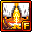 | **คลาส 2** | **Revolving Cannon** | 150% | 4 Hit | ไม่มี (0s) | 6 ตัว | ยิงกระสุนปืนกลเสริมพลังหมัด |
| 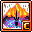 | **คลาส 3** | **Hammer Smash** | 230% | 6 Hit | ไม่มี (0s) | 8 ตัว | ทุบพื้นสร้างคลื่นกระแทกต่อเนื่อง |
|  | **คลาส 4** | **Shotgun Punch** | 265% | 6 Hit | ไม่มี (0s) | 6 ตัว | หมัดลูกซองระเบิดแรงผลักมอนสเตอร์ สกิลฟาร์มหลัก |
|  | **คลาส 4** | **Bunker Buster** | - | - | - | - | ยิงเจาะเกราะทะลวงทำดาเมจมหาศาลใส่บอส |
| 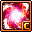 | **Hyper** | **Hyper Magnum Punch** | 500% | 15 Hit | 120 วิ | 15 ตัว | ชาร์จหมัดยักษ์พุ่งกระแทกมอนสเตอร์ทั้งฉาก |
|  | **Hyper** | **Cannon Overdrive** | - | - | 240 วิ | - | รีโหลดกระสุนปืนใหญ่อัตโนมัติ เพิ่มพลังระเบิด |
|  | **คลาส 5** | **Bunker Buster Explosion** | 1430% | 12 Hit | ไม่มี (0s) | 15 ตัว | ติดตั้งปืนใหญ่อัตโนมัติระเบิดเจาะเกราะทุกครั้งที่ชก |
|  | **คลาส 5** | **Gatling Punch** | 1100% | 7 Hit | 10 วิ | 8 ตัว | รัวหมัดปืนกลนับสิบฮิตต่อเนื่องอย่างบ้าคลั่ง |
|  | **คลาส 5** | **Bullet Barrage** | 650% | 8 Hit | ไม่มี (0s) | 8 ตัว | หมุนตัวกราดยิงกระสุนปืนใหญ่รอบทิศทาง |
|  | **คลาส 5** | **Afterimage Shock** | 385% | 9 Hit | 15 วิ | 4 ตัว | คลื่นกระแทกภาพติดตาตามติดทุกการโจมตี |

---

### 11. Aran (อารัน) (Heroes)
* **สเตตัสหลัก:** STR | **อาวุธประจำตัว:** โพลอาร์ม (Polearm)

| ไอคอน | คลาส | ชื่อสกิล | ดาเมจ (%) | Hit | คูลดาวน์ | เป้าหมาย | บทบาท & จุดเด่น |
| :---: | :---: | :--- | :---: | :---: | :---: | :---: | :--- |
|  | **คลาส 1** | **Smash Wave** | - | - | - | - | ฟาดง้าวปล่อยคลื่นพลังกระแทก |
|  | **คลาส 2** | **Final Toss** | - | - | ไม่มี (0s) | - | เสยง้าวผลักมอนสเตอร์ลอยขึ้นฟ้า |
|  | **คลาส 3** | **Aero Swing** | - | - | ไม่มี (0s) | - | ควงง้าวกลางอากาศกวาดมอนสเตอร์รอบตัว |
|  | **คลาส 4** | **Beyond Blade** | - | - | - | - | ฟาดง้าวต่อเนื่อง 3 จังหวะพลังทำลายล้างสูงสุด |
|  | **คลาส 4** | **Final Blow** | - | - | ไม่มี (0s) | - | ฟาดง้าวกระแทกพื้นเปิดทางสู่คอมโบ Beyond Blade |
|  | **Hyper** | **Maha's Carnage** | - | - | - | - | ทุบง้าวมาฮาลงพื้นสร้างความเสียหายวงกว้างมาก |
|  | **Hyper** | **Adrenaline Generator** | - | - | 120 วิ | - | เข้าสู่สถานะ Adrenaline ทันที ดาเมจและระยะสกิลเพิ่มขึ้น |
|  | **คลาส 5** | **Maha's Domain** | 600% | 3 Hit | ไม่มี (0s) | 6 ตัว | ปักง้าวมาฮาขนาดยักษ์ สร้างอาณาเขตฮีลและล้างดีบัฟ |
|  | **คลาส 5** | **Maha's Fury** | - | - | - | - | ปลดปล่อยพลังคลั่งของมาฮา เพิ่มพลังโจมตีและพายุหิมะ |
|  | **คลาส 5** | **Fenrir Crash** | - | - | - | - | เรียกหมาป่าเฟนรีร์กระโจนฟาดฟันต่อจาก Beyond Blade |
|  | **คลาส 5** | **Blizzard Tempest** | - | - | 90 วิ | - | พายุหิมะแช่แข็งศัตรูทั้งหมดและระเบิดดาเมจอย่างรุนแรง |

---

### 12. Hayato (ฮายาโตะ) (Sengoku)
* **สเตตัสหลัก:** STR | **อาวุธประจำตัว:** คาตานะ (Katana)

| ไอคอน | คลาส | ชื่อสกิล | ดาเมจ (%) | Hit | คูลดาวน์ | เป้าหมาย | บทบาท & จุดเด่น |
| :---: | :---: | :--- | :---: | :---: | :---: | :---: | :--- |
|  | **คลาส 1** | **Sangetsusen** | 10000% | 3 Hit | ไม่มี (0s) | 4 ตัว | ฟันดาบซามูไร 3 จังหวะ |
|  | **คลาส 2** | **Jin Sangetsusen** | 220% | 4 Hit | ไม่มี (0s) | 5 ตัว | พุ่งฟันดาบวารีผ่ากลุ่มศัตรู |
|  | **คลาส 3** | **Dankuusen** | 290% | 4 Hit | ไม่มี (0s) | 6 ตัว | พุ่งทะลวงแทงพร้อมดึงศัตรูตามติด |
|  | **คลาส 4** | **Rai Sangetsusen** | 360% | 4 Hit | ไม่มี (0s) | 8 ตัว | ฟันดาบสายฟ้าวงกว้างมาก สกิลฟาร์มหลัก |
|  | **คลาส 4** | **Hitokiri Strike** | 500% | 8 Hit | 90 วิ | 15 ตัว | ชักดาบผ่าวิญญาณ การันตีติดคริติคอล 100% |
|  | **Hyper** | **Falcon's Honor** | 500% | 8 Hit | 8 วิ | 14 ตัว | เรียกเหยี่ยวศักดิ์สิทธิ์ถล่มมอนสเตอร์ทั้งฉาก |
|  | **Hyper** | **God of Blades** | - | - | 90 วิ | - | ปลุกเทพแห่งดาบ เพิ่มพลังโจมตีและ Ignore DEF |
|  | **คลาส 5** | **Rai Blade Flash** | 1540% | 7 Hit | 12 วิ | 12 ตัว | ฟันดาบแสงรัว 8 ฮิตอย่างรวดเร็วใส่เป้าหมายเดียว |
|  | **คลาส 5** | **Battoujutsu Ultimate Will** | 1430% | 9 Hit | 10 วิ | 8 ตัว | ฟันดาบสะสมพลังผ่าวิญญาณ สร้างความเสียหายมหาศาล |
|  | **คลาส 5** | **Iaijutsu Phantom Blade** | 3300% | 15 Hit | 100 วิ | 12 ตัว | ชักดาบสะบัดเงารอบทิศทาง เพิ่มบัฟ Final Damage ซ้อนทับ |
|  | **คลาส 5** | **Instant Slice** | 715% | 6 Hit | ไม่มี (0s) | 5 ตัว | ฟันผ่ามิติฉับพลัน เคลียร์มอนสเตอร์ทั้งหน้าจอ |

---

### 13. Zero (ซีโร่ - Alpha & Beta) (Transcendence)
* **สเตตัสหลัก:** STR | **อาวุธประจำตัว:** Long Sword (Alpha) / Heavy Sword (Beta)

| ไอคอน | คลาส | ชื่อสกิล | ดาเมจ (%) | Hit | คูลดาวน์ | เป้าหมาย | บทบาท & จุดเด่น |
| :---: | :---: | :--- | :---: | :---: | :---: | :---: | :--- |
|  | **Alpha** | **Moon Strike** | 330% | 6 Hit | ไม่มี (0s) | 6 ตัว | ฟันดาบยาวลอยตัวพร้อมปล่อยคลื่นจันทรา |
|  | **Alpha** | **Pierce Thrust** | 380% | 9 Hit | ไม่มี (0s) | 6 ตัว | แทงดาบยาวพุ่งทะลวงศัตรูอย่างรวดเร็ว |
|  | **Alpha** | **Wind Cutter** | - | - | - | - | ปล่อยพายุดาบหมุนตัดศัตรูต่อเนื่อง |
|  | **Beta** | **Upper Slash** | 250% | 6 Hit | ไม่มี (0s) | 8 ตัว | เสยดาบหนักกระแทกศัตรูลอยขึ้นฟ้า |
|  | **Beta** | **Giga Crash** | 365% | 12 Hit | 10 วิ | 8 ตัว | ทุบดาบหนักลงพื้นสร้างคลื่นกระแทกยักษ์ |
|  | **Beta** | **Earth Break** | 170% | 3 Hit | 3 วิ | 8 ตัว | ฟาดดาบหนักผ่าปฐพี แตกกระจายเป็นสะเก็ดหิน |
|  | **Hyper** | **Shadow Rain** | 380% | 10 Hit | ไม่มี (0s) | 6 ตัว | ฝนดาบเงาตกกระหน่ำ บังคับบอสหยุดนิ่ง (Bind) |
|  | **Hyper** | **Chrono Break** | 335% | 4 Hit | 3 วิ | 8 ตัว | หยุดเวลาทั้งมิติ แช่แข็งบอสพร้อมระเบิดดาเมจมหาศาล |
|  | **คลาส 5** | **Chrono Break Strike** | - | - | ไม่มี (0s) | - | โจมตีประสานมิติเวลา สร้างความเสียหายรุนแรง |
|  | **คลาส 5** | **Joint Attack** | 1100% | 5 Hit | 30 วิ | - | การโจมตีผสานพลังของ Alpha และ Beta ฟาดฟันทั้งจอ |
|  | **คลาส 5** | **Shadow Flash** | 650% | 6 Hit | ไม่มี (0s) | 8 ตัว | ปักดาบสร้างอาณาเขตมิติและระเบิดสะท้อนดาเมจ |
|  | **คลาส 5** | **Ego Weapon** | 370% | 10 Hit | 10 วิ | 15 ตัว | อาวุธมีชีวิต ปลดปล่อยการโจมตีอัตโนมัติตามคอมโบ |

---

## 🔮 2. สายนักเวท (Magicians - 12 อาชีพ)

### 14. Arch Mage (Fire/Poison) (นักเวทไฟ/พิษ) (Explorer)
* **สเตตัสหลัก:** INT | **อาวุธประจำตัว:** คทา (Wand / Staff)

| ไอคอน | คลาส | ชื่อสกิล | ดาเมจ (%) | Hit | คูลดาวน์ | เป้าหมาย | บทบาท & จุดเด่น |
| :---: | :---: | :--- | :---: | :---: | :---: | :---: | :--- |
|  | **คลาส 1** | **Energy Bolt** | 389% | - | ไม่มี (0s) | 4 ตัว | ยิงลูกบอลเวทมนตร์โจมตีศัตรู |
|  | **คลาส 2** | **Flame Orb** | 381% | 2 Hit | ไม่มี (0s) | 6 ตัว | ลูกบอลเพลิงกลิ้งทะลวงเผาไหม้ |
|  | **คลาส 3** | **Explosion** | - | - | - | - | ระเบิดเพลิงรอบตัว สกิลฟาร์มช่วงกลางเกม |
|  | **คลาส 3** | **Poison Mist** | 310% | - | 20 วิ | - | ปล่อยหมอกพิษปกคลุมพื้นที่ สร้างดีบัฟพิษสะสม |
|  | **คลาส 4** | **Paralyze** | 220% | 7 Hit | 5 วิ | 8 ตัว | คลื่นพิษอัมพาต โจมตีมอนสเตอร์ด้านหน้าอย่างรวดเร็ว |
| 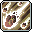 | **คลาส 4** | **Mist Eruption** | 315% | 12 Hit | 45 วิ | 15 ตัว | ระเบิดหมอกพิษทั้งหมด สร้างดาเมจมหาศาลตามจำนวนดีบัฟ |
|  | **คลาส 4** | **Meteor Shower** | 125% | 10 Hit | 10 วิ | 12 ตัว | อุกกาบาตเพลิงถล่มจากฟ้า กวาดล้างทั้งหน้าจอ |
|  | **Hyper** | **Megiddo Flame** | 420% | 15 Hit | 50 วิ | 1 ตัว | ลูกไฟปีศาจติดตามเป้าหมายเดี่ยว เผาผลาญบอส |
|  | **Hyper** | **Fire Auror** | 400% | 2 Hit | ไม่มี (0s) | 10 ตัว | ออร่าเพลิงแผดเผามอนสเตอร์รอบตัวต่อเนื่อง |
|  | **คลาส 5** | **DoT Punisher** | - | - | 30 วิ | - | ปล่อยฝูงลูกไฟเพลิงนรกไล่ล่าศัตรูรอบทิศทาง |
|  | **คลาส 5** | **Poison Nova** | 1400% | 1 Hit | 10 วิ | 8 ตัว | ระเบิดวงแหวนฟองพิษขยายตัวรอบทิศทาง |
|  | **คลาส 5** | **Fury of Ifrit** | 440% | 6 Hit | 75 วิ | 12 ตัว | อัญเชิญอีฟรีตปล่อยพายุเพลิงแผดเผาอย่างบ้าคลั่ง |
|  | **คลาส 5** | **Poison Chain** | 265% | 4 Hit | ไม่มี (0s) | 8 ตัว | โซ่พิษเชื่อมโยงมอนสเตอร์ เด้งลามไปทั่วทั้งแผนที่ |

---

### 15. Arch Mage (Ice/Lightning) (นักเวทน้ำแข็ง/สายฟ้า) (Explorer)
* **สเตตัสหลัก:** INT | **อาวุธประจำตัว:** คทา (Wand / Staff)

| ไอคอน | คลาส | ชื่อสกิล | ดาเมจ (%) | Hit | คูลดาวน์ | เป้าหมาย | บทบาท & จุดเด่น |
| :---: | :---: | :--- | :---: | :---: | :---: | :---: | :--- |
|  | **คลาส 1** | **Energy Bolt** | 389% | - | ไม่มี (0s) | 4 ตัว | ยิงลูกบอลเวทมนตร์โจมตีศัตรู |
|  | **คลาส 2** | **Cold Beam** | - | - | - | - | แท่งน้ำแข็งตกใส่หัวศัตรู แช่แข็งเป้าหมาย |
|  | **คลาส 3** | **Ice Strike** | 415% | 4 Hit | 8 วิ | 8 ตัว | เสาน้ำแข็งผุดขึ้นมารอบตัว กวาดมอนสเตอร์ |
|  | **คลาส 3** | **Glacier Chain** | - | - | - | - | โซ่น้ำแข็งดึงมอนสเตอร์เข้ามาตรงหน้า |
|  | **คลาส 4** | **Chain Lightning** | 185% | 10 Hit | 4 วิ | 6 ตัว | สายฟ้าชิ่งต่อเนื่องข้ามมอนสเตอร์ สกิลฟาร์มราชาแห่งเกม |
|  | **คลาส 4** | **Blizzard** | 301% | 12 Hit | 45 วิ | 15 ตัว | พายุหิมะถล่มทั้งหน้าจอ พร้อมดาเมจน้ำแข็งตามหลัง |
|  | **คลาส 4** | **Infinity** | - | - | - | - | เพิ่ม Magic ATT และ Final Damage ต่อเนื่องอย่างมหาศาล |
|  | **Hyper** | **Lightning Orb** | 150% | 15 Hit | 60 วิ | 15 ตัว | บอลสายฟ้าปล่อยลำแสงไฟฟ้าช็อตบอสอย่างต่อเนื่อง |
|  | **Hyper** | **Ice Aura** | - | - | 8 วิ | 15 ตัว | ออร่าน้ำแข็งปกป้องปาร์ตี้และลดความเร็วศัตรู |
|  | **คลาส 5** | **Ice Age** | 850% | 5 Hit | 25 วิ | - | แช่แข็งพื้นดินทั้งแผนที่ กลายเป็นลานน้ำแข็งทำลายล้าง |
|  | **คลาส 5** | **Bolt Barrage** | 650% | 5 Hit | 10 วิ | 10 ตัว | ยิงพายุสายฟ้า 8 ทิศทาง กวาดมอนสเตอร์ทะลุจอ |
|  | **คลาส 5** | **Spirit of Snow** | 880% | 9 Hit | 120 วิ | 10 ตัว | เรียกภูตหิมะยักษ์ออกมาช่วยถล่มเวทน้ำแข็ง |
|  | **คลาส 5** | **Jupiter Thunder** | - | - | 15 วิ | - | ลูกบอลสายฟ้าจูปิเตอร์ กลิ้งช็อตศัตรูอย่างรุนแรง |

---

### 16. Bishop (บิชอป) (Explorer)
* **สเตตัสหลัก:** INT | **อาวุธประจำตัว:** คทา (Wand / Staff)

| ไอคอน | คลาส | ชื่อสกิล | ดาเมจ (%) | Hit | คูลดาวน์ | เป้าหมาย | บทบาท & จุดเด่น |
| :---: | :---: | :--- | :---: | :---: | :---: | :---: | :--- |
|  | **คลาส 1** | **Energy Bolt** | 389% | - | ไม่มี (0s) | 4 ตัว | ยิงลูกบอลเวทมนตร์โจมตีศัตรู |
|  | **คลาส 2** | **Heal** | 490% | - | 4 วิ | 6 ตัว | ฟื้นฟูเลือด HP เพื่อนทั้งปาร์ตี้และทำดาเมจ Undead |
|  | **คลาส 2** | **Holy Arrow** | - | - | 600 วิ | - | ศรแสงศักดิ์สิทธิ์ยิงทะลวงมอนสเตอร์ |
|  | **คลาส 3** | **Shining Ray** | 304% | 4 Hit | 6 วิ | 6 ตัว | ลำแสงศักดิ์สิทธิ์ส่องลงมาจากฟ้า กวาดศัตรู |
|  | **คลาส 3** | **Holy Symbol** | - | - | 330 วิ | - | บัฟเพิ่มค่า EXP ที่ได้รับสูงสุด 50% สุดยอดบัฟแห่งเกม |
|  | **คลาส 4** | **Big Bang** | 405% | 12 Hit | 45 วิ | 15 ตัว | ระเบิดแสงศักดิ์สิทธิ์วงกว้าง สกิลฟาร์มหลักของบิชอป |
|  | **คลาส 4** | **Angel Ray** | 225% | 7 Hit | ไม่มี (0s) | 6 ตัว | ยิงลำแสงเทวทูต ฮีลเพื่อนและทำดาเมจใส่บอสเดี่ยวรัวๆ |
|  | **คลาส 4** | **Genesis** | - | - | 1200-90*x วิ | - | มหาเวทกำเนิดจักรวาล ถล่มทั้งหน้าจอ |
|  | **Hyper** | **Heavens Door** | 1000% | 8 Hit | 90 วิ | 15 ตัว | ประตูสวรรค์ กวาดมอนสเตอร์ทั้งจอ + บัฟชุบชีวิตฟรี 1 ครั้ง |
|  | **Hyper** | **Vengeance of Angel** | - | - | 1 วิ | 1 ตัว | แปลงร่างทูตสวรรค์ เพิ่มดาเมจ Angel Ray เพื่อตีบอส |
|  | **คลาส 5** | **Benediction** | 1100% | 10 Hit | 60 วิ | 15 ตัว | อาณาเขตสวดมนต์ บัฟ Final Damage และฟื้นฟูทั้งปาร์ตี้ |
|  | **คลาส 5** | **Angel of Libra** | 1760% | 12 Hit | ไม่มี (0s) | 12 ตัว | อัญเชิญทูตสวรรค์แห่งความสมดุล ช่วยโจมตีและบัฟดาเมจ |
|  | **คลาส 5** | **Peacemaker** | - | - | 30 วิ | - | ปล่อยคัมภีร์ศักดิ์สิทธิ์ลอยไปด้านหน้าก่อนระเบิดแสง |
|  | **คลาส 5** | **Divine Punishment** | - | - | - | - | ลำแสงลงทัณฑ์ศักดิ์สิทธิ์ ยิงเลเซอร์รัวถล่มบอส |

---

### 17. Blaze Wizard (เบลซ วิซาร์ด) (Cygnus Knights)
* **สเตตัสหลัก:** INT | **อาวุธประจำตัว:** คทา (Wand / Staff)

| ไอคอน | คลาส | ชื่อสกิล | ดาเมจ (%) | Hit | คูลดาวน์ | เป้าหมาย | บทบาท & จุดเด่น |
| :---: | :---: | :--- | :---: | :---: | :---: | :---: | :--- |
|  | **คลาส 1** | **Orbital Flame** | 210% | 1 Hit | ไม่มี (0s) | 4 ตัว | ลูกแก้วเพลิงหมุนพุ่งไปกลับ โจมตีรัวเร็ว |
|  | **คลาส 2** | **Orbital Flame II** | - | - | - | - | อัปเกรดลูกแก้วเพลิง 2 ลูก |
|  | **คลาส 3** | **Orbital Flame III** | - | - | - | - | อัปเกรดลูกแก้วเพลิง 3 ลูกพร้อมกัน |
|  | **คลาส 4** | **Orbital Flame IV** | - | - | - | - | ลูกแก้วเพลิงขั้น 4 พุ่ง 4 ลูกรัวๆ สกิลโจมตีหลัก |
|  | **คลาส 4** | **Blazing Extinction** | - | 3 Hit | 5 วิ | 8 ตัว | ดวงอาทิตย์เพลิงลอยไปข้างหน้า เผาผลาญทั้งแมพ |
|  | **Hyper** | **Dragon's Fury** | 500% | 6 Hit | 90 วิ | 1 ตัว | มังกรเพลิงพุ่งลงมาจากฟ้าถล่มศัตรู |
|  | **Hyper** | **Cataclysm** | 860% | 7 Hit | 100 วิ | 15 ตัว | อุกกาบาตยักษ์ถล่มพื้นโลก พร้อมสถานะอมตะ |
|  | **คลาส 5** | **Orbital Inferno** | 1650% | 6 Hit | 40 วิ | 15 ตัว | ลูกแก้วเพลิงยักษ์พุ่งช้าๆ เผาผลาญมอนสเตอร์ทั้งฉาก |
|  | **คลาส 5** | **Savage Flame** | 550% | 1 Hit | ไม่มี (0s) | 8 ตัว | อสูรเพลิงจิ้งจอก ระเบิดพลังไฟรอบทิศทาง |
|  | **คลาส 5** | **Inferno Sphere** | 1210% | 6 Hit | ไม่มี (0s) | 8 ตัว | ทุ่มลูกบอลเพลิงยักษ์ระเบิดดาเมจมหาศาล |
|  | **คลาส 5** | **Salamander Mischief** | - | - | 30 วิ | - | ซาลาแมนเดอร์ไฟลอยโจมตีและเพิ่ม Magic ATT |

---

### 18. Battle Mage (แบทเทิลเมจ) (Resistance)
* **สเตตัสหลัก:** INT | **อาวุธประจำตัว:** Staff

| ไอคอน | คลาส | ชื่อสกิล | ดาเมจ (%) | Hit | คูลดาวน์ | เป้าหมาย | บทบาท & จุดเด่น |
| :---: | :---: | :--- | :---: | :---: | :---: | :---: | :--- |
|  | **คลาส 1** | **Triple Blow** | 190% | 3 Hit | ไม่มี (0s) | 5 ตัว | ควงคทาฟาด 3 จังหวะ |
|  | **คลาส 2** | **Quad Blow** | 240% | 4 Hit | ไม่มี (0s) | 5 ตัว | ควงคทาฟาด 4 จังหวะรวดเร็ว |
|  | **คลาส 3** | **Finishing Blow** | - | - | - | - | ฟาดคทาจังหวะสุดท้ายสร้างความเสียหายรุนแรง |
|  | **คลาส 4** | **Blow Finish** | - | - | - | - | คอมโบฟาดคทาขั้นสุดยอด สกิลโจมตีหลัก |
|  | **คลาส 4** | **Dark Genesis** | - | - | - | - | เวทความมืดถล่มทั้งหน้าจอ พร้อมลดคูลดาวน์ |
| 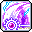 | **Hyper** | **Battle King Bar** | 650% | 2 Hit | 13 วิ | 8 ตัว | กระบองยักษ์ฟาดกวาดล้างมอนสเตอร์ทั้งจอ |
|  | **Hyper** | **Master of Death** | - | - | ไม่มี (0s) | - | ปลดปล่อยพลังความตาย เพิ่มดาเมจและออร่า |
|  | **คลาส 5** | **Union Aura** | 600% | - | 50 วิ | 8 ตัว | รวมออร่าทั้งหมดเป็นหนึ่งเดียว ฟาดฟันติดเคียวแห่งความตาย |
| 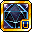 | **คลาส 5** | **Black Magic Altar** | 1100% | 5 Hit | 90 วิ | 10 ตัว | ติดตั้งแท่นบูชามืด เชื่อมโยงสายฟ้าระเบิดดาเมจ |
|  | **คลาส 5** | **Grim Harvest** | 295% | 15 Hit | 25 วิ | 15 ตัว | เคียวเก็บเกี่ยวดวงวิญญาณ ฟาดฟันทำลายล้างอัตโนมัติ |
|  | **คลาส 5** | **Abyssal Lightning** | 1100% | 8 Hit | ไม่มี (0s) | 6 ตัว | สายฟ้าแห่งความมืดฟาดกระหน่ำทุกครั้งที่เทเลพอร์ต |

---

### 19. Evan (อีวาน) (Heroes)
* **สเตตัสหลัก:** INT | **อาวุธประจำตัว:** Wand / Staff

| ไอคอน | คลาส | ชื่อสกิล | ดาเมจ (%) | Hit | คูลดาวน์ | เป้าหมาย | บทบาท & จุดเด่น |
| :---: | :---: | :--- | :---: | :---: | :---: | :---: | :--- |
|  | **คลาส 1** | **Mana Burst I** | 190% | 2 Hit | ไม่มี (0s) | 4 ตัว | ยิงเวทมนตร์ลูกแก้วมานา |
|  | **คลาส 2** | **Mana Burst II** | - | - | - | - | ยิงคลื่นมานาระเบิดคู่ |
|  | **คลาส 3** | **Mana Burst III** | - | - | - | - | ลำแสงมานาทะลวง 3 สาย |
|  | **คลาส 4** | **Mana Burst IV** | - | - | - | - | พายุมานา 4 Hit สกิลฟาร์มหลักของอีวาน |
|  | **คลาส 4** | **Dragon Breath** | - | - | - | - | มังกรพ่นไฟเผาผลาญศัตรูด้านหน้า |
|  | **Hyper** | **Summon Onyx Dragon** | 450% | 7 Hit | 240 วิ | 10 ตัว | เรียกมังกรโอนิกซ์ออกมาช่วยต่อสู้เคียงข้าง |
|  | **Hyper** | **Dragon Master** | 450% | 7 Hit | ไม่มี (0s) | 10 ตัว | ขี่หลังมังกรบินพ่นลำแสงเพลิงถล่มทั้งจออย่างอมตะ |
|  | **คลาส 5** | **Elemental Barrage** | - | - | 180 วิ | - | เวทมนตร์ 4 ธาตุประสานระเบิดกวาดล้างทั้งแมพ |
|  | **คลาส 5** | **Dragon Slam** | 770% | 4 Hit | 30 วิ | 10 ตัว | มังกรกระแทกพื้นสร้างคลื่นพลังทำลายล้าง |
|  | **คลาส 5** | **Elemental Radiance** | 1760% | 12 Hit | 100 วิ | 10 ตัว | รวบรวมแก่นแท้แห่งธาตุ ปลดปล่อยลำแสงดาราศาสตร์ |
|  | **คลาส 5** | **Spiral of Mana** | - | - | - | - | วังวนมานาหมุนปั่นทำดาเมจต่อเนื่องไม่หยุด |

---

### 20. Luminous (ลูมินัส) (Heroes)
* **สเตตัสหลัก:** INT | **อาวุธประจำตัว:** Shining Rod

| ไอคอน | คลาส | ชื่อสกิล | ดาเมจ (%) | Hit | คูลดาวน์ | เป้าหมาย | บทบาท & จุดเด่น |
| :---: | :---: | :--- | :---: | :---: | :---: | :---: | :--- |
|  | **คลาส 1** | **Flash Shower** | 310% | 1 Hit | ไม่มี (0s) | 5 ตัว | ลำแสงดาราตกกระแทกศัตรู |
|  | **คลาส 2** | **Sylvan Bolt** | 125% | - | ไม่มี (0s) | 6 ตัว | ยิงลูกศรแสงทะลวงมอนสเตอร์ |
|  | **คลาส 3** | **Spectral Light** | 131% | 4 Hit | ไม่มี (0s) | 8 ตัว | ยิงเลเซอร์แสงต่อเนื่องรอบทิศทาง |
| 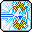 | **คลาส 4** | **Reflection** | 400% | 4 Hit | 330 วิ | 8 ตัว | ลำแสงสะท้อนชิ่งข้ามมอนสเตอร์ทั่วจอ สกิลฟาร์มเทพ |
|  | **คลาส 4** | **Apocalypse** | - | - | - | - | เปิดประตูนรกความมืดถล่มศัตรูวงกว้าง |
|  | **คลาส 4** | **Ender** | - | - | - | - | ใบมีดแสงดาเมจมหาศาล สกิลตีบอสหลักในสถานะ Equilibrium |
|  | **Hyper** | **Armageddon** | 1000% | 3 Hit | 120 วิ | 15 ตัว | ดาบแห่งจุดจบ ปักตรึงบอสให้อยู่นิ่ง (Bind 10s) |
|  | **Hyper** | **Equalize** | - | - | 150 วิ | - | เข้าสู่สถานะ Equilibrium ทันที ยิง Ender รัวๆ |
|  | **คลาส 5** | **Gate of Light** | 720% | 6 Hit | 5 วิ | 12 ตัว | เปิดประตูมิติแสงศักดิ์สิทธิ์ ยิงลำแสงทำลายล้าง |
|  | **คลาส 5** | **Aether Conduit** | - | - | 20 วิ | - | ลูกแก้วพลังงานแสงมืดปล่อยเลเซอร์กวาดจอ |
|  | **คลาส 5** | **Baptism of Light and Darkness** | 770% | 4 Hit | 10 วิ | 6 ตัว | พิธีล้างบาป ลำแสงผสานสองขั้วถล่มบอส 24 Hit |
|  | **คลาส 5** | **Liberation Nova** | 330% | 7 Hit | 90 วิ | 1 ตัว | ปลดปล่อยพลังจักรวาลระเบิดดาเมจมหาศาล |

---

### 21. Illium (อิลเลียม) (Flora)
* **สเตตัสหลัก:** INT | **อาวุธประจำตัว:** Lucent Gauntlet

| ไอคอน | คลาส | ชื่อสกิล | ดาเมจ (%) | Hit | คูลดาวน์ | เป้าหมาย | บทบาท & จุดเด่น |
| :---: | :---: | :--- | :---: | :---: | :---: | :---: | :--- |
|  | **คลาส 1** | **Radiant Javelin** | 120% | 2 Hit | ไม่มี (0s) | 1 ตัว | ปาหอกแสงกระทบลูกแก้วคริสตัล |
|  | **คลาส 2** | **Radiant Javelin II** | - | - | - | - | อัปเกรดหอกแสงเพิ่มดาเมจและความเร็ว |
|  | **คลาส 3** | **Radiant Javelin III** | - | - | - | - | หอกแสงแตกตัวเด้งโจมตีมอนสเตอร์ |
|  | **คลาส 4** | **Radiant Javelin IV** | - | - | - | - | หอกแสงขั้น 4 ชิ่งทะลวงศัตรู สกิลหลัก |
|  | **คลาส 4** | **Reaction - Destruction** | - | - | - | - | สั่งคริสตัลระเบิดคลื่นทำลายล้างวงกว้าง |
|  | **คลาส 4** | **Longinus Spear** | 500% | 5 Hit | 30 วิ | 10 ตัว | หอกยักษ์เทพเจ้าเสียบทะลวงพื้นดิน |
|  | **Hyper** | **Longinus Zone** | - | - | - | - | กางอาณาเขตหอกศักดิ์สิทธิ์ โจมตีพร้อมอมตะ |
|  | **Hyper** | **Flash Mirage** | - | - | - | - | แยกร่างเงาคริสตัลช่วยโจมตี |
|  | **คลาส 5** | **Crystal Ignition** | 1320% | 10 Hit | ไม่มี (0s) | 10 ตัว | ยิงเลเซอร์คริสตัลต่อเนื่องละลายบอส |
|  | **คลาส 5** | **Gramholder** | 1650% | 4 Hit | 180 วิ | 15 ตัว | อัญเชิญหุ่นรบเวทมนตร์ยักษ์ฟาดฟันทั้งฉาก |
|  | **คลาส 5** | **Soul of Crystal** | 660% | 12 Hit | 120 วิ | 15 ตัว | เสกลูกแก้วคริสตัลเสริมอีก 1 ลูก เพิ่มการระเบิดเป็นสองเท่า |
|  | **คลาส 5** | **Crystal Gate** | - | - | 180 วิ | - | ติดตั้งประตูคริสตัลวาร์ปไปมาทั่วแผนที่ |

---

### 22. Lara (ลาร่า) (Anima)
* **สเตตัสหลัก:** INT | **อาวุธประจำตัว:** Wand

| ไอคอน | คลาส | ชื่อสกิล | ดาเมจ (%) | Hit | คูลดาวน์ | เป้าหมาย | บทบาท & จุดเด่น |
| :---: | :---: | :--- | :---: | :---: | :---: | :---: | :--- |
|  | **คลาส 1** | **Essence Sprinkle** | 90% | 4 Hit | ไม่มี (0s) | 5 ตัว | โปรยพลังธรรมชาติโจมตีมอนสเตอร์ด้านหน้า |
|  | **คลาส 2** | **Eruption: Heaving River** | - | - | 5 วิ | - | ปลุกพลังแม่น้ำ คลื่นน้ำพุ่งทะลวงเป็นแนวยาว |
|  | **คลาส 3** | **Eruption: Whirlwind** | - | - | 60 วิ | - | ปลุกพลังสายลม หมุนปั่นมอนสเตอร์กลางอากาศ |
|  | **คลาส 4** | **Eruption: Sunrise Well** | - | - | ไม่มี (0s) | - | ปลุกพลังภูเขาไฟ ระเบิดลาวาสร้างแอ่งไฟทำดาเมจ |
|  | **คลาส 4** | **Dragon Vein Absorption** | - | - | 60 วิ | - | ดูดซับเส้นเลือดมังกรเพื่อรับบัฟและยิงกระสุนเวท |
|  | **Hyper** | **Vine Coil** | - | - | - | - | เถาวัลย์ธรรมชาติมัดตรึงศัตรู (Bind บอส 10s) |
|  | **Hyper** | **Peerless Mountain** | - | - | - | - | ภูผาตระหง่าน มอบบาเรียป้องกันดาเมจมหาศาล |
|  | **คลาส 5** | **Big Stretch** | - | - | 20 วิ | - | ยืดเส้นสายธรรมชาติ ตบมอนสเตอร์ทั้งฉากอย่างรุนแรง |
|  | **คลาส 5** | **Land's Connection** | 330% | 5 Hit | ไม่มี (0s) | 1 ตัว | เชื่อมต่อพลังผืนดิน ระเบิดคลื่นวิญญาณธรรมชาติ |
|  | **คลาส 5** | **Surging Essence** | - | - | 22 วิ | - | ปล่อยคลื่นแก่นแท้แห่งชีวิตพุ่งทะลุหน้าจอ |
|  | **คลาส 5** | **Winding Mountain Ridge** | - | - | 180 วิ | 7 ตัว | เรียกภูผาวิ่งชนมอนสเตอร์อย่างต่อเนื่อง |

---

### 23. Kinesis (คิเนซิส) (Other)
* **สเตตัสหลัก:** INT | **อาวุธประจำตัว:** PSY-limiter

| ไอคอน | คลาส | ชื่อสกิล | ดาเมจ (%) | Hit | คูลดาวน์ | เป้าหมาย | บทบาท & จุดเด่น |
| :---: | :---: | :--- | :---: | :---: | :---: | :---: | :--- |
|  | **คลาส 1** | **Kinetic Crash** | - | - | 1 วิ | 4 ตัว | ใช้พลังจิตกระแทกมอนสเตอร์กระเด็น |
|  | **คลาส 2** | **Mad Crash** | - | - | - | - | ยกพื้นคอนกรีตฟาดศัตรูด้านหน้า |
|  | **คลาส 3** | **Kinetic Grab** | - | - | - | - | ยกมอนสเตอร์ 3 ตัวลอยขึ้นฟ้าเพื่อใช้ทุบ |
|  | **คลาส 4** | **Psychic Grab** | - | - | - | - | ยกมอนสเตอร์หรือซากรถ 5 ชิ้นลอย สกิลโจมตีหลัก |
|  | **คลาส 4** | **Psychic Smash** | - | - | - | - | ทุ่มซากรถและมอนสเตอร์ที่ยกลงพื้น ระเบิดรุนแรง |
|  | **คลาส 4** | **Ultimate - Metal Press** | 1000% | 4 Hit | 30 วิ | 15 ตัว | เสกซากตู้เซฟเหล็กยักษ์ทับศัตรู ดาเมจมหาศาล |
|  | **Hyper** | **Everpsychic** | - | - | - | - | ดึงดูดวัตถุรอบเมืองเข้ามาบดขยี้ พร้อมสถานะอมตะ |
|  | **Hyper** | **Psychic Overdrive** | - | - | - | - | ลดการใช้แต้มพลังจิต Psychic Point ลงครึ่งหนึ่ง |
|  | **คลาส 5** | **Psychic Tornado** | 800% | 3 Hit | ไม่มี (0s) | 8 ตัว | เสกพายุทอร์นาโดพลังจิต ดูดกลืนทุกสิ่งก่อนขว้างระเบิด |
|  | **คลาส 5** | **Ultimate - Moving Matter** | - | - | - | - | เสกทรงกลมสสารพลังจิต กลิ้งบดขยี้บอสต่อเนื่อง |
|  | **คลาส 5** | **Law of Gravity** | 350% | - | 25 วิ | - | สร้างแรงโน้มถ่วงมหาศาลดูดบอสและระเบิดดาเมจ |
|  | **คลาส 5** | **Ultimate - Mind Flay** | 1320% | 15 Hit | ไม่มี (0s) | 10 ตัว | มีดพลังจิตนับร้อยเฉือนร่างศัตรูอย่างรวดเร็ว |

---

### 24. Kanna (คันนะ) (Sengoku)
* **สเตตัสหลัก:** INT | **อาวุธประจำตัว:** Fan

| ไอคอน | คลาส | ชื่อสกิล | ดาเมจ (%) | Hit | คูลดาวน์ | เป้าหมาย | บทบาท & จุดเด่น |
| :---: | :---: | :--- | :---: | :---: | :---: | :---: | :--- |
|  | **คลาส 1** | **Shikigami Haunting** | 190% | 2 Hit | ไม่มี (0s) | 4 ตัว | ยิงวิญญาณชิกิงามิ 3 จังหวะ |
|  | **คลาส 2** | **Shikigami Haunting II** | 130% | 4 Hit | ไม่มี (0s) | 6 ตัว | เพิ่มระยะและดาเมจวิญญาณชิกิงามิ |
|  | **คลาส 3** | **Kishin Shoukan** | 220% | 5 Hit | ไม่มี (0s) | 8 ตัว | เรียกผีสองพี่น้อง ช่วยเพิ่มการเกิดของมอนสเตอร์ในแมพ |
|  | **คลาส 4** | **Shikigami Haunting IV** | 300% | 5 Hit | 60 วิ | 8 ตัว | วิญญาณชิกิงามิขั้น 4 กวาดมอนสเตอร์เป็นแนวยาว |
|  | **คลาส 4** | **Vanquisher's Charm** | - | - | 900 วิ | - | ยิงยันต์แปะบอสต่อเนื่อง 15 Hit รวดเร็ว |
|  | **Hyper** | **Veritable Pandemonium** | 670% | 15 Hit | 120 วิ | 15 ตัว | กดทับวิญญาณ บังคับบอสหยุดนิ่ง (Bind 15s นานที่สุดในเกม) |
|  | **Hyper** | **Princess's Vow** | 500% | 1 Hit | ไม่มี (0s) | 15 ตัว | คำสาบานแห่งเจ้าหญิง เพิ่มดาเมจและค่าพลัง |
|  | **คลาส 5** | **Yuki-musume** | 350% | 10 Hit | ไม่มี (0s) | 8 ตัว | อัญเชิญเจ้าหญิงหิมะ ช่วยปล่อยเวทน้ำแข็งโจมตี |
|  | **คลาส 5** | **Spirit's Domain** | 1100% | 12 Hit | ไม่มี (0s) | 12 ตัว | กางอาณาเขตหินวิญญาณ ขยายตัวฮีลและเพิ่ม Final Damage |
|  | **คลาส 5** | **Liberated Ghost Balrog** | - | - | 200 วิ | - | อัญเชิญบาฮามุทวิญญาณยักษ์ทุบพื้นทำลายล้าง |
|  | **คลาส 5** | **Sengoku Force** | 440% | 6 Hit | 60 วิ | 1 ตัว | เรียก 4 ขุนพลเซ็นโกคุออกมาช่วยโจมตีรอบตัว |

---

### 25. Beast Tamer (บีสต์ เทมเมอร์) (Other)
* **สเตตัสหลัก:** INT | **อาวุธประจำตัว:** Scepter

| ไอคอน | คลาส | ชื่อสกิล | ดาเมจ (%) | Hit | คูลดาวน์ | เป้าหมาย | บทบาท & จุดเด่น |
| :---: | :---: | :--- | :---: | :---: | :---: | :---: | :--- |
|  | **Bear** | **Paw Swipe** | - | - | - | - | หมีตบกรงเล็บด้านหน้าต่อเนื่อง 4 จังหวะ |
|  | **Bear** | **Fish Slap** | - | - | 21000000 วิ | 1 ตัว | เอาปลาทูน่ายักษ์ฟาดศัตรู |
|  | **Snow Leopard** | **Leopard Paw** | - | - | - | - | เสือดาวกระโจนตบและพุ่งผ่านมอนสเตอร์ |
|  | **Hawk** | **Formation Attack** | - | - | 60 วิ | - | นกอินทรีบินทิ้งระเบิดขนนกจากบนฟ้า |
|  | **Cat** | **Meow Heal** | - | - | - | - | แมวเหมียวฮีลเพื่อนและมอบบัฟ EXP / Drop |
|  | **Hyper** | **Team Roar** | - | - | - | - | เสียงคำรามรวมพลัง 4 สัตว์เทพ บัฟอมตะและเพิ่มดาเมจ |
|  | **Hyper** | **All Together!** | - | - | - | - | เรียกเพื่อนสัตว์ทุกตัวออกมาปาร์ตี้ทำลายล้าง |
|  | **คลาส 5** | **Champ Charge** | 1320% | 15 Hit | 10 วิ | 10 ตัว | สัตว์ทั้ง 4 ตัววิ่งชนเป็นขบวนรถไฟทะลวงจอ |
|  | **คลาส 5** | **Cub Cavalry** | 2200% | 5 Hit | ไม่มี (0s) | 15 ตัว | ลูกสัตว์ตัวน้อยวิ่งออกมาช่วยถล่มศัตรู |
|  | **คลาส 5** | **Aerial Relief** | - | - | 120 วิ | - | บอลลูนเพื่อนสัตว์บินโปรยดอกไม้และระเบิดดาเมจ |
|  | **คลาส 5** | **Friend Barrier** | 265% | 6 Hit | 7 วิ | 6 ตัว | บาเรียเพื่อนสัตว์ ป้องกันสถานะและฮีลต่อเนื่อง |

---

## 🏹 3. สายนักธนู (Archers - 7 อาชีพ)

### 26. Bowmaster (โบว์มาสเตอร์) (Explorer)
* **สเตตัสหลัก:** DEX | **อาวุธประจำตัว:** ธนู (Bow)

| ไอคอน | คลาส | ชื่อสกิล | ดาเมจ (%) | Hit | คูลดาวน์ | เป้าหมาย | บทบาท & จุดเด่น |
| :---: | :---: | :--- | :---: | :---: | :---: | :---: | :--- |
|  | **คลาส 1** | **Arrow Blow** | 345% | - | ไม่มี (0s) | 4 ตัว | ยิงลูกศรโจมตีมอนสเตอร์ด้านหน้า |
|  | **คลาส 2** | **Arrow Bomb** | - | - | 8 วิ | 6 ตัว | ยิงลูกศรระเบิด สตั๊นมอนสเตอร์รอบเป้าหมาย |
|  | **คลาส 3** | **Flame Surge** | 400% | 3 Hit | ไม่มี (0s) | 6 ตัว | ยิงฝนศรเพลิงเผาผลาญศัตรูเป็นแนวกว้าง |
|  | **คลาส 4** | **Hurricane** | - | - | - | - | ยิงพายุลูกศรต่อเนื่องไม่หยุด สกิลบอสสัญลักษณ์แห่งเกม |
|  | **คลาส 4** | **Arrow Stream** | 350% | 5 Hit | ไม่มี (0s) | 8 ตัว | ยิงสาดห่ากระสุนลูกศร 8 ดอกกว้างทั้งจอ สกิลฟาร์มหลัก |
|  | **คลาส 4** | **Sharp Eyes** | - | - | 300 วิ | - | เนตรอินทรี บัฟเพิ่ม Critical Rate และ Critical Damage |
|  | **Hyper** | **Gritty Gust** | 335% | 12 Hit | 15 วิ | 12 ตัว | พายุศรยักษ์พัดกวาดมอนสเตอร์ทั้งฉาก |
|  | **Hyper** | **Concentration** | - | - | 90 วิ | - | เพ่งสมาธิ ไม่ถูกยกเลิกการยิงและเพิ่มพลังโจมตี |
|  | **คลาส 5** | **Storm of Arrows** | 880% | 1 Hit | 60 วิ | - | มหาพายุฝนลูกศรตกจากฟ้าครอบคลุมทั้งหน้าจอ |
|  | **คลาส 5** | **Inhuman Speed** | - | - | 120 วิ | - | ยิงศรเสริมด้วยความเร็วเหนือมนุษย์ |
|  | **คลาส 5** | **Quiver Barrage** | - | - | 16 วิ | - | ยิงกระสุนศรพิเศษจากกระบอกธนูระเบิดต่อเนื่อง |
|  | **คลาส 5** | **Silhouette Mirage** | 880% | 12 Hit | 90 วิ | 12 ตัว | แยกร่างเงาหลอกล่อศัตรูและช่วยสาดลูกศร |

---

### 27. Marksman (มาร์กสแมน) (Explorer)
* **สเตตัสหลัก:** DEX | **อาวุธประจำตัว:** หน้าไม้ (Crossbow)

| ไอคอน | คลาส | ชื่อสกิล | ดาเมจ (%) | Hit | คูลดาวน์ | เป้าหมาย | บทบาท & จุดเด่น |
| :---: | :---: | :--- | :---: | :---: | :---: | :---: | :--- |
|  | **คลาส 1** | **Arrow Blow** | 345% | - | ไม่มี (0s) | 4 ตัว | ยิงลูกศรโจมตีมอนสเตอร์ด้านหน้า |
|  | **คลาส 2** | **Iron Arrow** | 341% | 2 Hit | 8 วิ | 8 ตัว | ยิงศรเหล็กพุ่งทะลวงเป็นเส้นตรง |
|  | **คลาส 3** | **Bolt Rapture** | 975% | 1 Hit | ไม่มี (0s) | 8 ตัว | ยิงหน้าไม้ระเบิดคลื่นกระแทก |
|  | **คลาส 4** | **Snipe** | 465% | 9 Hit | 5 วิ | - | สไนเปอร์ลอบสังหาร ยิงนัดเดียวบอสสะเทือน ดาเมจมหาศาล |
|  | **คลาส 4** | **Piercing Arrow** | - | - | - | - | ยิงศรเจาะเกราะ ยิ่งทะลุมอนสเตอร์ตัวหลังยิ่งแรงขึ้น |
| 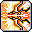 | **Hyper** | **High Speed Shot** | 450% | 9 Hit | 15 วิ | 12 ตัว | ยิงกระสุนความเร็วสูงทะลวงมอนสเตอร์ทั้งจอ |
|  | **Hyper** | **Bullseye** | - | - | 90 วิ | - | เล็งจุดตาย เพิ่ม Ignore DEF 20% และ Crit Damage |
| 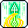 | **คลาส 5** | **True Snipe** | 880% | 1 Hit | 60 วิ | 1 ตัว | เข้าสู่โหมดซุ่มยิงสไนเปอร์ เล็งเป้าหมายยิงด้วยมือ ดาเมจสุดยอด |
|  | **คลาส 5** | **Split Arrow** | 880% | 8 Hit | 150 วิ | 10 ตัว | ศรแตกตัวระเบิดเป็นห่ากระสุนเมื่อกระทบเป้าหมาย |
|  | **คลาส 5** | **Charged Arrow** | - | - | 150 วิ | - | ชาร์จพลังศรหน้าไม้ ปล่อยคลื่นยักษ์กวาดทั้งแผนที่ |
|  | **คลาส 5** | **Repeating Crossbow Cartridge** | 715% | 3 Hit | 180 วิ | 6 ตัว | บรรจุกระสุนหน้าไม้กล ยิง Snipe ต่อเนื่องรวดเร็ว |

---

### 28. Pathfinder (พาธไฟน์เดอร์) (Explorer)
* **สเตตัสหลัก:** DEX | **อาวุธประจำตัว:** Ancient Bow

| ไอคอน | คลาส | ชื่อสกิล | ดาเมจ (%) | Hit | คูลดาวน์ | เป้าหมาย | บทบาท & จุดเด่น |
| :---: | :---: | :--- | :---: | :---: | :---: | :---: | :--- |
|  | **คลาส 1** | **Cardinal Deluge** | 110% | 4 Hit | ไม่มี (0s) | 4 ตัว | ยิงศรวารีติดตามศัตรู |
|  | **คลาส 2** | **Cardinal Burst** | - | - | - | - | ยิงศรระเบิดคลื่นกระแทกด้านหน้า |
|  | **คลาส 3** | **Cardinal Torrent** | - | - | - | - | พุ่งทะยานกลางอากาศพร้อมยิงศรวนรอบตัว |
|  | **คลาส 4** | **Cardinal Deluge Amplification** | - | - | - | - | อัปเกรดศรวารี 4 ดอกไล่ล่าศัตรูอัตโนมัติ |
|  | **คลาส 4** | **Cardinal Burst Amplification** | - | - | - | - | อัปเกรดศรระเบิดพลังทำลายล้างวงกว้าง |
|  | **คลาส 4** | **Combo Assault** | 350% | 4 Hit | ไม่มี (0s) | 6 ตัว | การโจมตีผสานโบราณ ฟันกวาดทั้งหน้าจอ |
|  | **Hyper** | **Ancient Astronaut** | - | - | - | - | ปลดปล่อยพลังโบราณ ยิงลำแสงโบราณกวาดจอ |
|  | **Hyper** | **Relic Evolution** | - | - | - | - | ปลุกพลังโบราณขั้นสูงสุด บัฟเกจ Relic เต็มทันที |
|  | **คลาส 5** | **Ultimate Blast** | 1000% | 15 Hit | 100 วิ | 15 ตัว | ชาร์จพลัง Relic ยิงศรโบราณยักษ์ทะลวงมิติ |
|  | **คลาส 5** | **Raven Tempest** | - | - | 120 วิ | - | พายุอีกาโบราณหมุนวนกวาดมอนสเตอร์ไปทั่วแมพ |
|  | **คลาส 5** | **Obsidian Barrier** | - | - | 120 วิ | - | กางม่านพลังหินออบซิเดียน ป้องกันดาเมจและโจมตี |
|  | **คลาส 5** | **Relic Unbound** | 660% | 12 Hit | 90 วิ | 8 ตัว | ปลดปล่อยเสาพลังโบราณ 7 เสาโจมตีต่อเนื่อง |

---

### 29. Wind Archer (วินด์ อาร์เชอร์) (Cygnus Knights)
* **สเตตัสหลัก:** DEX | **อาวุธประจำตัว:** ธนู (Bow)

| ไอคอน | คลาส | ชื่อสกิล | ดาเมจ (%) | Hit | คูลดาวน์ | เป้าหมาย | บทบาท & จุดเด่น |
| :---: | :---: | :--- | :---: | :---: | :---: | :---: | :--- |
|  | **คลาส 1** | **Breeze Arrow** | 140% | 3 Hit | ไม่มี (0s) | 5 ตัว | ยิงศรสายลมพุ่งทะลวง |
|  | **คลาส 2** | **Fairy Turn** | 195% | 3 Hit | ไม่มี (0s) | 6 ตัว | หมุนตัวสะบัดผ้าคลุมสายลมปัดเป่าศัตรู |
|  | **คลาส 3** | **Sentient Arrow** | 195% | 2 Hit | ไม่มี (0s) | 6 ตัว | ยิงลูกศรสายลมติดตามมอนสเตอร์ |
|  | **คลาส 4** | **Song of Heaven** | - | - | 900 วิ | - | ยิงเพลงพิณสายลมต่อเนื่องรวดเร็ว สกิลบอสหลัก |
|  | **คลาส 4** | **Spiral Vortex** | 345% | - | ไม่มี (0s) | 4 ตัว | ยิงพายุหมุนเกลียวผลักศัตรูและระเบิด |
|  | **คลาส 4** | **Trifling Wind** | 290% | - | ไม่มี (0s) | - | เศษศรสายลมแตกตัวบินว่อนรอบตัวอัตโนมัติ |
|  | **Hyper** | **Monsoon** | 430% | 12 Hit | 30 วิ | 15 ตัว | ลมมรสุมพัดถล่มมอนสเตอร์ทั้งหน้าจอ |
|  | **Hyper** | **Storm Bringer** | 500% | - | 200 วิ | - | เรียกพายุแห่งซิกนัส ยิงศรยักษ์ตามหลังทุกการโจมตี |
|  | **คลาส 5** | **Howling Gale** | 550% | 3 Hit | 10000 วิ | 10 ตัว | เสกพายุหมุนทอร์นาโด 2 ลูกวิ่งกวาดทั่วแผนที่ |
|  | **คลาส 5** | **Merciless Winds** | 1100% | 10 Hit | ไม่มี (0s) | 10 ตัว | กลุ่มก้อนศรสายลมรวมตัวและพุ่งกระแทกบอส |
|  | **คลาส 5** | **Gale Violent** | 1155% | 5 Hit | 120 วิ | 8 ตัว | พายุสายลมรุนแรงหมุนระเบิดดาเมจมหาศาล |
|  | **คลาส 5** | **Vortex Sphere** | 1430% | 15 Hit | 6720 วิ | 15 ตัว | ลูกกลมพายุหมุนเคลื่อนที่ช้าๆ ดูดมอนสเตอร์เข้ามาฟาดฟัน |

---

### 30. Wild Hunter (ไวลด์ ฮันเตอร์) (Resistance)
* **สเตตัสหลัก:** DEX | **อาวุธประจำตัว:** Crossbow

| ไอคอน | คลาส | ชื่อสกิล | ดาเมจ (%) | Hit | คูลดาวน์ | เป้าหมาย | บทบาท & จุดเด่น |
| :---: | :---: | :--- | :---: | :---: | :---: | :---: | :--- |
|  | **คลาส 1** | **Triple Shot** | - | - | - | - | ขี่จากัวร์ยิงศร 3 ดอก |
|  | **คลาส 2** | **Ricochet** | - | - | - | - | ยิงศรสะท้อนเด้งไปมาระหว่างศัตรู |
|  | **คลาส 3** | **Enduring Fire** | - | - | - | - | ยิงกระหน่ำกระสุนเพลิงต่อเนื่อง |
|  | **คลาส 4** | **Wild Arrow Blast** | - | - | - | - | ปืนกลหน้าไม้สาดกระสุนไม่หยุด สกิลบอสหลัก |
|  | **คลาส 4** | **Sonic Boom** | - | - | - | - | จากัวร์คำรามคลื่นเสียงโซนิคกวาดล้างศัตรู |
|  | **Hyper** | **Flash Rain** | - | - | - | - | ฝนศรส่องสว่างถล่มมอนสเตอร์ทั้งฉาก |
|  | **Hyper** | **Silent Rampage** | - | - | 120 วิ | - | สัญชาตญาณสัตว์ป่า เพิ่มดาเมจและอัตราติดสกิลเสริม |
|  | **คลาส 5** | **Jaguar Storm** | - | - | 120 วิ | - | เรียกฝูงจากัวร์ทั้ง 6 ตัวออกมารุมกัดขย้ำ |
|  | **คลาส 5** | **Primal Fury** | 550% | 9 Hit | 120 วิ | 6 ตัว | การโจมตีร่วมกับจากัวร์ พุ่งกระโจนขย้ำบอส |
|  | **คลาส 5** | **Wild Grenade** | 1100% | 1 Hit | ไม่มี (0s) | - | ยิงระเบิดจากัวร์เด้งไปมาและระเบิดทำดาเมจ |
|  | **คลาส 5** | **Nature's Belief** | 1320% | 6 Hit | 90 วิ | 12 ตัว | ศรัทธาแห่งพงไพร อัญเชิญพลังธรรมชาติถล่มจอ |

---

### 31. Mercedes (เมอร์เซเดส) (Heroes)
* **สเตตัสหลัก:** DEX | **อาวุธประจำตัว:** Dual Bowguns (ธนูคู่)

| ไอคอน | คลาส | ชื่อสกิล | ดาเมจ (%) | Hit | คูลดาวน์ | เป้าหมาย | บทบาท & จุดเด่น |
| :---: | :---: | :--- | :---: | :---: | :---: | :---: | :--- |
|  | **คลาส 1** | **Speed Dual Shot** | 135% | - | ไม่มี (0s) | 3 ตัว | ยิงธนูคู่ 2 จังหวะรวดเร็ว |
|  | **คลาส 2** | **Rising Rush** | 450% | - | ไม่มี (0s) | 8 ตัว | เสยศัตรูลอยขึ้นฟ้าเพื่อต่อคอมโบกลางอากาศ |
|  | **คลาส 3** | **Stunning Strike** | 300% | 4 Hit | ไม่มี (0s) | 8 ตัว | ยิงลูกศรสตั๊นมอนสเตอร์เป็นแนวยาว |
|  | **คลาส 4** | **Ishtar's Ring** | 220% | 2 Hit | ไม่มี (0s) | - | รัวกระสุนธนูคู่ระดับแสง สกิลโจมตีบอสเดี่ยวอันดับหนึ่ง |
|  | **คลาส 4** | **Spikes Royale** | 800% | 3 Hit | 5 วิ | 12 ตัว | กระโดดตีลังกายิงลูกศรลงพื้น ระเบิดลด DEF บอส |
|  | **คลาส 4** | **Lightning Edge** | 420% | 3 Hit | 30 วิ | 8 ตัว | พุ่งสไลด์ผ่านมอนสเตอร์ ลดดาเมจสะท้อน |
|  | **Hyper** | **Wrath of Enlil** | 460% | 10 Hit | 8 วิ | 10 ตัว | ความโกรธาแห่งเอนลิล เรียกทูตสวรรค์ยิงศรยักษ์ |
|  | **Hyper** | **Heroic Memories** | - | - | 90 วิ | - | ความทรงจำแห่งวีรบุรุษ เพิ่มพลังโจมตี |
|  | **คลาส 5** | **Spirit of Elluel** | - | - | 120 วิ | - | แยกร่างวิญญาณเอลฟ์ 2 ร่าง ยิงตามติดทุกสกิล |
|  | **คลาส 5** | **Sylvidia's Flight** | - | - | 10 วิ | - | ขี่ยูนิคอร์นซิวิเดีย วิ่งชนและพุ่งทะยานโจมตี |
|  | **คลาส 5** | **Irkalla's Wrath** | 715% | 4 Hit | ไม่มี (0s) | 1 ตัว | เรียกวิญญาณเอียร์คัลลายิงห่ากระสุนธนูคู่รัวนับร้อยฮิต |
|  | **คลาส 5** | **Royal Knights** | 715% | 3 Hit | ไม่มี (0s) | 1 ตัว | เรียก 4 องครักษ์เอลฟ์ออกมาช่วยยิงคุ้มกัน |

---

### 32. Kain (เคน) (Nova)
* **สเตตัสหลัก:** DEX | **อาวุธประจำตัว:** Breath Shooter

| ไอคอน | คลาส | ชื่อสกิล | ดาเมจ (%) | Hit | คูลดาวน์ | เป้าหมาย | บทบาท & จุดเด่น |
| :---: | :---: | :--- | :---: | :---: | :---: | :---: | :--- |
|  | **คลาส 1** | **Strike Arrow** | 80% | 5 Hit | ไม่มี (0s) | 4 ตัว | ยิงศรเหล็กพุ่งทะลวง |
|  | **คลาส 2** | **Strike Arrow II** | - | - | - | - | อัปเกรดศรเหล็กเพิ่มระยะและความแรง |
|  | **คลาส 3** | **Strike Arrow III** | - | - | - | - | ศรเหล็กยิงแตกตัวสร้างสะเก็ดดาเมจ |
|  | **คลาส 4** | **Falling Dust** | - | - | - | - | กระโดดขึ้นฟ้ายิงระเบิดฝุ่นควันลงพื้น |
|  | **คลาส 4** | **Dragon Burst** | 250% | 8 Hit | ไม่มี (0s) | 6 ตัว | ยิงกระสุนมังกรดำ 12 Hit รัวใส่บอส |
|  | **Hyper** | **Chasing Shot** | - | - | - | - | ยิงศรตามล่าเป้าหมายรอบทิศทาง |
|  | **Hyper** | **Incarnation** | - | - | - | - | จุติมังกรดำ เพิ่มพลังโจมตีและต้านทานสถานะ |
|  | **คลาส 5** | **Dragonic Phalanx** | 760% | 4 Hit | 200 วิ | 8 ตัว | กองทัพวิญญาณมังกรเดินหน้ากวาดมอนสเตอร์ |
| 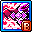 | **คลาส 5** | **Fatal Blitz** | 1375% | 8 Hit | ไม่มี (0s) | 10 ตัว | ระดมยิงประหารชีวิต รัวกระสุนมังกรดำไม่ยั้ง |
|  | **คลาส 5** | **Thanatos Descent** | 1% | 1 Hit | ไม่มี (0s) | 10 ตัว | ความตายมาเยือน แปลงร่างมังกรแห่งความตาย |
|  | **คลาส 5** | **Grip of Agony** | - | - | - | - | มือปีศาจขย้ำศัตรู ดึงดูดวิญญาณมาทำดาเมจ |

---

## 🗡️ 4. สายโจร (Thieves - 8 อาชีพ)

### 33. Night Lord (ไนท์ลอร์ด) (Explorer)
* **สเตตัสหลัก:** LUK | **อาวุธประจำตัว:** กรงเล็บ (Claw + ดาวกระจาย)

| ไอคอน | คลาส | ชื่อสกิล | ดาเมจ (%) | Hit | คูลดาวน์ | เป้าหมาย | บทบาท & จุดเด่น |
| :---: | :---: | :--- | :---: | :---: | :---: | :---: | :--- |
|  | **คลาส 1** | **Lucky Seven** | - | - | 600 วิ | - | ปาดาวกระจาย 2 นัดใส่ศัตรู |
|  | **คลาส 2** | **Shuriken Burst** | - | - | - | - | ปาดาวกระจายระเบิดใส่กลุ่มมอนสเตอร์ |
|  | **คลาส 3** | **Shadow Partner** | - | - | - | - | แยกร่างเงา โจมตีตามติดซ้ำอีก 70% |
|  | **คลาส 4** | **Quad Star** | 420% | - | ไม่มี (0s) | - | ปาดาวกระจาย 4 ดอกด้วยความเร็วแสง สกิลตีบอสหลัก |
|  | **คลาส 4** | **Showdown** | 708% | 2 Hit | 145 วิ | 6 ตัว | เสกมอนสเตอร์ยักษ์กวาดศัตรู เพิ่ม EXP และ Drop Rate |
|  | **คลาส 4** | **Assassin's Mark** | 120% | - | ไม่มี (0s) | 3 ตัว | ดาวกระจายวิญญาณเด้งชิ่งออกจากศัตรูอัตโนมัติ |
|  | **Hyper** | **Four Seasons** | 358% | 7 Hit | 14 วิ | 8 ตัว | สี่ฤดูกาล เสกยันต์ยักษ์ทับมอนสเตอร์ทั้งจอ |
|  | **Hyper** | **Bleed Dart** | - | - | 180 วิ | - | ดาวกระจายพิษเลือดไหล เพิ่มพลังโจมตีสูงมาก |
|  | **คลาส 5** | **Spread Throw** | 1100% | 6 Hit | 8 วิ | 12 ตัว | ปาดาวกระจายกระจาย 4 ทิศทาง ระเบิดดาเมจระยะประชิดมหาศาล |
|  | **คลาส 5** | **Fuma Shuriken** | 1210% | 5 Hit | 14 วิ | 10 ตัว | ปาดาวกระจายยักษ์หมุนฟันมอนสเตอร์ต่อเนื่อง |
|  | **คลาส 5** | **Dark Lord's Omen** | - | 4 Hit | ไม่มี (0s) | 1 ตัว | ยันต์โบราณเรียกฝนดาวกระจายตกถล่มทั้งฉาก |
|  | **คลาส 5** | **Throwing Star Barrage** | 1375% | 6 Hit | ไม่มี (0s) | 4 ตัว | สาดห่าฝนดาวกระจายรัวนับร้อยฮิตใส่บอส |

---

### 34. Shadower (ชาโดเวอร์) (Explorer)
* **สเตตัสหลัก:** LUK | **อาวุธประจำตัว:** มีดสั้น (Dagger + โล่)

| ไอคอน | คลาส | ชื่อสกิล | ดาเมจ (%) | Hit | คูลดาวน์ | เป้าหมาย | บทบาท & จุดเด่น |
| :---: | :---: | :--- | :---: | :---: | :---: | :---: | :--- |
|  | **คลาส 1** | **Double Stab** | - | - | - | - | แทงมีดสั้นสองจังหวะรวดเร็ว |
| 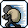 | **คลาส 2** | **Savage Blow** | 410% | - | 12 วิ | 4 ตัว | กระหน่ำแทงมีด 6 Hit รวดเร็ว |
|  | **คลาส 3** | **Meso Explosion** | 470% | 2 Hit | ไม่มี (0s) | 8 ตัว | จุดระเบิดเหรียญ Meso บนพื้น สร้างสะเก็ดระเบิดรอบทิศ |
|  | **คลาส 3** | **Shadow Partner** | 130% | 2 Hit | ไม่มี (0s) | 10 ตัว | แยกร่างเงาโจมตีตามติด |
|  | **คลาส 4** | **Assassinate** | - | - | - | - | ลอบสังหาร แทงจุดตาย 2 จังหวะรุนแรงที่สุดใส่บอส |
|  | **คลาส 4** | **Boomerang Step** | 375% | 4 Hit | 4 วิ | 8 ตัว | พุ่งเฉือนมีดไปกลับกวาดมอนสเตอร์ทั้งแถว |
|  | **Hyper** | **Shadow Veil** | 800% | 1 Hit | 60 วิ | 15 ตัว | หมอกเงาความมืด เฉือนศัตรูต่อเนื่องทั้งหน้าจอ |
|  | **Hyper** | **Flip the Coin** | - | - | 120 วิ | - | ดีดเหรียญทอง สะสมบัฟดาเมจและคริติคอล |
|  | **คลาส 5** | **Shadow Assault** | - | - | 180 วิ | - | พุ่งแทงทะลวงมิติ 4 ทิศทางต่อเนื่อง |
|  | **คลาส 5** | **Trickblade** | - | - | 60 วิ | - | เคาน์เตอร์แทงสวนบอสทันที พร้อมสถานะอมตะ |
|  | **คลาส 5** | **Sonic Blow** | 1980% | 8 Hit | 200 วิ | 12 ตัว | รัวหมื่นมีดสั้นโซนิคบูม ละลายเลือดบอสในพริบตา |
|  | **คลาส 5** | **Slash Shadow Formation** | - | - | ไม่มี (0s) | - | เรียกกองทัพเงาโจรฟาดฟันทำลายล้างทั้งฉาก |

---

### 35. Dual Blade (ดูอัล เบลด) (Explorer)
* **สเตตัสหลัก:** LUK | **อาวุธประจำตัว:** มีดคู่ (Dagger + Katara)

| ไอคอน | คลาส | ชื่อสกิล | ดาเมจ (%) | Hit | คูลดาวน์ | เป้าหมาย | บทบาท & จุดเด่น |
| :---: | :---: | :--- | :---: | :---: | :---: | :---: | :--- |
|  | **คลาส 1** | **Double Stab** | - | - | - | - | แทงมีดสั้นสองจังหวะ |
|  | **คลาส 2** | **Slash Storm** | - | - | - | - | ควงมีดคู่พุ่งฟันพายุหมุน |
|  | **คลาส 3** | **Flying Assaulter** | - | - | - | - | ทิ้งดิ่งจากฟ้าพุ่งแทงมอนสเตอร์ลงพื้น |
|  | **คลาส 4** | **Phantom Blow** | - | - | 900 วิ | - | กระหน่ำแทงมีดคู่ทะลวงเกราะบอส 6 Hit รัวเร็ว |
|  | **คลาส 4** | **Blade Fury** | 315% | 6 Hit | ไม่มี (0s) | 1 ตัว | หมุนตัวฟันมีดคู่รอบทิศ 360 องศา สกิลฟาร์มหลัก |
|  | **Hyper** | **Asura's Anger** | 420% | 4 Hit | 60 วิ | 10 ตัว | แปลงเป็นพายุหมุนมีดอาชูร่า เจาะเกราะ 100% ละลายบอส |
|  | **Hyper** | **Blade Clone** | 140% | - | 90 วิ | - | ร่างเงาคาตานะ ช่วยฟันซ้ำทุกการโจมตี |
|  | **คลาส 5** | **Blade Tempest** | 1320% | 6 Hit | 60 วิ | 10 ตัว | พายุมีดคู่เฉือนทำลายล้างทั้งหน้าจอ |
|  | **คลาส 5** | **Blades of Destiny** | 390% | 6 Hit | 180 วิ | 12 ตัว | มีดยักษ์แห่งชะตากรรมฟาดลงมาผ่าศัตรู |
|  | **คลาส 5** | **Blade Tornado** | 770% | 4 Hit | ไม่มี (0s) | 12 ตัว | ปล่อยพายุทอร์นาโดใบมีดพุ่งทะลวงกวาดมอนสเตอร์ |
|  | **คลาส 5** | **Haunted Edge** | 1% | - | ไม่มี (0s) | - | ดาบวิญญาณผีสิง ฟันตามติดทุกครั้งที่แทง Phantom Blow |

---

### 36. Night Walker (ไนท์ วอล์กเกอร์) (Cygnus Knights)
* **สเตตัสหลัก:** LUK | **อาวุธประจำตัว:** กรงเล็บ (Claw)

| ไอคอน | คลาส | ชื่อสกิล | ดาเมจ (%) | Hit | คูลดาวน์ | เป้าหมาย | บทบาท & จุดเด่น |
| :---: | :---: | :--- | :---: | :---: | :---: | :---: | :--- |
|  | **คลาส 1** | **Lucky Seven** | 230% | - | ไม่มี (0s) | - | ปาดาวกระจายเงามืด |
|  | **คลาส 2** | **Poison Needle** | 280% | - | ไม่มี (0s) | - | เข็มพิษปาเจาะศัตรู |
|  | **คลาส 3** | **Shadow Spark** | 340% | - | ไม่มี (0s) | - | ดาวกระจายเงามืดแตกตัวระเบิดรอบข้าง |
|  | **คลาส 4** | **Quintuple Star** | - | - | 900 วิ | - | ปาดาวกระจาย 5 ดอกรวดเร็ว สกิลตีบอสหลัก |
|  | **คลาส 4** | **Darkness Omen** | 340% | - | ไม่มี (0s) | - | เรียกค้างคาวเงามืดบินวนทำดาเมจเป็นฝูง |
|  | **Hyper** | **Dominion** | 1000% | 10 Hit | 180 วิ | 15 ตัว | กางอาณาเขตดวงจันทร์สีเลือด ควบคุมพื้นที่ทั้งแมพ |
|  | **Hyper** | **Shadow Illusion** | - | - | 180 วิ | - | แยกร่างเงา 3 ร่าง ปาดาวกระจายตามติด |
|  | **คลาส 5** | **Shadow Spear** | 1320% | 6 Hit | ไม่มี (0s) | 10 ตัว | หอกเงาผุดขึ้นจากพื้นนับร้อยเล่มทิ่มแทงบอส |
|  | **คลาส 5** | **Greater Dark Servant** | 1100% | 6 Hit | ไม่มี (0s) | 12 ตัว | แยกร่างเงาขนาดยักษ์ สลับตำแหน่งได้อิสระ |
|  | **คลาส 5** | **Shadow Bite** | 1870% | 8 Hit | 200 วิ | 10 ตัว | ค้างคาวเงามืดกัดขย้ำทั้งหน้าจอ เพิ่ม Final Damage |
|  | **คลาส 5** | **Rapid Throw** | 935% | 8 Hit | 90 วิ | 6 ตัว | สาดดาวกระจายเงามืดรัวไม่ยั้งใส่เป้าหมายเดียว |

---

### 37. Phantom (แฟนทอม) (Heroes)
* **สเตตัสหลัก:** LUK | **อาวุธประจำตัว:** Cane (ไม้เท้ามีด)

| ไอคอน | คลาส | ชื่อสกิล | ดาเมจ (%) | Hit | คูลดาวน์ | เป้าหมาย | บทบาท & จุดเด่น |
| :---: | :---: | :--- | :---: | :---: | :---: | :---: | :--- |
|  | **คลาส 1** | **Double Piercing** | 208% | 2 Hit | ไม่มี (0s) | 4 ตัว | แทงไม้เท้า 2 จังหวะ |
|  | **คลาส 2** | **Calling Card** | 190% | 3 Hit | ไม่มี (0s) | 4 ตัว | ปาไพ่มายากลตัดศัตรู |
|  | **คลาส 3** | **Coat of Arms** | 360% | 4 Hit | ไม่มี (0s) | 8 ตัว | ฟาดฟันตราสัญลักษณ์ประจำตระกูล |
|  | **คลาส 4** | **Mille Aiguilles** | 140% | 3 Hit | ไม่มี (0s) | 6 ตัว | แทงไม้เท้ารัวแสงพันเล่มต่อเนื่องไม่หยุด |
|  | **คลาส 4** | **Tempest** | 200% | 3 Hit | 18 วิ | 8 ตัว | พายุไพ่หมุนวนรอบตัว กวาดมอนสเตอร์รอบทิศ |
|  | **Hyper** | **Rose Carte Finale** | 700% | 6 Hit | 30 วิ | 15 ตัว | โปรยไพ่กุหลาบลงพื้น ระเบิดทำลายล้างทั้งฉาก |
|  | **Hyper** | **Final Cut / Buff** | - | - | 30 วิ | - | ขโมยสกิลคลาส 4 จาก Explorer มาใช้ได้อย่างอิสระ |
|  | **คลาส 5** | **Luck of the Draw** | 1320% | 6 Hit | ไม่มี (0s) | 10 ตัว | เปิดไพ่ทาโรต์รัวสาดใส่บอส พร้อมมอบบัฟและฮีล |
|  | **คลาส 5** | **Ace in the Hole** | 390% | 6 Hit | ไม่มี (0s) | 12 ตัว | ปาไพ่ตายเด้งชิ่งไปมาระหว่างศัตรูอย่างรุนแรง |
|  | **คลาส 5** | **Phantom's Mark** | 2200% | 15 Hit | 5000 วิ | 15 ตัว | สลักตราแฟนทอม 7 ตราก่อนระเบิดดาเมจทะลวง |
|  | **คลาส 5** | **Rift Break** | 935% | 8 Hit | ไม่มี (0s) | 6 ตัว | วาร์ปฟันข้ามมิติ 7 ครั้งต่อเนื่องอย่างแม่นยำ |

---

### 38. Cadena (คาเดนา) (Nova)
* **สเตตัสหลัก:** LUK | **อาวุธประจำตัว:** โซ่ (Chain)

| ไอคอน | คลาส | ชื่อสกิล | ดาเมจ (%) | Hit | คูลดาวน์ | เป้าหมาย | บทบาท & จุดเด่น |
| :---: | :---: | :--- | :---: | :---: | :---: | :---: | :--- |
|  | **คลาส 1** | **Chain Arts: Stroke** | - | - | ไม่มี (0s) | - | ฟาดโซ่ 2 จังหวะพื้นฐาน |
|  | **คลาส 2** | **Weapon Variety I** | - | - | - | - | สลับอาวุธสะสมสแตกดาเมจ |
|  | **คลาส 3** | **Weapon Variety II** | - | - | - | - | เพิ่มอาวุธ ปืนสั้น มีดกริช และไม้เบสบอล |
|  | **คลาส 4** | **Chain Arts: Stroke VI** | - | - | - | - | ฟาดโซ่ขั้นสูงสุด กวาดมอนสเตอร์วงกว้าง |
|  | **คลาส 4** | **Chain Arts: Crush** | 450% | 6 Hit | 12 วิ | 8 ตัว | ทุบโซ่ลงพื้นสร้างคลื่นช็อกเวฟ |
|  | **Hyper** | **Chain Arts: Reign of Chains** | 510% | 15 Hit | 30 วิ | 15 ตัว | ควงโซ่หมุนวนทำลายล้างทั้งหน้าจออย่างอมตะ |
|  | **Hyper** | **Merchant's Elixir** | - | - | 120 วิ | - | ดื่มยาพลังงาน เพิ่มการโจมตีและความเร็ว |
|  | **คลาส 5** | **Chain Arts: Void Strike** | 1760% | 6 Hit | ไม่มี (0s) | 12 ตัว | โซ่เงาวอยด์ช่วยฟาดฟันตามติดทุกอาวุธ |
|  | **คลาส 5** | **Apocalypse Cannon** | - | - | 150 วิ | - | ติดตั้งปืนใหญ่ระเบิดเพลิงเผาผลาญศัตรู |
| 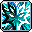 | **คลาส 5** | **Chain Arts: Maelstrom** | 880% | 7 Hit | 30 วิ | 10 ตัว | พายุโซ่หมุนปั่นดึงดูดศัตรูเข้ามาทำดาเมจ |
|  | **คลาส 5** | **Weapon Variety Finale** | 935% | 8 Hit | ไม่มี (0s) | 6 ตัว | ระเบิดคลังอาวุธทั้งหมดพร้อมกัน ถล่มบอสยับเยิน |

---

### 39. Hoyoung (โฮยอง) (Anima)
* **สเตตัสหลัก:** LUK | **อาวุธประจำตัว:** พัดวิเศษ (Ritual Fan)

| ไอคอน | คลาส | ชื่อสกิล | ดาเมจ (%) | Hit | คูลดาวน์ | เป้าหมาย | บทบาท & จุดเด่น |
| :---: | :---: | :--- | :---: | :---: | :---: | :---: | :--- |
|  | **คลาส 1** | **Talisman: Evil Banishing** | 80% | 5 Hit | ไม่มี (0s) | 5 ตัว | ยันต์ขับไล่ปีศาจ |
|  | **คลาส 2** | **Ground: Stone Tremor** | 90% | 4 Hit | ไม่มี (0s) | 6 ตัว | กระทืบพื้นหินถล่มขึ้นมาจากปฐพี |
|  | **คลาส 3** | **Heaven: Iron Fan Gale** | 150% | 5 Hit | ไม่มี (0s) | 6 ตัว | พัดลมพายุพัดกวาดมอนสเตอร์ |
|  | **คลาส 4** | **Humanity: As-You-Will Fan** | 340% | 6 Hit | 8 วิ | 8 ตัว | กระบองวิเศษแปลงกายฟาดกวาดมอนสเตอร์ |
| 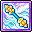 | **คลาส 4** | **Scroll: Star Vortex** | 420% | 8 Hit | ไม่มี (0s) | 10 ตัว | เปิดม้วนคัมภีร์น้ำเต้าดูดกลืนมอนสเตอร์ |
|  | **Hyper** | **Sage: Wrath of Gods** | - | - | - | - | ยืมพลังเทพเจ้าฟาดฟันทำลายล้างทั้งฉาก (Bind 10s) |
|  | **Hyper** | **Sage: Clone Rampage** | - | - | - | - | แยกร่างโคลนลิงลมช่วยโจมตีทั่วแมพ |
|  | **คลาส 5** | **Sage: Microcosm Miracle** | 880% | 14 Hit | 15 วิ | 15 ตัว | เปิดขวดน้ำเต้าวิเศษปล่อยลำแสงดวงดาว |
|  | **คลาส 5** | **Scroll: Tiger of the West** | 770% | 4 Hit | ไม่มี (0s) | 30 ตัว | เสือขาวแห่งทิศประจิมกระโจนขย้ำบอส |
|  | **คลาส 5** | **Sage: Apotheosis** | 1375% | 6 Hit | ไม่มี (0s) | 4 ตัว | จุติเซียนเหินเวหา ปล่อยคลื่นดาเมจมหาศาล |
|  | **คลาส 5** | **Sage: Three Paths Unity** | 1375% | 15 Hit | ไม่มี (0s) | 8 ตัว | รวมพลัง 3 วิถี สวรรค์ ปฐพี มนุษย์ ระเบิดหน้าจอ |

---

### 40. Khali (คาลี) (Flora)
* **สเตตัสหลัก:** LUK | **อาวุธประจำตัว:** Chakram

| ไอคอน | คลาส | ชื่อสกิล | ดาเมจ (%) | Hit | คูลดาวน์ | เป้าหมาย | บทบาท & จุดเด่น |
| :---: | :---: | :--- | :---: | :---: | :---: | :---: | :--- |
|  | **คลาส 1** | **Spark** | - | - | - | - | พุ่งฟันกงจักรประกายแสง |
|  | **คลาส 2** | **Insanity I** | - | - | - | - | ควงกงจักรหมุนฟันอย่างคลั่งไคล้ |
|  | **คลาส 3** | **Insanity II** | - | - | - | - | อัปเกรดการควงกงจักรพุ่งทะลวง 3 ทิศทาง |
|  | **คลาส 4** | **Arts: Flurry** | - | - | - | - | ฟันกงจักรพายุหมุนกวาดหน้าจอรวดเร็ว |
|  | **คลาส 4** | **Hex: Pandemonium** | - | - | - | - | เสกกงจักรยักษ์ปั่นพื้นสร้างอาณาเขตทำลายล้าง |
|  | **Hyper** | **Oblivion** | - | - | - | - | ลบเลือนความทรงจำ ระเบิดกงจักรรอบตัว |
|  | **Hyper** | **Desert Veil** | - | - | - | - | ม่านทรายแห่งทะเลทราย เพิ่มความเร็วและหลบหลีก |
|  | **คลาส 5** | **Hex: Sandstorm** | - | - | 14 วิ | - | พายุทรายกงจักรหมุนดูดมอนสเตอร์เข้ามาทำดาเมจ |
|  | **คลาส 5** | **Void Rush** | 605% | 6 Hit | ไม่มี (0s) | 8 ตัว | พุ่งข้ามมิติตัดผ่านศัตรูต่อเนื่องอย่างแม่นยำ |
|  | **คลาส 5** | **Chakram Split** | 825% | 3 Hit | ไม่มี (0s) | 1 ตัว | แยกกงจักรนับสิบเล่มบินไล่ล่าบอส |
|  | **คลาส 5** | **Desert Mirage** | 440% | 4 Hit | ไม่มี (0s) | 2 ตัว | ภาพลวงตาทะเลทราย หลอกล่อและโจมตีประสาน |

---

## ⚓ 5. สายโจรสลัด (Pirates - 10 อาชีพ)

### 41. Buccaneer (บัคคาเนียร์) (Explorer)
* **สเตตัสหลัก:** STR | **อาวุธประจำตัว:** สนับมือ (Knuckle)

| ไอคอน | คลาส | ชื่อสกิล | ดาเมจ (%) | Hit | คูลดาวน์ | เป้าหมาย | บทบาท & จุดเด่น |
| :---: | :---: | :--- | :---: | :---: | :---: | :---: | :--- |
|  | **คลาส 1** | **Somersault Kick** | - | - | 10 วิ | - | เตะลังกาหลังฟาดศัตรู |
|  | **คลาส 2** | **Corkscrew Blow** | 140% | 3 Hit | ไม่มี (0s) | 6 ตัว | พุ่งหมัดควงสว่านผลักมอนสเตอร์ |
|  | **คลาส 3** | **Energy Burst** | 473% | 2 Hit | 8 วิ | 8 ตัว | ระเบิดคลื่นพลังงานรอบตัว |
|  | **คลาส 4** | **Octopunch** | 320% | 8 Hit | ไม่มี (0s) | - | หมัดแปดทิศรัวใส่บอสเดี่ยว 8 Hit รวดเร็ว |
| 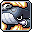 | **คลาส 4** | **Nautilus Strike** | 440% | 7 Hit | 60 วิ | 15 ตัว | เรียกเรือรบนอติลุสยิงปืนใหญ่ถล่มทั้งจอ |
|  | **คลาส 4** | **Lord of the Deep** | - | - | ไม่มี (0s) | - | อสูรสมุทรว่ายรอบตัว กวาดมอนสเตอร์อัตโนมัติ |
|  | **Hyper** | **Power Unity** | 650% | 5 Hit | 10 วิ | 8 ตัว | รวมพลังหมัดระเบิดคลื่น สะสมสแตกดาเมจ |
|  | **Hyper** | **Epic Adventure** | - | - | 240 วิ | - | การผจญภัยอันยิ่งใหญ่ เพิ่มพลังโจมตี |
|  | **คลาส 5** | **Transform** | - | - | 10 วิ | - | แปลงร่างซูเปอร์ไซย่า ยิงลูกบอลพลังงานยักษ์ 3 ลูก |
|  | **คลาส 5** | **Serpent Screw** | 1760% | 5 Hit | 1 วิ | 15 ตัว | มังกรสมุทรเลื้อยรอบตัว กวาดมอนสเตอร์ที่เดินผ่านละลายทันที |
|  | **คลาส 5** | **Hook Bomber** | 1320% | 10 Hit | ไม่มี (0s) | 8 ตัว | ฮุกหมัดระเบิดพลังมังกรสมุทรพุ่งทะลุจอ |
| 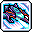 | **คลาส 5** | **Howling Fist** | 550% | 10 Hit | 5 วิ | 1 ตัว | ชาร์จหมัดคลื่นมังกรยักษ์คำรามล้างบางทั้งหน้าจอ |

---

### 42. Corsair (คอร์แซร์) (Explorer)
* **สเตตัสหลัก:** DEX | **อาวุธประจำตัว:** ปืนพก (Gun)

| ไอคอน | คลาส | ชื่อสกิล | ดาเมจ (%) | Hit | คูลดาวน์ | เป้าหมาย | บทบาท & จุดเด่น |
| :---: | :---: | :--- | :---: | :---: | :---: | :---: | :--- |
|  | **คลาส 1** | **Double Shot** | 185% | - | ไม่มี (0s) | - | ยิงปืนพก 2 นัดรวดเร็ว |
|  | **คลาส 2** | **Triple Fire** | 360% | - | ไม่มี (0s) | - | ยิงปืนพก 3 นัดต่อเนื่อง |
|  | **คลาส 3** | **Blunderbuster** | - | - | 30 วิ | - | ยิงปืนลูกซองกระจายมอนสเตอร์ด้านหน้า |
|  | **คลาส 4** | **Rapid Fire** | 325% | - | ไม่มี (0s) | - | รัวปืนพกอัตโนมัติไม่หยุด สกิลบอสสไตล์คาวบอย |
|  | **คลาส 4** | **Nautilus Strike** | 440% | 7 Hit | 30 วิ | 15 ตัว | เรียกเรือรบนอติลุสยิงปืนใหญ่ถล่มทั้งจอ |
|  | **คลาส 4** | **Eight-Legs Easton** | 649% | 4 Hit | ไม่มี (0s) | 8 ตัว | ยิงปืนใหญ่หมึกยักษ์ 8 ขากวาดทั้งหน้าจอ สกิลฟาร์มหลัก |
|  | **Hyper** | **Ugly Bomb** | 400% | 12 Hit | 15 วิ | 15 ตัว | ทิ้งระเบิดหัวกระโหลกยักษ์ ถล่มมอนสเตอร์ทั้งฉาก |
|  | **Hyper** | **Whalers** | - | - | 120 วิ | - | เรียกฉมวกปลาวาฬยักษ์แทงศัตรู |
|  | **คลาส 5** | **Bullet Barrage** | - | - | 180 วิ | - | หมุนตัวกราดยิงปืนพกรอบทิศ 360 องศา คลั่งไคล้ |
|  | **คลาส 5** | **Target Lock** | 1100% | 1 Hit | 15 วิ | 10 ตัว | ล็อกเป้าหมายด้วยเรดาร์ ยิงสไนเปอร์ทะลวงบอส |
|  | **คลาส 5** | **Nautilus Assault** | 720% | 12 Hit | 6 วิ | 10 ตัว | เรือรบนอติลุสพุ่งชนผ่านหน้าจอ ระเบิดมหาศาล |
|  | **คลาส 5** | **Death Trigger** | 660% | 12 Hit | 5 วิ | 1 ตัว | กระสุนลูกหลงเด้งทะลวงมอนสเตอร์นับสิบครั้ง |

---

### 43. Cannoneer (แคนนอนเนียร์) (Explorer)
* **สเตตัสหลัก:** STR | **อาวุธประจำตัว:** ปืนใหญ่ (Hand Cannon)

| ไอคอน | คลาส | ชื่อสกิล | ดาเมจ (%) | Hit | คูลดาวน์ | เป้าหมาย | บทบาท & จุดเด่น |
| :---: | :---: | :--- | :---: | :---: | :---: | :---: | :--- |
| 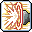 | **คลาส 1** | **Cannon Strike** | 295% | - | ไม่มี (0s) | 6 ตัว | ยิงปืนใหญ่กระสุนเดียว |
|  | **คลาส 2** | **Scatter Shot** | 215% | - | ไม่มี (0s) | 4 ตัว | ยิงปืนใหญ่ลูกปรายกระจายด้านหน้า |
|  | **คลาส 3** | **Cannon Spike** | 260% | 4 Hit | ไม่มี (0s) | 6 ตัว | ยิงกระสุนเข็มทะลวงมอนสเตอร์แถวยาว |
|  | **คลาส 4** | **Cannon Bazooka** | 545% | 4 Hit | ไม่มี (0s) | 8 ตัว | ยิงบาซูก้าปืนใหญ่ระยะไกลที่สุดในเกม กวาดมอนสเตอร์สุดแมพ |
|  | **คลาส 4** | **Cannon Barrage** | 510% | 5 Hit | 30 วิ | 15 ตัว | รัวปืนใหญ่ 4 กระบอกใส่บอสเดี่ยว 5 Hit รุนแรง |
|  | **Hyper** | **Rolling Rainbow** | 600% | 3 Hit | 90 วิ | 10 ตัว | ตั้งปืนใหญ่สายรุ้งรัวกระสุนทำดาเมจเป็นอาณาเขต |
|  | **Hyper** | **Buck Shot** | - | - | 180 วิ | - | ยิงลูกปรายแยกลูกกระสุนเป็น 3 เท่า |
|  | **คลาส 5** | **Cannonball** | 990% | 3 Hit | 180 วิ | 10 ตัว | ยิงลูกกระสุนปืนใหญ่ยักษ์กลิ้งช้าๆ ทะลวงบอส 30-50 Hit |
|  | **คลาส 5** | **ICBM** | - | - | 30 วิ | - | ยิงขีปนาวุธนิวเคลียร์ทิ้งดิ่งลงมาจากฟ้า ระเบิดมหาศาล |
|  | **คลาส 5** | **Monkey Business** | 330% | 6 Hit | 7 วิ | 8 ตัว | แก๊งลิงปืนใหญ่กระโดดออกมาช่วยถล่มบอส |
|  | **คลาส 5** | **Poolmaker** | 1100% | 5 Hit | 120 วิ | 4 ตัว | กระสุนปืนใหญ่ตกทั่วแมพ สร้างพื้นที่ทำดาเมจต่อเนื่อง |

---

### 44. Thunder Breaker (ธันเดอร์ เบรกเกอร์) (Cygnus Knights)
* **สเตตัสหลัก:** STR | **อาวุธประจำตัว:** สนับมือ (Knuckle)

| ไอคอน | คลาส | ชื่อสกิล | ดาเมจ (%) | Hit | คูลดาวน์ | เป้าหมาย | บทบาท & จุดเด่น |
| :---: | :---: | :--- | :---: | :---: | :---: | :---: | :--- |
|  | **คลาส 1** | **Shark Sweep** | 180% | 2 Hit | ไม่มี (0s) | 4 ตัว | ฟาดคลื่นฉลามกวาดศัตรู |
|  | **คลาส 2** | **Tidal Crash** | 175% | 4 Hit | ไม่มี (0s) | 6 ตัว | พุ่งชนดั่งคลื่นยักษ์ซัดฝั่ง |
| 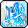 | **คลาส 3** | **Ascend** | 255% | 5 Hit | ไม่มี (0s) | 6 ตัว | กระโดดเสยสายฟ้าขึ้นสู่ท้องฟ้า |
|  | **คลาส 4** | **Annihilate** | - | - | 900 วิ | - | เรียกฉลามสายฟ้ายักษ์ฟาดใส่บอสเดี่ยว 7 Hit รวดเร็ว |
|  | **คลาส 4** | **Thunderbolt** | 350% | 7 Hit | ไม่มี (0s) | 1 ตัว | สายฟ้าฟาดกระหน่ำกวาดมอนสเตอร์วงกว้าง สกิลฟาร์มหลัก |
|  | **Hyper** | **Deep Rising** | 860% | 7 Hit | 45 วิ | 15 ตัว | ปลาวาฬสายฟ้ายักษ์กระโจนขึ้นจากใต้ดินถล่มทั้งจอ |
|  | **Hyper** | **Primal Wave** | - | - | 120 วิ | - | คลื่นยักษ์ปฐมกาล เพิ่มพลังโจมตีสายฟ้า |
|  | **คลาส 5** | **Lightning Cascade** | 780% | 3 Hit | 3 วิ | 10 ตัว | สายฟ้าเชื่อมโยงลามไปทั่วมอนสเตอร์ทุกตัวในแมพ |
|  | **คลาส 5** | **Shark Wave** | - | - | - | - | ฝูงฉลามสายฟ้าว่ายพุ่งทะลวงเป็นแนวยาว |
|  | **คลาส 5** | **Lightning Spear Multistrike** | 1320% | 9 Hit | 10 วิ | 12 ตัว | พุ่งแทงหอกสายฟ้าต่อเนื่อง 12 จังหวะ |
|  | **คลาส 5** | **Sea Wave** | 1100% | 5 Hit | ไม่มี (0s) | 4 ตัว | คลื่นยักษ์สึนามิพัดกวาดมอนสเตอร์ทั้งฉาก |

---

### 45. Mechanic (เมคานิก) (Resistance)
* **สเตตัสหลัก:** DEX | **อาวุธประจำตัว:** Gun (ขับหุ่นยนต์)

| ไอคอน | คลาส | ชื่อสกิล | ดาเมจ (%) | Hit | คูลดาวน์ | เป้าหมาย | บทบาท & จุดเด่น |
| :---: | :---: | :--- | :---: | :---: | :---: | :---: | :--- |
|  | **คลาส 1** | **Gatling Gun** | - | - | - | - | หุ่นยนต์กราดยิงปืนกลแกตลิ่ง |
|  | **คลาส 2** | **Atomic Hammer** | - | - | - | - | หมัดหุ่นยนต์ทุบพื้นสร้างคลื่นช็อก |
|  | **คลาส 3** | **Rocket Punch** | - | - | - | - | ยิงหมัดจรวดพุ่งทะลวงศัตรู |
|  | **คลาส 4** | **Heavy Salvo Plus** | - | - | - | - | ขับหุ่น Tank ยิงจรวดและปืนกลรัวใส่บอส |
|  | **คลาส 4** | **Robot Launcher: RM7** | - | - | - | - | ติดตั้งป้อมปืนมิสไซล์ช่วยยิงอัตโนมัติ |
|  | **Hyper** | **Distortion Bomb** | 350% | 2 Hit | 8 วิ | 8 ตัว | ยิงระเบิดบิดเบือนมิติ ดูดมอนสเตอร์เข้ามาทำดาเมจ |
|  | **Hyper** | **Support Unit: H-EX** | - | - | - | - | หุ่นยนต์ซัพพอร์ต ฮีลเลือดและลด DEF บอส |
|  | **คลาส 5** | **Doomsday Assault** | - | - | ไม่มี (0s) | - | เปลี่ยนเป็นโหมดป้อมปราการยิงขีปนาวุธถล่มทั้งจอ |
|  | **คลาส 5** | **Mobile Missile Battery** | 500% | 4 Hit | 180 วิ | 8 ตัว | ยิงห่ามิสไซล์ติดตามเป้าหมายรัวนับสิบลูก |
|  | **คลาส 5** | **Full Metal Barrage** | - | 5 Hit | 120 วิ | 6 ตัว | ยิงคลังอาวุธทั้งหมดของหุ่นยนต์รวดเดียว พร้อมสถานะอมตะ |
|  | **คลาส 5** | **Mecha Carrier** | 1100% | 5 Hit | ไม่มี (0s) | 4 ตัว | เรียกยานแม่บรรทุกเครื่องบิน ปล่อยโดรนรุมถล่มบอส |

---

### 46. Xenon (ซีนอน) (Resistance)
* **สเตตัสหลัก:** STR / DEX / LUK | **อาวุธประจำตัว:** Whip Blade

| ไอคอน | คลาส | ชื่อสกิล | ดาเมจ (%) | Hit | คูลดาวน์ | เป้าหมาย | บทบาท & จุดเด่น |
| :---: | :---: | :--- | :---: | :---: | :---: | :---: | :--- |
|  | **คลาส 1** | **Beam Spline** | 170% | 2 Hit | ไม่มี (0s) | 4 ตัว | ดาบเลเซอร์ฟัน 2 จังหวะ |
|  | **คลาส 2** | **Quicksilver Sword** | 175% | 3 Hit | ไม่มี (0s) | 6 ตัว | ดาบเลเซอร์แทงรวดเร็วหลายทิศทาง |
|  | **คลาส 3** | **Combat Switch** | 280% | 3 Hit | ไม่มี (0s) | 6 ตัว | ฟาดดาบเลเซอร์กวาดมอนสเตอร์ |
|  | **คลาส 4** | **Blade Dancing** | 260% | 1 Hit | ไม่มี (0s) | 8 ตัว | หมุนควงดาบเลเซอร์ฟาร์มมอนสเตอร์รอบตัว 360 องศา |
|  | **คลาส 4** | **Mecha Purge: Snipe** | 345% | 7 Hit | ไม่มี (0s) | 1 ตัว | ยิงเลเซอร์สไนเปอร์เจาะเกราะบอสเดี่ยว 7 Hit |
|  | **Hyper** | **Orbital Cataclysm** | 1500% | 6 Hit | 50 วิ | 15 ตัว | เรียกยานอวกาศยิงลำแสงทำลายล้างทั้งหน้าจอ |
|  | **Hyper** | **Amaranth Generator** | - | - | 90 วิ | - | เติมพลังงาน Supply ให้เต็ม 100% ทันที |
|  | **คลาส 5** | **Mega Smash** | 2200% | 7 Hit | 8 วิ | 15 ตัว | ชาร์จลำแสงเลเซอร์ขนาดยักษ์ ละลายบอสพร้อมสถานะอมตะ |
|  | **คลาส 5** | **Overload Mode** | 2640% | 12 Hit | ไม่มี (0s) | 15 ตัว | ปลดลิมิตพลังงาน ยิงกระสุนเลเซอร์ติดตามอัตโนมัติ |
|  | **คลาส 5** | **Hyperspeed Strike** | 1320% | 6 Hit | ไม่มี (0s) | 15 ตัว | พุ่งฟันด้วยความเร็วเหนือแสง 15 Hit รวดเร็ว |
|  | **คลาส 5** | **Photon Ray** | 1100% | 5 Hit | ไม่มี (0s) | 4 ตัว | ดาวเทียมล็อกเป้าหมาย ยิงลำแสงโฟตอนถล่มบอส |

---

### 47. Shade (เฉด / อึนวอล) (Heroes)
* **สเตตัสหลัก:** STR | **อาวุธประจำตัว:** สนับมือ (Knuckle)

| ไอคอน | คลาส | ชื่อสกิล | ดาเมจ (%) | Hit | คูลดาวน์ | เป้าหมาย | บทบาท & จุดเด่น |
| :---: | :---: | :--- | :---: | :---: | :---: | :---: | :--- |
|  | **คลาส 1** | **Flash Fist** | 90% | 2 Hit | ไม่มี (0s) | 4 ตัว | หมัดวิญญาณชกพุ่งไปข้างหน้า |
| 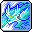 | **คลาส 2** | **Ground Pound** | 430% | 2 Hit | ไม่มี (0s) | 6 ตัว | ทุบพื้นเรียกอุ้งเท้าเสือวิญญาณ |
|  | **คลาส 3** | **Shockwave Punch** | 300% | 2 Hit | ไม่มี (0s) | 6 ตัว | หมัดคลื่นกระแทกกระดอนเป็นวงกว้าง |
|  | **คลาส 4** | **Spirit Claw** | 300% | 3 Hit | 2 วิ | 8 ตัว | กรงเล็บวิญญาณฟาดฟันบอส 8 Hit สกิลโจมตีหลัก |
|  | **คลาส 4** | **Bomb Punch** | 2400% | 1 Hit | 120 วิ | 6 ตัว | หมัดระเบิด 4 จังหวะ สกิลฟาร์มมอนสเตอร์ที่ดีที่สุด |
|  | **คลาส 4** | **Soul Splitter** | - | - | - | - | แยกวิญญาณบอสออกเป็น 2 ร่าง เพื่อทำดาเมจคูณสอง! |
|  | **Hyper** | **Spirit Bond Max** | - | - | - | - | รวมร่างวิญญาณเทพเจ้าจิ้งจอก เพิ่มดาเมจและป้องกันล้ม |
|  | **Hyper** | **Heroic Memories** | - | - | - | - | ความทรงจำแห่งวีรบุรุษ เพิ่มพลังโจมตี |
|  | **คลาส 5** | **Spiritgate** | 990% | 3 Hit | ไม่มี (0s) | 10 ตัว | เปิดประตูดินแดนวิญญาณ ฝูงวิญญาณรุมโจมตีมอนสเตอร์ |
|  | **คลาส 5** | **True Spirit Claw** | 395% | 10 Hit | 180 วิ | 10 ตัว | กรงเล็บวิญญาณแท้ขนาดยักษ์ ฟาดกวาดทั้งหน้าจอ |
|  | **คลาส 5** | **Ghostpark** | 440% | 7 Hit | ไม่มี (0s) | 8 ตัว | อัญเชิญจิ้งจอกเทพเจ้าช่วยโจมตีและปล่อยฟองวิญญาณ |
|  | **คลาส 5** | **Smashing Incarnation** | 1100% | 5 Hit | ไม่มี (0s) | 4 ตัว | หมัดยักษ์อวตารทุบทำลายล้างมอนสเตอร์ทั้งฉาก |

---

### 48. Angelic Buster (แองเจลิก บัสเตอร์) (Nova)
* **สเตตัสหลัก:** DEX | **อาวุธประจำตัว:** Soul Shooter

| ไอคอน | คลาส | ชื่อสกิล | ดาเมจ (%) | Hit | คูลดาวน์ | เป้าหมาย | บทบาท & จุดเด่น |
| :---: | :---: | :--- | :---: | :---: | :---: | :---: | :--- |
|  | **คลาส 1** | **Bubble Star** | - | - | - | - | ยิงกระสุนฟองสบู่ดวงดาว |
|  | **คลาส 2** | **Sting Explosive** | - | - | - | - | แทงกระสุนแสงระเบิดผลักมอนสเตอร์ |
|  | **คลาส 3** | **Soul Seeker** | - | - | - | - | ปล่อยลูกแก้วมังกรเด้งชิ่งไปมาทั่วหน้าจอ |
|  | **คลาส 4** | **Celestial Roar** | - | - | - | - | คำรามเสียงดนตรีศักดิ์สิทธิ์ กวาดมอนสเตอร์ทั้งจอ สกิลฟาร์มหลัก |
|  | **คลาส 4** | **Trinity** | 146% | 5 Hit | 60 วิ | 10 ตัว | คอมโบลำแสง 3 จังหวะยิงถล่มบอสเดี่ยว 6 Hit |
|  | **Hyper** | **Superstar Spotlight** | 600% | 3 Hit | 60 วิ | 15 ตัว | สปอตไลท์ซูเปอร์สตาร์ ส่องสว่างทำดาเมจรอบตัว |
|  | **Hyper** | **Final Contract** | - | - | 120 วิ | - | สัญญาแห่งมังกรเอสคาดา เพิ่มพลังโจมตีและคริติคอล |
|  | **คลาส 5** | **Sparkle Burst** | 935% | 5 Hit | 25 วิ | 15 ตัว | ริบบิ้นดวงดาวระเบิดเป็นพลุแสงขนาดมหึมา |
|  | **คลาส 5** | **Superstar Concert** | - | - | 240 วิ | - | คอนเสิร์ตไอดอล ร้องเพลงปล่อยคลื่นพลังทำลายล้าง |
|  | **คลาส 5** | **Mighty Mascot** | 660% | 12 Hit | ไม่มี (0s) | 15 ตัว | เรียกมาสคอตเอสคาดาตัวยักษ์ออกมาช่วยพ่นไฟ |
|  | **คลาส 5** | **Trinity Fusion** | 1100% | 5 Hit | ไม่มี (0s) | 4 ตัว | รวมพลัง Trinity ระเบิดลำแสงมังกรยักษ์ทะลุจอ |

---

### 49. Ark (อาร์ค) (Flora)
* **สเตตัสหลัก:** STR | **อาวุธประจำตัว:** Knuckle (แขนอสูร)

| ไอคอน | คลาส | ชื่อสกิล | ดาเมจ (%) | Hit | คูลดาวน์ | เป้าหมาย | บทบาท & จุดเด่น |
| :---: | :---: | :--- | :---: | :---: | :---: | :---: | :--- |
|  | **คลาส 1** | **Basic Charge Drive** | 60% | 1 Hit | ไม่มี (0s) | - | หมัดอสูรพุ่งชนด้านหน้า |
|  | **คลาส 2** | **Scarlet Charge Drive** | - | - | - | - | พุ่งทะยานด้วยหมัดเพลิง |
|  | **คลาส 3** | **Gust Charge Drive** | - | - | - | - | ทิ้งดิ่งหมัดวายุจากกลางอากาศ |
|  | **คลาส 4** | **Abyssal Charge Drive** | - | - | - | - | ระเบิดพลังแห่งห้วงอเวจีวงกว้าง |
|  | **คลาส 4** | **Gripping Agony** | - | - | - | - | กรงเล็บอสูรขย้ำศัตรูต่อเนื่อง |
|  | **Hyper** | **Endless Nightmare** | - | - | - | - | ฝันร้ายไร้ที่สิ้นสุด กวาดมอนสเตอร์ทั้งฉาก |
|  | **Hyper** | **Race of the Beast** | - | - | - | - | ปลดปล่อยสัญชาตญาณสัตว์ป่า เพิ่มความเร็ว |
|  | **คลาส 5** | **Infinity Spell** | 880% | 3 Hit | 120 วิ | 15 ตัว | คาถาไร้ขีดจำกัด เสกมืออสูรนับร้อยช่วยโจมตี |
|  | **คลาส 5** | **Abyssal Recall** | - | - | - | - | ระลึกอดีตอสูร ดำดิ่งสู่ห้วงอเวจีพร้อมสถานะอมตะ |
|  | **คลาส 5** | **Devious Nightmare** | - | - | 2 วิ | - | กรงเล็บปีศาจเฉือนทำลายล้างมิติ |
|  | **คลาส 5** | **Endless Dream** | 1100% | 5 Hit | ไม่มี (0s) | 4 ตัว | ระเบิดภาพหลอนปีศาจ รัวคอมโบทำลายล้างบอส |

---

### 50. Mo Xuan / Jett (โม่เสวียน / เจ็ต) (Other)
* **สเตตัสหลัก:** DEX | **อาวุธประจำตัว:** สนับมือ / ปืน

| ไอคอน | คลาส | ชื่อสกิล | ดาเมจ (%) | Hit | คูลดาวน์ | เป้าหมาย | บทบาท & จุดเด่น |
| :---: | :---: | :--- | :---: | :---: | :---: | :---: | :--- |
|  | **คลาส 1** | **Starline One** | - | - | - | - | หมัดดาวตกพุ่งชนศัตรู |
|  | **คลาส 2** | **Starline Two** | - | - | - | - | เสยหมัดคลื่นพลังดาวตกขึ้นฟ้า |
|  | **คลาส 3** | **Starline Three** | - | - | 900 วิ | - | หมัดอัดกระแทกมอนสเตอร์เป็นแนวยาว |
|  | **คลาส 4** | **Starline Four** | 300% | - | ไม่มี (0s) | - | คอมโบหมัดดาราศาสตร์ 4 จังหวะ |
|  | **คลาส 4** | **Suborbital Strike** | 450% | 4 Hit | 60 วิ | 8 ตัว | ดาวเทียมอวกาศยิงเลเซอร์สนับสนุนอัตโนมัติ |
|  | **Hyper** | **Bionic Resiliency** | 300% | 15 Hit | 30 วิ | 1 ตัว | เพิ่มความทนทานชีวภาพและสถานะผิดปกติ |
|  | **Hyper** | **Singularity Shock** | - | - | 180 วิ | - | ระเบิดหลุมดำ ซิงกูลาริตี้ ทำลายล้างทั้งหน้าจอ |
|  | **คลาส 5** | **Gravity Crush** | 710% | 15 Hit | 30 วิ | 12 ตัว | หลุมดำแรงโน้มถ่วง ดูดมอนสเตอร์เข้ามาบดขยี้ |
|  | **คลาส 5** | **Suborbital Beam** | 660% | 4 Hit | 120 วิ | 3 ตัว | ลำแสงดาวเทียมยักษ์ยิงกวาดล้างทั้งฉาก |
|  | **คลาส 5** | **Cosmic Strike** | 660% | - | 45 วิ | - | กำปั้นจักรวาลทุบพื้นทำลายล้างมอนสเตอร์ |
|  | **คลาส 5** | **Starfall** | 1210% | 4 Hit | ไม่มี (0s) | 3 ตัว | ฝนดาวตกถล่มจากอวกาศอย่างต่อเนื่อง |

---

