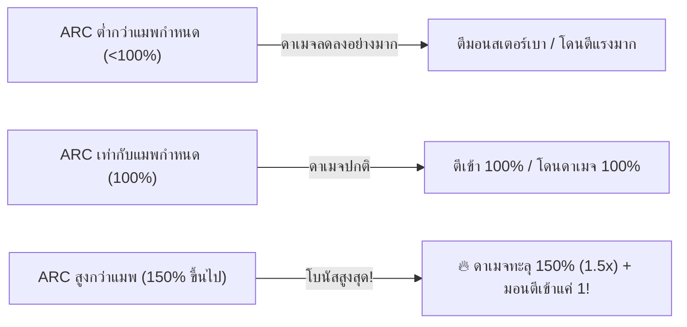

# 🔮 ระบบ Arcane Symbol & Arcane River

ระบบ **Arcane Symbol** และแม่น้ำ **Arcane River** คือระบบหัวใจหลักของการพัฒนาตัวละครหลังเลเวล 200 (เปลี่ยนอาชีพคลาส 5) ของ MapleStory และ Clover Idle โดยเป็นแหล่งมอบค่าสเตตัสหลัก (Main Stat) มหาศาลกว่า **13,200 หน่วย** และค่า **Arcane Force (ARC)** ที่ช่วยเพิ่มพลังโจมตีให้ตัวละครสูงสุดถึง **1.5 เท่า (150%)** รวมทั้งลดดาเมจที่ได้รับจากมอนสเตอร์จนเหลือเพียง 1 หน่วย!

***

## 🌟 1. ก้าวสู่คลาส 5 กับภารกิจ 3 เทพธิดา (Arcane Stones)

เมื่อตัวละครเลเวลถึง 200 และผ่านการทำเควสต์เปลี่ยนอาชีพคลาส 5 ตัวละครจะต้องเดินทางไปพบกับ **3 มหาเทพธิดาแห่งมิติต่างๆ** เพื่อทำภารกิจและรับมอบ **Arcane Stone** ทั้ง 3 ก้อน:

|                                  ไอคอน                                 | ชื่อไอเทมหินอาร์เคน             | เทพธิดาผู้มอบ                          | รายละเอียดและเงื่อนไข                                  |
| :--------------------------------------------------------------------: | ------------------------------- | -------------------------------------- | ------------------------------------------------------ |
|  | **Arcane Stone of Maple World** | Maple Goddess (เทพธิดาเมเปิ้ลเวิลด์)   | หินแห่งโลกเมเปิ้ล ตัวแทนแห่งความทรงจำและการเริ่มต้น    |
|  | **Arcane Stone of Grandis**     | Grandis Goddess (เทพธิดาแกรนดิส)       | หินแห่งมิติแกรนดิส ตัวแทนแห่งจิตวิญญาณและการต่อสู้     |
|  | **Arcane Stone of Tynerum**     | Goddess of Masteria (เทพธิดามาสทีเรีย) | หินแห่งดินแดนไทเนรัม ตัวแทนแห่งความมุ่งมั่นและการทดสอบ |

เมื่อทำภารกิจและปลดล็อคหินทั้ง 3 ก้อนสำเร็จ ตัวละครจะได้รับการปลดผนึกพลัง **Erda** เข้าสู่คลาส 5 ได้รับหน้าต่าง **V-Matrix** และสามารถก้าวข้ามประตูปริศนาเข้าสู่ดินแดน **Arcane River** เพื่อเริ่มสะสม Arcane Symbol ชิ้นแรกได้ทันที!

***

## ⚡ 2. ระบบ Arcane Force (ARC) และพลังดาเมจ 1.5 เท่า

ในแผนที่ของ Arcane River ทุกแผนที่และดันเจี้ยนบอส จะมีค่า **Required Arcane Force (ARC ที่ต้องการ)** กำหนดไว้ หากตัวละครมีค่า ARC สูงกว่าที่แมพต้องการ จะได้รับโบนัส Final Damage เพิ่มขึ้นอย่างมหาศาล และลดดาเมจที่ได้รับจากมอนสเตอร์:

### ตารางสัดส่วน Arcane Force และตัวคูณความเสียหาย

|  สัดส่วน ARC เทียบกับแมพ  | พลังโจมตีที่ทำได้ (Final Damage) | ดาเมจที่ได้รับจากมอนสเตอร์ | คำแนะนำ                                                                  |
| :-----------------------: | :------------------------------: | :------------------------: | ------------------------------------------------------------------------ |
|      **ต่ำกว่า 30%**      |              **10%**             |          **280%**          | โดนมอนสเตอร์ตบทีเดียวตาย ตีแทบไม่เข้า                                    |
|          **50%**          |              **60%**             |          **200%**          | ยังไม่ควรฟาร์ม เปลืองยาและฟาร์มช้า                                       |
|   **100% (เท่ากับแมพ)**   |             **100%**             |          **100%**          | ฟาร์มได้ตามปกติ ดาเมจมาตรฐาน                                             |
|          **110%**         |             **110%**             |           **80%**          | เริ่มฟาร์มสบายขึ้น ดาเมจแรงขึ้น 10%                                      |
|          **130%**         |             **130%**             |           **30%**          | ดาเมจแรงขึ้นอย่างชัดเจน โดนตีเบาลงมาก                                    |
| **150% ขึ้นไป (Max Cap)** |      **🔥 150% (1.5 เท่า!)**     |   **🛡️ เหลือ 1 ดาเมจ!**   | **จุดคุ้มค่าสูงสุด! ยืนชนมอนสเตอร์ได้สบาย ไม่เปลืองยา ตีมอนตายไวสุดขีด** |

> \[!TIP] สำหรับการลงบอสประจำ Arcane River เช่น Lucid, Will, Damien, Lotus หากทำค่า ARC ได้ถึง 150% ของบอส จะช่วยประหยัดเวลาในการตีบอสลงถึง 33% ด้วยพลังดาเมจคูณ 1.5 เท่า!

***

## 🗺️ 3. แนะนำ Arcane Symbol ทั้ง 6 ดินแดน (Lv. 200 - 235+)

เมื่อปลดล็อคเนื้อเรื่องของแต่ละเมืองใน Arcane River จะได้รับ **Arcane Symbol** ประจำเมืองนั้นๆ ซึ่งสามารถติดตั้งในหน้าต่างอุปกรณ์ (Equipment Tab) ได้ทั้งหมด 6 ช่องพร้อมกัน:

|                                  ไอคอน                                  | สัญลักษณ์อาร์เคน                     | เมืองประจำ Symbol                          | เลเวลตัวละครที่ปลดล็อค | ARC สูงสุด (Lv. 20) | Main Stat สูงสุด (Lv. 20) |
| :---------------------------------------------------------------------: | ------------------------------------ | ------------------------------------------ | :--------------------: | :-----------------: | :-----------------------: |
|  | **Arcane Symbol: Vanishing Journey** | ทะเลสาบแห่งการลืมเลือน (Road of Vanishing) |         Lv. 200        |       +220 ARC      |           +2,200          |
|  | **Arcane Symbol: Chu Chu Island**    | เกาะชูชู (Chu Chu Island)                  |         Lv. 210        |       +220 ARC      |           +2,200          |
|  | **Arcane Symbol: Lachelein**         | นครแห่งความฝันลาเชลีน (Lachelein)          |         Lv. 220        |       +220 ARC      |           +2,200          |
|  | **Arcane Symbol: Arcana**            | ป่าแห่งวิญญาณอาร์คานา (Arcana)             |         Lv. 225        |       +220 ARC      |           +2,200          |
|  | **Arcane Symbol: Morass**            | บึงแห่งความทรงจำโมราส (Morass)             |         Lv. 230        |       +220 ARC      |           +2,200          |
|  | **Arcane Symbol: Esfera**            | ทะเลจุดเริ่มต้นเอสเฟรา (Esfera)            |         Lv. 235        |       +220 ARC      |           +2,200          |
|                              **รวม 6 ชิ้น**                             | **ติดตั้งพร้อมกันทั้ง 6 ชิ้น**       | **Arcane River ครบเซ็ต**                   |      **Lv. 235+**      |  **🔥 +1,320 ARC**  |  **💎 +13,200 Main Stat** |

### 🪐 สัญลักษณ์ศักดิ์สิทธิ์ประจำดินแดน Grandis (Sacred Symbols - Lv. 260+)

สำหรับผู้เล่นระดับสูง (เลเวล 260 ขึ้นไป) จะก้าวข้ามผ่าน Arcane River เข้าสู่ทวีป **Grandis** และเริ่มสะสมพลังศักดิ์สิทธิ์ **Sacred Power (SAC)** ผ่าน **Sacred Symbol**:

| ไอคอน | สัญลักษณ์ศักดิ์สิทธิ์ | ดินแดนประจำ Symbol | เลเวลที่ปลดล็อค | สเตตัสและคุณสมบัติ |
| :---: | :--- | :--- | :---: | :--- |
|  | **Sacred Symbol: Cernium** | เซอร์เนียม เมืองแห่งแสงสว่าง (Cernium) | Lv. 260 | มอบค่า Sacred Power (SAC) และ Main Stat |
|  | **Sacred Symbol: Arcus** | โรงแรมร้างกลางทะเลทราย (Hotel Arcus) | Lv. 270 | มอบค่า Sacred Power (SAC) และ Main Stat |

---

## 📊 4. ตารางการอัปเกรด สเตตัส และจำนวน Symbol ที่ต้องใช้ (Lv. 1 - 20)

Arcane Symbol แต่ละชิ้นสามารถอัปเกรดได้ตั้งแต่ **เลเวล 1 ถึงเลเวล 20 (Max Level)** โดยการนำ Symbol ชนิดเดียวกันมาซ้อนรวมกัน (Grow) และจ่ายเงิน Meso เพื่อเลื่อนระดับขั้น:

### สเตตัสที่ได้รับต่อเลเวลของแต่ละสายอาชีพ

* **อาชีพทั่วไป (STR / DEX / INT / LUK):**
  * เลเวล 1: มอบ **+300 Main Stat** และ **+30 ARC**
  * เลเวล 2 - 20: เพิ่มเลเวลละ **+100 Main Stat** และ **+10 ARC**
  * เลเวล 20 Max: รวม **+2,200 Main Stat** และ **+220 ARC** ต่อชิ้น (ครบ 6 ชิ้นได้ **+13,200 Stat**)
* **อาชีพพิเศษ Xenon (พลัง 3 สเตตัส):**
  * เลเวล 1: มอบ **+117 STR / DEX / LUK** (+30 ARC)
  * เลเวล 2 - 20: เพิ่มเลเวลละ **+39 STR / DEX / LUK** (+10 ARC)
  * เลเวล 20 Max: รวม **+858 All Stat** ต่อชิ้น (ครบ 6 ชิ้นได้ **+5,148 All Stat**)
* **อาชีพพิเศษ Demon Avenger (เลือด HP):**
  * เลเวล 1: มอบ **+2,100 Max HP** (+30 ARC)
  * เลเวล 2 - 20: เพิ่มเลเวลละ **+700 Max HP** (+10 ARC)
  * เลเวล 20 Max: รวม **+15,400 Max HP** ต่อชิ้น (ครบ 6 ชิ้นได้ **+92,400 Max HP**)

### ตารางการเจริญเติบโตและจำนวน Symbol ที่ต้องใช้สะสม

> สูตรคำนวณจำนวน Symbol ที่ต้องใช้ในการอัปเกรดแต่ละเลเวล: $\text{Required Symbols} = (\text{Current Level})^2 + 11$

|   เลเวล Symbol   | Symbol ที่ต้องใช้เลเวลนี้ | Symbol สะสมทั้งหมด | ค่า Arcane Force (ARC) | Main Stat (อาชีพทั่วไป) | All Stat (Xenon) | Max HP (Demon Avenger) |
| :--------------: | :-----------------------: | :----------------: | :--------------------: | :---------------------: | :--------------: | :--------------------: |
|     **Lv. 1**    |          12 ชิ้น          |       1 ชิ้น       |           +30          |           +300          |       +117       |         +2,100         |
|     **Lv. 2**    |          15 ชิ้น          |       13 ชิ้น      |           +40          |           +400          |       +156       |         +2,800         |
|     **Lv. 3**    |          20 ชิ้น          |       28 ชิ้น      |           +50          |           +500          |       +195       |         +3,500         |
|     **Lv. 4**    |          27 ชิ้น          |       48 ชิ้น      |           +60          |           +600          |       +234       |         +4,200         |
|     **Lv. 5**    |          36 ชิ้น          |       75 ชิ้น      |           +70          |           +700          |       +273       |         +4,900         |
|     **Lv. 6**    |          47 ชิ้น          |      111 ชิ้น      |           +80          |           +800          |       +312       |         +5,600         |
|     **Lv. 7**    |          60 ชิ้น          |      158 ชิ้น      |           +90          |           +900          |       +351       |         +6,300         |
|     **Lv. 8**    |          75 ชิ้น          |      218 ชิ้น      |          +100          |          +1,000         |       +390       |         +7,000         |
|     **Lv. 9**    |          92 ชิ้น          |      293 ชิ้น      |          +110          |          +1,100         |       +429       |         +7,700         |
|    **Lv. 10**    |          111 ชิ้น         |      385 ชิ้น      |          +120          |          +1,200         |       +468       |         +8,400         |
|    **Lv. 11**    |          132 ชิ้น         |      496 ชิ้น      |          +130          |          +1,300         |       +507       |         +9,100         |
|    **Lv. 12**    |          155 ชิ้น         |      628 ชิ้น      |          +140          |          +1,400         |       +546       |         +9,800         |
|    **Lv. 13**    |          180 ชิ้น         |      783 ชิ้น      |          +150          |          +1,500         |       +585       |         +10,500        |
|    **Lv. 14**    |          207 ชิ้น         |      963 ชิ้น      |          +160          |          +1,600         |       +624       |         +11,200        |
|    **Lv. 15**    |          236 ชิ้น         |     1,170 ชิ้น     |          +170          |          +1,700         |       +663       |         +11,900        |
|    **Lv. 16**    |          267 ชิ้น         |     1,406 ชิ้น     |          +180          |          +1,800         |       +702       |         +12,600        |
|    **Lv. 17**    |          300 ชิ้น         |     1,673 ชิ้น     |          +190          |          +1,900         |       +741       |         +13,300        |
|    **Lv. 18**    |          335 ชิ้น         |     1,973 ชิ้น     |          +200          |          +2,000         |       +780       |         +14,000        |
|    **Lv. 19**    |          372 ชิ้น         |     2,308 ชิ้น     |          +210          |          +2,100         |       +819       |         +14,700        |
| **Lv. 20 (MAX)** |             —             |   **2,679 ชิ้น**   |      **+220 ARC**      |     **+2,200 Stat**     |   **+858 Stat**  |     **+15,400 HP**     |

***

## 🎯 5. แหล่งหาและฟาร์ม Arcane Symbol

ในแต่ละวัน ผู้เล่นสามารถสะสม Symbol เพื่อนำมาอัปเกรดได้จากหลายช่องทาง:

1. **เควสต์ประจำวัน (Daily Quests):**
   * รับเควสต์จาก NPC ประจำเมืองของแต่ละพื้นที่ กำจัดมอนสเตอร์หรือเก็บไอเทมตามที่กำหนด
   * ได้รับ Symbol เป็นรางวัลทันทีเมื่อส่งเควสต์
2. **มินิเกมและคอนเทนต์พิเศษประจำเมือง:**
   * **Vanishing Journey:** Erda Spectrum
   * **Chu Chu Island:** Hungry Muto (ทำอาหารเสิร์ฟมูโตะ)
   * **Lachelein:** Midnight Chaser
   * **Arcana:** Spirit Savior (ช่วยวิญญาณหิน)
   * **Morass:** Enheim Defense
   * **Esfera:** Ranheim Defense
3. **การดรอปจากมอนสเตอร์ (Hunting Drop):**
   * มอนสเตอร์ทุกตัวใน Arcane River มีโอกาสดรอป Arcane Symbol ประจำเมืองนั้นๆ
   * สวมใส่อุปกรณ์เพิ่มค่า Item Drop Rate หรือบัฟ **Decent Holy Symbol** จะช่วยให้ดรอป Symbol ไวขึ้นอย่างมาก
4. **ร้านค้ากิจกรรม & Quick Move ใน Clover Idle:**
   * สามารถใช้แต้มกิจกรรมหรือเหรียญ Coin จากระบบ Idle ในการแลกรับ Arcane Symbol Selector Coupon เพื่อเร่งการพัฒนาตัวละครให้เต็มเลเวล 20 ได้อย่างรวดเร็ว
