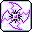
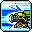

# 🗡️ สายโจร (Thief) — สกิลและแนวทางการจัดบอท 1-4 (8 อาชีพ)

สายโจรมีความคล่องตัวสูงสุด การโจมตีคริติคอลรุนแรง และมีดาวกระจาย/มีดบินช่วยกำจัดศัตรูได้อย่างรวดเร็ว

---

### 1. Night Lord (ไนท์ลอร์ด - Explorer)
* **สเตตัสหลัก:** LUK | **อาวุธ:** กรงเล็บ (Claw) + ดาวกระจาย (Throwing Stars)
* **สกิลฟาร์มหลัก:** Showdown (เพิ่ม EXP & Drop จากมอนสเตอร์) + Assassin's Mark (ดาวกระจายเด้ง)
* **สกิลบอส:** Quad Star + Spread Throw (สาดดาวกระจาย 5 ทิศทาง - ระเบิดบอสแรงที่สุด)
* **สกิล 5th Job:** Spread Throw, Fuma Shuriken, Dark Lord's Omen, Throwing Star Barrage
* **🎯 แนะนำตั้งปุ่มบอท 1-4:**
  * `[1]`  **Showdown** (ปามีดกวาดมอน + มอบโบนัส EXP/Drop)
  * `[2]`  **Fuma Shuriken** (กงจักรยักษ์หมุนฟันต่อเนื่อง)
  * `[3]`  **Dark Lord's Omen** (ป้ายหลุมศพเรียกดาวกระจายถล่มพื้น)
  * `[4]`  **Throwing Star Barrage** (สาดดาวกระจายยักษ์ทลายจอ)

---

### 2. Shadower (ชาโดเวอร์ - Explorer)
* **สเตตัสหลัก:** LUK | **อาวุธ:** มีดสั้น (Dagger) + Dagger Scabbard
* **สกิลฟาร์มหลัก:** Boomerang Stab / Cruel Stab + Meso Explosion (ระเบิดเงิน)
* **สกิลบอส:** Assassinate + Meso Explosion
* **สกิล 5th Job:** Shadow Assault, Trickblade, Sonic Blow, Slash Shadow Formation
* **🎯 แนะนำตั้งปุ่มบอท 1-4:**
  * `[1]`  **Cruel Stab** (แทงมีดเงาวงกว้าง)
  * `[2]`  **Meso Explosion** (ระเบิดเหรียญ Meso บนพื้นกวาดมอนสเตอร์รอบตัว)
  * `[3]`  **Sonic Blow** (สับมีดความเร็วเหนือเสียง)
  * `[4]`  **Slash Shadow Formation** (กองทัพนินจาเงาฟาดฟันทั้งจอ)

---

### 3. Dual Blade (ดูอัล เบลด - Explorer)
* **สเตตัสหลัก:** LUK | **อาวุธ:** มีดคู่ (Dagger + Katara)
* **สกิลฟาร์มหลัก:** Blade Furious (ควงมีดคู่หมุนตัว) + Flying Assaulter
* **สกิลบอส:** Phantom Blow + Asura's Anger
* **สกิล 5th Job:** Blade Tempest, Karma Fury, Blades of Destiny, Haunted Edge
* **🎯 แนะนำตั้งปุ่มบอท 1-4:**
  * `[1]`  **Blade Furious** (ควงมีดคู่หมุนฟันรอบทิศ 360 องศา)
  * `[2]`  **Karma Fury** (ยมทูตเงาฟาดฟันรอบตัวคูลดาวน์สั้น)
  * `[3]`  **Blades of Destiny** (มีดยักษ์ตกลงมาจากฟ้า)
  * `[4]`  **Blade Tempest** (พายุดาบคู่ทำลายล้าง)

---

### 4. Night Walker (ไนท์ วอล์คเกอร์ - Cygnus Knights)
* **สเตตัสหลัก:** LUK | **อาวุธ:** กรงเล็บ (Claw)
* **สกิลฟาร์มหลัก:** Shadow Spark + Shadow Bat (ค้างคาวบินชิ่งทั้งแมพ)
* **สกิลบอส:** Quintuple Star + Shadow Illusion
* **สกิล 5th Job:** Shadow Spear, Greater Dark Servant, Shadow Bite, Rapid Throw
* **🎯 แนะนำตั้งปุ่มบอท 1-4:**
  * `[1]`  **Shadow Spark** (ปาดาวกระจายความมืดระเบิดชิ่ง)
  * `[2]`  **Shadow Bite** (เงากัดกินมอนสเตอร์ทั่วทั้งจอ + บัฟ Final Damage)
  * `[3]`  **Shadow Spear** (หอกเงาพุ่งขึ้นมาจากพื้นทุกการโจมตี)
  * `[4]`  **Rapid Throw** (สาดดาวกระจายทมิฬความเร็วแสง)

---

### 5. Xenon (ซีนอน - Resistance / Hybrid)
* **สเตตัสหลัก:** STR / DEX / LUK (All Stat) | **อาวุธ:** Energy Sword + Controller
* **สกิลฟาร์มหลัก:** Mecha Purge: Bombard (ยิงมิสไซล์ถล่ม)
* **สกิลบอส:** Mecha Purge: Snipe (ปืนเลเซอร์เล็งจุดตาย)
* **สกิล 5th Job:** Mega Smash, Overload Mode, Hyperspeed Slicer, Photon Ray
* **🎯 แนะนำตั้งปุ่มบอท 1-4:**
  * `[1]`  **Mecha Purge: Bombard** (มิสไซล์ยิงกวาดมอนสเตอร์)
  * `[2]`  **Hyperspeed Slicer** (พุ่งฟันเลเซอร์ต่อเนื่อง)
  * `[3]`  **Photon Ray** (ดาวเทียมล็อคเป้ายิงเลเซอร์อัตโนมัติ)
  * `[4]`  **Mega Smash** (ชาร์จปืนใหญ่เลเซอร์เผาผลาญทั้งจอ)

---

### 6. Phantom (แฟนธ่อม - Heroes)
* **สเตตัสหลัก:** LUK | **อาวุธ:** Cane (ไม้เท้าดาบ) + Carte Blanche
* **สกิลฟาร์มหลัก:** Mille Aiguilles หรือขโมยสกิล (Steal Skill เช่น Arrow Stream, Chain Lightning)
* **สกิลบอส:** Tempest + Mille Aiguilles + Carte Noir
* **สกิล 5th Job:** Luck of the Draw, Ace in the Hole, Phantom's Mark, Rift Break
* **🎯 แนะนำตั้งปุ่มบอท 1-4:**
  * `[1]`  **Mille Aiguilles** (แทงการ์ดเร็วดั่งพายุ)
  * `[2]`  **Ace in the Hole** (ไพ่ใบตายบินเด้งชิ่งทั่วทั้งแมพ)
  * `[3]`  **Tempest** (พายุไพ่หมุนรอบตัวกวาดมอนสเตอร์)
  * `[4]`  **Rift Break** (เทเลพอร์ตฟันจุดตายทั่วหน้าจอ)

---

### 7. Cadena (คาเดน่า - Nova)
* **สเตตัสหลัก:** LUK | **อาวุธ:** Chain (โซ่ตรวน)
* **สกิลฟาร์มหลัก:** Chain Arts: Thrash + Weapon Variety (สลับอาวุธ)
* **สกิลบอส:** Chain Arts: Crush + Chain Arts: Takedown
* **สกิล 5th Job:** Chain Arts: Void Strike, Apocalypse Cannon, Chain Arts: Maelstrom, Weapon Variety Finale
* **🎯 แนะนำตั้งปุ่มบอท 1-4:**
  * `[1]`  **Chain Arts: Thrash** (เหวี่ยงโซ่กวาดศัตรู)
  * `[2]`  **Chain Arts: Maelstrom** (พายุโซ่หมุนดูดมอนสเตอร์)
  * `[3]`  **Apocalypse Cannon** (เรียกปืนใหญ่ยักษ์ยิงระเบิด)
  * `[4]`  **Chain Arts: Crush** (โซ่ยักษ์รัดขยี้บอส)

---

### 8. Hoyoung (โฮยอง - Anima)
* **สเตตัสหลัก:** LUK | **อาวุธ:** Ritual Fan (พัดเซียน)
* **สกิลฟาร์มหลัก:** Talisman: Evil-Sealing Gourd + As-You-Will Fan + Iron Fan Gale
* **สกิลบอส:** Earth: Stone Tremor + Humanity: Gold-Banded Cudgel
* **สกิล 5th Job:** Sage: Clone Rampage, Sage: Wrath of Gods, Sage: Apotheosis, Scroll: Tiger's Roar
* **🎯 แนะนำตั้งปุ่มบอท 1-4:**
  * `[1]`  **As-You-Will Fan** /  **Iron Fan Gale** (พัดพายุเซียนกวาดมอน)
  * `[2]`  **Earth: Stone Tremor** (เสาหินทุบพื้นระเบิด)
  * `[3]`  **Sage: Clone Rampage** (แยกร่างร่างโคลนช่วยตีทั้งแมพ)
  * `[4]`  **Scroll: Star Vortex** (คัมภีร์น้ำเต้าดูดมอนสเตอร์และดรอป)
