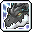
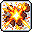
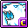
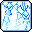

# 🛡️ สายนักรบ (Warrior) — สกิลและแนวทางการจัดบอท 1-4 (13 อาชีพ)

สายนักรบมีพลังป้องกันและเลือด (HP) สูง โจมตีระยะประชิดหนักหน่วง เหมาะสำหรับการฟาร์มที่ทนทาน ไม่ตายง่าย

---

### 1. Hero (ฮีโร่ - Explorer)
* **สเตตัสหลัก:** STR | **อาวุธ:** ดาบสองมือ / ขวานสองมือ
* **สกิลฟาร์มหลัก:** Raging Blow (สถานะ Enrage/Combo)
* **สกิลบอส:** Raging Blow + Puncture + Combo Deathfault
* **สกิล 5th Job:** Burning Soul Blade, Combo Instinct, Sword Illusion, Worldreaver
* **🎯 แนะนำตั้งปุ่มบอท 1-4:**
  * `[1]`  **Raging Blow** (สกิลฟาร์มหลัก)
  * `[2]`  **Puncture** (คูลดาวน์สั้น เคลียร์กว้าง)
  * `[3]`  **Sword Illusion** (5th Job โจมตีต่อเนื่อง)
  * `[4]`  **Worldreaver** (สกิลกวาดจอ + อมตะ)

---

### 2. Paladin (พาลาดิน - Explorer)
* **สเตตัสหลัก:** STR | **อาวุธ:** ดาบ / กระบองมือเดียวหรือสองมือ
* **สกิลฟาร์มหลัก:** Blast / Divine Charge
* **สกิลบอส:** Blast + Holy Unity
* **สกิล 5th Job:** Divine Echo, Hammers of the Righteous, Grand Cross, Mighty Mjolnir
* **🎯 แนะนำตั้งปุ่มบอท 1-4:**
  * `[1]`  **Divine Charge** (สกิลกวาดมอนหลัก)
  * `[2]`  **Mighty Mjolnir** (ค้อนสายฟ้าเด้งไปมา)
  * `[3]`  **Hammers of the Righteous** (ค้อนหมุนรอบตัวกวาดทั้งแมพ)
  * `[4]`  **Grand Cross** (ไม้ตายระเบิดพลังศักดิ์สิทธิ์)

---

### 3. Dark Knight (ดาร์กไนท์ - Explorer)
* **สเตตัสหลัก:** STR | **อาวุธ:** หอก (Spear) / โพลอาร์ม (Polearm)
* **สกิลฟาร์มหลัก:** Dark Impale
* **สกิลบอส:** Gungnir's Descent (ภายใต้สถานะ Sacrifice / Final Pact)
* **สกิล 5th Job:** Spear of Darkness, Radiant Evil, Calamitous Cyclones, Darkness Aura
* **🎯 แนะนำตั้งปุ่มบอท 1-4:**
  * `[1]`  **Dark Impale** (สกิลแทงวงกว้าง)
  * `[2]`  **Spear of Darkness** (ปาหอกมืดพุ่งทะลุจอ)
  * `[3]`  **Radiant Evil** (เสาดำกลืนกินทั้งแมพ)
  * `[4]`  **Calamitous Cyclones** (พายุหมุนดาร์กเนส)

---

### 4. Dawn Warrior (ดอว์น วอริเออร์ - Cygnus Knights)
* **สเตตัสหลัก:** STR | **อาวุธ:** ดาบสองมือ
* **สกิลฟาร์มหลัก:** Solar Slash / Lunar Divide
* **สกิลบอส:** Speeding Sunset / Moon Dancer
* **สกิล 5th Job:** Celestial Dance, Rift of Damnation, Soul Eclipse, Flare Slash
* **🎯 แนะนำตั้งปุ่มบอท 1-4:**
  * `[1]`  **Solar Slash** /  **Lunar Divide** (ฟันวงกว้างจันทรคราส)
  * `[2]`  **Cosmic Shower** (อุกกาบาตดาวตกลงพื้น)
  * `[3]`  **Soul Eclipse** (สุริยคราสเคลียร์ทั้งหน้าจอ)
  * `[4]`  **Rift of Damnation** (เปิดมิติผ่าโลก)

---

### 5. Mihile (มิฮาเอล - Cygnus Knights)
* **สเตตัสหลัก:** STR | **อาวุธ:** ดาบมือเดียว + Soul Shield
* **สกิลฟาร์มหลัก:** Radiant Cross
* **สกิลบอส:** Royal Guard (สวนกลับดาเมจ) + Radiant Cross
* **สกิล 5th Job:** Shield of Light, Sword of Light, Radiant Driver, Light of Courage
* **🎯 แนะนำตั้งปุ่มบอท 1-4:**
  * `[1]`  **Radiant Cross** (ดาบกางเขนแสง)
  * `[2]`  **Sword of Light** (ดาบยักษ์ฟาดทั้งจอ)
  * `[3]`  **Radiant Driver** (พุ่งแทงผลักมอนสเตอร์)
  * `[4]`  **Deadly Charge** (พุ่งชนบัฟปาร์ตี้)

---

### 6. Adele (อเดล - Flora)
* **สเตตัสหลัก:** STR | **อาวุธ:** Bladecaster (ดาบบิน)
* **สกิลฟาร์มหลัก:** Cleave + Hunting Decree (ดาบลอยไล่ล่า)
* **สกิลบอส:** Cleave + Ruin + Infinity
* **สกิล 5th Job:** Ruin, Infinity, Restore, Storm
* **🎯 แนะนำตั้งปุ่มบอท 1-4:**
  * `[1]`  **Cleave** (ฟันดาบอีเธอร์วงกว้าง)
  * `[2]`  **Hunting Decree** (สั่งดาบลอยไล่ล่ามอนสเตอร์ทั่วแมพ)
  * `[3]`  **Ruin** (ดาบยักษ์ตกลงมาจากฟ้า)
  * `[4]`  **Storm** (พายุดาบหมุนรอบตัว)

---

### 7. Kaiser (ไคเซอร์ - Nova)
* **สเตตัสหลัก:** STR | **อาวุธ:** ดาบสองมือ
* **สกิลฟาร์มหลัก:** Blade Burst / Gigas Wave
* **สกิลบอส:** Gigas Wave (แปลงร่างมังกร Final Form)
* **สกิล 5th Job:** Guardian of Nova, Draco Surge, Dragonfall, Bladefall
* **🎯 แนะนำตั้งปุ่มบอท 1-4:**
  * `[1]`  **Blade Burst** (ระเบิดดาบมังกร 6 ทิศทาง)
  * `[2]`  **Draco Surge** (มังกรเพลิงพุ่งทะลุจอ)
  * `[3]`  **Guardian of Nova** (เรียกวิญญาณ 3 อัศวินมังกรช่วยตี)
  * `[4]`  **Dragonfall** (มังกรดิ่งทลายโลก)

---

### 8. Demon Slayer (เดมอน สเลเยอร์ - Demon)
* **สเตตัสหลัก:** STR | **อาวุธ:** กระบองมือเดียว / ขวานมือเดียว (Demon Force)
* **สกิลฟาร์มหลัก:** Demon Infernal Concussion (ทุบพื้นระเบิด)
* **สกิลบอส:** Demon Impact
* **สกิล 5th Job:** Demon Awakening, Jormungandr, Orthrus, Demon Bane
* **🎯 แนะนำตั้งปุ่มบอท 1-4:**
  * `[1]`  **Demon Infernal Concussion** (ทุบพื้นระเบิดรอบทิศ)
  * `[2]`  **Demon Impact** (ดาเมจเป้าหมายเดี่ยวคริติคอล 100%)
  * `[3]`  **Jormungandr** (เรียกงูยักษ์กินมอนสเตอร์ทั้งแมพ)
  * `[4]`  **Orthrus** (เรียกหมานรกสองหัวช่วยโจมตี)

---

### 9. Demon Avenger (เดมอน อเวนเจอร์ - Demon)
* **สเตตัสหลัก:** Max HP | **อาวุธ:** Desperado
* **สกิลฟาร์มหลัก:** Lunar Slash
* **สกิลบอส:** Execution + Nether Shield (โล่เด้ง)
* **สกิล 5th Job:** Demonic Frenzy, Demonic Blast, Dimensional Sword, Revenant
* **🎯 แนะนำตั้งปุ่มบอท 1-4:**
  * `[1]`  **Lunar Slash** (ฟันพระจันทร์เสี้ยว)
  * `[2]`  **Nether Shield** (ปาโล่สะท้อนชิ่งมอนสเตอร์ทั่วแมพ)
  * `[3]`  **Dimensional Sword** (ดาบมิติบิดเบือนหมุนรอบตัว)
  * `[4]`  **Demonic Blast** (ชาร์จคลื่นโลหิตระเบิดจอ)

---

### 10. Blaster (บลาสเตอร์ - Resistance)
* **สเตตัสหลัก:** STR | **อาวุธ:** Arm Cannon (ปลอกแขนระเบิด)
* **สกิลฟาร์มหลัก:** Shotgun Punch / Magnum Punch
* **สกิลบอส:** Bunker Buster + Rocket Punch
* **สกิล 5th Job:** Rocket Punch, Gatling Punch, Bullet Barrage, Afterimage Shock
* **🎯 แนะนำตั้งปุ่มบอท 1-4:**
  * `[1]`  **Shotgun Punch** (หมัดกระสุนปืนลูกซอง)
  * `[2]`  **Bunker Buster** (กระสุนทะลวงเกราะ)
  * `[3]`  **Bullet Barrage** (สาดกระสุนรอบตัว 360 องศา)
  * `[4]`  **Afterimage Shock** (หมัดคลื่นเงาตามติด)

---

### 11. Aran (อารัน - Heroes)
* **สเตตัสหลัก:** STR | **อาวุธ:** โพลอาร์ม (Polearm)
* **สกิลฟาร์มหลัก:** Beyond Blade + Final Blow (Adrenaline Rush)
* **สกิลบอส:** Beyond Blade + Finisher - Hunter's Targeting
* **สกิล 5th Job:** Maha's Fury, Maha's Carnage, Fenrir Crash, Blizzard Tempest
* **🎯 แนะนำตั้งปุ่มบอท 1-4:**
  * `[1]`  **Final Blow** +  **Beyond Blade** (คอมโบกวาดมอนสเตอร์)
  * `[2]`  **Fenrir Crash** (หมาป่าหิมะกระโจนโจมตี)
  * `[3]`  **Maha's Carnage** (ขวานยักษ์ฟาดผ่าพื้นดิน)
  * `[4]`  **Blizzard Tempest** (พายุหิมะเยือกแข็งหยุดมอนสเตอร์)

---

### 12. Zero (ซีโร่ - Transcendent)
* **สเตตัสหลัก:** STR | **อาวุธ:** ดาบยาว (Alpha) / ดาบใหญ่ (Beta)
* **สกิลฟาร์มหลัก:** Wind Cutter / Spin Cutter (Alpha) & Flash Cut (Beta)
* **สกิลบอส:** Shadow Rain + Chrono Break
* **สกิล 5th Job:** Chrono Break, Twin Strike, Shadow Flash, Ego Weapon
* **🎯 แนะนำตั้งปุ่มบอท 1-4:**
  * `[1]`  **Wind Cutter** (Alpha พายุมีด)
  * `[2]`  **Flash Cut** (Beta สับมิติ)
  * `[3]`  **Shadow Flash** (ปักเสาดาบระเบิดมิติ)
  * `[4]`  **Chrono Break** (หยุดเวลาทั้งหน้าจอ)

---

### 13. Hayato (ฮายาโตะ - Sengoku)
* **สเตตัสหลัก:** STR | **อาวุธ:** Katana (ดาบซามูไร)
* **สกิลฟาร์มหลัก:** Rai Sanrenzan / Rai Blade Flash
* **สกิลบอส:** Shinsoku + Falcon's Honor
* **สกิล 5th Job:** Rai Blade Flash, Iaijutsu Phantom Blade, Zankei, Battoujutsu Ultimate Will
* **🎯 แนะนำตั้งปุ่มบอท 1-4:**
  * `[1]`  **Rai Sanrenzan** (ฟันดาบ 3 จังหวะต่อเนื่อง)
  * `[2]`  **Falcon's Honor** (เหยี่ยวเหินกวาดมอนสเตอร์ทั้งจอ)
  * `[3]`  **Iaijutsu Phantom Blade** (ดาบชักฟันสายฟ้าฟาด)
  * `[4]`  **Battoujutsu Ultimate Will** (ฟันดาบวิญญาณซามูไรไร้ขอบเขต)
