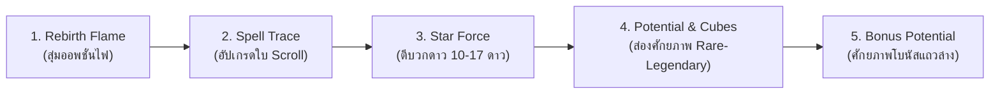
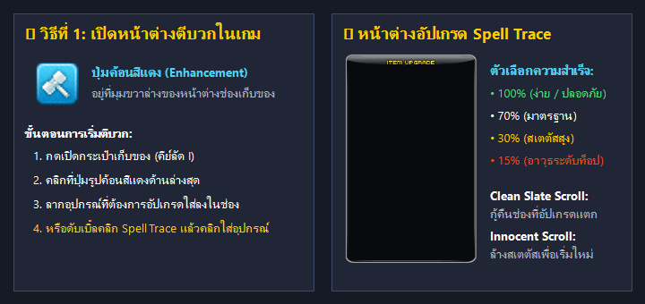
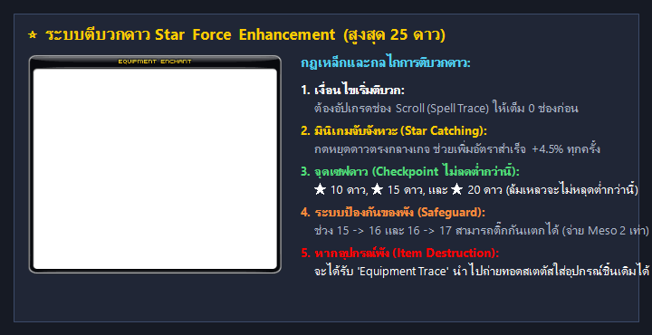
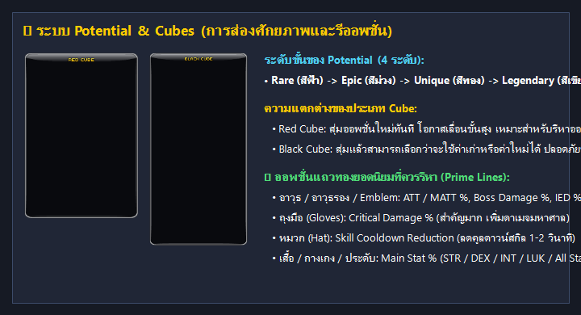
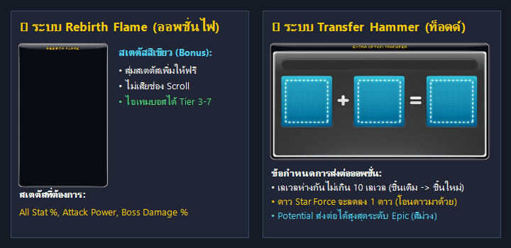

# 💎 ระบบตีบวก & พัฒนาอุปกรณ์ (Equipment Upgrade Masterclass)

การอัปเกรดและเสริมพลังอุปกรณ์ใน **Clover Idle Story** เป็นหัวใจสำคัญที่สุดในการเพิ่มพลังการต่อสู้ (Combat Power) ค่าสเตตัสหลัก และพลังโจมตีให้ก้าวกระโดด เพื่อเตรียมความพร้อมสำหรับการล่าบอสระดับสูงและการฟาร์มมอนสเตอร์ในแผนที่ระดับสูง

---

## 🗺️ ลำดับขั้นตอนการพัฒนาอุปกรณ์ที่ถูกต้อง (Optimal Progression Order)

เพื่อให้ประหยัดทรัพยากรและได้ประสิทธิภาพสูงสุด ควรทำตามลำดับขั้นตอนดังนี้:

> 💡 **วิธีเปิดหน้าต่างอัปเกรดอุปกรณ์ในเกม:**  
> 1. กดปุ่ม **`[ I ]`** เพื่อเปิดช่องเก็บของ (Inventory)  
> 2. คลิกที่ปุ่ม **ค้อนตีบวกสีแดง**  ที่มุมขวาล่างของหน้าต่าง Inventory  
> 3. หรือลากไอเทม เช่น Spell Trace หรือ ลูกเต๋า Cube ไปวางทับบนชิ้นส่วนอุปกรณ์ที่ต้องการพัฒนาได้ทันที

---

## 📜 ขั้นตอนที่ 1: ระบบ Scroll Upgrading (Spell Trace & ใบอัปเกรด)

ก่อนที่จะสามารถตีบวกดาว (Star Force) ได้ **อุปกรณ์ชิ้นนั้นต้องถูกใช้ Scroll จนครบจำนวนช่องอัปเกรด (Upgrade Slots) เสียก่อน**

### 1.1 ประเภทของ Spell Trace Scrolls
เมื่อใส่ไอเทมลงในช่อง Scroll UI ระบบจะให้เลือกเปอร์เซ็นต์ความสำเร็จของ Spell Trace:

| ประเภท Scroll | โอกาสสำเร็จ | สเตตัสที่ได้รับ (อาวุธ) | สเตตัสที่ได้รับ (ชุดเกราะ/ประดับ) | คำแนะนำการใช้งาน |
| :---: | :---: | :--- | :--- | :--- |
| **100%** | **100%** | +1 ATT/M.ATT, +1 Main Stat | +1~2 Main Stat, +HP | เหมาะสำหรับอุปกรณ์เริ่มต้น หรือตัวละคร Union ฟาร์มเลเวล |
| **70%** | **70%** | +2 ATT/M.ATT, +2 Main Stat | +2~4 Main Stat, +HP | คุ้มค่าและประหยัดที่สุดสำหรับผู้เล่นใหม่ |
| **30%** | **30%** | +3~5 ATT/M.ATT, +3~5 Main Stat | +5~7 Main Stat, +DEF/HP | **มาตรฐานสำหรับชุดเกราะ End-Game** (CRA, Absolab, Arcane) |
| **15%** | **15%** | **+9 ATT/M.ATT**, +4 Main Stat | *(มีเฉพาะอาวุธเท่านั้น)* | **มาตรฐานสำหรับอาวุธ End-Game** พลังโจมตีสูงสุด |

---

### 1.2 การกู้คืนช่องที่อัปเกรดล้มเหลว (Failed Slots Recovery)
หากการใช้ Scroll ล้มเหลว จำนวนช่องอัปเกรดจะลดลง แต่สามารถนำช่องเหล่านั้นกลับมาได้ด้วยไอเทมพิเศษ:
* **Clean Slate Scroll (10% / Pure 5%):** คืนช่องอัปเกรดที่เสียไปกลับมา 1 ช่อง โดยไม่มีความเสี่ยงที่ไอเทมจะเสียหาย
* **Innocent Scroll (60% / 100%):** ล้างค่าพลังและสเตตัสการ Scroll ทั้งหมดของไอเทมกลับเป็นค่าเริ่มต้น (Reset ช่องทั้งหมดให้เต็มเหมือนของใหม่) เพื่อเริ่มต้น Scroll ใหม่อีกครั้งโดยไม่ต้องซื้อไอเทมใหม่

---

## ⭐ ขั้นตอนที่ 2: ระบบ Star Force Enhancement (ตีบวกดาว)

เมื่อใช้อัปเกรดช่อง Scroll จนเต็ม (0 Slots Remaining) ระบบจะปลดล็อคให้สามารถตีบวกดาว **Star Force** ได้สูงสุดถึง **25 ดาว (25 Stars)** โดยใช้เงิน **Meso** ในการอัปเกรด

### 2.1 มินิเกม Star Catching
* ขณะกดตีบวก จะมีแถบดาวเคลื่อนที่ผ่านจุดสีเหลืองตรงกลาง
* หากกดปุ่ม **SPACEBAR** หรือคลิกหยุดดาวได้ตรงจุดสีเหลือง จะได้รับโบนัส **+4.5% โอกาสสำเร็จ** เพิ่มขึ้นทันทีในรอบนั้น

---

### 2.2 กฎความปลอดภัยและการป้องกันของแตก (Checkpoints & Safeguard)

* 🛡️ **จุดเซฟระดับดาว (Drop Prevention Checkpoints):**
  * เมื่อตีบวกถึง **10 ดาว, 15 ดาว, และ 20 ดาว** หากตีล้มเหลวในรอบถัดไป **ระดับดาวจะไม่ลดลงต่ำกว่าจุดเซฟเหล่านี้เด็ดขาด**
* 🛑 **ระบบ Safeguard (ป้องกันไอเทมระเบิด):**
  * ที่ระดับ **12 ถึง 16 ดาว** ผู้เล่นสามารถเลือกติ๊กเปิดใช้งาน **Safeguard** ได้
  * ระบบจะคิดค่าธรรมเนียม Meso เพิ่มเป็น 2 เท่า แต่จะการันตี **โอกาสไอเทมแตกเป็น 0%** อย่างแน่นอน
* 💥 **ระบบ Equipment Trace (รอยเงาอุปกรณ์):**
  * หากอุปกรณ์แตกระหว่างการตีบวกโดยไม่ได้เปิด Safeguard อุปกรณ์จะกลายเป็น **Equipment Trace (รอยเงาสีเทา)**
  * ค่าสเตตัสทั้งหมด (Scroll, Potential, Bonus Potential, Rebirth Flame) **จะไม่สูญหายไป**
  * ผู้เล่นสามารถนำ Equipment Trace ไปผสานกับไอเทมชิ้นใหม่ที่เป็นชนิดเดียวกัน (Clean Item) เพื่อกู้คืนสเตตัสเดิมทั้งหมดกลับมา และไอเทมจะเริ่มต้นที่ **12 ดาวทันที**

---

### 2.3 ตารางความน่าจะเป็นและเป้าหมายการทำดาว (Star Force Table)

| ช่วงระดับดาว | โอกาสสำเร็จ | โอกาสล้มเหลว (ดาวไม่ลด) | ล้มเหลว (ดาวลด -1) | โอกาสของแตก (Destroy) | กลยุทธ์แนะนำ |
| :---: | :---: | :---: | :---: | :---: | :--- |
| **0 ➔ 10 ดาว** | 95% ➔ 50% | 5% ➔ 50% | **0% (ไม่ลด)** | **0% (ไม่แตก)** | ตีได้สบาย ไม่มีความเสี่ยง |
| **10 ➔ 12 ดาว** | 45% ➔ 40% | 0% | 55% ➔ 59.4% | **0% (ไม่แตก)** | จุดประหยัดสำหรับตัว Union / ตัวรอง |
| **12 ➔ 15 ดาว** | 30% | 0% | 67.9% ➔ 68.6% | 0.7% ➔ 1.4% | **แนะนำเปิด Safeguard** ป้องกันของแตก |
| **15 ➔ 17 ดาว** | 30% | 0% | 67.9% | 2.1% | **เป้าหมายมาตรฐาน (17 Stars)** คุ้มค่าที่สุดในเกม |
| **17 ➔ 20 ดาว** | 30% | 0% | 67.9% | 2.1% | จุดวัดใจ ต้องมีทุนสำรองและชิ้นส่วนสำรอง |
| **20 ➔ 22 ดาว** | 30% | 0% | 63% | 7.0% | **เป้าหมายระดับ End-Game** สเตตัสเพิ่มมหาศาล |

> 🌟 **พลังก้าวกระโดดตั้งแต่ 16 ดาวขึ้นไป:**  
> ตั้งแต่ดาวที่ 16 เป็นต้นไป ทุกๆ 1 ดาวที่เพิ่มขึ้น จะมอบ **Weapon ATT และ Magic ATT เพิ่มขึ้นแบบทวีคูณ** (แตกต่างจากช่วง 1-15 ดาวที่เน้นเพิ่มเฉพาะ All Stat) ทำให้อุปกรณ์ 17 ดาวมีความแรงกว่าอุปกรณ์ 15 ดาวอย่างเห็นได้ชัด!

---

## 🔮 ขั้นตอนที่ 3: ระบบ Potential & Cubes (ออพชั่นศักยภาพ)

ระบบ Potential ช่วยปลดล็อคพลังแฝงของอุปกรณ์ แบ่งออกเป็น 4 ลำดับขั้น:
1. 🟦 **Rare (สีฟ้า):** ขั้นเริ่มต้น ค่าสเตตัส 3%
2. 🟪 **Epic (สีม่วง):** ขั้นมาตรฐาน ค่าสเตตัส 6%
3. 🟨 **Unique (สีทอง):** ขั้นระดับสูง ค่าสเตตัส 9%
4. 🟩 **Legendary (สีเขียว):** ขั้นสูงสุด ค่าสเตตัส 12% และปลดล็อคออพชั่นระดับพิเศษ

---

### 3.1 ประเภทของลูกเต๋า Cube และการใช้งาน

| ชนิดลูกเต๋า | ไอคอน | ระดับสูงสุดที่สุ่มได้ | ระดับสูงสุดที่เลื่อนขั้นได้ | คุณสมบัติพิเศษ |
| :--- | :---: | :---: | :---: | :--- |
| **Occult Cube** | - | Epic | **Epic** | หาได้ง่ายจากบอสรายวัน เหมาะสำหรับทำของ Epic 6-9% |
| **Master Craftsman's Cube** | - | Unique | **Unique** | สุ่มและเลื่อนขั้นได้ถึงระดับทอง (Unique) |
| **Meister's Cube** | - | Legendary | **Legendary** | สุ่มและเลื่อนขั้นได้ถึงระดับเขียว (Legendary) |
| **Red Cube** |  | Legendary | **Legendary** | โอกาสเลื่อนขั้นสูง เหมาะสำหรับรีโรลหาออพชั่น 2-3 บรรทัด |
| **Black Cube** |  | Legendary | **Legendary** | **โอกาสเลื่อนขั้นสูงที่สุด** และสามารถเลือกเก็บออพชั่นเดิม (Before) หรือรับออพชั่นใหม่ (After) ได้ |

---

### 3.2 ออพชั่นศักยภาพที่ดีที่สุด (Best in Slot / BiS Lines)

* ⚔️ **อาวุธ / อาวุธรอง / ตราสัญลักษณ์ (Weapon, Secondary, Emblem - WSE):**
  * **Boss Damage %** (+30% / +40%)
  * **ATT % / Magic ATT %** (+9% / +12%)
  * **Ignore Enemy Defense (IED) %** (+30% / +40%)
* 🧤 **ถุงมือ (Gloves):**
  * **Critical Damage %** (+8% ต่อบรรทัด - สำคัญที่สุดสำหรับถุงมือ)
  * **Main Stat %** (+9% / +12%)
* 🧢 **หมวก (Hat):**
  * **Skill Cooldown Reduction** (-1 วินาที / -2 วินาที - ช่วยลดคูลดาวน์สกิลหลัก)
  * **Main Stat %**
* 💍 **ชุดเกราะและเครื่องประดับอื่นๆ (Top, Bottom, Cape, Shoes, Accessories):**
  * **Main Stat %** (เช่น STR% / DEX% / INT% / LUK% หรือ All Stat %)

---

### 3.3 ตารางค่าออพชั่นศักยภาพระดับ Legendary (Lv. 150+ Equipments)

> 💡 **ความแตกต่างระหว่าง Prime Line vs Non-Prime (Sub-Prime):**  
> * **Prime Line (แถวเต็ม):** บรรทัดที่ 1 ของไอเทมจะเป็น Prime เสมอ และมีโอกาสสุ่มได้ในบรรทัดที่ 2-3 (เช่น 12% Stat / 40% Boss)
> * **Non-Prime Line (แถวรอง):** บรรทัดที่ 2 และ 3 หากไม่ได้ Prime จะได้ค่าระดับแถวรอง (เทียบเท่าระดับ Unique ขั้นสูงสุด เช่น 9% Stat / 30% Boss)

#### ⚔️ 1. กลุ่มอาวุธ, อาวุธรอง และตราสัญลักษณ์ (WSE: Weapon, Secondary, Emblem)

| ค่าออพชั่น (Stat Line) | Prime Line (แถวหลัก) | Non-Prime Line (แถวรอง) | ตำแหน่งที่สุ่มได้ | หมายเหตุ / จุดเด่น |
| :--- | :---: | :---: | :--- | :--- |
| **Boss Monster Damage %** | **+40%** | **+35% / +30%** | อาวุธ, อาวุธรอง | *(Emblem ไม่สามารถออก Boss Dmg ได้)* |
| **Attack % / Magic Attack %** | **+12%** | **+9%** | อาวุธ, อาวุธรอง, Emblem | ออพชั่นที่ดีที่สุดสำหรับทุกอาชีพ |
| **Ignore Enemy DEF (IED) %** | **+40%** | **+35%** | อาวุธ, อาวุธรอง, Emblem | ทะลุพลังป้องกันบอส ยิ่งเจอบอสโหดยิ่งจำเป็น |
| **Damage %** | **+12%** | **+9%** | อาวุธ, อาวุธรอง, Emblem | เพิ่มพลังโจมตีทั่วไป |
| **Critical Rate %** | **+12%** | **+9%** | อาวุธ, อาวุธรอง, Emblem | ใช้เสริมหากอัตราคริติคอลยังไม่ครบ 100% |

---

#### 🧤 2. กลุ่มถุงมือ (Gloves) & หมวก (Hat) - ตำแหน่งออพชั่นพิเศษ

| ตำแหน่งชิ้นส่วน | ค่าออพชั่น (Stat Line) | Prime Line (แถวหลัก) | Non-Prime Line (แถวรอง) | ความสำคัญ |
| :--- | :--- | :---: | :---: | :--- |
| **ถุงมือ (Gloves)** | **Critical Damage %** | **+8%** | *(มีเฉพาะ Prime)* | **สำคัญที่สุดของถุงมือ!** (1 บรรทัดเทียบเท่า Stat 20-30%) |
| | **Main Stat % (STR/DEX/INT/LUK)** | **+12%** | **+9%** | สเตตัสหลัก |
| | **All Stat %** | **+9%** | **+6%** | สเตตัสรวม |
| | **Decent Sharp Eyes / Speed Infusion** | สกิลบัฟพิเศษ | - | บัฟเพิ่มคริติคอล / สปีดการโจมตี |
| **หมวก (Hat)** | **Skill Cooldown Reduction** | **-2 วินาที** | **-1 วินาที** | ลดคูลดาวน์สกิล (ลดรวมได้สูงสุดไม่เกิน 5 วินาที) |
| | **Main Stat %** | **+12%** | **+9%** | สเตตัสหลัก |
| | **All Stat %** | **+9%** | **+6%** | สเตตัสรวม |
| | **Decent Combat Orders / Blessing** | สกิลบัฟพิเศษ | - | เพิ่มเลเวลสกิลคลาส 4 / บัฟพลังโจมตี |

---

#### 🛡️ 3. กลุ่มชุดเกราะทั่วไป (Top, Bottom, Overall, Cape, Shoes, Belt, Shoulder)

| ค่าออพชั่น (Stat Line) | Prime Line (แถวหลัก) | Non-Prime Line (แถวรอง) | คำแนะนำในการใช้งาน |
| :--- | :---: | :---: | :--- |
| **Main Stat % (STR / DEX / INT / LUK %)** | **+12%** | **+9%** | **เป้าหมายหลัก** (ของจบ 2-3 แถว: 21% - 33% Main Stat) |
| **All Stat %** | **+9%** | **+6%** | เหมาะสำหรับอาชีพสายผสม (เช่น Xenon) หรือช่วยดันสเตตัสรอง |
| **Max HP %** | **+12%** | **+9%** | สำคัญที่สุดสำหรับอาชีพ **Demon Avenger** |
| **Max MP %** | **+12%** | **+9%** | สำหรับอาชีพที่ใช้มานาเป็นพลังโจมตี |
| **Decent Skills** | สกิลบัฟเฉพาะชิ้น | - | Decent Hyper Body (กางเกง), Decent Haste (รองเท้า) |

---

#### 💍 4. กลุ่มเครื่องประดับ (Ring, Pendant, Face, Eye, Earrings) - ออพชั่นฟาร์ม & ล่าบอส

| ค่าออพชั่น (Stat Line) | Prime Line (แถวหลัก) | Non-Prime Line (แถวรอง) | คำแนะนำและข้อจำกัด |
| :--- | :---: | :---: | :--- |
| **Item Drop Rate (อัตราดรอปของ)** | **+20%** | *(มีเฉพาะ Prime)* | **ชุดฟาร์มของ/ล่าบอส** (สะสมจากออพชั่นอุปกรณ์ได้สูงสุด +100%) |
| **Meso Obtained (เงิน Meso ดรอป)** | **+20%** | *(มีเฉพาะ Prime)* | **ชุดฟาร์มเงินบอท** (สะสมจากออพชั่นอุปกรณ์ได้สูงสุด +100%) |
| **Main Stat %** | **+12%** | **+9%** | สเตตัสหลักสำหรับลงบอส |
| **All Stat %** | **+9%** | **+6%** | สเตตัสรวม |

---

### 3.4 ตารางศักยภาพโบนัสระดับ Legendary (Bonus Potential - แถวล่างสีทอง)

ระบบ Bonus Potential (B-Pot) ช่วยเพิ่มสเตตัสเสริมอีก 3 บรรทัดที่ด้านล่างสุดของอุปกรณ์:

| ตำแหน่งอุปกรณ์ | ค่าออพชั่น B-Pot Legendary | Prime Line (แถวหลัก) | Non-Prime Line (แถวรอง) |
| :--- | :--- | :---: | :---: |
| **อาวุธ / อาวุธรอง (Weapon/Sub)** | **Attack % / Magic Attack %** | **+8%** | **+5%** |
| | **Boss Monster Damage %** | **+18%** | **+12%** |
| | **Damage %** | **+8%** | **+5%** |
| | **Flat ATT / Magic ATT** | **+14** | **+11** |
| **ตราสัญลักษณ์ (Emblem)** | **Attack % / Magic Attack %** | **+8%** | **+5%** |
| | **Ignore Enemy DEF (IED) %** | **+8%** | **+5%** |
| **ถุงมือ (Gloves)** | **Critical Damage %** | **+3%** | *(Prime only)* |
| **หมวก (Hat)** | **Skill Cooldown Reduction** | **-1 วินาที** | *(Prime only)* |
| **เกราะ & ประดับ (Armor/Accessory)** | **Main Stat %** | **+7%** | **+5%** |
| | **All Stat %** | **+5%** | **+4%** |
| | **Main Stat ตามเลเวลตัวละคร** | **+2 ต่อ 10 เลเวล** *(Lv.250 = +50)* | **+1 ต่อ 10 เลเวล** |
| | **Flat ATT / Magic ATT** | **+14** | **+11** |

---

## 🔥 ขั้นตอนที่ 4: ระบบ Rebirth Flames (ออพชั่นไฟโบนัส)

Rebirth Flames ใช้สำหรับสุ่มค่า **Bonus Stats (ตัวเลขสีเขียวข้างสเตตัสพื้นฐาน)** ให้กับอุปกรณ์

### 4.1 Boss Advantage vs Non-Boss Items
* **Boss Advantage Equipments (มีจุดสีขาวที่มุมซ้ายบนของไอคอนไอเทม):**
  * เช่น ชุด CRA (Fafnir), Absolab, Arcane Umbra, Dominator Pendant
  * **การันตีสุ่มได้ 4 บรรทัดเสมอ** และค่าพลังจะอยู่ในระดับสูง (**Tier 3 ถึง Tier 7**)
* **Non-Boss Equipments:**
  * อุปกรณ์ทั่วไปที่ดรอปจากมอนสเตอร์ธรรมดา จะสุ่มได้เพียง 1-4 บรรทัด และค่าพลังอยู่ในระดับ **Tier 1 ถึง Tier 5**

### 4.2 สเตตัสไฟที่ควรตามหา:
* **อาวุธ:** เพิ่มพลังโจมตี **Weapon/Magic ATT (Tier 5-7)**, Boss Damage %, และ Damage %
* **ชุดเกราะ / เครื่องประดับ:** เพิ่ม **Main Stat รวม 60-100+** และมี **All Stat % (4% - 6%)**

---

## 🔨 ขั้นตอนที่ 5: ระบบ Transfer Hammer (ค้อนส่งต่อสเตตัส / Todd's Hammer)

ระบบค้อนส่งต่อช่วยให้ผู้เล่นสามารถถ่ายโอนสเตตัสจากอุปกรณ์เก่าไปยังอุปกรณ์ชิ้นใหม่ที่มีระดับเลเวลสูงกว่าได้ทันที

### 5.1 เงื่อนไขสำคัญในการใช้งาน:
1. **ระดับเลเวล:** อุปกรณ์ชิ้นใหม่ต้องมีเลเวลสูงกว่าชิ้นเดิมไม่เกิน **10 เลเวล** (หากเลเวลต่ำกว่า 100 สามารถห่างกันได้สูงสุด 20 เลเวล)
2. **ระดับดาว (Star Force):** อุปกรณ์ต้นทางต้องมีอย่างน้อย 1 ดาวขึ้นไป และเมื่อโอนย้ายสำเร็จ **ระดับดาวจะลดลง 1 ดาว** (เช่น 16 ดาว จะกลายเป็น 15 ดาว)
3. **การจำกัดระดับ Potential:**
   * ระบบจะโอนย้าย Potential ได้สูงสุดที่ระดับ **Epic**
   * หากไอเทมต้นทางเป็นระดับ Unique หรือ Legendary เมื่อส่งต่อไปยังชิ้นใหม่ **จะถูกปรับลดลงมาเป็นระดับ Epic โดยอัตโนมัติ**
4. **ช่อง Scroll ของไอเทมปลายทาง:**
   * ไอเทมปลายทางไม่จำเป็นต้องตี Scroll ไว้ก่อน เพราะระบบจะสุ่มใช้ **Spell Trace 100% ฟรี** เติมเต็มช่องที่ว่างอยู่ให้โดยอัตโนมัติ

---

## 💡 สรุปแนวทางการปั้นของสำหรับผู้เล่น Clover Idle Story

1. **งบเริ่มต้น (Early Game - Lv. 100 - 150):**  
   * ใช้ Spell Trace 70% หรือ 100% ให้เต็มช่อง
   * ตี Star Force ขึ้น **10 ดาว**
   * ใช้ Occult Cube ส่อง Potential ให้ได้ **Epic 6% Main Stat**
2. **งบปานกลาง (Mid Game - CRA & Absolab Lv. 150 - 200):**  
   * สุ่มไฟ Rebirth Flame ให้ได้ Main Stat + All Stat% สวยๆ
   * อัปเกรด Spell Trace 70% หรือ 30% (สำหรับชุด) และ 15% (สำหรับอาวุธ)
   * ตีบวก Star Force ไปที่ **17 ดาว** (ใช้ Safeguard ช่วง 12-16 ดาว)
   * ดัน Potential ไปที่ **Unique 9-15% Main Stat** หรือ Legendary
3. **ขั้นสุดยอด (End Game - Arcane Umbra Lv. 200+):**  
   * สุ่มไฟ Eternal Flame ระดับ Tier 6-7
   * อัปเกรด Spell Trace 30% / 15% สมบูรณ์แบบทุกช่อง
   * ดัน Star Force ไปที่ **21 - 22 ดาว**
   * รีโรล Potential ระดับ **Legendary 3 Lines (21% - 30%+ Main Stat / Triple Prime WSE)**
