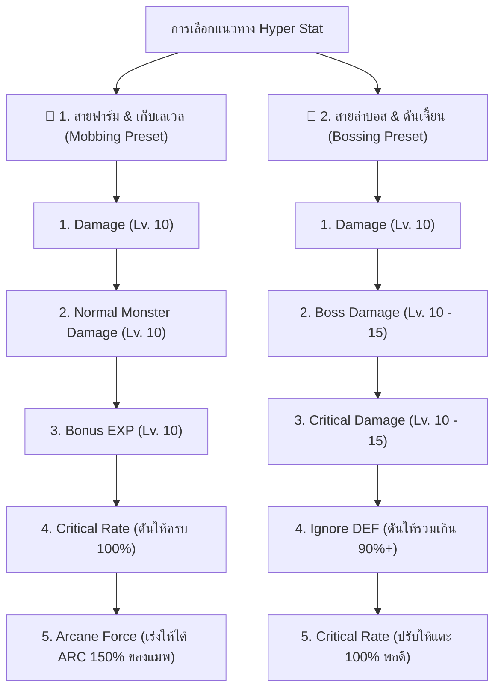

# ⚡ คู่มือระบบ Hyper Stat (ไฮเปอร์สเตตัส - เลเวล 140+)

ระบบ **Hyper Stat** คือระบบเสริมค่าพลังพื้นฐานของตัวละครที่ปลดล็อคเมื่อเลเวลถึง **140 ขึ้นไป** ใน MapleStory และ Clover Idle โดยผู้เล่นจะได้รับแต้ม **Hyper Stat Points** ทุกครั้งที่เลเวลอัป เพื่อนำไปเลือกอัปเกรดค่าสเตตัสขั้นสูงต่างๆ เช่น **Damage, Boss Damage, Critical Damage, Ignore Monster DEF, Bonus EXP** และ **Arcane Force** ได้อย่างอิสระตามสายการเล่น

---

## 📈 1. การได้รับแต้ม Hyper Stat Points ตามช่วงเลเวล

เมื่อตัวละครเลเวลอัปตั้งแต่เลเวล 140 เป็นต้นไป จะได้รับแต้ม Hyper Stat สะสมเพิ่มขึ้นตามระดับช่วงเลเวล ยิ่งเลเวลสูง ยิ่งได้รับแต้มต่อเลเวลมากขึ้น:

| ช่วงเลเวลตัวละคร | แต้ม Hyper Stat ที่ได้รับต่อการอัป 1 เลเวล |
| :---: | :---: |
| **Lv. 140 - 149** | **+3 แต้ม** ต่อเลเวล |
| **Lv. 150 - 159** | **+4 แต้ม** ต่อเลเวล |
| **Lv. 160 - 169** | **+5 แต้ม** ต่อเลเวล |
| **Lv. 170 - 179** | **+6 แต้ม** ต่อเลเวล |
| **Lv. 180 - 189** | **+7 แต้ม** ต่อเลเวล |
| **Lv. 190 - 199** | **+8 แต้ม** ต่อเลเวล |
| **Lv. 200 - 209** | **+9 แต้ม** ต่อเลเวล |
| **Lv. 210 - 219** | **+10 แต้ม** ต่อเลเวล |
| **Lv. 220 - 229** | **+11 แต้ม** ต่อเลเวล |
| **Lv. 230 - 239** | **+12 แต้ม** ต่อเลเวล |
| **Lv. 240 - 249** | **+13 แต้ม** ต่อเลเวล |
| **Lv. 250 ขึ้นไป** | **+14 ถึง +15 แต้ม** ต่อเลเวล |

---

## 💰 2. ตารางแต้มที่ใช้ในการอัปเกรดแต่ละเลเวล (Lv. 1 ถึง 15 Max)

การอัปเกรด Hyper Stat จะใช้แต้มเพิ่มขึ้นเรื่อยๆ ตามระดับขั้น โดยมีเลเวลสูงสุดที่ **เลเวล 15**:

| เลเวลของสเตตัส | แต้มที่ต้องใช้ในเลเวลนี้ | แต้มสะสมรวมตั้งแต่ Lv. 0 | คำแนะนำความคุ้มค่า |
| :---: | :---: | :---: | :--- |
| **Lv. 1** | **1 แต้ม** | 1 แต้ม | คุ้มค่าสูงสุด (อัปให้ครบทุกสเตตัสที่จำเป็น) |
| **Lv. 2** | **2 แต้ม** | 3 แต้ม | คุ้มค่ามาก |
| **Lv. 3** | **4 แต้ม** | 7 แต้ม | คุ้มค่ามาก |
| **Lv. 4** | **8 แต้ม** | 15 แต้ม | คุ้มค่ามาก |
| **Lv. 5** | **10 แต้ม** | 25 แต้ม | **จุดคุ้มค่าพื้นฐานสำหรับผู้เล่นช่วงต้น (Lv. 1-5 รวมใช้แค่ 25 แต้ม)** |
| **Lv. 6** | **15 แต้ม** | 40 แต้ม | คุ้มค่าปานกลาง |
| **Lv. 7** | **20 แต้ม** | 60 แต้ม | คุ้มค่าปานกลาง |
| **Lv. 8** | **25 แต้ม** | 85 แต้ม | คุ้มค่าปานกลาง |
| **Lv. 9** | **30 แต้ม** | 115 แต้ม | เริ่มใช้แต้มสูง |
| **Lv. 10** | **35 แต้ม** | **150 แต้ม** | **จุดคุ้มค่าสูงสุดสำหรับสายหลัก (Sweet Spot)** |
| **Lv. 11** | **50 แต้ม** | 200 แต้ม | อัปเฉพาะสเตตัสสำคัญมากเมื่อแต้มเหลือ |
| **Lv. 12** | **65 แต้ม** | 265 แต้ม | ใช้แต้มเยอะมาก |
| **Lv. 13** | **80 แต้ม** | 345 แต้ม | สำหรับตัวละครเลเวล 230+ |
| **Lv. 14** | **100 แต้ม** | 445 แต้ม | สำหรับตัวละครเลเวล 250+ |
| **Lv. 15 (MAX)** | **120 แต้ม** | **565 แต้ม** | ดันจนเต็มสำหรับสเตตัสหลักตัวคูณดาเมจ |

> [!TIP]
> **กฎทองของ Hyper Stat:** การอัปสเตตัสจากเลเวล 10 ไป 15 ใช้แต้มสูงถึง **415 แต้ม** ซึ่งแต้มจำนวนนี้สามารถนำไปอัปสเตตัสอื่นจาก 0 ให้ถึงเลเวล 10 ได้เกือบ **3 สเตตัส!** ดังนั้น ควรกระจายแต้มให้สเตตัสหลักถึงเลเวล 10 ให้ครบก่อน แล้วค่อยดันสเตตัสที่สำคัญที่สุดขึ้น 11-15 ต่อไป

---

## 📊 3. ตารางสเตตัส Hyper Stat ทั้งหมดและผลลัพธ์ที่ได้รับ

| สเตตัส Hyper Stat | ผลลัพธ์ที่ได้รับต่อเลเวล | ค่าสูงสุดที่ Lv. 15 (MAX) | ระดับความสำคัญ |
| :--- | :--- | :---: | :---: |
| **💥 Damage (ความเสียหายทั่วไป)** | +3% ต่อเลเวล (Lv. 1-5), +3% (Lv. 6-15) | **+45% Damage** | ⭐⭐⭐⭐⭐ (จำเป็นที่สุดสำหรับทุกสาย) |
| **👑 Boss Damage (ความเสียหายต่อบอส)** | +3% ต่อเลเวล (Lv. 1-5), +4% (Lv. 6-15) | **+55% Boss Damage** | ⭐⭐⭐⭐⭐ (หัวใจหลักสายล่าบอส) |
| **🎯 Critical Damage (ดาเมจคริติคอล)** | **+1% ต่อเลเวล** สม่ำเสมอทุกเลเวล | **+15% Crit Damage** | ⭐⭐⭐⭐⭐ (ตัวคูณดาเมจที่แรงที่สุด) |
| **🛡️ Ignore DEF (เจาะเกราะบอส - IED)** | +3% ต่อเลเวล (Lv. 1-5), +3% ถึง +4% | **+45% Ignore DEF** | ⭐⭐⭐⭐⭐ (บอสตั้งแต่ CRA ขึ้นไปต้องมี) |
| **🎲 Critical Rate (อัตราคริติคอล)** | +1% ต่อเลเวล (Lv. 1-5), +2% (Lv. 6-15) | **+25% Crit Rate** | ⭐⭐⭐⭐ (อัปให้ครบ 100% ตามความจำเป็น) |
| **🔮 Arcane Force (พลังอาร์เคน - ARC)** | +5 ARC (Lv. 1-10), +10 ARC (Lv. 11-15) | **+100 ARC** | ⭐⭐⭐⭐ (ช่วยเร่งดาเมจ 1.5 เท่าใน Arcane River) |
| **📖 Bonus EXP (ค่าประสบการณ์โบนัส)** | +0.5% (Lv. 1-5), +1.0% (Lv. 6-15) | **+10% EXP** | ⭐⭐⭐⭐ (ยอดเยี่ยมมากสำหรับสายฟาร์มเวล) |
| **⚔️ Normal Monster Damage** | +3% (Lv. 1-5), +3% ถึง +4% (Lv. 6-15) | **+45% Normal Dmg** | ⭐⭐⭐⭐ (ช่วยให้วันฮิตมอนสเตอร์ในแมพเวลสูง) |
| **💪 Main Stat (STR / DEX / INT / LUK)** | +15 Stat (Lv. 1-5), +30 Stat (Lv. 6-15) | **+375 Flat Stat** | ⭐⭐⭐ (อัปเมื่อสเตตัสเปอร์เซ็นต์เต็มแล้ว) |
| **🗡️ Attack Power / Magic Attack** | +3 Atk/M.Atk ต่อเลเวล | **+45 Atk / M.Atk** | ⭐⭐⭐ (พลังโจมตีพื้นฐาน) |
| **❤️ Max HP / Max MP** | +2% ต่อเลเวล (Lv. 1-5), +3% (Lv. 6-15) | **+40% Max HP/MP** | ⭐⭐⭐ (ดีมากสำหรับ Demon Avenger) |
| **🌀 Status Resistance (ต้านทานสถานะ)** | +1 ต้านทาน (Lv. 1-5), +2 (Lv. 6-15) | **+25 Status Resist** | ⭐⭐ (ช่วยลดระยะเวลาติดสถานะผิดปกติ) |

---

## 🎯 4. แนวทางการจัดสรรแต้มที่คุ้มค่าที่สุด (Priority Builds)

ระบบ Hyper Stat มีฟังก์ชัน **Preset 1, 2, 3** ให้ผู้เล่นสามารถสลับหน้าสเตตัสได้ตามสถานการณ์:

### 4.1 สายเก็บเลเวล & ฟาร์มไอเทม (Mobbing / Farming Build)
* **เป้าหมาย:** วันฮิตมอนสเตอร์ตายใน 1 สกิล (One-Shot Kill) และเร่ง EXP สูงสุด
1. **Damage:** อัปเลเวล 10
2. **Normal Monster Damage:** อัปเลเวล 10 (เพิ่มดาเมจมอนสเตอร์ทั่วไปโดยตรง)
3. **Bonus EXP:** อัปเลเวล 10 (+10% EXP ตลอดเวลา)
4. **Critical Rate:** อัปเสริมจน Critical Rate รวมของตัวละครแตะ 100%
5. **Critical Damage:** อัปเลเวล 8 - 10
6. **Arcane Force:** อัป 5 - 10 เลเวลเพื่อดันค่า ARC ให้ถึง 150% ของแมพ (รับตัวคูณดาเมจ 1.5 เท่า)

### 4.2 สายล่าบอสระดับสูง (Bossing Build)
* **เป้าหมาย:** รีดตัวคูณ Final Damage และเจาะเกราะบอสให้ทะลุ 90% - 95%
1. **Damage:** อัปเลเวล 10
2. **Boss Damage:** อัปเลเวล 10 - 15 (ดันเต็มที่)
3. **Critical Damage:** อัปเลเวล 10 - 15 (เพิ่มตัวคูณดาเมจรุนแรงที่สุด)
4. **Ignore Monster DEF (IED):** อัปเลเวล 10 - 12 (เพื่อให้ค่า IED รวมในหน้าต่างตัวละครเกิน 90% ขึ้นไปสำหรับบอส CRA, Lotus, Damien)
5. **Critical Rate:** อัปเฉพาะเท่าที่จำเป็นให้แตะ 100%
6. **Attack / Main Stat:** อัปเสริมเมื่อแต้มเหลือ

---

## 🔄 5. การรีเซ็ตแต้ม Hyper Stat (Reset Stat)

* ผู้เล่นสามารถกดปุ่ม **Reset** ที่หน้าต่าง Hyper Stat ได้ตลอดเวลา
* ค่าธรรมเนียมในการรีเซ็ตจะคิดเป็นเงิน **Meso (ประมาณ 10,000,000 Meso)**
* เมื่อรีเซ็ตแล้ว จะได้รับแต้ม Hyper Stat Points ทั้งหมดกลับคืนมาครบ 100% เพื่อจัดสรรใหม่ได้อย่างอิสระ
