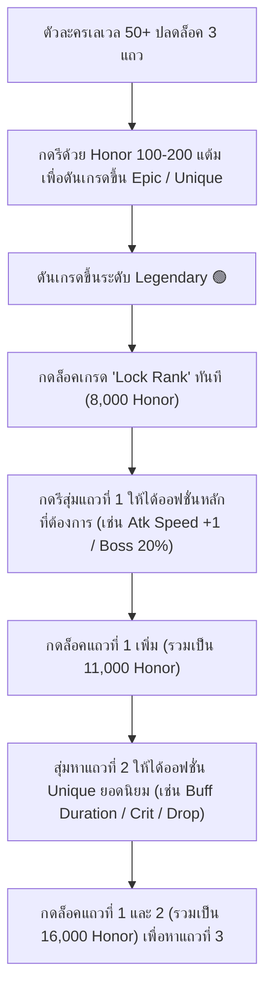

# 🌟 ระบบ Inner Ability (ความสามารถภายใน)

**Inner Ability (ความสามารถภายใน)** คือระบบเสริมพลังพิเศษประจำตัวละครแบบถาวร โดยตัวละครสามารถปลดล็อคแถบพลังพิเศษได้สูงสุด **3 แถว** ซึ่งแต่ละแถวจะมอบค่าสเตตัสและคุณสมบัติพิเศษระดับสูง เช่น **ความเร็วโจมตี (Attack Speed +1), ดาเมจบอส (Boss Damage +20%), ขยายระยะเวลาบัฟ (Buff Duration +50%), โอกาสไม่ติดคูลดาวน์ (Cooldown Skip 20%), และอัตราการดรอปไอเทม/เงิน (Drop Rate / Meso +20%)**

---

## 🧭 1. เงื่อนไขการปลดล็อค & วิธีการเปิดใช้งาน

* **เลเวลที่ปลดล็อค:** เมื่อตัวละครเลเวล **50 ขึ้นไป** ระบบจะทำการปลดล็อคช่องความสามารถภายในทั้ง 3 แถวให้ทันทีโดยอัตโนมัติ
* **วิธีเปิดหน้าต่าง Ability:**
  1. กดเปิดหน้าต่างข้อมูลตัวละคร (คีย์ลัด `S` หรือคลิกรูปตัวละคร)
  2. คลิกที่ปุ่ม **`Detail Stats`** (รายละเอียดสเตตัส)
  3. จะพบหน้าต่าง **`Ability`** แสดงสถานะระดับขั้นและออฟชั่นทั้ง 3 แถว พร้อมแต้ม **Honor EXP** ที่มีอยู่

---

## 🏆 2. ระดับขั้นของ Inner Ability (Tiers)

Inner Ability แบ่งออกเป็น 4 ระดับขั้น ยิ่งระดับสูงเท่าใด คุณภาพและตัวเลขของออฟชั่นจะยิ่งทรงพลังมากขึ้น:

| ระดับ (Tier) | สีกรอบ | ความสำคัญ & บทบาท | โอกาสเลื่อนขั้น |
| :--- | :---: | :--- | :---: |
| **Rare** | ⚪ สีเทา/ขาว | ระดับเริ่มต้นหลังจากปลดล็อค มอบสเตตัสพื้นฐานเล็กน้อย | สูง |
| **Epic** | 🔵 สีฟ้า | ระดับกลาง มอบสเตตัสระดับปานกลาง | ปานกลาง |
| **Unique** | 🟠 สีส้ม/เหลือง | ระดับสูง เริ่มมีออฟชั่นสำคัญ เช่น Buff Duration, Crit Rate, Drop Rate | ปานกลาง-ต่ำ |
| **Legendary** | 🟢 สีเขียว | **ระดับสูงสุด (เป้าหมายหลัก)** มีออฟชั่นพิเศษขั้นเทพ เช่น Attack Speed +1, Boss Damage +20% | ต่ำ (ล็อคเกรดได้) |

### 📌 โครงสร้างของแถวทั้ง 3 (Line Distribution)
* **แถวที่ 1 (Prime Line):** จะมีระดับเท่ากับ **ระดับขั้นหลักของตัวละครเสมอ** (เช่น หากตัวละครอยู่ในระดับ Legendary แถวแรกจะสุ่มได้เฉพาะออฟชั่นของเกรด Legendary เท่านั้น)
* **แถวที่ 2 และ แถวที่ 3 (Sub Lines):** จะสุ่มออกมาระดับต่ำกว่าเกรดหลัก 1 - 2 ขั้น (เมื่อตัวละครเป็นระดับ Legendary แถวที่ 2 และ 3 จะสุ่มได้สูงสุดที่ระดับ **Unique** และ **Epic**)

---

## 💎 3. อัตราการใช้แต้ม Honor EXP ในการรี & การล็อค (Locking Costs)

อ้างอิงข้อมูลจริงจากไฟล์ระบบของเกม (`Etc.wz/InnerAbility.img`):

| ระดับ (Tier) | รีปกติ (ไม่ล็อค) | ล็อคระดับเกรด (0 แถว) | ล็อคระดับ + ล็อค 1 แถว | ล็อคระดับ + ล็อค 2 แถว |
| :--- | :---: | :---: | :---: | :---: |
| **Rare** | 100 Honor | - | 400 Honor | 900 Honor |
| **Epic** | 200 Honor | 500 Honor | 1,100 Honor | 2,600 Honor |
| **Unique** | 1,500 Honor | 2,000 Honor | 3,000 Honor | 5,500 Honor |
| **Legendary** | 8,000 Honor | **8,000 Honor** | **11,000 Honor** | **16,000 Honor** |

> 💡 **ข้อควรระวังสำคัญที่สุด:**  
> เมื่อรีจนเลื่อนขั้นเป็น **Legendary** แล้ว **ต้องกดติ๊กถูกที่ช่องกุญแจ "Lock Rank" (ล็อคระดับ) เสมอ (ใช้ 8,000 Honor)** มิฉะนั้นการกดรีครั้งต่อไปอาจทำให้ระดับตกลงมาเป็น Unique ได้!

---

## 🔄 4. ขั้นตอนและเทคนิคการทำ Inner Ability (Step-by-Step)

### 🔮 ไอเทมตัวช่วยประเภท Circulator
นอกจากการใช้ Honor EXP แล้ว ผู้เล่นยังสามารถใช้ไอเทมประเภท **Circulator** ในการปรับแต่งออฟชั่นได้:

1. **Miracle Circulator:**  
   * สุ่มออฟชั่นใหม่ทั้งหมด โดย**การันตีค่าตัวเลขสูงสุด (Max Value)** ของระดับนั้นๆ เสมอ และมีโอกาสเลื่อนขั้นเกรด
2. **Chaos Circulator:**  
   * สุ่มเปลี่ยนเฉพาะ **"ตัวเลขค่าสเตตัส"** ของออฟชั่นเดิมที่มีอยู่แล้ว โดยไม่เปลี่ยนชนิดออฟชั่น เหมาะสำหรับผู้ที่ได้ออฟชั่นตรงสายทั้ง 3 แถวแล้ว แต่ต้องการปรับตัวเลขให้เต็ม Max
3. **Black Circulator:**  
   * สุ่มออฟชั่นใหม่ โดยสามารถเลือกได้ว่าจะใช้ **"ออฟชั่นเดิม (Before)"** หรือ **"ออฟชั่นใหม่ (After)"** ป้องกันออฟชั่นดีๆ หาย
4. **Legendary / Unique Circulator:**  
   * ใช้งานแล้วเลื่อนขั้นตัวละครขึ้นสู่ระดับ Legendary หรือ Unique ทันที 100%

---

## 🗺️ 5. สถานที่ดรอป Honor EXP & แหล่งฟาร์มแต้มเกียรติยศ

ในเซิร์ฟเวอร์ **Clover Idle Story** ผู้เล่นสามารถสะสม Honor EXP ได้อย่างรวดเร็วผ่านหลากหลายช่องทาง:

### 1. การฟาร์มมอนสเตอร์ด้วยระบบบอทอัตโนมัติ (`@autoplay` / `@bot`)
* มอนสเตอร์ทั่วไปทุกตัวในเกมมีโอกาสดรอป **`Medal of Honor (เหรียญเกียรติยศ)`**
* เมื่อใช้งานสัตว์เลี้ยงที่มีระบบเก็บของออโต้ (AutoLoot) สัตว์เลี้ยงจะดูดเหรียญเข้าตัวละครทันที มอบ **100 - 200 Honor EXP ต่อเหรียญ**
* ด้วยอัตราการเกิดของมอนสเตอร์ที่รวดเร็ว การเปิดบอทฟาร์มเพียง 1-2 ชั่วโมง จะสามารถสะสมเหรียญ Honor ได้หลายแสนถึงล้านแต้ม

### 2. บอสมอนสเตอร์ประจำวันและประจำสัปดาห์ (Daily & Weekly Bosses)
* บอสทุกระดับตั้งแต่ Zakum, Horntail, Papulatus, Root Abyss จนถึงบอสระดับสูงอย่าง Lotus, Damien, Lucid, Will, Verus Hilla, และ Black Mage
* ดรอป **`Boss Medal of Honor`** หรือ **`Large Boss Medal of Honor`** ให้แต้ม Honor EXP สูงถึง **5,000 - 10,000 แต้มต่อชิ้น**
* การลงบอสครบทุกตัวในแต่ละวัน/สัปดาห์ จะทำให้ได้รับแต้ม Honor นับแสนแต้มอย่างง่ายดาย

### 3. มอนสเตอร์ Elite & Elite Champions
* เมื่อฟาร์มในแผนที่ มอนสเตอร์ขนาดใหญ่ระดับ Elite Monster และฝูง Elite Champions จะสุ่มเกิด
* เมื่อกำจัดได้ จะดรอป **`Special Medal of Honor`** ซึ่งมอบแต้ม Honor ก้อนใหญ่ทันที

### 4. หอคอยฝึกฝน Mu Lung Dojo
* ท้าทายหอคอย Mu Lung Dojo สะสมแต้มคะแนนมูหลง (Dojo Points)
* นำแต้มไปแลกซื้อ **`Mu Gong's Guaranteed Medal of Honor (10,000 Honor EXP)`** กับ NPC **So Gong** ที่หน้าทางเข้ามูหลง

### 5. ร้านค้าด่วน Quick Move & กิจกรรมพิเศษ
* เมนู `@quickmove` และร้านค้ากิจกรรมพิเศษ มักจะมี **Special Medal of Honor Package** และ **Miracle Circulator Coupon** ให้แลกซื้อเป็นประจำ

---

## 📊 6. ตารางออฟชั่น Inner Ability ทั้งหมด (All Possible Lines)

รวบรวมข้อมูลอย่างเป็นทางการจากไฟล์ระบบของเกม (`Skill.wz/7000.img`) แสดงค่าต่ำสุด (Min) และสูงสุด (Max) ของแต่ละระดับ:

### ⚔️ หมวดพลังโจมตี & การต่อสู้ (Combat & Bossing)

| ออฟชั่น (Ability Name) | Rare (⚪) | Epic (🔵) | Unique (🟠) | Legendary (🟢) | หมายเหตุ |
| :--- | :---: | :---: | :---: | :---: | :--- |
| **Attack Speed (ความเร็วโจมตี)** | - | - | - | **+1 ระดับ (Max)** | ⭐️ ยอดนิยมอันดับ 1 สำหรับอาชีพที่ยังไม่ถึง Hard Cap |
| **Boss Damage (ดาเมจบอส)** | - | 5% - 10% | 11% - 15% | **16% - 20% (Max)** | ⭐️ เพิ่มพลังโจมตีใส่บอสทุกชนิด |
| **Buff Duration (ระยะเวลาบัฟ)** | 2% - 13% | 14% - 25% | 27% - 38% | **39% - 50% (Max)** | ⭐️ จำเป็นมากสำหรับ Dark Knight, เมจ Explorer, Luminous |
| **Cooldown Skip (โอกาสไม่ติดคูลดาวน์)** | - | 5% - 10% | 11% - 15% | **16% - 20% (Max)** | ⭐️ มีผลกับสกิลส่วนใหญ่ (ยกเว้นสกิลที่มีเงื่อนไขพิเศษ) |
| **Passive Skills Level (เลเวลพาสซีฟ)** | - | - | - | **+1 เลเวล (Max)** | เพิ่มเลเวลสกิล Passive คลาส 4 (ไม่รวม 5th Job) |
| **Attack Target +1 (เพิ่มเป้าหมายโจมตี)** | - | - | - | **+1 ตัว (Max)** | เพิ่มจำนวนมอนสเตอร์ที่โดนสกิลโจมตีหลายเป้า |
| **Damage to Abnormal Status (ดาเมจเป้าหมายติดสถานะ)** | 1% - 3% | 4% - 5% | 6% - 8% | **9% - 10% (Max)** | ทำงานร่วมกับสกิลดีบัฟ สตั๊น พิษ สโลว์ |
| **Normal Monster Damage (ดาเมจมอนสเตอร์ทั่วไป)** | 1% - 3% | 4% - 5% | 6% - 8% | **9% - 10% (Max)** | เหมาะสำหรับตัวละครเน้นฟาร์มมอนสเตอร์ |

---

### 📈 หมวดสเตตัส & คริติคอล (Stats & Critical)

| ออฟชั่น (Ability Name) | Rare (⚪) | Epic (🔵) | Unique (🟠) | Legendary (🟢) | หมายเหตุ |
| :--- | :---: | :---: | :---: | :---: | :--- |
| **Critical Rate (อัตราคริติคอล)** | 5% - 10% | 11% - 15% | 16% - 20% | **25% - 30% (Max)** | ⭐️ เหมาะสำหรับอาชีพที่คริติคอลพื้นฐานยังไม่ครบ 100% |
| **Attack (พลังโจมตี)** | +3 ถึง +12 | +15 ถึง +21 | +21 ถึง +24 | **+27 ถึง +30 (Max)** | บวกพลังโจมตีแบนราบ |
| **Magic Attack (พลังโจมตีเวท)** | +3 ถึง +12 | +15 ถึง +21 | +21 ถึง +24 | **+27 ถึง +30 (Max)** | บวกพลังเวทแบนราบ |
| **Attack per Level (พลังโจมตีตามเลเวล)** | - | - | +1 ทุก 18-20 เวล | **+1 ทุก 16 เวล (Max)** | เลเวล 250 ได้รับพลังโจมตีประมาณ +15 |
| **Magic Attack per Level (พลังเวทตามเลเวล)** | - | - | +1 ทุก 18-20 เวล | **+1 ทุก 16 เวล (Max)** | เลเวล 250 ได้รับพลังเวทประมาณ +15 |
| **All Stats (สเตตัสรวม)** | +5 ถึง +10 | +11 ถึง +20 | +21 ถึง +30 | **+31 ถึง +40 (Max)** | เพิ่ม STR, DEX, INT, LUK พร้อมกัน |
| **Single Stat (STR / DEX / INT / LUK)** | +5 ถึง +10 | +11 ถึง +20 | +21 ถึง +30 | **+31 ถึง +40 (Max)** | เพิ่มสเตตัสหลักเดี่ยว |
| **Dual Stat (สเตตัสคู่ เช่น STR + DEX)** | +10 / +5 | +20 / +10 | +30 / +15 | **+40 / +20 (Max)** | สเตตัสหลัก +40 และสเตตัสรอง +20 |
| **Max HP % (พลังชีวิตสูงสุดเป็น %)** | 2% - 5% | 6% - 10% | 11% - 15% | **16% - 20% (Max)** | สำคัญอย่างยิ่งสำหรับ Demon Avenger |
| **Max MP % (พลังเวทสูงสุดเป็น %)** | 2% - 5% | 6% - 10% | 11% - 15% | **16% - 20% (Max)** | เพิ่มปริมาณ MP สูงสุด |
| **Flat Max HP (พลังชีวิตแบบหน่วย)** | +75 ถึง +150 | +165 ถึง +300 | +315 ถึง +450 | **+465 ถึง +600 (Max)** | เพิ่ม HP พื้นฐาน |
| **Flat Max MP (พลังเวทแบบหน่วย)** | +75 ถึง +150 | +165 ถึง +300 | +315 ถึง +450 | **+465 ถึง +600 (Max)** | เพิ่ม MP พื้นฐาน |
| **DEF (พลังป้องกัน)** | +50 ถึง +100 | +110 ถึง +200 | +210 ถึง +300 | **+310 ถึง +400 (Max)** | เพิ่มพลังป้องกันกายภาพ/เวท |

---

### 💰 หมวดยูทิลิตี้ & การฟาร์ม (Utility & Farming)

| ออฟชั่น (Ability Name) | Rare (⚪) | Epic (🔵) | Unique (🟠) | Legendary (🟢) | หมายเหตุ |
| :--- | :---: | :---: | :---: | :---: | :--- |
| **Item Drop Rate (อัตราการดรอปไอเทม)** | 3% - 5% | 6% - 10% | 11% - 15% | **16% - 20% (Max)** | ⭐️ ยอดนิยมสำหรับตัวฟาร์มหลักและตัวลงบอส |
| **Meso Drop Rate (อัตราการได้รับเงิน Meso)** | 3% - 5% | 6% - 10% | 11% - 15% | **16% - 20% (Max)** | ⭐️ ช่วยเพิ่มเงินเมโซจากการเปิดบอทฟาร์มอย่างมหาศาล |
| **Movement Speed (ความเร็วการเคลื่อนที่)** | +2 ถึง +6 | +8 ถึง +12 | +14 ถึง +18 | **+20 (Max)** | เพิ่มความคล่องตัวในการเดินแมพ |
| **Jump (แรงกระโดด)** | +2 ถึง +4 | +6 ถึง +8 | +10 ถึง +12 | **+14 (Max)** | เพิ่มความสูงในการกระโดด |

---

## 🎯 7. แนวทางเลือกออฟชั่นยอดนิยมตามสายอาชีพ (Best in Slot Guide)

### 1. สายที่ "ต้องใช้ Attack Speed +1" เป็นแถวที่ 1
อาชีพที่สกิลบัฟความเร็วโจมตียังไม่ถึงขีดจำกัดสูงสุด (Hard Cap: Attack Speed ระดับ 8 หรือ 0 เมื่อนับจากดีเลย์) จำเป็นต้องมี **Attack Speed +1 ในแถวแรก (Legendary)** เพื่อเพิ่มความเร็วในการกดสกิลและ DPS อย่างมหาศาล:
* **สายนักรบ:** Hero, Paladin, Dark Knight, Adele, Kaiser, Blaster, Aran, Hayato, Zero
* **สายนักธนู:** Marksman, Wild Hunter
* **สายโจร:** Shadower, Dual Blade
* **สายโจรสลัด:** Buccaneer, Cannoneer, Shade, Ark

### 2. สายที่ "ต้องใช้ Buff Duration +50%" เป็นแถวที่ 1
อาชีพที่มีสกิลบัฟสำคัญอย่างยิ่งต่อดาเมจและไม่ต้องการให้บัฟหมด:
* **Dark Knight:** ยืดระยะเวลาบัฟ Sacrifice เพื่อให้สามารถใช้ทวน Gungnir's Descent ได้อย่างไร้คูลดาวน์ตลอดเวลา 100% Uptime
* **Explorer Mages (Arch Mage F/P, I/L, Bishop):** ยืดระยะเวลาสกิลบัฟ **Infinity** ซึ่งเพิ่ม Final Damage สูงขึ้นเรื่อยๆ ตามเวลาที่บัฟทำงาน ยิ่งบัฟอยู่นานดาเมจยิ่งมหาศาล
* **Luminous:** ยืดระยะเวลาโหมด Equilibrium (โหมดบัฟโจมตีกึ่งแสงกึ่งมืดทำดาเมจสูงสุด)
* **Mechanic:** ยืดระยะเวลาหุ่นยนต์และบัฟสนับสนุนปาร์ตี้

### 3. สายที่ "นิยม Cooldown Skip 20%" เป็นแถวที่ 1
อาชีพที่สกิลสำคัญไม่มีข้อความระบุว่า "ไม่ได้รับผลจาก Cooldown Skip":
* **Dual Blade:** รีคูลดาวน์ Sudden Raid, Final Cut, Blade Clone
* **Phantom:** รีคูลดาวน์สกิลขโมยหลากหลายชนิด
* **Wind Archer:** รีคูลดาวน์พายุและสกิลโจมตีวงกว้าง
* **Explorer Mages:** รีคูลดาวน์สกิลหมู่คลาส 4

### 4. สายดาเมจบอสมาตรฐาน (Boss Damage +20%)
สำหรับอาชีพที่มีความเร็วโจมตีแตะ Hard Cap อยู่แล้ว (เช่น Night Lord, Bowmaster, Mercedes, Corsair, Xenon, Adele ร่างเร่งสปีด):
* **แถวที่ 1 (Legendary):** Boss Monster Damage +20%
* **แถวที่ 2 (Unique):** Critical Rate +20% หรือ Buff Duration +38% หรือ Attack/M.Atk +21
* **แถวที่ 3 (Unique/Epic):** Item Drop Rate +15% หรือ Damage to Abnormal Status +8% หรือ All Stats +30

### 5. เซ็ตสำหรับตัวฟาร์มหลัก (Farmer Build)
สำหรับตัวละครที่สร้างมาเพื่อเปิดบอท `@autoplay` หาของและเงินเมโซตลอด 24 ชั่วโมง:
* **แถวที่ 1 (Legendary):** **Item Drop Rate +20%**
* **แถวที่ 2 (Unique):** **Meso Drop Rate +15%**
* **แถวที่ 3 (Unique/Epic):** Damage to Normal Monsters +8% หรือ Attack/Stat เสริมความแรงให้มอนสเตอร์ตายใน 1 ฮิต (One-shot kill)
