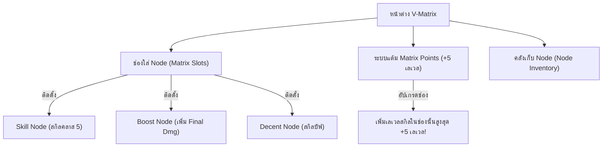
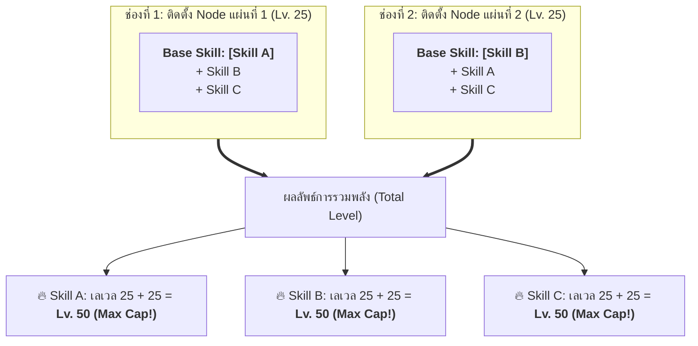
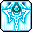

# 💠 คู่มือระบบ Nodestone & V-Matrix (ระบบสกิลคลาส 5)

ระบบ **V-Matrix** และไอเทมหินสกิล **Nodestone** คือระบบแกนหลักของสกิลคลาส 5 (5th Job Skill System) สำหรับตัวละครเลเวล 200 ขึ้นไปใน MapleStory และ Clover Idle โดยเป็นระบบที่เปิดโอกาสให้ผู้เล่นปรับแต่งสกิล เสริมพลัง Final Damage ของสกิลคลาส 1-4 ให้รุนแรงขึ้นกว่า **+100% ถึง +150%** รวมถึงติดตั้งสกิลอรรถประโยชน์ระดับเทพอย่าง Decent Holy Symbol, Blink, Erda Nova และ Rope Lift ได้อย่างอิสระ

---

## 🧭 1. โครงสร้างหน้าต่าง V-Matrix & ช่องติดตั้ง Node (Matrix Slots)

เมื่อเปลี่ยนอาชีพคลาส 5 สำเร็จ ผู้เล่นสามารถเปิดหน้าต่าง **V-Matrix** ได้จากเมนูสกิลคลาส 5 โดยมีองค์ประกอบสำคัญ 3 ส่วน:

### 1.1 การปลดล็อคช่องติดตั้ง (Matrix Slots)

| สถานะช่อง | ไอคอนแสดงผล | คำอธิบาย |
| :---: | :---: | :--- |
| **ช่องพร้อมใช้งาน (Unlocked)** |  | ช่องว่างที่ปลดล็อคแล้ว สามารถลาก Node จากคลังมาสวมใส่ได้ทันที |
| **ช่องที่ยังล็อคอยู่ (Locked)** |  | ช่องที่รอปลดล็อคฟรีเมื่อตัวละครเลเวลอัป หรือสามารถจ่ายเงิน Meso เพื่อปลดล็อคล่วงหน้าได้ 2 ช่อง |

* **ปลดล็อคฟรีตามเลเวล:** ผู้เล่นจะได้รับช่องใส่ Node เริ่มต้นที่เลเวล 200 และจะปลดล็อคช่องใหม่ฟรีทุกๆ การอัปเลเวลตัวละคร
* **การจ่าย Meso ปลดล็อคล่วงหน้า:** ผู้เล่นสามารถจ่ายเงิน Meso เพื่อปลดล็อคช่องใส่ Node ล่วงหน้าได้สูงสุด 2 ช่อง เพื่อสวมใส่สกิลสำคัญได้ไวยิ่งขึ้นตั้งแต่ช่วงต้นเกม

### 1.2 ระบบ Matrix Points (แต้มเสริมเลเวลช่อง)
* ทุกครั้งที่ตัวละครเลเวลอัปตั้งแต่เลเวล 200 เป็นต้นไป จะได้รับ **1 Matrix Point**
* แต้มนี้สามารถนำไปใช้อัปเกรดที่ **"ช่องใส่ Node (Slot)"** ได้โดยตรง สูงสุด **+5 เลเวลต่อช่อง**
* **ข้อดีมหาศาล:** เมื่อนำ Node ใดๆ มาใส่ในช่องที่อัปแต้มไว้ เลเวลของ Node นั้นจะได้รับโบนัสเพิ่มขึ้นทันที เช่น:
  * Skill Node เลเวล 25 + Matrix Point 5 แต้ม = **เลเวล 30 (Max Cap สกิลคลาส 5)**
  * Boost Node เลเวล 25 + Matrix Point 5 แต้ม = **เลเวล 30**

---

## 📦 2. ประเภทของ Node ในระบบ V-Matrix (4 ประเภทหลัก)

ภายในระบบ V-Matrix สกิลจะถูกแบ่งออกเป็น 4 รูปแบบตามลักษณะการใช้งาน:

| กรอบสวมใส่ | ป้ายเมนู | ประเภท Node | เลเวลสูงสุดจากตัว Node | เลเวลเมื่อรวม Matrix Points | คำอธิบายและประโยชน์ |
| :---: | :---: | :--- | :---: | :---: | :--- |
|  |  | **1. Skill Node (โน้ดสกิลคลาส 5)** | **Lv. 25** | **Lv. 30** | สกิลกดใช้และสกิลติดตัวใหม่ของคลาส 5 แบ่งเป็นสกิลเฉพาะอาชีพ (4 สกิลหลัก) และสกิลรวมสายอาชีพ |
|  |  | **2. Boost Node (โน้ดเสริมพลัง)** | **Lv. 25 (ซ้อนได้ Lv. 50)** | **Lv. 60** | โน้ด 3 สกิลใน 1 แผ่น เพิ่ม Final Damage ให้กับสกิลคลาส 1-4 เดิมที่มีอยู่ สูงสุด +100% ถึง +150%! |
|  |  | **3. Decent Skill Node (สกิลยืม)** | **Lv. 1 - 25** | **Lv. 30** | สกิลบัฟสารพัดประโยชน์ที่หยิบยืมมาจากอาชีพอื่น เช่น Holy Symbol, Sharp Eyes ทุกอาชีพสามารถใส่ได้ |
|  |  | **4. Special Node (โน้ดพิเศษ)** | **Lv. 1** | — | โน้ดเงื่อนไขพิเศษ มีอายุการใช้งาน (7 - 30 วัน) มอบบัฟพิเศษเมื่อทำตามเงื่อนไขสำเร็จ เช่น ฟื้นฟูเลือดเมื่อโจมตีคริติคอล |

---

## 🏆 3. สุดยอดเทคนิคการทำ "Perfect Trio Nodes" (สูตร 2 Nodes 3 Skills)

นี่คือเทคนิคที่สำคัญที่สุดสำหรับผู้เล่นทุกคนในการประหยัดช่อง V-Matrix และดันดาเมจของสกิลหลักให้ทะลุขีดจำกัด!

### 3.1 กฎเหล็กของ Boost Node
1. Boost Node 1 แผ่นจะประกอบด้วย **3 สกิลเสมอ** (สกิลหลัก + สกิลย่อยที่หนึ่ง + สกิลย่อยที่สอง)
2. **สกิลแรก (บนสุด) คือ "Base Skill" (ชื่อฐานของโน้ด):**
   * ชื่อของ Node จะถูกตั้งตามสกิลแรกสุดนี้
3. **ข้อห้ามสำคัญ:** **"ห้ามสวมใส่ Boost Node ที่มี Base Skill ซ้ำกันลงในหน้าต่าง V-Matrix พร้อมกันเด็ดขาด!"**
4. **แต่สกิลข้างในสามารถซ้ำกันได้** หากมี Base Skill คนละตัวกัน!

---

### 3.2 สูตรสำเร็จ: 2 Nodes 3 Skills (รวมเป็น Lv. 50 - 60)

สมมติว่าอาชีพของคุณมีสกิลโจมตีหลักที่ต้องใช้งาน 3 สกิล ได้แก่ **Skill A**, **Skill B** และ **Skill C**:

#### ประสิทธิภาพที่ได้รับ:
* ใช้ช่อง Matrix Slots เพียงแค่ **2 ช่องเท่านั้น!**
* ทั้ง 3 สกิลได้รับผลรวมเลเวลเป็น **Lv. 50 เต็มเพดานพื้นฐานทันที**
* เพิ่ม Final Damage ให้กับสกิลคลาส 4 ทั้งสามสกิล **+100% (แรงขึ้น 2 เท่าตัว!)**
* หากอัป Matrix Points ในช่องที่ 1 และ 2 เต็ม (+5 ทั้ง 2 ช่อง) เลเวลของทั้งสามสกิลจะพุ่งทะลุไปถึง **Lv. 60 (เพิ่ม Final Damage สูงสุด +120% และได้รับ Ignore Monster DEF +20%)**

> [!NOTE]
> **สำหรับอาชีพที่มีสกิลหลัก 6 สกิล (เช่น Dual Blade, Hayato, Kanna, Mercedes):**
> ให้ใช้สูตร **4 Nodes 6 Skills** โดยจัดเป็น 2 คู่ (A-B-C คู่กับ B-A-C และ D-E-F คู่กับ E-D-F) จะได้สกิลทั้ง 6 เลเวล 50-60 เต็มทุกสกิลโดยใช้เพียง 4 ช่องเท่านั้น!

---

## 🔮 4. การย่อย Node (Disassemble) และคราฟต์ Node Shards

เมื่อเปิด Nodestone แล้วได้ Node ที่ไม่ได้ใช้งาน ผู้เล่นสามารถนำไปคุยกับ NPC V-Matrix เพื่อทำลาย (Disassemble) ให้กลายเป็น **Node Shards ( Nodestone Fragment)** และนำไปคราฟต์เป็น Node ที่ต้องการแบบเจาะจงได้ 100%:

### ตารางจำนวน Node Shards ที่ได้รับจากการย่อย
| ประเภท Node ที่นำมาย่อย | กรอบแสดงผล | จำนวน Node Shards ที่ได้รับ |
| :--- | :---: | :---: |
| **Boost Node (โน้ดเสริมพลัง)** |  | **10 Shards** |
| **Skill Node (โน้ดสกิลคลาส 5)** |  | **40 Shards** |
| **Special Node (โน้ดพิเศษสีม่วง)** |  | **50 Shards** |

### ตารางการคราฟต์ไอเทมและ Node ที่ต้องการ
| ไอคอน | สิ่งที่ต้องการคราฟต์ | จำนวน Shards ที่ต้องใช้ | ข้อดี / รายละเอียด |
| :---: | :--- | :---: | :--- |
|  | **Nodestone (หินสุ่ม)** | **35 Shards** | สุ่มรับ Node ใหม่ เหมาะสำหรับช่วงต้นเกมที่ต้องการลุ้นโน้ดจำนวนมาก |
|  | **Specific Boost Node (โน้ดเสริมพลังเจาะจง)** | **70 Shards** | **เลือก Base Skill ที่ต้องการได้ 100%!** (สกิลย่อยอีก 2 สกิลจะสุ่ม) นิยมใช้ทำ Perfect Trio |
|  | **Specific Skill Node (โน้ดสกิลคลาส 5 เจาะจง)** | **140 Shards** | **เลือกสกิลคลาส 5 ที่ต้องการได้ 100%!** ใช้สำหรับอัปเวลสกิลคลาส 5 ประจำตัวและสกิล Decent |
|  | **Special Node (โน้ดพิเศษ)** | **250 Shards** | คราฟต์โน้ดบัฟเงื่อนไขพิเศษตามต้องการ |

---

## 💎 5. รวมไอเทม Nodestone ทั้งหมดในเกม

| ไอคอน | ชื่อไอเทม Nodestone | รายละเอียดและคุณสมบัติ |
| :---: | :--- | :--- |
|  | **Nodestone (หินโน้ดมาตรฐาน)** | ดรอปจากมอนสเตอร์ทุกตัวใน Arcane River เมื่อกดใช้งานจะสุ่มรับ Skill Node, Boost Node หรือ Special Node ของสายอาชีพตนเอง |
|  | **Skill Nodestone** | เมื่อเปิดใช้งานจะได้รับ Skill Node ของคลาส 5 อย่างแน่นอน |
|  | **Amazing Nodestone** | หินโน้ดระดับสูง เมื่อเปิดใช้งานมีโอกาสได้รับ Node ที่มีเลเวลเริ่มต้นสูงกว่าปกติ |
|  | **Experience Nodestone (EXP Node)** | **หินโน้ด EXP มหาศาล!** นำไปใช้เป็นวัตถุดิบในการอัปเลเวล Skill Node ใดๆ ก็ได้ ให้ค่า EXP เทียบเท่ากับ Skill Node ซ้ำกันถึง 150 EXP (ช่วยประหยัดเวลาอัปสกิลคลาส 5 ได้มหาศาล) |
|  | **Mirror World Nodestone** | หินโน้ดพิเศษที่ได้รับจากการพิชิตบอส Will นำไปใช้คราฟต์และอัปเกรดสกิลคลาส 5 ระดับจักรวาล **True Arachnid Reflection (แมงมุมใยกระจก)** |
|  | **Mitra's Nodestone** | หินโน้ดศักดิ์สิทธิ์ที่สามารถกดรับ Nodestone ได้สัปดาห์ละครั้งต่อเนื่องยาวนาน |
|  | **Nodestone Fragment (Node Shards)** | ชิ้นส่วนที่ได้รับจากการย่อย Node ที่ไม่ต้องการ ใช้สำหรับคราฟต์ Nodestone หรือเลือกคราฟต์สกิลที่ต้องการได้โดยตรง |

---

## ⚡ 6. รวม Decent Skill Nodes ครบทั้ง 7 สกิล

Decent Skills คือสกิลบัฟของอาชีพอื่นที่ถูกแปลงมาเป็น Node สำหรับติดตั้ง ทุกอาชีพสามารถสวมใส่ได้โดยไม่มีข้อจำกัด:

| ไอคอน | ชื่อสกิล Decent Node | ต้นกำเนิดอาชีพ | ผลลัพธ์และคุณสมบัติ | ความคุ้มค่าในการใช้งาน |
| :---: | :--- | :--- | :--- | :---: |
|  | **Decent Holy Symbol** | Bishop | เพิ่ม **EXP ที่ได้รับ +20% ถึง +35%** และเพิ่ม **Item Drop Rate +14% ถึง +24%** | ⭐⭐⭐⭐⭐ **(ต้องมีเป็นชิ้นแรก!)** |
|  | **Decent Sharp Eyes** | Bowmaster / Marksman | เพิ่ม **Critical Rate +10%** และเพิ่ม **Critical Damage +8%** | ⭐⭐⭐⭐⭐ **(จำเป็นมากทุกคอนเทนต์)** |
|  | **Decent Speed Infusion** | Buccaneer | เพิ่มค่า **Attack Speed (ความเร็วโจมตี) ขึ้น +1 ระดับ (1 Stage)** | ⭐⭐⭐⭐⭐ **(หัวใจหลักสายโจมตี)** |
|  | **Decent Combat Orders** | Paladin | เพิ่มเลเวลของสกิล **คลาส 4 ทั้งหมดขึ้น +1 เลเวล** (ทะลุ Master Level) | ⭐⭐⭐⭐ **(เพิ่ม Stat/Mastery)** |
|  | **Decent Advanced Blessing** | Bishop | เพิ่ม **Attack / Magic Attack +20**, เพิ่ม **Max HP / Max MP +700** | ⭐⭐⭐⭐ **(บัฟพลังโจมตีฟรี)** |
|  | **Decent Hyper Body** | Dark Knight | เพิ่ม **Max HP และ Max MP ขึ้น +40%** | ⭐⭐⭐ **(ดีมากสำหรับ Demon Avenger)** |
|  | **Decent Mystic Door** | Priest / Bishop | เปิดประตูมิติวาร์ปกลับเมืองที่ใกล้ที่สุดและวาร์ปกลับมายังจุดเดิมได้ | ⭐⭐ **(สะดวกในการเดินทาง)** |

---

## 🌌 7. รวมสกิลใช้งานกลางคลาส 5 (Common 5th Job Skill Nodes)

นอกจากสกิล Decent แล้ว ในระบบ V-Matrix ยังมีสกิลกลางคลาส 5 ที่ทุกอาชีพในเกมสามารถสวมใส่ได้เพื่อเพิ่มความคล่องตัวและการต่อสู้กับบอสระดับสูง:

| ไอคอน | ชื่อสกิล V-Node | คุณสมบัติและความสามารถ | คำแนะนำการใช้งาน |
| :---: | :--- | :--- | :--- |
|  | **Rope Lift (โหนเชือก)** | ยิงสลิงดึงตัวละครพุ่งขึ้นสู่แพลตฟอร์มด้านบนอย่างรวดเร็ว | **สกิล Must-Have สำหรับการฟาร์มและการปีนแมพ** ช่วยให้เคลื่อนที่ในแนวดิ่งได้ไวกว่าทุกสกิล |
|  | **Blink (ลอยตัวหลบเมคานิก)** | กดครั้งแรกเพื่อเทเลพอร์ตสุ่มระยะสั้น หากกดค้างจะ**ลอยตัวค้างอยู่กลางอากาศได้สูงสุด 5 วินาที** พร้อมบัฟ All Stat | **หัวใจหลักในการลงบอสระดับสูง** (เช่น ลอยตัวหลบคลื่น Lucid, ลอยหลบใย Will, หลบลำแสง Damien) |
|  | **Erda Nova (สกิลหยุดบอส / Bind)** | ปลดปล่อยพลัง Erda ยิงเข้าใส่ศัตรู **หยุดการเคลื่อนไหวของบอส (Bind) นานสูงสุด 10 วินาที** | **จำเป็นอย่างยิ่งสำหรับอาชีพที่ไม่มีสกิล Bind ประจำตัว** เพื่อตรึงบอสให้อยู่นิ่งช่วงระเบิดดาเมจ Burst |
|  | **Erda Shower (ฝนดาวตก Erda)** | โจมตีมอนสเตอร์รอบตัวเป็นวงกว้าง หรือกดคู่กับปุ่มล่างเพื่อ**ปักเสา Erda Fountain ช่วยฟาร์มมอนสเตอร์อัตโนมัติ** | ยอดเยี่ยมสำหรับการฟาร์ม คอยจัดการมอนสเตอร์อีกฝั่งของแผนที่ ช่วยประหยัดเวลาเดินฟาร์ม |
|  | **True Arachnid Reflection (แมงมุม Will)** | สกิลบอส Will ยิงลำแสงใยแมงมุมสะท้อนทั่วทั้งหน้าจอ และมีขาแมงมุมคอยแทงโจมตีศัตรูต่อเนื่อง | ดาเมจรุนแรงมหาศาลทั้งในการลงบอสและการเคลียร์มอนสเตอร์ยกหน้าจอ |
|  | **Solar Crest (ไฟสุริยะ Seren)** | อัญเชิญเปลวเพลิงแห่งเทพสุริยะ Seren เผาทำลายศัตรูรอบตัวอย่างรุนแรงต่อเนื่อง | สกิลบอสระดับสูง มอบดาเมจ Burst เสริมให้กับการต่อสู้กับบอสระดับท็อป |
