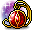
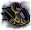
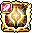
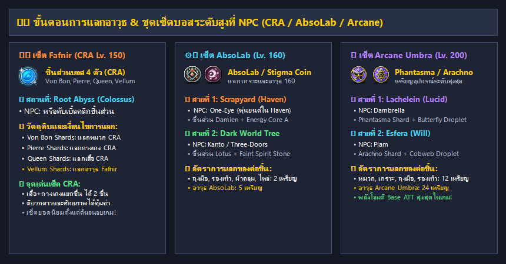

# 🏰 ข้อมูลบอส & ดันเจี้ยน (@bossinfo)

การล่าบอสคือหัวใจสำคัญที่สุดในการพัฒนาตัวละครของ **Clover Idle Story** เพื่อตามหาอุปกรณ์สวมใส่ระดับสูง เซ็ตประดับบอส อาวุธประจำสายอาชีพ ชิ้นส่วนแลกอุปกรณ์ และเงิน Meso มหาศาลสำหรับการตีบวกและรีโรลศักยภาพ

---

## ⏱️ 1. การตรวจสอบรอบบอสและการเข้าห้องบอส (`@boss` / `@bossinfo`)

* **คำสั่งเช็ครอบคูลดาวน์บอส:** พิมพ์ **`@boss`** หรือ **`@bossinfo`** ในช่องแชท
* **ระบบจะแสดงผล:**
  * รายการบอสทั้งหมดที่ตัวละครสามารถท้าทายได้
  * สถานะความพร้อม (พร้อมเข้าสู้ หรือ ต้องรอเวลารีเซ็ตอีกกี่ชั่วโมง/นาที)
  * รอบการรีเซ็ตบอส:
    * **บอสประจำวัน (Daily Bosses):** รีเซ็ตทุกเที่ยงคืน (00:00 น.) ของทุกวัน
    * **บอสประจำสัปดาห์ (Weekly Bosses):** รีเซ็ตทุกวันพฤหัสบดี เวลา 00:00 น.
* **ระบบวาร์ปหน้าห้องบอส:** สามารถเปิดระบบ **Maple Guide `[ U ]`** หรือใช้ปุ่ม Boss UI บนหน้าจอ เพื่อเทเลพอร์ตไปยังหน้าห้องบอสได้ทันทีฟรี!

---

## 🏆 2. ตารางข้อมูลบอสและไอเทมดรอปเด่น (Boss Progression Ladder)

| ลำดับขั้นบอส | รายชื่อบอส & ความยาก | เลเวลแนะนำ | รอบรีเซ็ต | ไอเทมดรอปเด่นที่สำคัญ |
| :--- | :--- | :---: | :---: | :--- |
| **🔰 บอสประจำวัน (Daily)** | **Normal Zakum** | 100+ | รายวัน | Aquatic Letter Eye, Condensed Power Crystal, Meso |
| | **Normal / Chaos Horntail** | 130+ | รายวัน | Silver Blossom Ring, Dea Sidus Earring, Horntail Necklace |
| | **Normal / Hard Hilla** | 120+ | รายวัน | สัตว์เลี้ยง Dark Soul Pet, Necro Set, กล่องหิน Soul |
| | **Normal Root Abyss (4 บอส)** | 130+ | รายวัน | ชิ้นส่วนเหรียญ Yggdrasil Rune, ปลดล็อคโหมด Chaos |
| | **Normal Pink Bean** | 160+ | รายวัน | Golden Clover Belt, Pink Holy Cup, Black Bean Ring |
| | **Easy / Normal Arkarium** | 140+ | รายวัน | Mechanator Pendant, **Dominator Pendant**, Primal Essence |
| | **Easy / Normal Magnus** | 130+ | รายวัน | Crystal Ventus Badge, Royal Black Metal Shoulder |
| | **Normal Papulatus** | 155+ | รายวัน | Papulatus Clock Chair, เหรียญ Meso, ใบอัปเกรด |
| **⚔️ บอสสัปดาห์ระดับกลาง (Weekly)** | **Chaos Zakum** | 180+ | สัปดาห์ | Chaos Zakum Helmet, Enraged Zakum Belt, เม็ดเงินก้อนโต |
| | **Chaos Root Abyss (CRA 4 บอส)** | 180+ | สัปดาห์ | **ชิ้นส่วนแลกเซ็ต Fafnir (CRA Lv.150)**, คริสตัลบอส Meso |
| | **Hard Magnus** | 190+ | สัปดาห์ | เหรียญ Magnus Coin, ผ้าคลุม Tyrant Cloak, ปลอกแขน |
| | **Chaos Papulatus** | 200+ | สัปดาห์ | **Papulatus Mark (หน้ากากเวล 145)**, พวงกุญแจบอส |
| | **Guardian Angel Slime (N/C)** | 210+ | สัปดาห์ | **Guardian Angel Ring (แหวนเวล 160)** |
| | **Lotus & Damien (Normal)** | 210+ | สัปดาห์ | ชิ้นส่วน Energy Core / Stigma Piece **แลกเซ็ต AbsoLab (Lv.160)** |
| **🌌 บอสระดับสูง (End-Game)** | **Lotus & Damien (Hard)** | 230+ | สัปดาห์ | **Berserked (หน้าเวล 160)**, **Magic Eyepatch (ตาเวล 160)** |
| | **Lucid & Will (Normal / Hard)** | 235+ | สัปดาห์ | ชิ้นส่วน Droplet Stones **แลกเซ็ต Arcane Umbra (Lv.200)**, **Dreamy Belt** |
| | **Gloom (Chaos)** | 245+ | สัปดาห์ | **Endless Terror (แหวนเวล 200 Pitched Boss)** |
| | **Verus Hilla (Hard)** | 250+ | สัปดาห์ | **Source of Suffering (สร้อยเวล 200 Pitched Boss)** |
| | **Darknell (Hard)** | 255+ | สัปดาห์ | **Commanding Force Earring (ต่างหูเวล 200 Pitched Boss)** |
| | **Black Mage (บอสแห่งความมืด)** | 255+ | เดือนละ 1 ครั้ง | **Genesis Weapon (อาวุธเทพปลดผนึก)**, Genesis Badge |
| | **Chosen Seren, Kalos, Kaling** | 265+ | สัปดาห์ | **Mitra's Rage (ตรา Emblem เวล 200)**, ชิ้นส่วนเซ็ต Ether |

---

## 💍 3. เซ็ตประดับบอสยอดนิยม (Boss Accessory Set)

เซ็ตประดับบอส (Boss Accessory Set) คืออุปกรณ์ประดับหลักสำหรับผู้เล่นตั้งแต่ระดับเริ่มต้นไปจนถึงระดับกลาง-สูง หาง่าย มีสเตตัสโบนัสสูง และมอบผลลัพธ์ของเซ็ตที่คุ้มค่ามาก

### 3.1 ตารางไอเทมประดับบอสทั้ง 13 ชิ้น พร้อมเลเวลสวมใส่

| ภาพไอคอน | ชื่อไอเทมประดับ | ตำแหน่งสวมใส่ | เลเวลที่ต้องการ (Req Lv) | บอสที่ดรอปไอเทม | จุดเด่นและคำแนะนำ |
| :---: | :--- | :---: | :---: | :--- | :--- |
|  | **Aquatic Letter Eye Accessory** | หน้ากากตา (Eye) | **Lv. 100** | Normal Zakum | ประดับตาชิ้นแรกของทุกคน สเตตัสคุ้มค่า |
|  | **Condensed Power Crystal** | ประดับใบหน้า (Face) | **Lv. 110** | Normal Zakum | ประดับหน้ายอดนิยม ส่อง Potential ติด 6-9% ง่าย |
|  | **Silver Blossom Ring** | แหวน (Ring) | **Lv. 110** | Horntail (ทุกระดับ) | แหวนสเตตัสเริ่มต้น ตีบวกดาวและศักยภาพได้ |
|  | **Royal Black Metal Shoulder** | หัวไหล่ (Shoulder) | **Lv. 120** | Magnus (ทุกระดับ) | หัวไหล่มาตรฐานสำหรับเก็บเซ็ตโบนัส |
|  | **Mechanator Pendant** | สร้อยคอ (Pendant) | **Lv. 120** | Arkarium (ทุกระดับ) | สร้อยเส้นรองสำหรับใส่คู่กับ Dominator หรือ Horntail |
|  | **Chaos Horntail Necklace** | สร้อยคอ (Pendant) | **Lv. 120** | Chaos Horntail | มี 3 Upgrade Slots ใช้ไข่ Horntail Egg บวก ATT ได้ |
|  | **Crystal Ventus Badge** | ตราเหรียญ (Badge) | **Lv. 130** | Magnus (ทุกระดับ) | ตราเหรียญบวก All Stat +10 และ ATT/M.ATT +5 |
|  | **Dea Sidus Earring** | ต่างหู (Earring) | **Lv. 130** | Horntail (ทุกระดับ) | ต่างหูสเตตัสสูง สุ่มออพชั่นไฟ Rebirth Flame ได้สวย |
|  | **Golden Clover Belt** | เข็มขัด (Belt) | **Lv. 140** | Pink Bean (ทุกระดับ) | เข็มขัดหลักสำหรับผู้เล่นช่วงกลางเกม |
|  | **Pink Holy Cup** | กระเป๋าพกพา (Pocket) | **Lv. 140** | Pink Bean (ทุกระดับ) | ใส่ในช่อง Pocket ได้รับ All Stat และ ATT สูง |
|  | **Dominator Pendant** | สร้อยคอ (Pendant) | **Lv. 140** | Normal Arkarium | **สร้อยคอที่ดีที่สุดในเซ็ต!** เป็น Boss Advantage ออพชั่นไฟสูง |
|  | **Papulatus Mark** | หน้ากากตา (Eye) | **Lv. 145** | Chaos Papulatus | **ประดับตาเทพประจำเซ็ต!** ตีได้ถึง 20+ ดาว |
|  | **Guardian Angel Ring** | แหวน (Ring) | **Lv. 160** | Guardian Angel Slime | นับเป็นทั้ง Boss Accessory Set หรือ Dawn Boss Set |

---

### 3.2 เอฟเฟกต์โบนัสเซ็ต (Set Effects)
* **3 ชิ้น:** All Stat +10, Max HP/MP +5%, Weapon/Magic ATT +5
* **5 ชิ้น:** All Stat +10, Max HP/MP +5%, Weapon/Magic ATT +5
* **7 ชิ้น:** All Stat +10, Weapon/Magic ATT +10, **Ignore Enemy DEF +10%**
* **9 ชิ้น:** All Stat +15, Weapon/Magic ATT +10, **Boss Monster Damage +10%**

---

## 👑 4. เซ็ตประดับบอสระดับสุดยอด (Pitched Boss Set - End Game)

**Pitched Boss Set** คือสุดยอดเซ็ตประดับในตำนานของ MapleStory ที่ดรอปจากบอสระดับ Hard และ Chaos ชั้นนำเท่านั้น ทุกชิ้นเป็นไอเทมเลเวล 160 - 200 ที่มีสเตตัสพื้นฐานมหาศาล และเอฟเฟกต์เซ็ตที่เพิ่ม Critical Damage และ Boss Damage สูงสุดในเกม

| ภาพไอคอน | ชื่อไอเทมประดับ Pitched Boss | ตำแหน่งสวมใส่ | เลเวลสวมใส่ (Req Lv) | บอสที่ดรอปไอเทม |
| :---: | :--- | :---: | :---: | :--- |
|  | **Berserked** | ประดับใบหน้า (Face) | **Lv. 160** | Hard Lotus |
|  | **Magic Eyepatch** | หน้ากากตา (Eye) | **Lv. 160** | Hard Damien |
|  | **Dreamy Belt** | เข็มขัด (Belt) | **Lv. 200** | Hard Lucid |
|  | **Endless Terror** | แหวน (Ring) | **Lv. 200** | Chaos Gloom |
|  | **Source of Suffering** | สร้อยคอ (Pendant) | **Lv. 200** | Hard Verus Hilla |
|  | **Commanding Force Earring** | ต่างหู (Earring) | **Lv. 200** | Hard Darknell |
|  | **Mitra's Rage** | ตราประจำอาชีพ (Emblem) | **Lv. 200** | Hard Chosen Seren |

* 🌟 **โบนัสเซ็ต Pitched Boss ที่โดดเด่น:**  
  * เซ็ต 2 ชิ้น: All Stat +10, ATT/M.ATT +10, **Boss Damage +10%**  
  * เซ็ต 3 ชิ้น: All Stat +10, ATT/M.ATT +10, **IED +10%**  
  * เซ็ต 4 ชิ้น: All Stat +15, ATT/M.ATT +15, **Critical Damage +5%**  
  * เซ็ต 5-7 ชิ้น: ดัน All Stat, ATT/M.ATT และ Boss Damage เพิ่มขึ้นแบบทวีคูณ!

---

## 🏛️ 5. ขั้นตอนและวิธีแลกอาวุธ & ชุดเซ็ตบอสที่ NPC

นอกจากการดรอปเป็นชิ้นอุปกรณ์สำเร็จรูปแล้ว ผู้เล่นยังสามารถสะสม **ชิ้นส่วนบอส (Shards)** หรือ **เหรียญแลกเปลี่ยน (Boss Coins)** เพื่อนำไปแลกซื้ออาวุธและชุดเกราะบอสที่ NPC ได้อย่างแน่นอน 100%:

---

### 🗡️ 5.1 เซ็ต Chaos Root Abyss (CRA - Fafnir Lv. 150)
เซ็ต Fafnir (CRA) ประกอบด้วย หมวก, เสื้อ, กางเกง และอาวุธประจำอาชีพ เป็นเซ็ตมาตรฐานยอดนิยมที่สุดในเกม

* **ชิ้นส่วนที่ใช้แลก (ดรอปจากบอส CRA):**
  * **Piece of Von Bon:** ใช้สะสมแลก **หมวก CRA (Royal Hat)**
  * **Piece of Pierre:** ใช้สะสมแลก **กางเกง CRA (Trixter Pants)**
  * **Piece of Crimson Queen:** ใช้สะสมแลก **เสื้อ CRA (Eagle Eye Shirt)**
  * **Piece of Vellum:** ใช้สะสมแลก **อาวุธ Fafnir Weapon**
* **วิธีและขั้นตอนการแลก:**
  1. สะสมชิ้นส่วนของบอสแต่ละตัวให้ครบตามจำนวนที่ระบบกำหนด
  2. เปิดช่องเก็บของ (Inventory `[ I ]`) ในหมวด **USE** หรือ **ETC**
  3. **ดับเบิ้ลคลิกที่ชิ้นส่วนบอสชิ้นนั้นๆ** (หรือคุยกับ NPC ในแผนที่ Colossus Root Abyss)
  4. หน้าต่างระบบจะแสดงรายการอาวุธหรือชุดเกราะตามสายอาชีพของคุณ สามารถคลิกเลือกชิ้นที่ต้องการเพื่อรับไอเทมได้ทันที!

---

### ⚙️ 5.2 เซ็ต AbsoLab (Lv. 160)
อุปกรณ์เซ็ต AbsoLab (หมวก, เสื้อ, ถุงมือ, รองเท้า, ผ้าคลุม, หัวไหล่, อาวุธ) สามารถหาได้ผ่าน 2 เส้นทาง:

#### 📍 เส้นทางที่ 1: Scrapyard (Haven) - สาย Damien
1. **วัตถุดิบที่ต้องใช้:**
   * **Faint Stigma Spirit Stone:** ได้รับจากการทำเควสต์ประจำสัปดาห์ในเมือง Haven / Scrapyard
   * **Twisted Stigma Energy Piece:** ดรอปจากการกำจัดบอส **Damien** (Normal หรือ Hard)
2. **ขั้นตอนการแลก:**
   * นำวัตถุดิบทั้งสองชิ้นไปแลกเป็น  **Stigma Coin** กับ NPC **One-Eye** ในแผนที่ Haven
   * ใช้ **Stigma Coin 2 เหรียญ** เพื่อแลกซื้อชิ้นส่วนชุดเกราะ (ถุงมือ, รองเท้า, ผ้าคลุม)
   * ใช้ **Stigma Coin 5 เหรียญ** เพื่อแลกซื้อ **อาวุธ AbsoLab Weapon**

#### 📍 เส้นทางที่ 2: Dark World Tree (Deserted Camp) - สาย Lotus
1. **วัตถุดิบที่ต้องใช้:**
   * **Diffusion-Line Energy Core Grade A:** ได้รับจากการทำเควสต์ประจำสัปดาห์ใน Deserted Camp
   * **Extraordinary Energy Core Grade S:** ดรอปจากการกำจัดบอส **Lotus** (Normal หรือ Hard)
2. **ขั้นตอนการแลก:**
   * นำวัตถุดิบไปแลกเป็น  **AbsoLab Coin** กับ NPC **Three-Doors** หรือ **Kanto** ใน Abandoned Camp
   * อัตราการแลก: 2 เหรียญสำหรับชุดเกราะ และ 5 เหรียญสำหรับอาวุธ

---

### 🌌 5.3 เซ็ต Arcane Umbra (Lv. 200)
สุดยอดอาวุธและชุดเกราะ End-Game ที่มีค่า Base ATT สูงที่สุดในเกม แลกได้ผ่าน 2 เมืองหลักใน Arcane River:

#### 📍 เส้นทางที่ 1: Lachelein (สาย Lucid)
* **วัตถุดิบ:**
  * **Butterfly Droplet Stone:** ดรอปจากการฟาร์มมอนสเตอร์ในแผนที่ Lachelein, Arcana, และ Morass
  * **Phantasma Shard:** ดรอปจากการกำจัดบอส **Lucid** (Normal หรือ Hard)
* **NPC ที่รับแลก:** NPC **Dambrella** ในเมือง Lachelein
* **เหรียญที่ได้รับ:**  **Phantasma Coin**

#### 📍 เส้นทางที่ 2: Esfera (สาย Will)
* **วัตถุดิบ:**
  * **Stone Cobweb Droplet:** ดรอปจากการฟาร์มมอนสเตอร์ในแผนที่ Esfera
  * **Arachno Shard:** ดรอปจากการกำจัดบอส **Will** (Normal หรือ Hard)
* **NPC ที่รับแลก:** NPC **Piam** ในเมือง Esfera
* **เหรียญที่ได้รับ:**  **Arachno Coin**

#### 🛒 อัตราการแลกอุปกรณ์ Arcane Umbra:
* **ชุดเกราะ (หมวก, เสื้อสูท, ถุงมือ, รองเท้า, ผ้าคลุม, หัวไหล่):** ใช้ **12 เหรียญ** ต่อชิ้น
* **อาวุธประจำสายอาชีพ (Arcane Umbra Weapon):** ใช้ **24 เหรียญ** ต่อชิ้น

> 💡 **ทางลัดพิเศษใน Clover Idle Story:**  
> ผู้เล่นสามารถคลิกที่ปุ่ม **Quick Move** บนมุมซ้ายบนของหน้าจอในเมืองหลัก หรือตรวจสอบในร้านค้าด่วน เพื่อเข้าสู่หน้าต่างแลกเปลี่ยนอุปกรณ์บอสได้โดยตรงโดยไม่ต้องเสียเวลาเดินข้ามแผนที่!
