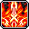
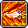
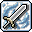
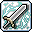
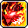
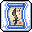
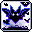
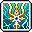
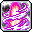

# 📚 รวมสกิลทุกอาชีพ (คลาส 1 - 5)

รวบรวมข้อมูลสกิลของทุกอาชีพใน **Clover Idle Story (KMS v232.2)** อย่างละเอียดครบถ้วนทั้ง **50 อาชีพ** ตั้งแต่ **คลาส 1 ถึง คลาส 5 (5th Job V-Matrix)** พร้อมภาพไอคอนสกิลแท้, ค่าดาเมจเปอร์เซ็นต์ (Damage %), จำนวนครั้งที่โจมตี (Hit), คูลดาวน์ (Cooldown), และจำนวนเป้าหมายสูงสุด เพื่อใช้เป็นคู่มืออ้างอิงสำหรับการอัปเกรดตัวละครและการจัดปุ่มสกิลบอทอัตโนมัติ (`@bot` / `@autoplay`)

> 💡 **หมายเหตุเกี่ยวกับค่าดาเมจและสเตตัสในตาราง:**
>
> * ค่า **ดาเมจ (%)**, **จำนวน Hit**, และ **คูลดาวน์** ทั้งหมดในตารางนี้ คำนวณที่ **เลเวลสูงสุด (Max Level)** ของแต่ละสกิลตามข้อมูลจริงในไฟล์เกม Client WZ
>   * **คลาส 1 - 3:** คำนวณที่ Max Level ของแต่ละสกิล (เวล 10 - 20)
>   * **คลาส 4:** คำนวณที่ Max Level 30 (อัป Master Book เต็ม)
>   * **Hyper Skills:** คำนวณที่ Max Level 1
>   * **คลาส 5 (V-Matrix):** คำนวณที่ Node Level 25 - 30 (เลเวลเมทริกซ์เต็ม)
> * ผู้เล่นจึงสามารถใช้เป็นค่าอ้างอิงของพลังทำลายล้างสูงสุดจริงของแต่ละสกิลได้ทันที

***

## 🧭 สารบัญด่วนเลือกดูตามสายอาชีพ (Quick Navigation)

* [🛡️ สายนักรบ (13 อาชีพ)](./#-1-สายนักรบ-warriors---13-อาชีพ)
* [🔮 สายนักเวท (12 อาชีพ)](./#-2-สายนักเวท-magicians---12-อาชีพ)
* [🏹 สายนักธนู (7 อาชีพ)](./#-3-สายนักธนู-archers---7-อาชีพ)
* [🗡️ สายโจร (8 อาชีพ)](./#-4-สายโจร-thieves---8-อาชีพ)
* [⚓ สายโจรสลัด (10 อาชีพ)](./#-5-สายโจรสลัด-pirates---10-อาชีพ)

***

## 🛡️ 1. สายนักรบ (Warriors - 13 อาชีพ)

**สายนักรบมีทั้งหมด 13 อาชีพ ได้แก่:**

1. [Hero (ฮีโร่) (Explorer)](./#1-hero-ฮีโร่-explorer)
2. [Paladin (พาลาดิน) (Explorer)](./#2-paladin-พาลาดิน-explorer)
3. [Dark Knight (ดาร์กไนท์) (Explorer)](./#3-dark-knight-ดาร์กไนท์-explorer)
4. [Dawn Warrior (ดอว์น วอริเออร์) (Cygnus Knights)](./#4-dawn-warrior-ดอว์น-วอริเออร์-cygnus-knights)
5. [Mihile (มิฮาเอล) (Cygnus Knights)](./#5-mihile-มิฮาเอล-cygnus-knights)
6. [Adele (อเดล) (Flora)](./#6-adele-อเดล-flora)
7. [Kaiser (ไคเซอร์) (Nova)](./#7-kaiser-ไคเซอร์-nova)
8. [Demon Slayer (เดมอน สเลเยอร์) (Demon)](./#8-demon-slayer-เดมอน-สเลเยอร์-demon)
9. [Demon Avenger (เดมอน อเวนเจอร์) (Demon)](./#9-demon-avenger-เดมอน-อเวนเจอร์-demon)
10. [Blaster (บลาสเตอร์) (Resistance)](./#10-blaster-บลาสเตอร์-resistance)
11. [Aran (อารัน) (Heroes)](./#11-aran-อารัน-heroes)
12. [Hayato (ฮายาโตะ) (Sengoku)](./#12-hayato-ฮายาโตะ-sengoku)
13. [Zero (ซีโร่ - Alpha & Beta) (Transcendence)](./#13-zero-ซีโร่---alpha-beta-transcendence)

***

### 1. Hero (ฮีโร่) (Explorer)

* **สเตตัสหลัก:** STR | **อาวุธประจำตัว:** ดาบสองมือ / ขวานสองมือ

|                                             ไอคอน                                             |    คลาส    | ชื่อสกิล               | ดาเมจ (%) |   Hit  |    คูลดาวน์    | เป้าหมาย | บทบาท & จุดเด่น                                                      |
| :-------------------------------------------------------------------------------------------: | :--------: | ---------------------- | :-------: | :----: | :------------: | :------: | -------------------------------------------------------------------- |
|           | **คลาส 1** | **Slash Blast**        |    415%   |  1 Hit |   ไม่มี (0s)   |   6 ตัว  | สกิลฟันกวาดระยะประชิดรอบตัว                                          |
|          | **คลาส 2** | **Combo Attack**       |     -     |    -   |   ไม่มี (0s)   |     -    | เปิดใช้งานระบบเก็บลูกแก้วคอมโบเพื่อเพิ่มพลังโจมตี                    |
|            | **คลาส 2** | **Combo Fury**         |    203%   |  2 Hit |      8 วิ      |   8 ตัว  | พุ่งลากมอนสเตอร์เข้ามาฟันพร้อมสะสมคอมโบ                              |
|                 | **คลาส 3** | **Panic**              |   1300%   |  1 Hit |     100 วิ     |   6 ตัว  | ฟาดดาบระเบิดคอมโบ ลดพลังโจมตีศัตรูและตาบอด                           |
|                 | **คลาส 3** | **Shout**              |    250%   |  6 Hit |      10 วิ     |  12 ตัว  | คำรามคลื่นเสียงสตั๊นมอนสเตอร์รอบตัวเป็นวงกว้าง                       |
|           | **คลาส 4** | **Raging Blow**        |    200%   |  7 Hit |   ไม่มี (0s)   |   8 ตัว  | สกิลฟาร์มและโจมตีหลัก ฟันต่อเนื่องรวดเร็ว (ติดคริ 100% ในฮิตสุดท้าย) |
|              | **คลาส 4** | **Puncture**           |    576%   |  4 Hit |      30 วิ     |   8 ตัว  | แทงทะลวงเกราะ ทำให้ศัตรูติดดีบัฟรับดาเมจคริติคอลแรงขึ้น              |
|                | **คลาส 4** | **Enrage**             |     -     |    -   | ไม่มี (Toggle) |   2 ตัว  | เปลี่ยนการโจมตีทั้งหมดเป็นเป้าเดี่ยวเพื่อสังหารบอสอย่างรุนแรง        |
|           |  **Hyper** | **Rising Rage**        |    500%   |  8 Hit |      10 วิ     |  10 ตัว  | สกิลเสาดาบเพลิงทะลวงฟ้า คูลดาวน์สั้น กวาดมอนสเตอร์ทั้งฉาก            |
|          |  **Hyper** | **Cry Valhalla**       |     -     |    -   |     150 วิ     |     -    | ปลุกพลังวัลฮัลลา เพิ่มพลังโจมตีและต้านทานสถานะผิดปกติ 100%           |
|  | **คลาส 5** | **Burning Soul Blade** |     -     |    -   |     180 วิ     |  10 ตัว  | ดาบเพลิงวิญญาณ ปักลงพื้นช่วยโจมตีอัตโนมัติหรือถือฟัน                 |
|         | **คลาส 5** | **Worldreaver**        |    880%   | 14 Hit |      20 วิ     |  15 ตัว  | ผ่ามิติฟันทำลายล้างทั้งหน้าจอ มอบสถานะอมตะชั่วขณะ                    |
|      | **คลาส 5** | **Combo Instinct**     |    440%   |  6 Hit |   ไม่มี (0s)   |   6 ตัว  | ปลดปล่อยสัญชาตญาณดาบฟันรอยแยกมิติโจมตีต่อเนื่อง                      |
|      | **คลาส 5** | **Sword Illusion**     |    275%   |  4 Hit |      30 วิ     |   8 ตัว  | ภาพลวงตาดาบฟันทะลุเกราะอย่างรวดเร็วก่อนระเบิดรอบทิศ                  |

***

### 2. Paladin (พาลาดิน) (Explorer)

* **สเตตัสหลัก:** STR | **อาวุธประจำตัว:** ดาบ / กระบอง

|                                                ไอคอน                                                |    คลาส    | ชื่อสกิล                     | ดาเมจ (%) |   Hit  |  คูลดาวน์  | เป้าหมาย | บทบาท & จุดเด่น                                             |
| :-------------------------------------------------------------------------------------------------: | :--------: | ---------------------------- | :-------: | :----: | :--------: | :------: | ----------------------------------------------------------- |
|                 | **คลาส 1** | **Slash Blast**              |    415%   |  1 Hit | ไม่มี (0s) |   6 ตัว  | สกิลฟันกวาดระยะประชิดรอบตัว                                 |
|                | **คลาส 2** | **Flame Charge**             |    160%   |  3 Hit |    8 วิ    |   4 ตัว  | เคลือบอาวุธด้วยธาตุไฟ เผาไหม้เป้าหมายต่อเนื่อง              |
|             | **คลาส 2** | **Blizzard Charge**          |    160%   |  3 Hit |    8 วิ    |   4 ตัว  | เคลือบอาวุธด้วยธาตุน้ำแข็ง ชะลอความเร็วศัตรู                |
|            | **คลาส 3** | **Lightning Charge**         |    280%   |  3 Hit |    8 วิ    |   6 ตัว  | เคลือบอาวุธด้วยสายฟ้า สตั๊นและโจมตีสายฟ้าฟาด                |
|                    | **คลาส 3** | **Threaten**                 |     -     |    -   |   260 วิ   |     -    | คำรามข่มขวัญ ลดพลังป้องกัน (DEF) และพลังโจมตีของบอส         |
|               | **คลาส 4** | **Divine Charge**            |    454%   |  3 Hit |    10 วิ   |   6 ตัว  | เคลือบอาวุธด้วยพลังศักดิ์สิทธิ์ กวาดมอนสเตอร์วงกว้างมาก     |
|                       | **คลาส 4** | **Blast**                    |    285%   |  9 Hit | ไม่มี (0s) |   1 ตัว  | สกิลแทงบอสเดี่ยว 9 Hit รุนแรงที่สุด พร้อมรับบัฟพลังป้องกัน  |
|        | **คลาส 4** | **Heaven's Hammer**          |    570%   |  8 Hit |    15 วิ   |  15 ตัว  | ค้อนยักษ์จากสวรรค์ฟาดทำลายมอนสเตอร์ทั้งจอ                   |
|                |  **Hyper** | **Smite Shield**             |    500%   |  6 Hit |   120 วิ   |  15 ตัว  | ปาโล่แสงศักดิ์สิทธิ์ บังคับติดสถานะ Bind หยุดบอส 10 วินาที  |
|               |  **Hyper** | **Sacrosanctity**            |     -     |    -   |   300 วิ   |     -    | ร่างศักดิ์สิทธิ์อมตะ 100% ไม่รับดาเมจใดๆ เป็นเวลา 30 วินาที |
|               | **คลาส 5** | **Divine Echo**              |    680%   |  6 Hit |    75 วิ   |   8 ตัว  | สะท้อนสกิลทั้งหมดไปยังเพื่อนในปาร์ตี้เพื่อช่วยทำดาเมจ       |
|  | **คลาส 5** | **Hammers of the Righteous** |   1155%   |  3 Hit |    60 วิ   |   8 ตัว  | ค้อนศักดิ์สิทธิ์ 3 อันหมุนรอบตัวกวาดมอนสเตอร์รอบทิศ         |
|               | **คลาส 5** | **Grand Cross**              |    385%   | 12 Hit |   150 วิ   |  12 ตัว  | กางเขนแสงศักดิ์สิทธิ์ขนาดยักษ์ระเบิดดาเมจมหาศาล             |
|            | **คลาส 5** | **Mighty Mjolnir**           |    495%   |  6 Hit | ไม่มี (0s) |   4 ตัว  | ปาค้อนมยอลเนียร์สายฟ้า เด้งทะลวงไปมาระหว่างศัตรู            |

***

### 3. Dark Knight (ดาร์กไนท์) (Explorer)

* **สเตตัสหลัก:** STR | **อาวุธประจำตัว:** หอก / โพลอาร์ม

|                                              ไอคอน                                              |    คลาส    | ชื่อสกิล                | ดาเมจ (%) |   Hit  |  คูลดาวน์  | เป้าหมาย | บทบาท & จุดเด่น                                        |
| :---------------------------------------------------------------------------------------------: | :--------: | ----------------------- | :-------: | :----: | :--------: | :------: | ------------------------------------------------------ |
|             | **คลาส 1** | **Slash Blast**         |    415%   |  1 Hit | ไม่มี (0s) |   6 ตัว  | สกิลฟันกวาดระยะประชิดรอบตัว                            |
|          | **คลาส 2** | **Piercing Drive**      |    221%   |  2 Hit | ไม่มี (0s) |   8 ตัว  | แทงหอกทะลวงมอนสเตอร์ด้านหน้าอย่างรวดเร็ว               |
|         | **คลาส 3** | **La Mancha Spear**     |    161%   |  1 Hit |    8 วิ    |  10 ตัว  | ควงหอกกังหันลมต่อเนื่องรอบทิศทาง                       |
|             | **คลาส 3** | **Cross Surge**         |     -     |    -   |   260 วิ   |     -    | บัฟเพิ่มพลังโจมตีตามสัดส่วน HP ที่มีอยู่สูงสุด         |
|             | **คลาส 4** | **Dark Impale**         |    280%   |  7 Hit | ไม่มี (0s) |   8 ตัว  | แทงหอกความมืดวงกว้างและรวดเร็ว สกิลฟาร์มหลัก           |
|  | **คลาส 4** | **Gungnir's Descent**   |    225%   | 12 Hit |    8 วิ    |   1 ตัว  | ทวนกุงเนียร์ตกจากฟ้า สกิลโจมตีบอสเดี่ยวอันทรงพลัง      |
|               | **คลาส 4** | **Sacrifice**           |     -     |    -   |    70 วิ   |     -    | สละวิญญาณแห่งความมืดเพื่อขจัดคูลดาวน์ของ Gungnir       |
|          |  **Hyper** | **Dark Synthesis**      |    330%   | 10 Hit |    10 วิ   |  10 ตัว  | ระเบิดคลื่นพลังมืดกวาดล้างศัตรูทั้งหน้าจอ              |
|             |  **Hyper** | **Dark Thirst**         |     -     |    -   |   120 วิ   |     -    | กระหายเลือด เพิ่มพลังโจมตีสูงมากและดูดเลือดทุกการโจมตี |
|     | **คลาส 5** | **Spear of Darkness**   |    715%   |  7 Hit |    10 วิ   |  12 ตัว  | พุ่งหอกยักษ์แห่งความมืด ทะลวงมอนสเตอร์เป็นทางยาว       |
|          | **คลาส 5** | **Radiant Evil**        |    130%   |  6 Hit |    20 วิ   |  10 ตัว  | เสาดำแห่งความมืดกลืนกินพื้นดิน ทำดาเมจต่อเนื่อง        |
|   | **คลาส 5** | **Calamitous Cyclones** |    880%   | 12 Hit |   180 วิ   |  12 ตัว  | พายุหมุนเคียวแห่งความตาย ดึงมอนสเตอร์เข้ามารับดาเมจ    |
|         | **คลาส 5** | **Darkness Aura**       |    550%   |  9 Hit | ไม่มี (0s) |   6 ตัว  | ออร่าความมืดสะสมพลังและระเบิดสร้างดาเมจรอบตัว          |

***

### 4. Dawn Warrior (ดอว์น วอริเออร์) (Cygnus Knights)

* **สเตตัสหลัก:** STR | **อาวุธประจำตัว:** ดาบสองมือ

|                                             ไอคอน                                            |    คลาส    | ชื่อสกิล              | ดาเมจ (%) |  Hit  |  คูลดาวน์  | เป้าหมาย | บทบาท & จุดเด่น                                     |
| :------------------------------------------------------------------------------------------: | :--------: | --------------------- | :-------: | :---: | :--------: | :------: | --------------------------------------------------- |
|        | **คลาส 1** | **Triple Slash**      |    240%   |   -   |   400 วิ   |     -    | ฟันดาบ 3 จังหวะไปด้านหน้า                           |
|                                         RwuUfnlrK28c                                         | **คลาส 2** | **Moon Strike**       |     -     |   -   |      -     |     -    | ฟันดาบจันทราลอยตัวขึ้นสู่ท้องฟ้า                    |
|         | **คลาส 3** | **Moon Shadow**       |     -     |   -   | ไม่มี (0s) |     -    | ควงดาบจันทร์เสี้ยวกวาดมอนสเตอร์รอบตัว               |
|        | **คลาส 4** | **Lunar Divide**      |    295%   | 6 Hit | ไม่มี (0s) |   7 ตัว  | ฟันดาบจันทร์ดับวงกว้างมาก เคลียร์มอนสเตอร์ยอดเยี่ยม |
|         | **คลาส 4** | **Solar Slash**       |    295%   | 6 Hit | ไม่มี (0s) |   7 ตัว  | ฟันดาบสุริยันระเบิดไฟอย่างรวดเร็ว                   |
|       | **คลาส 4** | **Cosmic Shower**     |    240%   | 6 Hit |    5 วิ    |   7 ตัว  | เรียกอุกกาบาตดาวตกลงมาสร้างอาณาเขตทำดาเมจ           |
|        |  **Hyper** | **Cosmic Burst**      |    160%   | 5 Hit |    20 วิ   |  15 ตัว  | ระเบิดอัญมณีจักรวาลสร้างความเสียหายรอบทิศทาง        |
|          |  **Hyper** | **Soul Forge**        |     -     |   -   |   180 วิ   |     -    | หลอมรวมจิตวิญญาณแห่งดาบ เพิ่มดาเมจและพลังโจมตี      |
|    | **คลาส 5** | **Celestial Dance**   |     -     |   -   |   180 วิ   |     -    | ระบำสุริยันจันทรา โจมตีประสานเงาทั้งสองขั้ว         |
|  | **คลาส 5** | **Rift of Damnation** |   1150%   | 6 Hit |   180 วิ   |  15 ตัว  | ฟันรอยแยกมิติแห่งจักรวาล ฟาดฟันมอนสเตอร์ทั้งจอ      |
|       | **คลาส 5** | **Soul Eclipse**      |    990%   | 7 Hit |   180 วิ   |  15 ตัว  | สุริยุปราคาบดบังท้องฟ้าและระเบิดคลื่นแสงสุริยัน     |
|        | **คลาส 5** | **Flare Slash**       |     -     |   -   |    25 วิ   |     -    | ดาบสุริยเพลิงปะทุอัตโนมัติทุกครั้งที่โจมตี          |

***

### 5. Mihile (มิฮาเอล) (Cygnus Knights)

* **สเตตัสหลัก:** STR | **อาวุธประจำตัว:** ดาบมือเดียว + โล่ Soul Shield

|                                            ไอคอน                                            |    คลาส    | ชื่อสกิล              | ดาเมจ (%) |   Hit  |  คูลดาวน์  | เป้าหมาย | บทบาท & จุดเด่น                                      |
| :-----------------------------------------------------------------------------------------: | :--------: | --------------------- | :-------: | :----: | :--------: | :------: | ---------------------------------------------------- |
|        | **คลาส 1** | **Royal Guard**       |    390%   |    -   | ไม่มี (0s) |   5 ตัว  | ยกโล่เคาน์เตอร์ดาเมจสวนกลับ 100% พร้อมมอบบัฟอมตะ     |
|     | **คลาส 2** | **Radiant Driver**    |    673%   |  1 Hit | ไม่มี (0s) |   6 ตัว  | พุ่งแทงโล่ผลักมอนสเตอร์เป็นกลุ่มไปข้างหน้า           |
|            | **คลาส 3** | **Trinity**           |     -     |    -   |    60 วิ   |  10 ตัว  | แทงดาบแสงศักดิ์สิทธิ์ 3 จังหวะต่อเนื่อง              |
|      | **คลาส 4** | **Radiant Cross**     |    210%   | 11 Hit |    10 วิ   |   2 ตัว  | ดาบกางเขนแสงขนาดใหญ่ ฟันกวาดทั้งหน้าจอ สกิลฟาร์มหลัก |
|      | **คลาส 4** | **Deadly Charge**     |    440%   |  4 Hit |    10 วิ   |   7 ตัว  | เรียกอัศวินพุ่งชนสร้างความเสียหายและบัฟปาร์ตี้       |
|        |  **Hyper** | **Sacred Cube**       |    600%   | 10 Hit |    15 วิ   |  15 ตัว  | ลูกบาศก์แสงศักดิ์สิทธิ์ เสริมพลังป้องกันและดาเมจ     |
|  |  **Hyper** | **Queen of Tomorrow** |     -     |    -   |   180 วิ   |     -    | ขอพรอัศวินแห่งซิกนัส เพิ่มความทนทานต่อดาเมจรุนแรง    |
|   | **คลาส 5** | **Shield of Light**   |     -     |  7 Hit |    12 วิ   |  12 ตัว  | สร้างกำแพงโล่แสงศักดิ์สิทธิ์ปกป้องเพื่อนทั้งปาร์ตี้  |
|    | **คลาส 5** | **Sword of Light**    |   2200%   |  6 Hit | ไม่มี (0s) |  12 ตัว  | ดาบแห่งแสงฟาดลงมาทำลายล้างมอนสเตอร์รอบตัว            |
|      | **คลาส 5** | **Radiant Soul**      |   1870%   |  8 Hit |   120 วิ   |   8 ตัว  | ปลดปล่อยวิญญาณแห่งแสง เพิ่มระยะดาบ Radiant Cross     |
|  | **คลาส 5** | **Light of Courage**  |     -     |    -   | ไม่มี (0s) |     -    | แสงแห่งความกล้าหาญ บัฟพลังโจมตีและเพิ่มดาเมจปาร์ตี้  |

***

### 6. Adele (อเดล) (Flora)

* **สเตตัสหลัก:** STR | **อาวุธประจำตัว:** Bladecaster (ดาบลอย)

|                                           ไอคอน                                           |    คลาส    | ชื่อสกิล           | ดาเมจ (%) |  Hit  |  คูลดาวน์  | เป้าหมาย | บทบาท & จุดเด่น                                          |
| :---------------------------------------------------------------------------------------: | :--------: | ------------------ | :-------: | :---: | :--------: | :------: | -------------------------------------------------------- |
|           | **คลาส 1** | **Plain**          |    105%   | 4 Hit | ไม่มี (0s) |   5 ตัว  | ฟันดาบอีเธอร์พื้นฐานไปด้านหน้า                           |
|        | **คลาส 2** | **Puncture**       |    90%    | 8 Hit | ไม่มี (0s) |   6 ตัว  | แทงดาบพุ่งทะลวงกลุ่มศัตรู                                |
|           | **คลาส 3** | **Cross**          |    240%   | 6 Hit | ไม่มี (0s) |   6 ตัว  | ฟันดาบกากบาทอีเธอร์วงกว้าง                               |
|  | **คลาส 3** | **Hunting Decree** |    260%   | 2 Hit | ไม่มี (0s) |   1 ตัว  | สั่งดาบอีเธอร์ลอยบินไล่ล่าโจมตีมอนสเตอร์ทั่วแมพ          |
|          | **คลาส 4** | **Cleave**         |    375%   | 6 Hit | ไม่มี (0s) |   7 ตัว  | ดาบยักษ์ฟันกวาดหน้าจอรุนแรง สกิลฟาร์มและบอสหลัก          |
|           | **คลาส 4** | **Grave**          |    600%   | 6 Hit | ไม่มี (0s) |   6 ตัว  | สลักดาบผนึกเป้าหมายบอส เพิ่มดาเมจจากดาบลอยทั้งหมด        |
|                                        of4fHbK6jIbI                                       |  **Hyper** | **Shardbreaker**   |     -     |   -   |      -     |     -    | ระเบิดเศษผลึกดาบอีเธอร์สร้างความเสียหายทั่วจอ            |
|                                        0ot6Ns4DsBWS                                       |  **Hyper** | **Legacy**         |     -     |   -   |      -     |     -    | ปลดปล่อยสายเลือดขุนนาง ฟื้นฟูเกจ Ether เต็มทันที         |
|            | **คลาส 5** | **Ruin**           |    550%   | 6 Hit |    60 วิ   |  15 ตัว  | ดาบโบราณยักษ์ตกลงมาจากฟากฟ้า ระเบิดดาเมจมหาศาล           |
|        | **คลาส 5** | **Infinity**       |    550%   | 6 Hit | ไม่มี (0s) |  15 ตัว  | เสกดงดาบอีเธอร์นับร้อยเล่มพุ่งกระหน่ำโจมตีรอบตัว         |
|         | **คลาส 5** | **Restore**        |    990%   | 9 Hit | ไม่มี (0s) |  15 ตัว  | เปิดมิติฟื้นฟูอีเธอร์ สร้างออร่าดาเมจและเพิ่มจำนวนดาบบิน |
|           | **คลาส 5** | **Storm**          |    550%   | 2 Hit |    90 วิ   |   7 ตัว  | สั่งดาบบินทั้งหมดหมุนวนเป็นพายุตัดรอบตัวอเดล             |

***

### 7. Kaiser (ไคเซอร์) (Nova)

* **สเตตัสหลัก:** STR | **อาวุธประจำตัว:** ดาบสองมือ

|                                            ไอคอน                                            |    คลาส    | ชื่อสกิล             | ดาเมจ (%) |   Hit  |  คูลดาวน์  | เป้าหมาย | บทบาท & จุดเด่น                                            |
| :-----------------------------------------------------------------------------------------: | :--------: | -------------------- | :-------: | :----: | :--------: | :------: | ---------------------------------------------------------- |
|        | **คลาส 1** | **Flame Surge**      |    80%    |  3 Hit | ไม่มี (0s) |   8 ตัว  | ยิงคลื่นดาบเพลิงมังกรไปข้างหน้า                            |
|                                         fMN3OGk8WnKU                                        | **คลาส 2** | **Tempest Blades**   |     -     |    -   |      -     |     -    | เสกดาบมังกร 3 เล่มบินหมุนรอบตัว                            |
|                                         NUQPF4uNq0ym                                        | **คลาส 3** | **Wingbeat**         |     -     |    -   |      -     |     -    | ปล่อยพายุปีกมังกรหมุนปั่นมอนสเตอร์ต่อเนื่อง                |
|        | **คลาส 4** | **Blade Burst**      |    380%   |  5 Hit | ไม่มี (0s) |  12 ตัว  | ระเบิดดาบมังกร 6 เล่มกวาดรอบทิศ สกิลฟาร์มหลัก              |
|         | **คลาส 4** | **Gigas Wave**       |    330%   |  9 Hit |    3 วิ    |   1 ตัว  | ฟันคลื่นดาบมังกร 9 Hit รัวใส่เป้าหมายเดียวสำหรับบอส        |
|         | **คลาส 4** | **Final Form**       |     -     |    -   |    60 วิ   |     -    | แปลงร่างเป็นนักรบมังกรขั้นสูงสุด เพิ่มพลังโจมตีและความเร็ว |
|         |  **Hyper** | **Prominence**       |   1000%   | 15 Hit |    60 วิ   |  15 ตัว  | เรียกพญามังกรเพลิงเผาผลาญศัตรูทั้งหน้าจอ                   |
|       |  **Hyper** | **Final Trance**     |     -     |    -   |   300 วิ   |     -    | แปลงร่าง Final Form ทันทีโดยไม่ต้องสะสม Morph Gauge        |
|  | **คลาส 5** | **Guardian of Nova** |    990%   |  5 Hit | ไม่มี (0s) |  10 ตัว  | เรียกวิญญาณ 3 อดีตไคเซอร์ออกมาช่วยฟาดฟัน                   |
|       | **คลาส 5** | **Draco Surge**      |    650%   | 10 Hit |    5 วิ    |   8 ตัว  | ฟันคลื่นพลังมังกรเพลิงพุ่งทะลุหน้าจออย่างทรงพลัง           |
|        | **คลาส 5** | **Dragonfall**       |    650%   | 12 Hit |    5 วิ    |   8 ตัว  | มังกรอัศวินดิ่งลงมาจากฟากฟ้ากระแทกพื้นทลายโลก              |
|         | **คลาส 5** | **Bladefall**        |    825%   |  5 Hit | ไม่มี (0s) |  10 ตัว  | ดาบยักษ์ปักลงพื้นสร้างเพลิงมังกรระเบิดต่อเนื่อง            |

***

### 8. Demon Slayer (เดมอน สเลเยอร์) (Demon)

* **สเตตัสหลัก:** STR | **อาวุธประจำตัว:** กระบองมือเดียว / ขวานมือเดียว

|                                                ไอคอน                                                |    คลาส    | ชื่อสกิล                      | ดาเมจ (%) |   Hit  |  คูลดาวน์  | เป้าหมาย | บทบาท & จุดเด่น                                             |
| :-------------------------------------------------------------------------------------------------: | :--------: | ----------------------------- | :-------: | :----: | :--------: | :------: | ----------------------------------------------------------- |
|                | **คลาส 1** | **Demon Slash**               |    130%   |  3 Hit | ไม่มี (0s) |   8 ตัว  | การโจมตีพื้นฐานสะสม Demon Force (DF)                        |
|                 | **คลาส 2** | **Soul Eater**                |    140%   |  5 Hit | ไม่มี (0s) |   8 ตัว  | กลืนกินวิญญาณ ดึงมอนสเตอร์เข้ามาทำดาเมจ                     |
|                  | **คลาส 3** | **Judgement**                 |    220%   |  5 Hit | ไม่มี (0s) |  10 ตัว  | ตัดสินโทษบาป ฟาดดาบปีศาจกวาดรอบตัว                          |
|  | **คลาส 4** | **Demon Infernal Concussion** |    400%   |  1 Hit | ไม่มี (0s) |  10 ตัว  | ทุบพื้นระเบิดเสาเพลิงปีศาจกว้างทั้งจอ สกิลฟาร์มหลัก         |
|               | **คลาส 4** | **Demon Impact**              |    460%   |  6 Hit |    3 วิ    |   4 ตัว  | กระแทกตราปีศาจ ดาเมจคริ 100% เจาะเกราะบอส                   |
|             |  **Hyper** | **Cerberus Chomp**            |    450%   |  6 Hit |    5 วิ    |   8 ตัว  | เรียกหมาสามหัวเคอร์เบรอสกัดขย้ำ ฟื้นฟูเกจ DF เต็ม           |
|                 |  **Hyper** | **Blue Blood**                |     -     |    -   |   120 วิ   |     -    | เลือดสีน้ำเงิน เพิ่มการโจมตีซ้ำเป็นสองเท่า (Shadow Partner) |
|           | **คลาส 5** | **Demon Awakening**           |   2400%   |  3 Hit |   150 วิ   |  10 ตัว  | ปลุกพลังปีศาจขั้นสูงสุด เสริมพลัง Demon Slash ติดคริ 100%   |
|            | **คลาส 5** | **Spirit of Rage**            |   1210%   |  7 Hit | ไม่มี (0s) |  10 ตัว  | อสูรปีศาจแห่งความโกรธแค้น ปักหลักช่วยโจมตีอัตโนมัติ         |
|                   | **คลาส 5** | **Orthrus**                   |    660%   | 15 Hit | ไม่มี (0s) |  12 ตัว  | เรียกสองอสูรเนเทอร์ ออกมาช่วยโจมตีทุกครั้งที่ฟัน            |
|                | **คลาส 5** | **Demon Bane**                |    990%   |  5 Hit | ไม่มี (0s) |  15 ตัว  | ปล่อยคลื่นลำแสงปีศาจทำลายล้าง พร้อมสถานะอมตะสมบูรณ์         |

***

### 9. Demon Avenger (เดมอน อเวนเจอร์) (Demon)

* **สเตตัสหลัก:** HP | **อาวุธประจำตัว:** Desperado

|                                               ไอคอน                                               |    คลาส    | ชื่อสกิล                    | ดาเมจ (%) |  Hit  |  คูลดาวน์  | เป้าหมาย | บทบาท & จุดเด่น                                       |
| :-----------------------------------------------------------------------------------------------: | :--------: | --------------------------- | :-------: | :---: | :--------: | :------: | ----------------------------------------------------- |
|     | **คลาส 1** | **Exceed: Double Slash**    |    250%   | 2 Hit | ไม่มี (0s) |   8 ตัว  | ฟันดาบสองจังหวะเข้าสู่สถานะคลั่ง                      |
|  | **คลาส 2** | **Exceed: Moonlight Slash** |    145%   | 4 Hit | ไม่มี (0s) |  10 ตัว  | ฟันดาบจันทร์เสี้ยวรอบตัวอย่างรวดเร็ว                  |
|        | **คลาส 3** | **Exceed: Execution**       |    350%   | 3 Hit | ไม่มี (0s) |  10 ตัว  | เชือดเฉือนเป้าหมายเดี่ยวอย่างรุนแรงเจาะเกราะ          |
|            | **คลาส 4** | **Nether Shield**           |    500%   | 2 Hit |    6 วิ    |   2 ตัว  | ปาโล่ปีศาจ 2 อัน เด้งชิ่งไปมาทั่วหน้าจอ               |
|             | **คลาส 4** | **Nether Slice**            |    540%   | 4 Hit | ไม่มี (0s) |   2 ตัว  | ดาบตัดผ่านมิติ ลด DEF ของเป้าหมายลง                   |
|          |  **Hyper** | **Thousand Swords**         |    500%   | 8 Hit |    8 วิ    |  14 ตัว  | ดาบนับพันเล่มผุดขึ้นจากพื้น ทำลายล้างมอนสเตอร์ทั้งจอ  |
|        |  **Hyper** | **Demonic Fortitude**       |     -     |   -   |    75 วิ   |     -    | ปลุกความมุ่งมั่นแห่งปีศาจ เพิ่ม Max Damage            |
|          | **คลาส 5** | **Demonic Frenzy**          |    450%   | 6 Hit |   120 วิ   |   8 ตัว  | สร้างหนองเลือดปีศาจบนพื้น ทำดาเมจมหาศาลแลกกับการลด HP |
|           | **คลาส 5** | **Demonic Blast**           |    990%   | 5 Hit | ไม่มี (0s) |   4 ตัว  | ชาร์จพลังดาบโลหิตปล่อยคลื่นระเบิดดาเมจทะลุจอ          |
|                                            eZbYtfphAhC6                                           | **คลาส 5** | **Dimensional Sword**       |     -     |   -   |      -     |     -    | ดาบมิติหมุนรอบตัว ฟาดฟันต่อเนื่องรอบทิศทาง            |
|                | **คลาส 5** | **Revenant**                |    385%   | 6 Hit |    15 วิ   |   9 ตัว  | เข้าสู่ร่างผีดิบ ป้องกันการตายจากดาเมจทุกชนิด 100%    |

***

### 10. Blaster (บลาสเตอร์) (Resistance)

* **สเตตัสหลัก:** STR | **อาวุธประจำตัว:** Arm Cannon

|                                                ไอคอน                                               |    คลาส    | ชื่อสกิล                    | ดาเมจ (%) |   Hit  |  คูลดาวน์  | เป้าหมาย | บทบาท & จุดเด่น                                     |
| :------------------------------------------------------------------------------------------------: | :--------: | --------------------------- | :-------: | :----: | :--------: | :------: | --------------------------------------------------- |
|              | **คลาส 1** | **Magnum Punch**            |    85%    |  3 Hit | ไม่มี (0s) |   6 ตัว  | ชกหมัดปืนใหญ่ทะลวงด้านหน้า                          |
|          | **คลาส 2** | **Revolving Cannon**        |    150%   |  4 Hit | ไม่มี (0s) |   6 ตัว  | ยิงกระสุนปืนกลเสริมพลังหมัด                         |
|              | **คลาส 3** | **Hammer Smash**            |    230%   |  6 Hit | ไม่มี (0s) |   8 ตัว  | ทุบพื้นสร้างคลื่นกระแทกต่อเนื่อง                    |
|             | **คลาส 4** | **Shotgun Punch**           |    265%   |  6 Hit | ไม่มี (0s) |   6 ตัว  | หมัดลูกซองระเบิดแรงผลักมอนสเตอร์ สกิลฟาร์มหลัก      |
|                                            9uTMk4SJj5uF                                            | **คลาส 4** | **Bunker Buster**           |     -     |    -   |      -     |     -    | ยิงเจาะเกราะทะลวงทำดาเมจมหาศาลใส่บอส                |
|        |  **Hyper** | **Hyper Magnum Punch**      |    500%   | 15 Hit |   120 วิ   |  15 ตัว  | ชาร์จหมัดยักษ์พุ่งกระแทกมอนสเตอร์ทั้งฉาก            |
|          |  **Hyper** | **Cannon Overdrive**        |     -     |    -   |   240 วิ   |     -    | รีโหลดกระสุนปืนใหญ่อัตโนมัติ เพิ่มพลังระเบิด        |
|  | **คลาส 5** | **Bunker Buster Explosion** |   1430%   | 12 Hit | ไม่มี (0s) |  15 ตัว  | ติดตั้งปืนใหญ่อัตโนมัติระเบิดเจาะเกราะทุกครั้งที่ชก |
|            | **คลาส 5** | **Gatling Punch**           |   1100%   |  7 Hit |    10 วิ   |   8 ตัว  | รัวหมัดปืนกลนับสิบฮิตต่อเนื่องอย่างบ้าคลั่ง         |
|           | **คลาส 5** | **Bullet Barrage**          |    650%   |  8 Hit | ไม่มี (0s) |   8 ตัว  | หมุนตัวกราดยิงกระสุนปืนใหญ่รอบทิศทาง                |
|         | **คลาส 5** | **Afterimage Shock**        |    385%   |  9 Hit |    15 วิ   |   4 ตัว  | คลื่นกระแทกภาพติดตาตามติดทุกการโจมตี                |

***

### 11. Aran (อารัน) (Heroes)

* **สเตตัสหลัก:** STR | **อาวุธประจำตัว:** โพลอาร์ม (Polearm)

|                                             ไอคอน                                             |    คลาส    | ชื่อสกิล             | ดาเมจ (%) |  Hit  |  คูลดาวน์  | เป้าหมาย | บทบาท & จุดเด่น                                         |
| :-------------------------------------------------------------------------------------------: | :--------: | -------------------- | :-------: | :---: | :--------: | :------: | ------------------------------------------------------- |
|                                          e38RJu0BHEdK                                         | **คลาส 1** | **Smash Wave**       |    500%   | 1 Hit |    3 วิ    |   6 ตัว  | ฟาดง้าวปล่อยคลื่นพลังกระแทก                             |
|                                          umw3vDo9ZJyB                                         | **คลาส 2** | **Final Toss**       |    950%   | 1 Hit | ไม่มี (0s) |   6 ตัว  | เสยง้าวผลักมอนสเตอร์ลอยขึ้นฟ้า                          |
|                                          WMNYbiGAgXRc                                         | **คลาส 3** | **Aero Swing**       |    350%   | 2 Hit | ไม่มี (0s) |   8 ตัว  | ควงง้าวกลางอากาศกวาดมอนสเตอร์รอบตัว                     |
|                                          EwI625DOH0kb                                         | **คลาส 4** | **Beyond Blade**     |    315%   | 5 Hit | ไม่มี (0s) |   8 ตัว  | ฟาดง้าวต่อเนื่อง 3 จังหวะพลังทำลายล้างสูงสุด            |
|           | **คลาส 4** | **Final Blow**       |    335%   | 5 Hit | ไม่มี (0s) |   6 ตัว  | ฟาดง้าวกระแทกพื้นเปิดทางสู่คอมโบ Beyond Blade           |
|                                          yB80K68XsOkK                                         |  **Hyper** | **Maha's Domain**    |    800%   | 5 Hit |   150 วิ   |  15 ตัว  | ทุบง้าวมาฮาลงพื้นสร้างความเสียหายวงกว้างมาก             |
|                                          Orr21Cyko3MT                                         |  **Hyper** | **Adrenaline Burst** |     -     |   -   |   240 วิ   |     -    | เข้าสู่สถานะ Adrenaline ทันที ดาเมจและระยะสกิลเพิ่มขึ้น |
|  | **คลาส 5** | **Maha's Domain**    |    600%   | 3 Hit | ไม่มี (0s) |   6 ตัว  | ปักง้าวมาฮาขนาดยักษ์ สร้างอาณาเขตฮีลและล้างดีบัฟ        |
|                                          SsvAM95kTVZb                                         | **คลาส 5** | **Maha's Fury**      |    880%   | 5 Hit |   150 วิ   |  10 ตัว  | ปลดปล่อยพลังคลั่งของมาฮา เพิ่มพลังโจมตีและพายุหิมะ      |
|                                          EW6K1NJmt4zk                                         | **คลาส 5** | **Fenrir Crash**     |    550%   | 7 Hit | ไม่มี (0s) |  10 ตัว  | เรียกหมาป่าเฟนรีร์กระโจนฟาดฟันต่อจาก Beyond Blade       |
|    | **คลาส 5** | **Blizzard Tempest** |    880%   | 6 Hit |   180 วิ   |  15 ตัว  | พายุหิมะแช่แข็งศัตรูทั้งหมดและระเบิดดาเมจอย่างรุนแรง    |

***

### 12. Hayato (ฮายาโตะ) (Sengoku)

* **สเตตัสหลัก:** STR | **อาวุธประจำตัว:** คาตานะ (Katana)

|                                                 ไอคอน                                                |    คลาส    | ชื่อสกิล                      | ดาเมจ (%) |   Hit  |  คูลดาวน์  | เป้าหมาย | บทบาท & จุดเด่น                                       |
| :--------------------------------------------------------------------------------------------------: | :--------: | ----------------------------- | :-------: | :----: | :--------: | :------: | ----------------------------------------------------- |
|                 | **คลาส 1** | **Sangetsusen**               |   10000%  |  3 Hit | ไม่มี (0s) |   4 ตัว  | ฟันดาบซามูไร 3 จังหวะ                                 |
|             | **คลาส 2** | **Jin Sangetsusen**           |    220%   |  4 Hit | ไม่มี (0s) |   5 ตัว  | พุ่งฟันดาบวารีผ่ากลุ่มศัตรู                           |
|                   | **คลาส 3** | **Dankuusen**                 |    290%   |  4 Hit | ไม่มี (0s) |   6 ตัว  | พุ่งทะลวงแทงพร้อมดึงศัตรูตามติด                       |
|             | **คลาส 4** | **Rai Sangetsusen**           |    360%   |  4 Hit | ไม่มี (0s) |   8 ตัว  | ฟันดาบสายฟ้าวงกว้างมาก สกิลฟาร์มหลัก                  |
|             | **คลาส 4** | **Hitokiri Strike**           |    500%   |  8 Hit |    90 วิ   |  15 ตัว  | ชักดาบผ่าวิญญาณ การันตีติดคริติคอล 100%               |
|         |  **Hyper** | **Falcon's Honor**            |    500%   |  8 Hit |    8 วิ    |  14 ตัว  | เรียกเหยี่ยวศักดิ์สิทธิ์ถล่มมอนสเตอร์ทั้งฉาก          |
|               |  **Hyper** | **God of Blades**             |     -     |    -   |    90 วิ   |     -    | ปลุกเทพแห่งดาบ เพิ่มพลังโจมตีและ Ignore DEF           |
|            | **คลาส 5** | **Rai Blade Flash**           |   1540%   |  7 Hit |    12 วิ   |  12 ตัว  | ฟันดาบแสงรัว 8 ฮิตอย่างรวดเร็วใส่เป้าหมายเดียว        |
|  | **คลาส 5** | **Battoujutsu Ultimate Will** |   1430%   |  9 Hit |    10 วิ   |   8 ตัว  | ฟันดาบสะสมพลังผ่าวิญญาณ สร้างความเสียหายมหาศาล        |
|     | **คลาส 5** | **Iaijutsu Phantom Blade**    |   3300%   | 15 Hit |   100 วิ   |  12 ตัว  | ชักดาบสะบัดเงารอบทิศทาง เพิ่มบัฟ Final Damage ซ้อนทับ |
|              | **คลาส 5** | **Instant Slice**             |    715%   |  6 Hit | ไม่มี (0s) |   5 ตัว  | ฟันผ่ามิติฉับพลัน เคลียร์มอนสเตอร์ทั้งหน้าจอ          |

***

### 13. Zero (ซีโร่ - Alpha & Beta) (Transcendence)

* **สเตตัสหลัก:** STR | **อาวุธประจำตัว:** Long Sword (Alpha) / Heavy Sword (Beta)

|                                              ไอคอน                                             |    คลาส    | ชื่อสกิล                | ดาเมจ (%) |   Hit  |  คูลดาวน์  | เป้าหมาย | บทบาท & จุดเด่น                                   |
| :--------------------------------------------------------------------------------------------: | :--------: | ----------------------- | :-------: | :----: | :--------: | :------: | ------------------------------------------------- |
|          |  **Alpha** | **Moon Strike**         |    330%   |  6 Hit | ไม่มี (0s) |   6 ตัว  | ฟันดาบยาวลอยตัวพร้อมปล่อยคลื่นจันทรา              |
|        |  **Alpha** | **Pierce Thrust**       |    380%   |  9 Hit | ไม่มี (0s) |   6 ตัว  | แทงดาบยาวพุ่งทะลวงศัตรูอย่างรวดเร็ว               |
|                                          hcfJWbf7zh4r                                          |  **Alpha** | **Wind Cutter**         |     -     |    -   |      -     |     -    | ปล่อยพายุดาบหมุนตัดศัตรูต่อเนื่อง                 |
|          |  **Beta**  | **Upper Slash**         |    250%   |  6 Hit | ไม่มี (0s) |   8 ตัว  | เสยดาบหนักกระแทกศัตรูลอยขึ้นฟ้า                   |
|           |  **Beta**  | **Giga Crash**          |    365%   | 12 Hit |    10 วิ   |   8 ตัว  | ทุบดาบหนักลงพื้นสร้างคลื่นกระแทกยักษ์             |
|          |  **Beta**  | **Earth Break**         |    170%   |  3 Hit |    3 วิ    |   8 ตัว  | ฟาดดาบหนักผ่าปฐพี แตกกระจายเป็นสะเก็ดหิน          |
|          |  **Hyper** | **Shadow Rain**         |    380%   | 10 Hit | ไม่มี (0s) |   6 ตัว  | ฝนดาบเงาตกกระหน่ำ บังคับบอสหยุดนิ่ง (Bind)        |
|         |  **Hyper** | **Chrono Break**        |    335%   |  4 Hit |    3 วิ    |   8 ตัว  | หยุดเวลาทั้งมิติ แช่แข็งบอสพร้อมระเบิดดาเมจมหาศาล |
|  | **คลาส 5** | **Chrono Break Strike** |     -     |    -   | ไม่มี (0s) |     -    | โจมตีประสานมิติเวลา สร้างความเสียหายรุนแรง        |
|         | **คลาส 5** | **Joint Attack**        |   1100%   |  5 Hit |    30 วิ   |     -    | การโจมตีผสานพลังของ Alpha และ Beta ฟาดฟันทั้งจอ   |
|         | **คลาส 5** | **Shadow Flash**        |    650%   |  6 Hit | ไม่มี (0s) |   8 ตัว  | ปักดาบสร้างอาณาเขตมิติและระเบิดสะท้อนดาเมจ        |
|           | **คลาส 5** | **Ego Weapon**          |    370%   | 10 Hit |    10 วิ   |  15 ตัว  | อาวุธมีชีวิต ปลดปล่อยการโจมตีอัตโนมัติตามคอมโบ    |

***

## 🔮 2. สายนักเวท (Magicians - 12 อาชีพ)

**สายนักเวทมีทั้งหมด 12 อาชีพ ได้แก่:**

1. [Arch Mage (Fire/Poison) (นักเวทไฟ/พิษ) (Explorer)](./#14-arch-mage-firepoison-นักเวทไฟพิษ-explorer)
2. [Arch Mage (Ice/Lightning) (นักเวทน้ำแข็ง/สายฟ้า) (Explorer)](./#15-arch-mage-icelightning-นักเวทน้ำแข็งสายฟ้า-explorer)
3. [Bishop (บิชอป) (Explorer)](./#16-bishop-บิชอป-explorer)
4. [Blaze Wizard (เบลซ วิซาร์ด) (Cygnus Knights)](./#17-blaze-wizard-เบลซ-วิซาร์ด-cygnus-knights)
5. [Battle Mage (แบทเทิลเมจ) (Resistance)](./#18-battle-mage-แบทเทิลเมจ-resistance)
6. [Evan (อีวาน) (Heroes)](./#19-evan-อีวาน-heroes)
7. [Luminous (ลูมินัส) (Heroes)](./#20-luminous-ลูมินัส-heroes)
8. [Illium (อิลเลียม) (Flora)](./#21-illium-อิลเลียม-flora)
9. [Lara (ลาร่า) (Anima)](./#22-lara-ลาร่า-anima)
10. [Kinesis (คิเนซิส) (Other)](./#23-kinesis-คิเนซิส-other)
11. [Kanna (คันนะ) (Sengoku)](./#24-kanna-คันนะ-sengoku)
12. [Beast Tamer (บีสต์ เทมเมอร์) (Other)](./#25-beast-tamer-บีสต์-เทมเมอร์-other)

***

### 14. Arch Mage (Fire/Poison) (นักเวทไฟ/พิษ) (Explorer)

* **สเตตัสหลัก:** INT | **อาวุธประจำตัว:** คทา (Wand / Staff)

|                                           ไอคอน                                          |    คลาส    | ชื่อสกิล          | ดาเมจ (%) |   Hit  |  คูลดาวน์  | เป้าหมาย | บทบาท & จุดเด่น                                    |
| :--------------------------------------------------------------------------------------: | :--------: | ----------------- | :-------: | :----: | :--------: | :------: | -------------------------------------------------- |
|      | **คลาส 1** | **Energy Bolt**   |    389%   |    -   | ไม่มี (0s) |   4 ตัว  | ยิงลูกบอลเวทมนตร์โจมตีศัตรู                        |
|        | **คลาส 2** | **Flame Orb**     |    381%   |  2 Hit | ไม่มี (0s) |   6 ตัว  | ลูกบอลเพลิงกลิ้งทะลวงเผาไหม้                       |
|                                       4KrVPCbRu6AV                                       | **คลาส 3** | **Explosion**     |     -     |    -   |      -     |     -    | ระเบิดเพลิงรอบตัว สกิลฟาร์มช่วงกลางเกม             |
|      | **คลาส 3** | **Poison Mist**   |    310%   |    -   |    20 วิ   |     -    | ปล่อยหมอกพิษปกคลุมพื้นที่ สร้างดีบัฟพิษสะสม        |
|         | **คลาส 4** | **Paralyze**      |    220%   |  7 Hit |    5 วิ    |   8 ตัว  | คลื่นพิษอัมพาต โจมตีมอนสเตอร์ด้านหน้าอย่างรวดเร็ว  |
|    | **คลาส 4** | **Mist Eruption** |    315%   | 12 Hit |    45 วิ   |  15 ตัว  | ระเบิดหมอกพิษทั้งหมด สร้างดาเมจมหาศาลตามจำนวนดีบัฟ |
|    | **คลาส 4** | **Meteor Shower** |    125%   | 10 Hit |    10 วิ   |  12 ตัว  | อุกกาบาตเพลิงถล่มจากฟ้า กวาดล้างทั้งหน้าจอ         |
|    |  **Hyper** | **Megiddo Flame** |    420%   | 15 Hit |    50 วิ   |   1 ตัว  | ลูกไฟปีศาจติดตามเป้าหมายเดี่ยว เผาผลาญบอส          |
|       |  **Hyper** | **Fire Auror**    |    400%   |  2 Hit | ไม่มี (0s) |  10 ตัว  | ออร่าเพลิงแผดเผามอนสเตอร์รอบตัวต่อเนื่อง           |
|   | **คลาส 5** | **DoT Punisher**  |     -     |    -   |    30 วิ   |     -    | ปล่อยฝูงลูกไฟเพลิงนรกไล่ล่าศัตรูรอบทิศทาง          |
|    | **คลาส 5** | **Poison Nova**   |   1400%   |  1 Hit |    10 วิ   |   8 ตัว  | ระเบิดวงแหวนฟองพิษขยายตัวรอบทิศทาง                 |
|  | **คลาส 5** | **Fury of Ifrit** |    440%   |  6 Hit |    75 วิ   |  12 ตัว  | อัญเชิญอีฟรีตปล่อยพายุเพลิงแผดเผาอย่างบ้าคลั่ง     |
|   | **คลาส 5** | **Poison Chain**  |    265%   |  4 Hit | ไม่มี (0s) |   8 ตัว  | โซ่พิษเชื่อมโยงมอนสเตอร์ เด้งลามไปทั่วทั้งแผนที่   |

***

### 15. Arch Mage (Ice/Lightning) (นักเวทน้ำแข็ง/สายฟ้า) (Explorer)

* **สเตตัสหลัก:** INT | **อาวุธประจำตัว:** คทา (Wand / Staff)

|                                            ไอคอน                                           |    คลาส    | ชื่อสกิล            | ดาเมจ (%) |   Hit  |  คูลดาวน์  | เป้าหมาย | บทบาท & จุดเด่น                                       |
| :----------------------------------------------------------------------------------------: | :--------: | ------------------- | :-------: | :----: | :--------: | :------: | ----------------------------------------------------- |
|        | **คลาส 1** | **Energy Bolt**     |    389%   |    -   | ไม่มี (0s) |   4 ตัว  | ยิงลูกบอลเวทมนตร์โจมตีศัตรู                           |
|                                        qK9VclMMSu2z                                        | **คลาส 2** | **Cold Beam**       |     -     |    -   |      -     |     -    | แท่งน้ำแข็งตกใส่หัวศัตรู แช่แข็งเป้าหมาย              |
|         | **คลาส 3** | **Ice Strike**      |    415%   |  4 Hit |    8 วิ    |   8 ตัว  | เสาน้ำแข็งผุดขึ้นมารอบตัว กวาดมอนสเตอร์               |
|                                        IxpGKuMuY60D                                        | **คลาส 3** | **Glacier Chain**   |     -     |    -   |      -     |     -    | โซ่น้ำแข็งดึงมอนสเตอร์เข้ามาตรงหน้า                   |
|    | **คลาส 4** | **Chain Lightning** |    185%   | 10 Hit |    4 วิ    |   6 ตัว  | สายฟ้าชิ่งต่อเนื่องข้ามมอนสเตอร์ สกิลฟาร์มราชาแห่งเกม |
|           | **คลาส 4** | **Blizzard**        |    301%   | 12 Hit |    45 วิ   |  15 ตัว  | พายุหิมะถล่มทั้งหน้าจอ พร้อมดาเมจน้ำแข็งตามหลัง       |
|                                        sUnkpJWoxPqO                                        | **คลาส 4** | **Infinity**        |     -     |    -   |      -     |     -    | เพิ่ม Magic ATT และ Final Damage ต่อเนื่องอย่างมหาศาล |
|      |  **Hyper** | **Lightning Orb**   |    150%   | 15 Hit |    60 วิ   |  15 ตัว  | บอลสายฟ้าปล่อยลำแสงไฟฟ้าช็อตบอสอย่างต่อเนื่อง         |
|           |  **Hyper** | **Ice Aura**        |     -     |    -   |    8 วิ    |  15 ตัว  | ออร่าน้ำแข็งปกป้องปาร์ตี้และลดความเร็วศัตรู           |
|          | **คลาส 5** | **Ice Age**         |    850%   |  5 Hit |    25 วิ   |     -    | แช่แข็งพื้นดินทั้งแผนที่ กลายเป็นลานน้ำแข็งทำลายล้าง  |
|     | **คลาส 5** | **Bolt Barrage**    |    650%   |  5 Hit |    10 วิ   |  10 ตัว  | ยิงพายุสายฟ้า 8 ทิศทาง กวาดมอนสเตอร์ทะลุจอ            |
|   | **คลาส 5** | **Spirit of Snow**  |    880%   |  9 Hit |   120 วิ   |  10 ตัว  | เรียกภูตหิมะยักษ์ออกมาช่วยถล่มเวทน้ำแข็ง              |
|  | **คลาส 5** | **Jupiter Thunder** |     -     |    -   |    15 วิ   |     -    | ลูกบอลสายฟ้าจูปิเตอร์ กลิ้งช็อตศัตรูอย่างรุนแรง       |

***

### 16. Bishop (บิชอป) (Explorer)

* **สเตตัสหลัก:** INT | **อาวุธประจำตัว:** คทา (Wand / Staff)

|                                            ไอคอน                                            |    คลาส    | ชื่อสกิล               | ดาเมจ (%) |   Hit  |    คูลดาวน์   | เป้าหมาย | บทบาท & จุดเด่น                                          |
| :-----------------------------------------------------------------------------------------: | :--------: | ---------------------- | :-------: | :----: | :-----------: | :------: | -------------------------------------------------------- |
|         | **คลาส 1** | **Energy Bolt**        |    389%   |    -   |   ไม่มี (0s)  |   4 ตัว  | ยิงลูกบอลเวทมนตร์โจมตีศัตรู                              |
|                | **คลาส 2** | **Heal**               |    490%   |    -   |      4 วิ     |   6 ตัว  | ฟื้นฟูเลือด HP เพื่อนทั้งปาร์ตี้และทำดาเมจ Undead        |
|          | **คลาส 2** | **Holy Arrow**         |     -     |    -   |     600 วิ    |     -    | ศรแสงศักดิ์สิทธิ์ยิงทะลวงมอนสเตอร์                       |
|         | **คลาส 3** | **Shining Ray**        |    304%   |  4 Hit |      6 วิ     |   6 ตัว  | ลำแสงศักดิ์สิทธิ์ส่องลงมาจากฟ้า กวาดศัตรู                |
|         | **คลาส 3** | **Holy Symbol**        |     -     |    -   |     330 วิ    |     -    | บัฟเพิ่มค่า EXP ที่ได้รับสูงสุด 50% สุดยอดบัฟแห่งเกม     |
|            | **คลาส 4** | **Big Bang**           |    405%   | 12 Hit |     45 วิ     |  15 ตัว  | ระเบิดแสงศักดิ์สิทธิ์วงกว้าง สกิลฟาร์มหลักของบิชอป       |
|           | **คลาส 4** | **Angel Ray**          |    225%   |  7 Hit |   ไม่มี (0s)  |   6 ตัว  | ยิงลำแสงเทวทูต ฮีลเพื่อนและทำดาเมจใส่บอสเดี่ยวรัวๆ       |
|             | **คลาส 4** | **Genesis**            |     -     |    -   | 1200-90\*x วิ |     -    | มหาเวทกำเนิดจักรวาล ถล่มทั้งหน้าจอ                       |
|        |  **Hyper** | **Heavens Door**       |   1000%   |  8 Hit |     90 วิ     |  15 ตัว  | ประตูสวรรค์ กวาดมอนสเตอร์ทั้งจอ + บัฟชุบชีวิตฟรี 1 ครั้ง |
|  |  **Hyper** | **Vengeance of Angel** |     -     |    -   |      1 วิ     |   1 ตัว  | แปลงร่างทูตสวรรค์ เพิ่มดาเมจ Angel Ray เพื่อตีบอส        |
|       | **คลาส 5** | **Benediction**        |   1100%   | 10 Hit |     60 วิ     |  15 ตัว  | อาณาเขตสวดมนต์ บัฟ Final Damage และฟื้นฟูทั้งปาร์ตี้     |
|    | **คลาส 5** | **Angel of Libra**     |   1760%   | 12 Hit |   ไม่มี (0s)  |  12 ตัว  | อัญเชิญทูตสวรรค์แห่งความสมดุล ช่วยโจมตีและบัฟดาเมจ       |
|        | **คลาส 5** | **Peacemaker**         |     -     |    -   |     30 วิ     |     -    | ปล่อยคัมภีร์ศักดิ์สิทธิ์ลอยไปด้านหน้าก่อนระเบิดแสง       |
|                                         leI3bc0IC6uG                                        | **คลาส 5** | **Divine Punishment**  |     -     |    -   |       -       |     -    | ลำแสงลงทัณฑ์ศักดิ์สิทธิ์ ยิงเลเซอร์รัวถล่มบอส            |

***

### 17. Blaze Wizard (เบลซ วิซาร์ด) (Cygnus Knights)

* **สเตตัสหลัก:** INT | **อาวุธประจำตัว:** คทา (Wand / Staff)

|                                              ไอคอน                                             |    คลาส    | ชื่อสกิล                | ดาเมจ (%) |  Hit  |  คูลดาวน์  | เป้าหมาย | บทบาท & จุดเด่น                                   |
| :--------------------------------------------------------------------------------------------: | :--------: | ----------------------- | :-------: | :---: | :--------: | :------: | ------------------------------------------------- |
|         | **คลาส 1** | **Orbital Flame**       |    210%   | 1 Hit | ไม่มี (0s) |   4 ตัว  | ลูกแก้วเพลิงหมุนพุ่งไปกลับ โจมตีรัวเร็ว           |
|                                          RihKXVDDKqdx                                          | **คลาส 2** | **Orbital Flame II**    |     -     |   -   |      -     |     -    | อัปเกรดลูกแก้วเพลิง 2 ลูก                         |
|                                          QnkCw2yFh0td                                          | **คลาส 3** | **Orbital Flame III**   |     -     |   -   |      -     |     -    | อัปเกรดลูกแก้วเพลิง 3 ลูกพร้อมกัน                 |
|                                          I98vek1h54Qt                                          | **คลาส 4** | **Orbital Flame IV**    |     -     |   -   |      -     |     -    | ลูกแก้วเพลิงขั้น 4 พุ่ง 4 ลูกรัวๆ สกิลโจมตีหลัก   |
|    | **คลาส 4** | **Blazing Extinction**  |     -     | 3 Hit |    5 วิ    |   8 ตัว  | ดวงอาทิตย์เพลิงลอยไปข้างหน้า เผาผลาญทั้งแมพ       |
|    |  **Hyper** | **Dragon's Fury**       |    500%   | 6 Hit |    90 วิ   |   1 ตัว  | มังกรเพลิงพุ่งลงมาจากฟ้าถล่มศัตรู                 |
|             |  **Hyper** | **Cataclysm**           |    860%   | 7 Hit |   100 วิ   |  15 ตัว  | อุกกาบาตยักษ์ถล่มพื้นโลก พร้อมสถานะอมตะ           |
|      | **คลาส 5** | **Orbital Inferno**     |   1650%   | 6 Hit |    40 วิ   |  15 ตัว  | ลูกแก้วเพลิงยักษ์พุ่งช้าๆ เผาผลาญมอนสเตอร์ทั้งฉาก |
|         | **คลาส 5** | **Savage Flame**        |    550%   | 1 Hit | ไม่มี (0s) |   8 ตัว  | อสูรเพลิงจิ้งจอก ระเบิดพลังไฟรอบทิศทาง            |
|       | **คลาส 5** | **Inferno Sphere**      |   1210%   | 6 Hit | ไม่มี (0s) |   8 ตัว  | ทุ่มลูกบอลเพลิงยักษ์ระเบิดดาเมจมหาศาล             |
|  | **คลาส 5** | **Salamander Mischief** |     -     |   -   |    30 วิ   |     -    | ซาลาแมนเดอร์ไฟลอยโจมตีและเพิ่ม Magic ATT          |

***

### 18. Battle Mage (แบทเทิลเมจ) (Resistance)

* **สเตตัสหลัก:** INT | **อาวุธประจำตัว:** Staff

|                                             ไอคอน                                            |    คลาส    | ชื่อสกิล              | ดาเมจ (%) |   Hit  |  คูลดาวน์  | เป้าหมาย | บทบาท & จุดเด่น                                         |
| :------------------------------------------------------------------------------------------: | :--------: | --------------------- | :-------: | :----: | :--------: | :------: | ------------------------------------------------------- |
|         | **คลาส 1** | **Triple Blow**       |    190%   |  3 Hit | ไม่มี (0s) |   5 ตัว  | ควงคทาฟาด 3 จังหวะ                                      |
|           | **คลาส 2** | **Quad Blow**         |    240%   |  4 Hit | ไม่มี (0s) |   5 ตัว  | ควงคทาฟาด 4 จังหวะรวดเร็ว                               |
|                                         gxrD1wROGcZR                                         | **คลาส 3** | **Finishing Blow**    |     -     |    -   |      -     |     -    | ฟาดคทาจังหวะสุดท้ายสร้างความเสียหายรุนแรง               |
|                                         KzoBdLjiUxXa                                         | **คลาส 4** | **Blow Finish**       |     -     |    -   |      -     |     -    | คอมโบฟาดคทาขั้นสุดยอด สกิลโจมตีหลัก                     |
|                                         fK0ERB2cycj7                                         | **คลาส 4** | **Dark Genesis**      |     -     |    -   |      -     |     -    | เวทความมืดถล่มทั้งหน้าจอ พร้อมลดคูลดาวน์                |
|     |  **Hyper** | **Battle King Bar**   |    650%   |  2 Hit |    13 วิ   |   8 ตัว  | กระบองยักษ์ฟาดกวาดล้างมอนสเตอร์ทั้งจอ                   |
|     |  **Hyper** | **Master of Death**   |     -     |    -   | ไม่มี (0s) |     -    | ปลดปล่อยพลังความตาย เพิ่มดาเมจและออร่า                  |
|         | **คลาส 5** | **Union Aura**        |    600%   |    -   |    50 วิ   |   8 ตัว  | รวมออร่าทั้งหมดเป็นหนึ่งเดียว ฟาดฟันติดเคียวแห่งความตาย |
|  | **คลาส 5** | **Black Magic Altar** |   1100%   |  5 Hit |    90 วิ   |  10 ตัว  | ติดตั้งแท่นบูชามืด เชื่อมโยงสายฟ้าระเบิดดาเมจ           |
|       | **คลาส 5** | **Grim Harvest**      |    295%   | 15 Hit |    25 วิ   |  15 ตัว  | เคียวเก็บเกี่ยวดวงวิญญาณ ฟาดฟันทำลายล้างอัตโนมัติ       |
|  | **คลาส 5** | **Abyssal Lightning** |   1100%   |  8 Hit | ไม่มี (0s) |   6 ตัว  | สายฟ้าแห่งความมืดฟาดกระหน่ำทุกครั้งที่เทเลพอร์ต         |

***

### 19. Evan (อีวาน) (Heroes)

* **สเตตัสหลัก:** INT | **อาวุธประจำตัว:** Wand / Staff

|                                             ไอคอน                                             |    คลาส    | ชื่อสกิล               | ดาเมจ (%) |   Hit  |  คูลดาวน์  | เป้าหมาย | บทบาท & จุดเด่น                                 |
| :-------------------------------------------------------------------------------------------: | :--------: | ---------------------- | :-------: | :----: | :--------: | :------: | ----------------------------------------------- |
|         | **คลาส 1** | **Mana Burst I**       |    190%   |  2 Hit | ไม่มี (0s) |   4 ตัว  | ยิงเวทมนตร์ลูกแก้วมานา                          |
|                                          vyUO2nU7rrgd                                         | **คลาส 2** | **Mana Burst II**      |     -     |    -   |      -     |     -    | ยิงคลื่นมานาระเบิดคู่                           |
|                                          99oKub5400ac                                         | **คลาส 3** | **Mana Burst III**     |     -     |    -   |      -     |     -    | ลำแสงมานาทะลวง 3 สาย                            |
|                                          PsgMg6q6PqSu                                         | **คลาส 4** | **Mana Burst IV**      |     -     |    -   |      -     |     -    | พายุมานา 4 Hit สกิลฟาร์มหลักของอีวาน            |
|                                          2T7Z6G17Sn8C                                         | **คลาส 4** | **Dragon Breath**      |     -     |    -   |      -     |     -    | มังกรพ่นไฟเผาผลาญศัตรูด้านหน้า                  |
|   |  **Hyper** | **Summon Onyx Dragon** |    450%   |  7 Hit |   240 วิ   |  10 ตัว  | เรียกมังกรโอนิกซ์ออกมาช่วยต่อสู้เคียงข้าง       |
|        |  **Hyper** | **Dragon Master**      |    450%   |  7 Hit | ไม่มี (0s) |  10 ตัว  | ขี่หลังมังกรบินพ่นลำแสงเพลิงถล่มทั้งจออย่างอมตะ |
|   | **คลาส 5** | **Elemental Barrage**  |     -     |    -   |   180 วิ   |     -    | เวทมนตร์ 4 ธาตุประสานระเบิดกวาดล้างทั้งแมพ      |
|         | **คลาส 5** | **Dragon Slam**        |    770%   |  4 Hit |    30 วิ   |  10 ตัว  | มังกรกระแทกพื้นสร้างคลื่นพลังทำลายล้าง          |
|  | **คลาส 5** | **Elemental Radiance** |   1760%   | 12 Hit |   100 วิ   |  10 ตัว  | รวบรวมแก่นแท้แห่งธาตุ ปลดปล่อยลำแสงดาราศาสตร์   |
|                                          XOzsWVQzsq6H                                         | **คลาส 5** | **Spiral of Mana**     |     -     |    -   |      -     |     -    | วังวนมานาหมุนปั่นทำดาเมจต่อเนื่องไม่หยุด        |

***

### 20. Luminous (ลูมินัส) (Heroes)

* **สเตตัสหลัก:** INT | **อาวุธประจำตัว:** Shining Rod

|                                                   ไอคอน                                                  |    คลาส    | ชื่อสกิล                          | ดาเมจ (%) |  Hit  |  คูลดาวน์  | เป้าหมาย | บทบาท & จุดเด่น                                      |
| :------------------------------------------------------------------------------------------------------: | :--------: | --------------------------------- | :-------: | :---: | :--------: | :------: | ---------------------------------------------------- |
|                    | **คลาส 1** | **Flash Shower**                  |    310%   | 1 Hit | ไม่มี (0s) |   5 ตัว  | ลำแสงดาราตกกระแทกศัตรู                               |
|                     | **คลาส 2** | **Sylvan Bolt**                   |    125%   |   -   | ไม่มี (0s) |   6 ตัว  | ยิงลูกศรแสงทะลวงมอนสเตอร์                            |
|                  | **คลาส 3** | **Spectral Light**                |    131%   | 4 Hit | ไม่มี (0s) |   8 ตัว  | ยิงเลเซอร์แสงต่อเนื่องรอบทิศทาง                      |
|                      | **คลาส 4** | **Reflection**                    |    400%   | 4 Hit |   330 วิ   |   8 ตัว  | ลำแสงสะท้อนชิ่งข้ามมอนสเตอร์ทั่วจอ สกิลฟาร์มเทพ      |
|                                               SztYXUztpxh8                                               | **คลาส 4** | **Apocalypse**                    |     -     |   -   |      -     |     -    | เปิดประตูนรกความมืดถล่มศัตรูวงกว้าง                  |
|                                               RmUgAbiAfvYs                                               | **คลาส 4** | **Ender**                         |     -     |   -   |      -     |     -    | ใบมีดแสงดาเมจมหาศาล สกิลตีบอสหลักในสถานะ Equilibrium |
|                      |  **Hyper** | **Armageddon**                    |   1000%   | 3 Hit |   120 วิ   |  15 ตัว  | ดาบแห่งจุดจบ ปักตรึงบอสให้อยู่นิ่ง (Bind 10s)        |
|                        |  **Hyper** | **Equalize**                      |     -     |   -   |   150 วิ   |     -    | เข้าสู่สถานะ Equilibrium ทันที ยิง Ender รัวๆ        |
|                  | **คลาส 5** | **Gate of Light**                 |    720%   | 6 Hit |    5 วิ    |  12 ตัว  | เปิดประตูมิติแสงศักดิ์สิทธิ์ ยิงลำแสงทำลายล้าง       |
|                 | **คลาส 5** | **Aether Conduit**                |     -     |   -   |    20 วิ   |     -    | ลูกแก้วพลังงานแสงมืดปล่อยเลเซอร์กวาดจอ               |
|  | **คลาส 5** | **Baptism of Light and Darkness** |    770%   | 4 Hit |    10 วิ   |   6 ตัว  | พิธีล้างบาป ลำแสงผสานสองขั้วถล่มบอส 24 Hit           |
|                | **คลาส 5** | **Liberation Nova**               |    330%   | 7 Hit |    90 วิ   |   1 ตัว  | ปลดปล่อยพลังจักรวาลระเบิดดาเมจมหาศาล                 |

***

### 21. Illium (อิลเลียม) (Flora)

* **สเตตัสหลัก:** INT | **อาวุธประจำตัว:** Lucent Gauntlet

|                                            ไอคอน                                            |    คลาส    | ชื่อสกิล                   | ดาเมจ (%) |   Hit  |  คูลดาวน์  | เป้าหมาย | บทบาท & จุดเด่น                                           |
| :-----------------------------------------------------------------------------------------: | :--------: | -------------------------- | :-------: | :----: | :--------: | :------: | --------------------------------------------------------- |
|   | **คลาส 1** | **Radiant Javelin**        |    120%   |  2 Hit | ไม่มี (0s) |   1 ตัว  | ปาหอกแสงกระทบลูกแก้วคริสตัล                               |
|                                         HD70tBBxZokk                                        | **คลาส 2** | **Radiant Javelin II**     |     -     |    -   |      -     |     -    | อัปเกรดหอกแสงเพิ่มดาเมจและความเร็ว                        |
|                                         3QXacKf1gSEp                                        | **คลาส 3** | **Radiant Javelin III**    |     -     |    -   |      -     |     -    | หอกแสงแตกตัวเด้งโจมตีมอนสเตอร์                            |
|                                         GNi24fexV2u7                                        | **คลาส 4** | **Radiant Javelin IV**     |     -     |    -   |      -     |     -    | หอกแสงขั้น 4 ชิ่งทะลวงศัตรู สกิลหลัก                      |
|                                         Dc6oVtDakuKk                                        | **คลาส 4** | **Reaction - Destruction** |     -     |    -   |      -     |     -    | สั่งคริสตัลระเบิดคลื่นทำลายล้างวงกว้าง                    |
|    | **คลาส 4** | **Longinus Spear**         |    500%   |  5 Hit |    30 วิ   |  10 ตัว  | หอกยักษ์เทพเจ้าเสียบทะลวงพื้นดิน                          |
|                                         8CU3MsfsaBin                                        |  **Hyper** | **Longinus Zone**          |     -     |    -   |      -     |     -    | กางอาณาเขตหอกศักดิ์สิทธิ์ โจมตีพร้อมอมตะ                  |
|                                         vXS17KUX2KNd                                        |  **Hyper** | **Flash Mirage**           |     -     |    -   |      -     |     -    | แยกร่างเงาคริสตัลช่วยโจมตี                                |
|  | **คลาส 5** | **Crystal Ignition**       |   1320%   | 10 Hit | ไม่มี (0s) |  10 ตัว  | ยิงเลเซอร์คริสตัลต่อเนื่องละลายบอส                        |
|        | **คลาส 5** | **Gramholder**             |   1650%   |  4 Hit |   180 วิ   |  15 ตัว  | อัญเชิญหุ่นรบเวทมนตร์ยักษ์ฟาดฟันทั้งฉาก                   |
|   | **คลาส 5** | **Soul of Crystal**        |    660%   | 12 Hit |   120 วิ   |  15 ตัว  | เสกลูกแก้วคริสตัลเสริมอีก 1 ลูก เพิ่มการระเบิดเป็นสองเท่า |
|      | **คลาส 5** | **Crystal Gate**           |     -     |    -   |   180 วิ   |     -    | ติดตั้งประตูคริสตัลวาร์ปไปมาทั่วแผนที่                    |

***

### 22. Lara (ลาร่า) (Anima)

* **สเตตัสหลัก:** INT | **อาวุธประจำตัว:** Wand

|                                                ไอคอน                                               |    คลาส    | ชื่อสกิล                    | ดาเมจ (%) |  Hit  |  คูลดาวน์  | เป้าหมาย | บทบาท & จุดเด่น                                  |
| :------------------------------------------------------------------------------------------------: | :--------: | --------------------------- | :-------: | :---: | :--------: | :------: | ------------------------------------------------ |
|         | **คลาส 1** | **Essence Sprinkle**        |    90%    | 4 Hit | ไม่มี (0s) |   5 ตัว  | โปรยพลังธรรมชาติโจมตีมอนสเตอร์ด้านหน้า           |
|  | **คลาส 2** | **Eruption: Heaving River** |     -     |   -   |    5 วิ    |     -    | ปลุกพลังแม่น้ำ คลื่นน้ำพุ่งทะลวงเป็นแนวยาว       |
|      | **คลาส 3** | **Eruption: Whirlwind**     |     -     |   -   |    60 วิ   |     -    | ปลุกพลังสายลม หมุนปั่นมอนสเตอร์กลางอากาศ         |
|   | **คลาส 4** | **Eruption: Sunrise Well**  |     -     |   -   | ไม่มี (0s) |     -    | ปลุกพลังภูเขาไฟ ระเบิดลาวาสร้างแอ่งไฟทำดาเมจ     |
|   | **คลาส 4** | **Dragon Vein Absorption**  |     -     |   -   |    60 วิ   |     -    | ดูดซับเส้นเลือดมังกรเพื่อรับบัฟและยิงกระสุนเวท   |
|                                            Z9uzabjRnFi1                                            |  **Hyper** | **Vine Coil**               |     -     |   -   |      -     |     -    | เถาวัลย์ธรรมชาติมัดตรึงศัตรู (Bind บอส 10s)      |
|                                            f7x8NLkctyfM                                            |  **Hyper** | **Peerless Mountain**       |     -     |   -   |      -     |     -    | ภูผาตระหง่าน มอบบาเรียป้องกันดาเมจมหาศาล         |
|              | **คลาส 5** | **Big Stretch**             |     -     |   -   |    20 วิ   |     -    | ยืดเส้นสายธรรมชาติ ตบมอนสเตอร์ทั้งฉากอย่างรุนแรง |
|   | **คลาส 5** | **Land's Connection**       |    330%   | 5 Hit | ไม่มี (0s) |   1 ตัว  | เชื่อมต่อพลังผืนดิน ระเบิดคลื่นวิญญาณธรรมชาติ    |
|          | **คลาส 5** | **Surging Essence**         |     -     |   -   |    22 วิ   |     -    | ปล่อยคลื่นแก่นแท้แห่งชีวิตพุ่งทะลุหน้าจอ         |
|   | **คลาส 5** | **Winding Mountain Ridge**  |     -     |   -   |   180 วิ   |   7 ตัว  | เรียกภูผาวิ่งชนมอนสเตอร์อย่างต่อเนื่อง           |

***

### 23. Kinesis (คิเนซิส) (Other)

* **สเตตัสหลัก:** INT | **อาวุธประจำตัว:** PSY-limiter

|                                               ไอคอน                                               |    คลาส    | ชื่อสกิล                     | ดาเมจ (%) |   Hit  |  คูลดาวน์  | เป้าหมาย | บทบาท & จุดเด่น                                      |
| :-----------------------------------------------------------------------------------------------: | :--------: | ---------------------------- | :-------: | :----: | :--------: | :------: | ---------------------------------------------------- |
|           | **คลาส 1** | **Kinetic Crash**            |     -     |    -   |    1 วิ    |   4 ตัว  | ใช้พลังจิตกระแทกมอนสเตอร์กระเด็น                     |
|                                            KjNxqCf4fVMz                                           | **คลาส 2** | **Mad Crash**                |     -     |    -   |      -     |     -    | ยกพื้นคอนกรีตฟาดศัตรูด้านหน้า                        |
|                                            SrjS815xzU9p                                           | **คลาส 3** | **Kinetic Grab**             |     -     |    -   |      -     |     -    | ยกมอนสเตอร์ 3 ตัวลอยขึ้นฟ้าเพื่อใช้ทุบ               |
|                                            hHXuaVdoPQQA                                           | **คลาส 4** | **Psychic Grab**             |     -     |    -   |      -     |     -    | ยกมอนสเตอร์หรือซากรถ 5 ชิ้นลอย สกิลโจมตีหลัก         |
|                                            T75k7qEz1S5A                                           | **คลาส 4** | **Psychic Smash**            |     -     |    -   |      -     |     -    | ทุ่มซากรถและมอนสเตอร์ที่ยกลงพื้น ระเบิดรุนแรง        |
|  | **คลาส 4** | **Ultimate - Metal Press**   |   1000%   |  4 Hit |    30 วิ   |  15 ตัว  | เสกซากตู้เซฟเหล็กยักษ์ทับศัตรู ดาเมจมหาศาล           |
|                                            5OXUbaV9qJNi                                           |  **Hyper** | **Everpsychic**              |     -     |    -   |      -     |     -    | ดึงดูดวัตถุรอบเมืองเข้ามาบดขยี้ พร้อมสถานะอมตะ       |
|                                            QAdG41OoSLrA                                           |  **Hyper** | **Psychic Overdrive**        |     -     |    -   |      -     |     -    | ลดการใช้แต้มพลังจิต Psychic Point ลงครึ่งหนึ่ง       |
|         | **คลาส 5** | **Psychic Tornado**          |    800%   |  3 Hit | ไม่มี (0s) |   8 ตัว  | เสกพายุทอร์นาโดพลังจิต ดูดกลืนทุกสิ่งก่อนขว้างระเบิด |
|                                            IZQGRWm5CXji                                           | **คลาส 5** | **Ultimate - Moving Matter** |     -     |    -   |      -     |     -    | เสกทรงกลมสสารพลังจิต กลิ้งบดขยี้บอสต่อเนื่อง         |
|          | **คลาส 5** | **Law of Gravity**           |    350%   |    -   |    25 วิ   |     -    | สร้างแรงโน้มถ่วงมหาศาลดูดบอสและระเบิดดาเมจ           |
|    | **คลาส 5** | **Ultimate - Mind Flay**     |   1320%   | 15 Hit | ไม่มี (0s) |  10 ตัว  | มีดพลังจิตนับร้อยเฉือนร่างศัตรูอย่างรวดเร็ว          |

***

### 24. Kanna (คันนะ) (Sengoku)

* **สเตตัสหลัก:** INT | **อาวุธประจำตัว:** Fan

|                                               ไอคอน                                               |    คลาส    | ชื่อสกิล                   | ดาเมจ (%) |   Hit  |  คูลดาวน์  | เป้าหมาย | บทบาท & จุดเด่น                                         |
| :-----------------------------------------------------------------------------------------------: | :--------: | -------------------------- | :-------: | :----: | :--------: | :------: | ------------------------------------------------------- |
|       | **คลาส 1** | **Shikigami Haunting**     |    190%   |  2 Hit | ไม่มี (0s) |   4 ตัว  | ยิงวิญญาณชิกิงามิ 3 จังหวะ                              |
|    | **คลาส 2** | **Shikigami Haunting II**  |    130%   |  4 Hit | ไม่มี (0s) |   6 ตัว  | เพิ่มระยะและดาเมจวิญญาณชิกิงามิ                         |
|           | **คลาส 3** | **Kishin Shoukan**         |    220%   |  5 Hit | ไม่มี (0s) |   8 ตัว  | เรียกผีสองพี่น้อง ช่วยเพิ่มการเกิดของมอนสเตอร์ในแมพ     |
|    | **คลาส 4** | **Shikigami Haunting IV**  |    300%   |  5 Hit |    60 วิ   |   8 ตัว  | วิญญาณชิกิงามิขั้น 4 กวาดมอนสเตอร์เป็นแนวยาว            |
|  | **คลาส 4** | **Vanquisher's Charm**     |     -     |    -   |   900 วิ   |     -    | ยิงยันต์แปะบอสต่อเนื่อง 15 Hit รวดเร็ว                  |
|    |  **Hyper** | **Veritable Pandemonium**  |    670%   | 15 Hit |   120 วิ   |  15 ตัว  | กดทับวิญญาณ บังคับบอสหยุดนิ่ง (Bind 15s นานที่สุดในเกม) |
|      |  **Hyper** | **Princess's Vow**         |    500%   |  1 Hit | ไม่มี (0s) |  15 ตัว  | คำสาบานแห่งเจ้าหญิง เพิ่มดาเมจและค่าพลัง                |
|             | **คลาส 5** | **Yuki-musume**            |    350%   | 10 Hit | ไม่มี (0s) |   8 ตัว  | อัญเชิญเจ้าหญิงหิมะ ช่วยปล่อยเวทน้ำแข็งโจมตี            |
|    | **คลาส 5** | **Spirit's Domain**        |   1100%   | 12 Hit | ไม่มี (0s) |  12 ตัว  | กางอาณาเขตหินวิญญาณ ขยายตัวฮีลและเพิ่ม Final Damage     |
|  | **คลาส 5** | **Liberated Ghost Balrog** |     -     |    -   |   200 วิ   |     -    | อัญเชิญบาฮามุทวิญญาณยักษ์ทุบพื้นทำลายล้าง               |
|           | **คลาส 5** | **Sengoku Force**          |    440%   |  6 Hit |    60 วิ   |   1 ตัว  | เรียก 4 ขุนพลเซ็นโกคุออกมาช่วยโจมตีรอบตัว               |

***

### 25. Beast Tamer (บีสต์ เทมเมอร์) (Other)

* **สเตตัสหลัก:** INT | **อาวุธประจำตัว:** Scepter

|                                            ไอคอน                                            |       คลาส       | ชื่อสกิล             | ดาเมจ (%) |   Hit  |    คูลดาวน์    | เป้าหมาย | บทบาท & จุดเด่น                                   |
| :-----------------------------------------------------------------------------------------: | :--------------: | -------------------- | :-------: | :----: | :------------: | :------: | ------------------------------------------------- |
|                                         YYeW3ogbXYHq                                        |     **Bear**     | **Paw Swipe**        |     -     |    -   |        -       |     -    | หมีตบกรงเล็บด้านหน้าต่อเนื่อง 4 จังหวะ            |
|         |     **Bear**     | **Fish Slap**        |     -     |    -   | ไม่มี (Toggle) |   1 ตัว  | เอาปลาทูน่ายักษ์ฟาดศัตรู                          |
|                                         hf8h9A1mJQpm                                        | **Snow Leopard** | **Leopard Paw**      |     -     |    -   |        -       |     -    | เสือดาวกระโจนตบและพุ่งผ่านมอนสเตอร์               |
|  |     **Hawk**     | **Formation Attack** |     -     |    -   |      60 วิ     |     -    | นกอินทรีบินทิ้งระเบิดขนนกจากบนฟ้า                 |
|                                         QPzIeXNmKjeJ                                        |      **Cat**     | **Meow Heal**        |     -     |    -   |        -       |     -    | แมวเหมียวฮีลเพื่อนและมอบบัฟ EXP / Drop            |
|                                         Kpr8RR8p8fcD                                        |     **Hyper**    | **Team Roar**        |     -     |    -   |        -       |     -    | เสียงคำรามรวมพลัง 4 สัตว์เทพ บัฟอมตะและเพิ่มดาเมจ |
|                                         iAlDyaefHLxN                                        |     **Hyper**    | **All Together!**    |     -     |    -   |        -       |     -    | เรียกเพื่อนสัตว์ทุกตัวออกมาปาร์ตี้ทำลายล้าง       |
|      |    **คลาส 5**    | **Champ Charge**     |   1320%   | 15 Hit |      10 วิ     |  10 ตัว  | สัตว์ทั้ง 4 ตัววิ่งชนเป็นขบวนรถไฟทะลวงจอ          |
|       |    **คลาส 5**    | **Cub Cavalry**      |   2200%   |  5 Hit |   ไม่มี (0s)   |  15 ตัว  | ลูกสัตว์ตัวน้อยวิ่งออกมาช่วยถล่มศัตรู             |
|     |    **คลาส 5**    | **Aerial Relief**    |     -     |    -   |     120 วิ     |     -    | บอลลูนเพื่อนสัตว์บินโปรยดอกไม้และระเบิดดาเมจ      |
|    |    **คลาส 5**    | **Friend Barrier**   |    265%   |  6 Hit |      7 วิ      |   6 ตัว  | บาเรียเพื่อนสัตว์ ป้องกันสถานะและฮีลต่อเนื่อง     |

***

## 🏹 3. สายนักธนู (Archers - 7 อาชีพ)

**สายนักธนูมีทั้งหมด 7 อาชีพ ได้แก่:**

1. [Bowmaster (โบว์มาสเตอร์) (Explorer)](./#26-bowmaster-โบว์มาสเตอร์-explorer)
2. [Marksman (มาร์กสแมน) (Explorer)](./#27-marksman-มาร์กสแมน-explorer)
3. [Pathfinder (พาธไฟน์เดอร์) (Explorer)](./#28-pathfinder-พาธไฟน์เดอร์-explorer)
4. [Wind Archer (วินด์ อาร์เชอร์) (Cygnus Knights)](./#29-wind-archer-วินด์-อาร์เชอร์-cygnus-knights)
5. [Wild Hunter (ไวลด์ ฮันเตอร์) (Resistance)](./#30-wild-hunter-ไวลด์-ฮันเตอร์-resistance)
6. [Mercedes (เมอร์เซเดส) (Heroes)](./#31-mercedes-เมอร์เซเดส-heroes)
7. [Kain (เคน) (Nova)](./#32-kain-เคน-nova)

***

### 26. Bowmaster (โบว์มาสเตอร์) (Explorer)

* **สเตตัสหลัก:** DEX | **อาวุธประจำตัว:** ธนู (Bow)

|                                             ไอคอน                                            |    คลาส    | ชื่อสกิล              | ดาเมจ (%) |   Hit  |  คูลดาวน์  | เป้าหมาย | บทบาท & จุดเด่น                                       |
| :------------------------------------------------------------------------------------------: | :--------: | --------------------- | :-------: | :----: | :--------: | :------: | ----------------------------------------------------- |
|           | **คลาส 1** | **Arrow Blow**        |    345%   |    -   | ไม่มี (0s) |   4 ตัว  | ยิงลูกศรโจมตีมอนสเตอร์ด้านหน้า                        |
|           | **คลาส 2** | **Arrow Bomb**        |     -     |    -   |    8 วิ    |   6 ตัว  | ยิงลูกศรระเบิด สตั๊นมอนสเตอร์รอบเป้าหมาย              |
|          | **คลาส 3** | **Flame Surge**       |    400%   |  3 Hit | ไม่มี (0s) |   6 ตัว  | ยิงฝนศรเพลิงเผาผลาญศัตรูเป็นแนวกว้าง                  |
|                                         ou46JVJVoem3                                         | **คลาส 4** | **Hurricane**         |     -     |    -   |      -     |     -    | ยิงพายุลูกศรต่อเนื่องไม่หยุด สกิลบอสสัญลักษณ์แห่งเกม  |
|         | **คลาส 4** | **Arrow Stream**      |    350%   |  5 Hit | ไม่มี (0s) |   8 ตัว  | ยิงสาดห่ากระสุนลูกศร 8 ดอกกว้างทั้งจอ สกิลฟาร์มหลัก   |
|           | **คลาส 4** | **Sharp Eyes**        |     -     |    -   |   300 วิ   |     -    | เนตรอินทรี บัฟเพิ่ม Critical Rate และ Critical Damage |
|          |  **Hyper** | **Gritty Gust**       |    335%   | 12 Hit |    15 วิ   |  12 ตัว  | พายุศรยักษ์พัดกวาดมอนสเตอร์ทั้งฉาก                    |
|        |  **Hyper** | **Concentration**     |     -     |    -   |    90 วิ   |     -    | เพ่งสมาธิ ไม่ถูกยกเลิกการยิงและเพิ่มพลังโจมตี         |
|    | **คลาส 5** | **Storm of Arrows**   |    880%   |  1 Hit |    60 วิ   |     -    | มหาพายุฝนลูกศรตกจากฟ้าครอบคลุมทั้งหน้าจอ              |
|      | **คลาส 5** | **Inhuman Speed**     |     -     |    -   |   120 วิ   |     -    | ยิงศรเสริมด้วยความเร็วเหนือมนุษย์                     |
|     | **คลาส 5** | **Quiver Barrage**    |     -     |    -   |    16 วิ   |     -    | ยิงกระสุนศรพิเศษจากกระบอกธนูระเบิดต่อเนื่อง           |
|  | **คลาส 5** | **Silhouette Mirage** |    880%   | 12 Hit |    90 วิ   |  12 ตัว  | แยกร่างเงาหลอกล่อศัตรูและช่วยสาดลูกศร                 |

***

### 27. Marksman (มาร์กสแมน) (Explorer)

* **สเตตัสหลัก:** DEX | **อาวุธประจำตัว:** หน้าไม้ (Crossbow)

|                                                  ไอคอน                                                  |    คลาส    | ชื่อสกิล                         | ดาเมจ (%) |  Hit  |  คูลดาวน์  | เป้าหมาย | บทบาท & จุดเด่น                                               |
| :-----------------------------------------------------------------------------------------------------: | :--------: | -------------------------------- | :-------: | :---: | :--------: | :------: | ------------------------------------------------------------- |
|                      | **คลาส 1** | **Arrow Blow**                   |    345%   |   -   | ไม่มี (0s) |   4 ตัว  | ยิงลูกศรโจมตีมอนสเตอร์ด้านหน้า                                |
|                      | **คลาส 2** | **Iron Arrow**                   |    341%   | 2 Hit |    8 วิ    |   8 ตัว  | ยิงศรเหล็กพุ่งทะลวงเป็นเส้นตรง                                |
|                    | **คลาส 3** | **Bolt Rapture**                 |    975%   | 1 Hit | ไม่มี (0s) |   8 ตัว  | ยิงหน้าไม้ระเบิดคลื่นกระแทก                                   |
|                           | **คลาส 4** | **Snipe**                        |    465%   | 9 Hit |    5 วิ    |     -    | สไนเปอร์ลอบสังหาร ยิงนัดเดียวบอสสะเทือน ดาเมจมหาศาล           |
|                                               7LdK0nw1Xe8s                                              | **คลาส 4** | **Piercing Arrow**               |     -     |   -   |      -     |     -    | ยิงศรเจาะเกราะ ยิ่งทะลุมอนสเตอร์ตัวหลังยิ่งแรงขึ้น            |
|                 |  **Hyper** | **High Speed Shot**              |    450%   | 9 Hit |    15 วิ   |  12 ตัว  | ยิงกระสุนความเร็วสูงทะลวงมอนสเตอร์ทั้งจอ                      |
|                        |  **Hyper** | **Bullseye**                     |     -     |   -   |    90 วิ   |     -    | เล็งจุดตาย เพิ่ม Ignore DEF 20% และ Crit Damage               |
|                    | **คลาส 5** | **True Snipe**                   |    880%   | 1 Hit |    60 วิ   |   1 ตัว  | เข้าสู่โหมดซุ่มยิงสไนเปอร์ เล็งเป้าหมายยิงด้วยมือ ดาเมจสุดยอด |
|                   | **คลาส 5** | **Split Arrow**                  |    880%   | 8 Hit |   150 วิ   |  10 ตัว  | ศรแตกตัวระเบิดเป็นห่ากระสุนเมื่อกระทบเป้าหมาย                 |
|                 | **คลาส 5** | **Charged Arrow**                |     -     |   -   |   150 วิ   |     -    | ชาร์จพลังศรหน้าไม้ ปล่อยคลื่นยักษ์กวาดทั้งแผนที่              |
|  | **คลาส 5** | **Repeating Crossbow Cartridge** |    715%   | 3 Hit |   180 วิ   |   6 ตัว  | บรรจุกระสุนหน้าไม้กล ยิง Snipe ต่อเนื่องรวดเร็ว               |

***

### 28. Pathfinder (พาธไฟน์เดอร์) (Explorer)

* **สเตตัสหลัก:** DEX | **อาวุธประจำตัว:** Ancient Bow

|                                            ไอคอน                                            |    คลาส    | ชื่อสกิล                          | ดาเมจ (%) |   Hit  |  คูลดาวน์  | เป้าหมาย | บทบาท & จุดเด่น                                |
| :-----------------------------------------------------------------------------------------: | :--------: | --------------------------------- | :-------: | :----: | :--------: | :------: | ---------------------------------------------- |
|     | **คลาส 1** | **Cardinal Deluge**               |    110%   |  4 Hit | ไม่มี (0s) |   4 ตัว  | ยิงศรวารีติดตามศัตรู                           |
|                                         Ilbf0dyKXOeg                                        | **คลาส 2** | **Cardinal Burst**                |     -     |    -   |      -     |     -    | ยิงศรระเบิดคลื่นกระแทกด้านหน้า                 |
|                                         0kyemypDj5ri                                        | **คลาส 3** | **Cardinal Torrent**              |     -     |    -   |      -     |     -    | พุ่งทะยานกลางอากาศพร้อมยิงศรวนรอบตัว           |
|                                         bdzLOheACT7B                                        | **คลาส 4** | **Cardinal Deluge Amplification** |     -     |    -   |      -     |     -    | อัปเกรดศรวารี 4 ดอกไล่ล่าศัตรูอัตโนมัติ        |
|                                         TRp0QkT1jP47                                        | **คลาส 4** | **Cardinal Burst Amplification**  |     -     |    -   |      -     |     -    | อัปเกรดศรระเบิดพลังทำลายล้างวงกว้าง            |
|       | **คลาส 4** | **Combo Assault**                 |    350%   |  4 Hit | ไม่มี (0s) |   6 ตัว  | การโจมตีผสานโบราณ ฟันกวาดทั้งหน้าจอ            |
|                                         b10kz8O31zUm                                        |  **Hyper** | **Ancient Astronaut**             |     -     |    -   |      -     |     -    | ปลดปล่อยพลังโบราณ ยิงลำแสงโบราณกวาดจอ          |
|                                         nI1qnzm3gj69                                        |  **Hyper** | **Relic Evolution**               |     -     |    -   |      -     |     -    | ปลุกพลังโบราณขั้นสูงสุด บัฟเกจ Relic เต็มทันที |
|    | **คลาส 5** | **Ultimate Blast**                |   1000%   | 15 Hit |   100 วิ   |  15 ตัว  | ชาร์จพลัง Relic ยิงศรโบราณยักษ์ทะลวงมิติ       |
|     | **คลาส 5** | **Raven Tempest**                 |     -     |    -   |   120 วิ   |     -    | พายุอีกาโบราณหมุนวนกวาดมอนสเตอร์ไปทั่วแมพ      |
|  | **คลาส 5** | **Obsidian Barrier**              |     -     |    -   |   120 วิ   |     -    | กางม่านพลังหินออบซิเดียน ป้องกันดาเมจและโจมตี  |
|     | **คลาส 5** | **Relic Unbound**                 |    660%   | 12 Hit |    90 วิ   |   8 ตัว  | ปลดปล่อยเสาพลังโบราณ 7 เสาโจมตีต่อเนื่อง       |

***

### 29. Wind Archer (วินด์ อาร์เชอร์) (Cygnus Knights)

* **สเตตัสหลัก:** DEX | **อาวุธประจำตัว:** ธนู (Bow)

|                                            ไอคอน                                           |    คลาส    | ชื่อสกิล            | ดาเมจ (%) |   Hit  |  คูลดาวน์  | เป้าหมาย | บทบาท & จุดเด่น                                       |
| :----------------------------------------------------------------------------------------: | :--------: | ------------------- | :-------: | :----: | :--------: | :------: | ----------------------------------------------------- |
|      | **คลาส 1** | **Breeze Arrow**    |    140%   |  3 Hit | ไม่มี (0s) |   5 ตัว  | ยิงศรสายลมพุ่งทะลวง                                   |
|        | **คลาส 2** | **Fairy Turn**      |    195%   |  3 Hit | ไม่มี (0s) |   6 ตัว  | หมุนตัวสะบัดผ้าคลุมสายลมปัดเป่าศัตรู                  |
|    | **คลาส 3** | **Sentient Arrow**  |    195%   |  2 Hit | ไม่มี (0s) |   6 ตัว  | ยิงลูกศรสายลมติดตามมอนสเตอร์                          |
|    | **คลาส 4** | **Song of Heaven**  |     -     |    -   |   900 วิ   |     -    | ยิงเพลงพิณสายลมต่อเนื่องรวดเร็ว สกิลบอสหลัก           |
|     | **คลาส 4** | **Spiral Vortex**   |    345%   |    -   | ไม่มี (0s) |   4 ตัว  | ยิงพายุหมุนเกลียวผลักศัตรูและระเบิด                   |
|     | **คลาส 4** | **Trifling Wind**   |    290%   |    -   | ไม่มี (0s) |     -    | เศษศรสายลมแตกตัวบินว่อนรอบตัวอัตโนมัติ                |
|           |  **Hyper** | **Monsoon**         |    430%   | 12 Hit |    30 วิ   |  15 ตัว  | ลมมรสุมพัดถล่มมอนสเตอร์ทั้งหน้าจอ                     |
|     |  **Hyper** | **Storm Bringer**   |    500%   |    -   |   200 วิ   |     -    | เรียกพายุแห่งซิกนัส ยิงศรยักษ์ตามหลังทุกการโจมตี      |
|     | **คลาส 5** | **Howling Gale**    |    550%   |  3 Hit |  10000 วิ  |  10 ตัว  | เสกพายุหมุนทอร์นาโด 2 ลูกวิ่งกวาดทั่วแผนที่           |
|  | **คลาส 5** | **Merciless Winds** |   1100%   | 10 Hit | ไม่มี (0s) |  10 ตัว  | กลุ่มก้อนศรสายลมรวมตัวและพุ่งกระแทกบอส                |
|     | **คลาส 5** | **Gale Violent**    |   1155%   |  5 Hit |   120 วิ   |   8 ตัว  | พายุสายลมรุนแรงหมุนระเบิดดาเมจมหาศาล                  |
|    | **คลาส 5** | **Vortex Sphere**   |   1430%   | 15 Hit |   6720 วิ  |  15 ตัว  | ลูกกลมพายุหมุนเคลื่อนที่ช้าๆ ดูดมอนสเตอร์เข้ามาฟาดฟัน |

***

### 30. Wild Hunter (ไวลด์ ฮันเตอร์) (Resistance)

* **สเตตัสหลัก:** DEX | **อาวุธประจำตัว:** Crossbow

|                                              ไอคอน                                              |    คลาส    | ชื่อสกิล             | ดาเมจ (%) |  Hit  |  คูลดาวน์  | เป้าหมาย | บทบาท & จุดเด่น                                  |
| :---------------------------------------------------------------------------------------------: | :--------: | -------------------- | :-------: | :---: | :--------: | :------: | ------------------------------------------------ |
|                                           EGNHfDcU4qup                                          | **คลาส 1** | **Triple Shot**      |     -     |   -   |      -     |     -    | ขี่จากัวร์ยิงศร 3 ดอก                            |
|                                           xEUpuFyDpXZN                                          | **คลาส 2** | **Ricochet**         |     -     |   -   |      -     |     -    | ยิงศรสะท้อนเด้งไปมาระหว่างศัตรู                  |
|                                           LJQpQvvTHW7j                                          | **คลาส 3** | **Enduring Fire**    |     -     |   -   |      -     |     -    | ยิงกระหน่ำกระสุนเพลิงต่อเนื่อง                   |
|                                           s66ylnboPIim                                          | **คลาส 4** | **Wild Arrow Blast** |    300%   | 1 Hit | ไม่มี (0s) |   1 ตัว  | ปืนกลหน้าไม้สาดกระสุนไม่หยุด สกิลบอสหลัก         |
|                                           Xxgk5qzkulYF                                          | **คลาส 4** | **Sonic Boom**       |     -     |   -   |      -     |     -    | จากัวร์คำรามคลื่นเสียงโซนิคกวาดล้างศัตรู         |
|                                           PhnX12ZN0nn2                                          |  **Hyper** | **Flash Rain**       |     -     |   -   |      -     |     -    | ฝนศรส่องสว่างถล่มมอนสเตอร์ทั้งฉาก                |
|         |  **Hyper** | **Silent Rampage**   |     -     |   -   |   120 วิ   |     -    | สัญชาตญาณสัตว์ป่า เพิ่มดาเมจและอัตราติดสกิลเสริม |
|          | **คลาส 5** | **Jaguar Storm**     |     -     |   -   |   120 วิ   |     -    | เรียกฝูงจากัวร์ทั้ง 6 ตัวออกมารุมกัดขย้ำ         |
|           | **คลาส 5** | **Primal Fury**      |    550%   | 9 Hit |   120 วิ   |   6 ตัว  | การโจมตีร่วมกับจากัวร์ พุ่งกระโจนขย้ำบอส         |
|          | **คลาส 5** | **Wild Grenade**     |   1100%   | 1 Hit | ไม่มี (0s) |     -    | ยิงระเบิดจากัวร์เด้งไปมาและระเบิดทำดาเมจ         |
|  | **คลาส 5** | **Nature's Belief**  |   1320%   | 6 Hit |    90 วิ   |  12 ตัว  | ศรัทธาแห่งพงไพร อัญเชิญพลังธรรมชาติถล่มจอ        |

***

### 31. Mercedes (เมอร์เซเดส) (Heroes)

* **สเตตัสหลัก:** DEX | **อาวุธประจำตัว:** Dual Bowguns (ธนูคู่)

|                                               ไอคอน                                               |    คลาส    | ชื่อสกิล              | ดาเมจ (%) |   Hit  |  คูลดาวน์  | เป้าหมาย | บทบาท & จุดเด่น                                       |
| :-----------------------------------------------------------------------------------------------: | :--------: | --------------------- | :-------: | :----: | :--------: | :------: | ----------------------------------------------------- |
|          | **คลาส 1** | **Speed Dual Shot**   |    135%   |    -   | ไม่มี (0s) |   3 ตัว  | ยิงธนูคู่ 2 จังหวะรวดเร็ว                             |
|              | **คลาส 2** | **Rising Rush**       |    450%   |    -   | ไม่มี (0s) |   8 ตัว  | เสยศัตรูลอยขึ้นฟ้าเพื่อต่อคอมโบกลางอากาศ              |
|          | **คลาส 3** | **Stunning Strike**   |    300%   |  4 Hit | ไม่มี (0s) |   8 ตัว  | ยิงลูกศรสตั๊นมอนสเตอร์เป็นแนวยาว                      |
|       | **คลาส 4** | **Ishtar's Ring**     |    220%   |  2 Hit | ไม่มี (0s) |     -    | รัวกระสุนธนูคู่ระดับแสง สกิลโจมตีบอสเดี่ยวอันดับหนึ่ง |
|            | **คลาส 4** | **Spikes Royale**     |    800%   |  3 Hit |    5 วิ    |  12 ตัว  | กระโดดตีลังกายิงลูกศรลงพื้น ระเบิดลด DEF บอส          |
|           | **คลาส 4** | **Lightning Edge**    |    420%   |  3 Hit |    30 วิ   |   8 ตัว  | พุ่งสไลด์ผ่านมอนสเตอร์ ลดดาเมจสะท้อน                  |
|           |  **Hyper** | **Wrath of Enlil**    |    460%   | 10 Hit |    8 วิ    |  10 ตัว  | ความโกรธาแห่งเอนลิล เรียกทูตสวรรค์ยิงศรยักษ์          |
|          |  **Hyper** | **Heroic Memories**   |     -     |    -   |    90 วิ   |     -    | ความทรงจำแห่งวีรบุรุษ เพิ่มพลังโจมตี                  |
|        | **คลาส 5** | **Spirit of Elluel**  |     -     |    -   |   120 วิ   |     -    | แยกร่างวิญญาณเอลฟ์ 2 ร่าง ยิงตามติดทุกสกิล            |
|  | **คลาส 5** | **Sylvidia's Flight** |     -     |    -   |    10 วิ   |     -    | ขี่ยูนิคอร์นซิวิเดีย วิ่งชนและพุ่งทะยานโจมตี          |
|    | **คลาส 5** | **Irkalla's Wrath**   |    715%   |  4 Hit | ไม่มี (0s) |   1 ตัว  | เรียกวิญญาณเอียร์คัลลายิงห่ากระสุนธนูคู่รัวนับร้อยฮิต |
|           | **คลาส 5** | **Royal Knights**     |    715%   |  3 Hit | ไม่มี (0s) |   1 ตัว  | เรียก 4 องครักษ์เอลฟ์ออกมาช่วยยิงคุ้มกัน              |

***

### 32. Kain (เคน) (Nova)

* **สเตตัสหลัก:** DEX | **อาวุธประจำตัว:** Breath Shooter

|                                            ไอคอน                                            |    คลาส    | ชื่อสกิล             | ดาเมจ (%) |  Hit  |  คูลดาวน์  | เป้าหมาย | บทบาท & จุดเด่น                            |
| :-----------------------------------------------------------------------------------------: | :--------: | -------------------- | :-------: | :---: | :--------: | :------: | ------------------------------------------ |
|       | **คลาส 1** | **Strike Arrow**     |    80%    | 5 Hit | ไม่มี (0s) |   4 ตัว  | ยิงศรเหล็กพุ่งทะลวง                        |
|                                         j62bufmlVyRx                                        | **คลาส 2** | **Strike Arrow II**  |     -     |   -   |      -     |     -    | อัปเกรดศรเหล็กเพิ่มระยะและความแรง          |
|                                         XP0tnJkZwHed                                        | **คลาส 3** | **Strike Arrow III** |     -     |   -   |      -     |     -    | ศรเหล็กยิงแตกตัวสร้างสะเก็ดดาเมจ           |
|                                         Q6FsvYt51wdx                                        | **คลาส 4** | **Falling Dust**     |     -     |   -   |      -     |     -    | กระโดดขึ้นฟ้ายิงระเบิดฝุ่นควันลงพื้น       |
|       | **คลาส 4** | **Dragon Burst**     |    250%   | 8 Hit | ไม่มี (0s) |   6 ตัว  | ยิงกระสุนมังกรดำ 12 Hit รัวใส่บอส          |
|                                         VPmFLJrg3uqi                                        |  **Hyper** | **Chasing Shot**     |     -     |   -   |      -     |     -    | ยิงศรตามล่าเป้าหมายรอบทิศทาง               |
|                                         c6XOjHNmoWJ0                                        |  **Hyper** | **Incarnation**      |     -     |   -   |      -     |     -    | จุติมังกรดำ เพิ่มพลังโจมตีและต้านทานสถานะ  |
|  | **คลาส 5** | **Dragonic Phalanx** |    760%   | 4 Hit |   200 วิ   |   8 ตัว  | กองทัพวิญญาณมังกรเดินหน้ากวาดมอนสเตอร์     |
|       | **คลาส 5** | **Fatal Blitz**      |   1375%   | 8 Hit | ไม่มี (0s) |  10 ตัว  | ระดมยิงประหารชีวิต รัวกระสุนมังกรดำไม่ยั้ง |
|  | **คลาส 5** | **Thanatos Descent** |     1%    | 1 Hit | ไม่มี (0s) |  10 ตัว  | ความตายมาเยือน แปลงร่างมังกรแห่งความตาย    |
|                                         LSpoClStevWL                                        | **คลาส 5** | **Grip of Agony**    |     -     |   -   |      -     |     -    | มือปีศาจขย้ำศัตรู ดึงดูดวิญญาณมาทำดาเมจ    |

***

## 🗡️ 4. สายโจร (Thieves - 8 อาชีพ)

**สายโจรมีทั้งหมด 8 อาชีพ ได้แก่:**

1. [Night Lord (ไนท์ลอร์ด) (Explorer)](./#33-night-lord-ไนท์ลอร์ด-explorer)
2. [Shadower (ชาโดเวอร์) (Explorer)](./#34-shadower-ชาโดเวอร์-explorer)
3. [Dual Blade (ดูอัล เบลด) (Explorer)](./#35-dual-blade-ดูอัล-เบลด-explorer)
4. [Night Walker (ไนท์ วอล์กเกอร์) (Cygnus Knights)](./#36-night-walker-ไนท์-วอล์กเกอร์-cygnus-knights)
5. [Phantom (แฟนทอม) (Heroes)](./#37-phantom-แฟนทอม-heroes)
6. [Cadena (คาเดนา) (Nova)](./#38-cadena-คาเดนา-nova)
7. [Hoyoung (โฮยอง) (Anima)](./#39-hoyoung-โฮยอง-anima)
8. [Khali (คาลี) (Flora)](./#40-khali-คาลี-flora)

***

### 33. Night Lord (ไนท์ลอร์ด) (Explorer)

* **สเตตัสหลัก:** LUK | **อาวุธประจำตัว:** กรงเล็บ (Claw + ดาวกระจาย)

|                                               ไอคอน                                              |    คลาส    | ชื่อสกิล                  | ดาเมจ (%) |  Hit  |  คูลดาวน์  | เป้าหมาย | บทบาท & จุดเด่น                                        |
| :----------------------------------------------------------------------------------------------: | :--------: | ------------------------- | :-------: | :---: | :--------: | :------: | ------------------------------------------------------ |
|              | **คลาส 1** | **Lucky Seven**           |    190%   | 2 Hit | ไม่มี (0s) |   1 ตัว  | ปาดาวกระจาย 2 นัดใส่ศัตรู                              |
|                                           RgdqtFTIgrnw                                           | **คลาส 2** | **Shuriken Burst**        |     -     |   -   |      -     |     -    | ปาดาวกระจายระเบิดใส่กลุ่มมอนสเตอร์                     |
|                                           uMZNlA1ZLLBi                                           | **คลาส 3** | **Shadow Partner**        |     -     |   -   |      -     |     -    | แยกร่างเงา โจมตีตามติดซ้ำอีก 70%                       |
|                | **คลาส 4** | **Quad Star**             |    420%   |   -   | ไม่มี (0s) |     -    | ปาดาวกระจาย 4 ดอกด้วยความเร็วแสง สกิลตีบอสหลัก         |
|                 | **คลาส 4** | **Showdown**              |    708%   | 2 Hit |   145 วิ   |   6 ตัว  | เสกมอนสเตอร์ยักษ์กวาดศัตรู เพิ่ม EXP และ Drop Rate     |
|     | **คลาส 4** | **Assassin's Mark**       |    120%   |   -   | ไม่มี (0s) |   3 ตัว  | ดาวกระจายวิญญาณเด้งชิ่งออกจากศัตรูอัตโนมัติ            |
|             |  **Hyper** | **Four Seasons**          |    358%   | 7 Hit |    14 วิ   |   8 ตัว  | สี่ฤดูกาล เสกยันต์ยักษ์ทับมอนสเตอร์ทั้งจอ              |
|               |  **Hyper** | **Bleed Dart**            |   1000%   | 1 Hit |   180 วิ   |   1 ตัว  | ดาวกระจายพิษเลือดไหล เพิ่มพลังโจมตีสูงมาก              |
|           | **คลาส 5** | **Spread Throw**          |   1100%   | 6 Hit |    8 วิ    |  12 ตัว  | ปาดาวกระจายกระจาย 4 ทิศทาง ระเบิดดาเมจระยะประชิดมหาศาล |
|          | **คลาส 5** | **Fuma Shuriken**         |   1210%   | 5 Hit |    14 วิ   |  10 ตัว  | ปาดาวกระจายยักษ์หมุนฟันมอนสเตอร์ต่อเนื่อง              |
|  | **คลาส 5** | **Dark Lord's Omen**      |     -     | 4 Hit | ไม่มี (0s) |   1 ตัว  | ยันต์โบราณเรียกฝนดาวกระจายตกถล่มทั้งฉาก                |
|  | **คลาส 5** | **Throwing Star Barrage** |   1375%   | 6 Hit | ไม่มี (0s) |   4 ตัว  | สาดห่าฝนดาวกระจายรัวนับร้อยฮิตใส่บอส                   |

***

### 34. Shadower (ชาโดเวอร์) (Explorer)

* **สเตตัสหลัก:** LUK | **อาวุธประจำตัว:** มีดสั้น (Dagger + โล่)

|                                               ไอคอน                                               |    คลาส    | ชื่อสกิล                   | ดาเมจ (%) |  Hit  |  คูลดาวน์  | เป้าหมาย | บทบาท & จุดเด่น                                     |
| :-----------------------------------------------------------------------------------------------: | :--------: | -------------------------- | :-------: | :---: | :--------: | :------: | --------------------------------------------------- |
|                                            mVGNHGK1VpbY                                           | **คลาส 1** | **Double Stab**            |     -     |   -   |      -     |     -    | แทงมีดสั้นสองจังหวะรวดเร็ว                          |
|               | **คลาส 2** | **Savage Blow**            |    410%   |   -   |    12 วิ   |   4 ตัว  | กระหน่ำแทงมีด 6 Hit รวดเร็ว                         |
|            | **คลาส 3** | **Meso Explosion**         |    470%   | 2 Hit | ไม่มี (0s) |   8 ตัว  | จุดระเบิดเหรียญ Meso บนพื้น สร้างสะเก็ดระเบิดรอบทิศ |
|            | **คลาส 3** | **Shadow Partner**         |    130%   | 2 Hit | ไม่มี (0s) |  10 ตัว  | แยกร่างเงาโจมตีตามติด                               |
|                                            q66SnpTUZMtE                                           | **คลาส 4** | **Assassinate**            |    750%   | 3 Hit | ไม่มี (0s) |   1 ตัว  | ลอบสังหาร แทงจุดตาย 2 จังหวะรุนแรงที่สุดใส่บอส      |
|            | **คลาส 4** | **Boomerang Step**         |    375%   | 4 Hit |    4 วิ    |   8 ตัว  | พุ่งเฉือนมีดไปกลับกวาดมอนสเตอร์ทั้งแถว              |
|               |  **Hyper** | **Shadow Veil**            |    800%   | 1 Hit |    60 วิ   |  15 ตัว  | หมอกเงาความมืด เฉือนศัตรูต่อเนื่องทั้งหน้าจอ        |
|             |  **Hyper** | **Flip the Coin**          |     -     |   -   |   120 วิ   |     -    | ดีดเหรียญทอง สะสมบัฟดาเมจและคริติคอล                |
|          | **คลาส 5** | **Shadow Assault**         |     -     |   -   |   180 วิ   |     -    | พุ่งแทงทะลวงมิติ 4 ทิศทางต่อเนื่อง                  |
|              | **คลาส 5** | **Trickblade**             |     -     |   -   |    60 วิ   |     -    | เคาน์เตอร์แทงสวนบอสทันที พร้อมสถานะอมตะ             |
|              | **คลาส 5** | **Sonic Blow**             |   1980%   | 8 Hit |   200 วิ   |  12 ตัว  | รัวหมื่นมีดสั้นโซนิคบูม ละลายเลือดบอสในพริบตา       |
|  | **คลาส 5** | **Slash Shadow Formation** |     -     |   -   | ไม่มี (0s) |     -    | เรียกกองทัพเงาโจรฟาดฟันทำลายล้างทั้งฉาก             |

***

### 35. Dual Blade (ดูอัล เบลด) (Explorer)

* **สเตตัสหลัก:** LUK | **อาวุธประจำตัว:** มีดคู่ (Dagger + Katara)

|                                             ไอคอน                                            |    คลาส    | ชื่อสกิล              | ดาเมจ (%) |  Hit  |  คูลดาวน์  | เป้าหมาย | บทบาท & จุดเด่น                                     |
| :------------------------------------------------------------------------------------------: | :--------: | --------------------- | :-------: | :---: | :--------: | :------: | --------------------------------------------------- |
|                                         qYSzVsJWCYZI                                         | **คลาส 1** | **Double Stab**       |     -     |   -   |      -     |     -    | แทงมีดสั้นสองจังหวะ                                 |
|                                         6OBNqvZMYrdH                                         | **คลาส 2** | **Slash Storm**       |     -     |   -   |      -     |     -    | ควงมีดคู่พุ่งฟันพายุหมุน                            |
|                                         1APz95hhmJY9                                         | **คลาส 3** | **Flying Assaulter**  |    165%   | 4 Hit | ไม่มี (0s) |   8 ตัว  | ทิ้งดิ่งจากฟ้าพุ่งแทงมอนสเตอร์ลงพื้น                |
|         | **คลาส 4** | **Phantom Blow**      |     -     |   -   |   900 วิ   |     -    | กระหน่ำแทงมีดคู่ทะลวงเกราะบอส 6 Hit รัวเร็ว         |
|           | **คลาส 4** | **Blade Fury**        |    315%   | 6 Hit | ไม่มี (0s) |   1 ตัว  | หมุนตัวฟันมีดคู่รอบทิศ 360 องศา สกิลฟาร์มหลัก       |
|   |  **Hyper** | **Asura's Anger**     |    420%   | 4 Hit |    60 วิ   |  10 ตัว  | แปลงเป็นพายุหมุนมีดอาชูร่า เจาะเกราะ 100% ละลายบอส  |
|          |  **Hyper** | **Blade Clone**       |    140%   |   -   |    90 วิ   |     -    | ร่างเงาคาตานะ ช่วยฟันซ้ำทุกการโจมตี                 |
|      | **คลาส 5** | **Blade Tempest**     |   1320%   | 6 Hit |    60 วิ   |  10 ตัว  | พายุมีดคู่เฉือนทำลายล้างทั้งหน้าจอ                  |
|  | **คลาส 5** | **Blades of Destiny** |    390%   | 6 Hit |   180 วิ   |  12 ตัว  | มีดยักษ์แห่งชะตากรรมฟาดลงมาผ่าศัตรู                 |
|      | **คลาส 5** | **Blade Tornado**     |    770%   | 4 Hit | ไม่มี (0s) |  12 ตัว  | ปล่อยพายุทอร์นาโดใบมีดพุ่งทะลวงกวาดมอนสเตอร์        |
|       | **คลาส 5** | **Haunted Edge**      |     1%    |   -   | ไม่มี (0s) |     -    | ดาบวิญญาณผีสิง ฟันตามติดทุกครั้งที่แทง Phantom Blow |

***

### 36. Night Walker (ไนท์ วอล์กเกอร์) (Cygnus Knights)

* **สเตตัสหลัก:** LUK | **อาวุธประจำตัว:** กรงเล็บ (Claw)

|                                              ไอคอน                                              |    คลาส    | ชื่อสกิล                 | ดาเมจ (%) |   Hit  |  คูลดาวน์  | เป้าหมาย | บทบาท & จุดเด่น                                   |
| :---------------------------------------------------------------------------------------------: | :--------: | ------------------------ | :-------: | :----: | :--------: | :------: | ------------------------------------------------- |
|            | **คลาส 1** | **Lucky Seven**          |    230%   |    -   | ไม่มี (0s) |     -    | ปาดาวกระจายเงามืด                                 |
|          | **คลาส 2** | **Poison Needle**        |    280%   |    -   | ไม่มี (0s) |     -    | เข็มพิษปาเจาะศัตรู                                |
|           | **คลาส 3** | **Shadow Spark**         |    340%   |    -   | ไม่มี (0s) |     -    | ดาวกระจายเงามืดแตกตัวระเบิดรอบข้าง                |
|         | **คลาส 4** | **Quintuple Star**       |     -     |    -   |   900 วิ   |     -    | ปาดาวกระจาย 5 ดอกรวดเร็ว สกิลตีบอสหลัก            |
|          | **คลาส 4** | **Darkness Omen**        |    340%   |    -   | ไม่มี (0s) |     -    | เรียกค้างคาวเงามืดบินวนทำดาเมจเป็นฝูง             |
|               |  **Hyper** | **Dominion**             |   1000%   | 10 Hit |   180 วิ   |  15 ตัว  | กางอาณาเขตดวงจันทร์สีเลือด ควบคุมพื้นที่ทั้งแมพ   |
|        |  **Hyper** | **Shadow Illusion**      |     -     |    -   |   180 วิ   |     -    | แยกร่างเงา 3 ร่าง ปาดาวกระจายตามติด               |
|          | **คลาส 5** | **Shadow Spear**         |   1320%   |  6 Hit | ไม่มี (0s) |  10 ตัว  | หอกเงาผุดขึ้นจากพื้นนับร้อยเล่มทิ่มแทงบอส         |
|  | **คลาส 5** | **Greater Dark Servant** |   1100%   |  6 Hit | ไม่มี (0s) |  12 ตัว  | แยกร่างเงาขนาดยักษ์ สลับตำแหน่งได้อิสระ           |
|           | **คลาส 5** | **Shadow Bite**          |   1870%   |  8 Hit |   200 วิ   |  10 ตัว  | ค้างคาวเงามืดกัดขย้ำทั้งหน้าจอ เพิ่ม Final Damage |
|           | **คลาส 5** | **Rapid Throw**          |    935%   |  8 Hit |    90 วิ   |   6 ตัว  | สาดดาวกระจายเงามืดรัวไม่ยั้งใส่เป้าหมายเดียว      |

***

### 37. Phantom (แฟนทอม) (Heroes)

* **สเตตัสหลัก:** LUK | **อาวุธประจำตัว:** Cane (ไม้เท้ามีด)

|                                              ไอคอน                                             |    คลาส    | ชื่อสกิล              | ดาเมจ (%) |   Hit  |  คูลดาวน์  | เป้าหมาย | บทบาท & จุดเด่น                                |
| :--------------------------------------------------------------------------------------------: | :--------: | --------------------- | :-------: | :----: | :--------: | :------: | ---------------------------------------------- |
|       | **คลาส 1** | **Double Piercing**   |    208%   |  2 Hit | ไม่มี (0s) |   4 ตัว  | แทงไม้เท้า 2 จังหวะ                            |
|          | **คลาส 2** | **Calling Card**      |    190%   |  3 Hit | ไม่มี (0s) |   4 ตัว  | ปาไพ่มายากลตัดศัตรู                            |
|          | **คลาส 3** | **Coat of Arms**      |    360%   |  4 Hit | ไม่มี (0s) |   8 ตัว  | ฟาดฟันตราสัญลักษณ์ประจำตระกูล                  |
|       | **คลาส 4** | **Mille Aiguilles**   |    140%   |  3 Hit | ไม่มี (0s) |   6 ตัว  | แทงไม้เท้ารัวแสงพันเล่มต่อเนื่องไม่หยุด        |
|               | **คลาส 4** | **Tempest**           |    200%   |  3 Hit |    18 วิ   |   8 ตัว  | พายุไพ่หมุนวนรอบตัว กวาดมอนสเตอร์รอบทิศ        |
|     |  **Hyper** | **Rose Carte Finale** |    700%   |  6 Hit |    30 วิ   |  15 ตัว  | โปรยไพ่กุหลาบลงพื้น ระเบิดทำลายล้างทั้งฉาก     |
|      |  **Hyper** | **Final Cut / Buff**  |     -     |    -   |    30 วิ   |     -    | ขโมยสกิลคลาส 4 จาก Explorer มาใช้ได้อย่างอิสระ |
|     | **คลาส 5** | **Luck of the Draw**  |   1320%   |  6 Hit | ไม่มี (0s) |  10 ตัว  | เปิดไพ่ทาโรต์รัวสาดใส่บอส พร้อมมอบบัฟและฮีล    |
|      | **คลาส 5** | **Ace in the Hole**   |    390%   |  6 Hit | ไม่มี (0s) |  12 ตัว  | ปาไพ่ตายเด้งชิ่งไปมาระหว่างศัตรูอย่างรุนแรง    |
|  | **คลาส 5** | **Phantom's Mark**    |   2200%   | 15 Hit |   5000 วิ  |  15 ตัว  | สลักตราแฟนทอม 7 ตราก่อนระเบิดดาเมจทะลวง        |
|           | **คลาส 5** | **Rift Break**        |    935%   |  8 Hit | ไม่มี (0s) |   6 ตัว  | วาร์ปฟันข้ามมิติ 7 ครั้งต่อเนื่องอย่างแม่นยำ   |

***

### 38. Cadena (คาเดนา) (Nova)

* **สเตตัสหลัก:** LUK | **อาวุธประจำตัว:** โซ่ (Chain)

|                                                 ไอคอน                                                 |    คลาส    | ชื่อสกิล                        | ดาเมจ (%) |   Hit  |  คูลดาวน์  | เป้าหมาย | บทบาท & จุดเด่น                               |
| :---------------------------------------------------------------------------------------------------: | :--------: | ------------------------------- | :-------: | :----: | :--------: | :------: | --------------------------------------------- |
|           | **คลาส 1** | **Chain Arts: Stroke**          |     -     |    -   | ไม่มี (0s) |     -    | ฟาดโซ่ 2 จังหวะพื้นฐาน                        |
|                                              u9NyOaFFw17Z                                             | **คลาส 2** | **Weapon Variety I**            |     -     |    -   |      -     |     -    | สลับอาวุธสะสมสแตกดาเมจ                        |
|                                              GprHf9WAGuNN                                             | **คลาส 3** | **Weapon Variety II**           |     -     |    -   |      -     |     -    | เพิ่มอาวุธ ปืนสั้น มีดกริช และไม้เบสบอล       |
|                                              0V6qDoSyUIG3                                             | **คลาส 4** | **Chain Arts: Stroke VI**       |     -     |    -   |      -     |     -    | ฟาดโซ่ขั้นสูงสุด กวาดมอนสเตอร์วงกว้าง         |
|            | **คลาส 4** | **Chain Arts: Crush**           |    450%   |  6 Hit |    12 วิ   |   8 ตัว  | ทุบโซ่ลงพื้นสร้างคลื่นช็อกเวฟ                 |
|  |  **Hyper** | **Chain Arts: Reign of Chains** |    510%   | 15 Hit |    30 วิ   |  15 ตัว  | ควงโซ่หมุนวนทำลายล้างทั้งหน้าจออย่างอมตะ      |
|       |  **Hyper** | **Merchant's Elixir**           |     -     |    -   |   120 วิ   |     -    | ดื่มยาพลังงาน เพิ่มการโจมตีและความเร็ว        |
|     | **คลาส 5** | **Chain Arts: Void Strike**     |   1760%   |  6 Hit | ไม่มี (0s) |  12 ตัว  | โซ่เงาวอยด์ช่วยฟาดฟันตามติดทุกอาวุธ           |
|           | **คลาส 5** | **Apocalypse Cannon**           |     -     |    -   |   150 วิ   |     -    | ติดตั้งปืนใหญ่ระเบิดเพลิงเผาผลาญศัตรู         |
|       | **คลาส 5** | **Chain Arts: Maelstrom**       |    880%   |  7 Hit |    30 วิ   |  10 ตัว  | พายุโซ่หมุนปั่นดึงดูดศัตรูเข้ามาทำดาเมจ       |
|       | **คลาส 5** | **Weapon Variety Finale**       |    935%   |  8 Hit | ไม่มี (0s) |   6 ตัว  | ระเบิดคลังอาวุธทั้งหมดพร้อมกัน ถล่มบอสยับเยิน |

***

### 39. Hoyoung (โฮยอง) (Anima)

* **สเตตัสหลัก:** LUK | **อาวุธประจำตัว:** พัดวิเศษ (Ritual Fan)

|                                                 ไอคอน                                                |    คลาส    | ชื่อสกิล                      | ดาเมจ (%) |   Hit  |  คูลดาวน์  | เป้าหมาย | บทบาท & จุดเด่น                                 |
| :--------------------------------------------------------------------------------------------------: | :--------: | ----------------------------- | :-------: | :----: | :--------: | :------: | ----------------------------------------------- |
|   | **คลาส 1** | **Talisman: Evil Banishing**  |    80%    |  5 Hit | ไม่มี (0s) |   5 ตัว  | ยันต์ขับไล่ปีศาจ                                |
|       | **คลาส 2** | **Ground: Stone Tremor**      |    90%    |  4 Hit | ไม่มี (0s) |   6 ตัว  | กระทืบพื้นหินถล่มขึ้นมาจากปฐพี                  |
|      | **คลาส 3** | **Heaven: Iron Fan Gale**     |    150%   |  5 Hit | ไม่มี (0s) |   6 ตัว  | พัดลมพายุพัดกวาดมอนสเตอร์                       |
|  | **คลาส 4** | **Humanity: As-You-Will Fan** |    340%   |  6 Hit |    8 วิ    |   8 ตัว  | กระบองวิเศษแปลงกายฟาดกวาดมอนสเตอร์              |
|        | **คลาส 4** | **Scroll: Star Vortex**       |    420%   |  8 Hit | ไม่มี (0s) |  10 ตัว  | เปิดม้วนคัมภีร์น้ำเต้าดูดกลืนมอนสเตอร์          |
|                                             Ah42grK2xCFk                                             |  **Hyper** | **Sage: Wrath of Gods**       |     -     |    -   |      -     |     -    | ยืมพลังเทพเจ้าฟาดฟันทำลายล้างทั้งฉาก (Bind 10s) |
|                                             iPWJJFp5xDRI                                             |  **Hyper** | **Sage: Clone Rampage**       |     -     |    -   |      -     |     -    | แยกร่างโคลนลิงลมช่วยโจมตีทั่วแมพ                |
|    | **คลาส 5** | **Sage: Microcosm Miracle**   |    880%   | 14 Hit |    15 วิ   |  15 ตัว  | เปิดขวดน้ำเต้าวิเศษปล่อยลำแสงดวงดาว             |
|  | **คลาส 5** | **Scroll: Tiger of the West** |    770%   |  4 Hit | ไม่มี (0s) |  30 ตัว  | เสือขาวแห่งทิศประจิมกระโจนขย้ำบอส               |
|           | **คลาส 5** | **Sage: Apotheosis**          |   1375%   |  6 Hit | ไม่มี (0s) |   4 ตัว  | จุติเซียนเหินเวหา ปล่อยคลื่นดาเมจมหาศาล         |
|    | **คลาส 5** | **Sage: Three Paths Unity**   |   1375%   | 15 Hit | ไม่มี (0s) |   8 ตัว  | รวมพลัง 3 วิถี สวรรค์ ปฐพี มนุษย์ ระเบิดหน้าจอ  |

***

### 40. Khali (คาลี) (Flora)

* **สเตตัสหลัก:** LUK | **อาวุธประจำตัว:** Chakram

|                                           ไอคอน                                           |    คลาส    | ชื่อสกิล             | ดาเมจ (%) |  Hit  |  คูลดาวน์  | เป้าหมาย | บทบาท & จุดเด่น                              |
| :---------------------------------------------------------------------------------------: | :--------: | -------------------- | :-------: | :---: | :--------: | :------: | -------------------------------------------- |
|                                        QAHjoWn9iiqC                                       | **คลาส 1** | **Spark**            |     -     |   -   |      -     |     -    | พุ่งฟันกงจักรประกายแสง                       |
|                                        xZ72ZNfJ9FZ5                                       | **คลาส 2** | **Insanity I**       |     -     |   -   |      -     |     -    | ควงกงจักรหมุนฟันอย่างคลั่งไคล้               |
|                                        30md1xk9ZWQ6                                       | **คลาส 3** | **Insanity II**      |     -     |   -   |      -     |     -    | อัปเกรดการควงกงจักรพุ่งทะลวง 3 ทิศทาง        |
|                                        aNxrPftcatLN                                       | **คลาส 4** | **Arts: Flurry**     |     -     |   -   |      -     |     -    | ฟันกงจักรพายุหมุนกวาดหน้าจอรวดเร็ว           |
|                                        bxL9pXDXcPhq                                       | **คลาส 4** | **Hex: Pandemonium** |     -     |   -   |      -     |     -    | เสกกงจักรยักษ์ปั่นพื้นสร้างอาณาเขตทำลายล้าง  |
|                                        6j87rOFz3vsy                                       |  **Hyper** | **Oblivion**         |     -     |   -   |      -     |     -    | ลบเลือนความทรงจำ ระเบิดกงจักรรอบตัว          |
|                                        PheN4nXTwHu0                                       |  **Hyper** | **Desert Veil**      |     -     |   -   |      -     |     -    | ม่านทรายแห่งทะเลทราย เพิ่มความเร็วและหลบหลีก |
|  | **คลาส 5** | **Hex: Sandstorm**   |     -     |   -   |    14 วิ   |     -    | พายุทรายกงจักรหมุนดูดมอนสเตอร์เข้ามาทำดาเมจ  |
|       | **คลาส 5** | **Void Rush**        |    605%   | 6 Hit | ไม่มี (0s) |   8 ตัว  | พุ่งข้ามมิติตัดผ่านศัตรูต่อเนื่องอย่างแม่นยำ |
|   | **คลาส 5** | **Chakram Split**    |    825%   | 3 Hit | ไม่มี (0s) |   1 ตัว  | แยกกงจักรนับสิบเล่มบินไล่ล่าบอส              |
|   | **คลาส 5** | **Desert Mirage**    |    440%   | 4 Hit | ไม่มี (0s) |   2 ตัว  | ภาพลวงตาทะเลทราย หลอกล่อและโจมตีประสาน       |

***

## ⚓ 5. สายโจรสลัด (Pirates - 10 อาชีพ)

**สายโจรสลัดมีทั้งหมด 10 อาชีพ ได้แก่:**

1. [Buccaneer (บัคคาเนียร์) (Explorer)](./#41-buccaneer-บัคคาเนียร์-explorer)
2. [Corsair (คอร์แซร์) (Explorer)](./#42-corsair-คอร์แซร์-explorer)
3. [Cannoneer (แคนนอนเนียร์) (Explorer)](./#43-cannoneer-แคนนอนเนียร์-explorer)
4. [Thunder Breaker (ธันเดอร์ เบรกเกอร์) (Cygnus Knights)](./#44-thunder-breaker-ธันเดอร์-เบรกเกอร์-cygnus-knights)
5. [Mechanic (เมคานิก) (Resistance)](./#45-mechanic-เมคานิก-resistance)
6. [Xenon (ซีนอน) (Resistance)](./#46-xenon-ซีนอน-resistance)
7. [Shade (เฉด / อึนวอล) (Heroes)](./#47-shade-เฉด-อึนวอล-heroes)
8. [Angelic Buster (แองเจลิก บัสเตอร์) (Nova)](./#48-angelic-buster-แองเจลิก-บัสเตอร์-nova)
9. [Ark (อาร์ค) (Flora)](./#49-ark-อาร์ค-flora)
10. [Mo Xuan / Jett (โม่เสวียน / เจ็ต) (Other)](./#50-mo-xuan-jett-โม่เสวียน-เจ็ต-other)

***

### 41. Buccaneer (บัคคาเนียร์) (Explorer)

* **สเตตัสหลัก:** STR | **อาวุธประจำตัว:** สนับมือ (Knuckle)

|                                           ไอคอน                                           |    คลาส    | ชื่อสกิล             | ดาเมจ (%) |   Hit  |  คูลดาวน์  | เป้าหมาย | บทบาท & จุดเด่น                                           |
| :---------------------------------------------------------------------------------------: | :--------: | -------------------- | :-------: | :----: | :--------: | :------: | --------------------------------------------------------- |
|   | **คลาส 1** | **Somersault Kick**  |     -     |    -   |    10 วิ   |     -    | เตะลังกาหลังฟาดศัตรู                                      |
|    | **คลาส 2** | **Corkscrew Blow**   |    140%   |  3 Hit | ไม่มี (0s) |   6 ตัว  | พุ่งหมัดควงสว่านผลักมอนสเตอร์                             |
|      | **คลาส 3** | **Energy Burst**     |    473%   |  2 Hit |    8 วิ    |   8 ตัว  | ระเบิดคลื่นพลังงานรอบตัว                                  |
|         | **คลาส 4** | **Octopunch**        |    320%   |  8 Hit | ไม่มี (0s) |     -    | หมัดแปดทิศรัวใส่บอสเดี่ยว 8 Hit รวดเร็ว                   |
|   | **คลาส 4** | **Nautilus Strike**  |    440%   |  7 Hit |    60 วิ   |  15 ตัว  | เรียกเรือรบนอติลุสยิงปืนใหญ่ถล่มทั้งจอ                    |
|  | **คลาส 4** | **Lord of the Deep** |     -     |    -   | ไม่มี (0s) |     -    | อสูรสมุทรว่ายรอบตัว กวาดมอนสเตอร์อัตโนมัติ                |
|       |  **Hyper** | **Power Unity**      |    650%   |  5 Hit |    10 วิ   |   8 ตัว  | รวมพลังหมัดระเบิดคลื่น สะสมสแตกดาเมจ                      |
|    |  **Hyper** | **Epic Adventure**   |     -     |    -   |   240 วิ   |     -    | การผจญภัยอันยิ่งใหญ่ เพิ่มพลังโจมตี                       |
|       | **คลาส 5** | **Transform**        |     -     |    -   |    10 วิ   |     -    | แปลงร่างซูเปอร์ไซย่า ยิงลูกบอลพลังงานยักษ์ 3 ลูก          |
|   | **คลาส 5** | **Serpent Screw**    |   1760%   |  5 Hit |    1 วิ    |  15 ตัว  | มังกรสมุทรเลื้อยรอบตัว กวาดมอนสเตอร์ที่เดินผ่านละลายทันที |
|     | **คลาส 5** | **Hook Bomber**      |   1320%   | 10 Hit | ไม่มี (0s) |   8 ตัว  | ฮุกหมัดระเบิดพลังมังกรสมุทรพุ่งทะลุจอ                     |
|    | **คลาส 5** | **Howling Fist**     |    550%   | 10 Hit |    5 วิ    |   1 ตัว  | ชาร์จหมัดคลื่นมังกรยักษ์คำรามล้างบางทั้งหน้าจอ            |

***

### 42. Corsair (คอร์แซร์) (Explorer)

* **สเตตัสหลัก:** DEX | **อาวุธประจำตัว:** ปืนพก (Gun)

|                                            ไอคอน                                            |    คลาส    | ชื่อสกิล              | ดาเมจ (%) |   Hit  |  คูลดาวน์  | เป้าหมาย | บทบาท & จุดเด่น                                      |
| :-----------------------------------------------------------------------------------------: | :--------: | --------------------- | :-------: | :----: | :--------: | :------: | ---------------------------------------------------- |
|         | **คลาส 1** | **Double Shot**       |    185%   |    -   | ไม่มี (0s) |     -    | ยิงปืนพก 2 นัดรวดเร็ว                                |
|         | **คลาส 2** | **Triple Fire**       |    360%   |    -   | ไม่มี (0s) |     -    | ยิงปืนพก 3 นัดต่อเนื่อง                              |
|       | **คลาส 3** | **Blunderbuster**     |     -     |    -   |    30 วิ   |     -    | ยิงปืนลูกซองกระจายมอนสเตอร์ด้านหน้า                  |
|          | **คลาส 4** | **Rapid Fire**        |    325%   |    -   | ไม่มี (0s) |     -    | รัวปืนพกอัตโนมัติไม่หยุด สกิลบอสสไตล์คาวบอย          |
|     | **คลาส 4** | **Nautilus Strike**   |    440%   |  7 Hit |    30 วิ   |  15 ตัว  | เรียกเรือรบนอติลุสยิงปืนใหญ่ถล่มทั้งจอ               |
|   | **คลาส 4** | **Eight-Legs Easton** |    649%   |  4 Hit | ไม่มี (0s) |   8 ตัว  | ยิงปืนใหญ่หมึกยักษ์ 8 ขากวาดทั้งหน้าจอ สกิลฟาร์มหลัก |
|           |  **Hyper** | **Ugly Bomb**         |    400%   | 12 Hit |    15 วิ   |  15 ตัว  | ทิ้งระเบิดหัวกระโหลกยักษ์ ถล่มมอนสเตอร์ทั้งฉาก       |
|             |  **Hyper** | **Whalers**           |     -     |    -   |   120 วิ   |     -    | เรียกฉมวกปลาวาฬยักษ์แทงศัตรู                         |
|      | **คลาส 5** | **Bullet Barrage**    |     -     |    -   |   180 วิ   |     -    | หมุนตัวกราดยิงปืนพกรอบทิศ 360 องศา คลั่งไคล้         |
|       | **คลาส 5** | **Target Lock**       |   1100%   |  1 Hit |    15 วิ   |  10 ตัว  | ล็อกเป้าหมายด้วยเรดาร์ ยิงสไนเปอร์ทะลวงบอส           |
|  | **คลาส 5** | **Nautilus Assault**  |    720%   | 12 Hit |    6 วิ    |  10 ตัว  | เรือรบนอติลุสพุ่งชนผ่านหน้าจอ ระเบิดมหาศาล           |
|     | **คลาส 5** | **Death Trigger**     |    660%   | 12 Hit |    5 วิ    |   1 ตัว  | กระสุนลูกหลงเด้งทะลวงมอนสเตอร์นับสิบครั้ง            |

***

### 43. Cannoneer (แคนนอนเนียร์) (Explorer)

* **สเตตัสหลัก:** STR | **อาวุธประจำตัว:** ปืนใหญ่ (Hand Cannon)

|                                            ไอคอน                                           |    คลาส    | ชื่อสกิล            | ดาเมจ (%) |  Hit  |  คูลดาวน์  | เป้าหมาย | บทบาท & จุดเด่น                                         |
| :----------------------------------------------------------------------------------------: | :--------: | ------------------- | :-------: | :---: | :--------: | :------: | ------------------------------------------------------- |
|      | **คลาส 1** | **Cannon Strike**   |    295%   |   -   | ไม่มี (0s) |   6 ตัว  | ยิงปืนใหญ่กระสุนเดียว                                   |
|       | **คลาส 2** | **Scatter Shot**    |    215%   |   -   | ไม่มี (0s) |   4 ตัว  | ยิงปืนใหญ่ลูกปรายกระจายด้านหน้า                         |
|       | **คลาส 3** | **Cannon Spike**    |    260%   | 4 Hit | ไม่มี (0s) |   6 ตัว  | ยิงกระสุนเข็มทะลวงมอนสเตอร์แถวยาว                       |
|     | **คลาส 4** | **Cannon Bazooka**  |    545%   | 4 Hit | ไม่มี (0s) |   8 ตัว  | ยิงบาซูก้าปืนใหญ่ระยะไกลที่สุดในเกม กวาดมอนสเตอร์สุดแมพ |
|     | **คลาส 4** | **Cannon Barrage**  |    510%   | 5 Hit |    30 วิ   |  15 ตัว  | รัวปืนใหญ่ 4 กระบอกใส่บอสเดี่ยว 5 Hit รุนแรง            |
|    |  **Hyper** | **Rolling Rainbow** |    600%   | 3 Hit |    90 วิ   |  10 ตัว  | ตั้งปืนใหญ่สายรุ้งรัวกระสุนทำดาเมจเป็นอาณาเขต           |
|          |  **Hyper** | **Buck Shot**       |     -     |   -   |   180 วิ   |     -    | ยิงลูกปรายแยกลูกกระสุนเป็น 3 เท่า                       |
|       | **คลาส 5** | **Cannonball**      |    990%   | 3 Hit |   180 วิ   |  10 ตัว  | ยิงลูกกระสุนปืนใหญ่ยักษ์กลิ้งช้าๆ ทะลวงบอส 30-50 Hit    |
|             | **คลาส 5** | **ICBM**            |     -     |   -   |    30 วิ   |     -    | ยิงขีปนาวุธนิวเคลียร์ทิ้งดิ่งลงมาจากฟ้า ระเบิดมหาศาล    |
|  | **คลาส 5** | **Monkey Business** |    330%   | 6 Hit |    7 วิ    |   8 ตัว  | แก๊งลิงปืนใหญ่กระโดดออกมาช่วยถล่มบอส                    |
|        | **คลาส 5** | **Poolmaker**       |   1100%   | 5 Hit |   120 วิ   |   4 ตัว  | กระสุนปืนใหญ่ตกทั่วแมพ สร้างพื้นที่ทำดาเมจต่อเนื่อง     |

***

### 44. Thunder Breaker (ธันเดอร์ เบรกเกอร์) (Cygnus Knights)

* **สเตตัสหลัก:** STR | **อาวุธประจำตัว:** สนับมือ (Knuckle)

|                                                  ไอคอน                                                 |    คลาส    | ชื่อสกิล                        | ดาเมจ (%) |  Hit  |  คูลดาวน์  | เป้าหมาย | บทบาท & จุดเด่น                                    |
| :----------------------------------------------------------------------------------------------------: | :--------: | ------------------------------- | :-------: | :---: | :--------: | :------: | -------------------------------------------------- |
|                   | **คลาส 1** | **Shark Sweep**                 |    180%   | 2 Hit | ไม่มี (0s) |   4 ตัว  | ฟาดคลื่นฉลามกวาดศัตรู                              |
|                   | **คลาส 2** | **Tidal Crash**                 |    175%   | 4 Hit | ไม่มี (0s) |   6 ตัว  | พุ่งชนดั่งคลื่นยักษ์ซัดฝั่ง                        |
|                        | **คลาส 3** | **Ascend**                      |    255%   | 5 Hit | ไม่มี (0s) |   6 ตัว  | กระโดดเสยสายฟ้าขึ้นสู่ท้องฟ้า                      |
|                    | **คลาส 4** | **Annihilate**                  |     -     |   -   |   900 วิ   |     -    | เรียกฉลามสายฟ้ายักษ์ฟาดใส่บอสเดี่ยว 7 Hit รวดเร็ว  |
|                   | **คลาส 4** | **Thunderbolt**                 |    350%   | 7 Hit | ไม่มี (0s) |   1 ตัว  | สายฟ้าฟาดกระหน่ำกวาดมอนสเตอร์วงกว้าง สกิลฟาร์มหลัก |
|                   |  **Hyper** | **Deep Rising**                 |    860%   | 7 Hit |    45 วิ   |  15 ตัว  | ปลาวาฬสายฟ้ายักษ์กระโจนขึ้นจากใต้ดินถล่มทั้งจอ     |
|                   |  **Hyper** | **Primal Wave**                 |     -     |   -   |   120 วิ   |     -    | คลื่นยักษ์ปฐมกาล เพิ่มพลังโจมตีสายฟ้า              |
|            | **คลาส 5** | **Lightning Cascade**           |    780%   | 3 Hit |    3 วิ    |  10 ตัว  | สายฟ้าเชื่อมโยงลามไปทั่วมอนสเตอร์ทุกตัวในแมพ       |
|                                              HFXfaiLZh662                                              | **คลาส 5** | **Shark Wave**                  |     -     |   -   |      -     |     -    | ฝูงฉลามสายฟ้าว่ายพุ่งทะลวงเป็นแนวยาว               |
|  | **คลาส 5** | **Lightning Spear Multistrike** |   1320%   | 9 Hit |    10 วิ   |  12 ตัว  | พุ่งแทงหอกสายฟ้าต่อเนื่อง 12 จังหวะ                |
|                     | **คลาส 5** | **Sea Wave**                    |   1100%   | 5 Hit | ไม่มี (0s) |   4 ตัว  | คลื่นยักษ์สึนามิพัดกวาดมอนสเตอร์ทั้งฉาก            |

***

### 45. Mechanic (เมคานิก) (Resistance)

* **สเตตัสหลัก:** DEX | **อาวุธประจำตัว:** Gun (ขับหุ่นยนต์)

|                                               ไอคอน                                               |    คลาส    | ชื่อสกิล                   | ดาเมจ (%) |  Hit  |  คูลดาวน์  | เป้าหมาย | บทบาท & จุดเด่น                                       |
| :-----------------------------------------------------------------------------------------------: | :--------: | -------------------------- | :-------: | :---: | :--------: | :------: | ----------------------------------------------------- |
|                                            yPC0Y47VAAwn                                           | **คลาส 1** | **Gatling Gun**            |    130%   | 4 Hit | ไม่มี (0s) |   1 ตัว  | หุ่นยนต์กราดยิงปืนกลแกตลิ่ง                           |
|                                            xF7FgTovdL4y                                           | **คลาส 2** | **Atomic Hammer**          |     -     |   -   |      -     |     -    | หมัดหุ่นยนต์ทุบพื้นสร้างคลื่นช็อก                     |
|                                            k8Je0zQnsNev                                           | **คลาส 3** | **Rocket Punch**           |     -     |   -   |      -     |     -    | ยิงหมัดจรวดพุ่งทะลวงศัตรู                             |
|                                            mI8x5pTj4dKV                                           | **คลาส 4** | **Heavy Salvo Plus**       |    390%   | 6 Hit | ไม่มี (0s) |   1 ตัว  | ขับหุ่น Tank ยิงจรวดและปืนกลรัวใส่บอส                 |
|                                            oXzIqrmSVR66                                           | **คลาส 4** | **Robot Launcher: RM7**    |     -     |   -   |      -     |     -    | ติดตั้งป้อมปืนมิสไซล์ช่วยยิงอัตโนมัติ                 |
|          |  **Hyper** | **Distortion Bomb**        |    350%   | 2 Hit |    8 วิ    |   8 ตัว  | ยิงระเบิดบิดเบือนมิติ ดูดมอนสเตอร์เข้ามาทำดาเมจ       |
|                                            DFBcAx5B1Kuy                                           |  **Hyper** | **Support Unit: H-EX**     |     -     |   -   |      -     |     -    | หุ่นยนต์ซัพพอร์ต ฮีลเลือดและลด DEF บอส                |
|        | **คลาส 5** | **Doomsday Assault**       |     -     |   -   | ไม่มี (0s) |     -    | เปลี่ยนเป็นโหมดป้อมปราการยิงขีปนาวุธถล่มทั้งจอ        |
|  | **คลาส 5** | **Mobile Missile Battery** |    500%   | 4 Hit |   180 วิ   |   8 ตัว  | ยิงห่ามิสไซล์ติดตามเป้าหมายรัวนับสิบลูก               |
|      | **คลาส 5** | **Full Metal Barrage**     |     -     | 5 Hit |   120 วิ   |   6 ตัว  | ยิงคลังอาวุธทั้งหมดของหุ่นยนต์รวดเดียว พร้อมสถานะอมตะ |
|           | **คลาส 5** | **Mecha Carrier**          |   1100%   | 5 Hit | ไม่มี (0s) |   4 ตัว  | เรียกยานแม่บรรทุกเครื่องบิน ปล่อยโดรนรุมถล่มบอส       |

***

### 46. Xenon (ซีนอน) (Resistance)

* **สเตตัสหลัก:** STR / DEX / LUK | **อาวุธประจำตัว:** Whip Blade

|                                             ไอคอน                                            |    คลาส    | ชื่อสกิล               | ดาเมจ (%) |   Hit  |  คูลดาวน์  | เป้าหมาย | บทบาท & จุดเด่น                                   |
| :------------------------------------------------------------------------------------------: | :--------: | ---------------------- | :-------: | :----: | :--------: | :------: | ------------------------------------------------- |
|         | **คลาส 1** | **Beam Spline**        |    170%   |  2 Hit | ไม่มี (0s) |   4 ตัว  | ดาบเลเซอร์ฟัน 2 จังหวะ                            |
|   | **คลาส 2** | **Quicksilver Sword**  |    175%   |  3 Hit | ไม่มี (0s) |   6 ตัว  | ดาบเลเซอร์แทงรวดเร็วหลายทิศทาง                    |
|       | **คลาส 3** | **Combat Switch**      |    280%   |  3 Hit | ไม่มี (0s) |   6 ตัว  | ฟาดดาบเลเซอร์กวาดมอนสเตอร์                        |
|       | **คลาส 4** | **Blade Dancing**      |    260%   |  1 Hit | ไม่มี (0s) |   8 ตัว  | หมุนควงดาบเลเซอร์ฟาร์มมอนสเตอร์รอบตัว 360 องศา    |
|  | **คลาส 4** | **Mecha Purge: Snipe** |    345%   |  7 Hit | ไม่มี (0s) |   1 ตัว  | ยิงเลเซอร์สไนเปอร์เจาะเกราะบอสเดี่ยว 7 Hit        |
|   |  **Hyper** | **Orbital Cataclysm**  |   1500%   |  6 Hit |    50 วิ   |  15 ตัว  | เรียกยานอวกาศยิงลำแสงทำลายล้างทั้งหน้าจอ          |
|  |  **Hyper** | **Amaranth Generator** |     -     |    -   |    90 วิ   |     -    | เติมพลังงาน Supply ให้เต็ม 100% ทันที             |
|         | **คลาส 5** | **Mega Smash**         |   2200%   |  7 Hit |    8 วิ    |  15 ตัว  | ชาร์จลำแสงเลเซอร์ขนาดยักษ์ ละลายบอสพร้อมสถานะอมตะ |
|      | **คลาส 5** | **Overload Mode**      |   2640%   | 12 Hit | ไม่มี (0s) |  15 ตัว  | ปลดลิมิตพลังงาน ยิงกระสุนเลเซอร์ติดตามอัตโนมัติ   |
|  | **คลาส 5** | **Hyperspeed Strike**  |   1320%   |  6 Hit | ไม่มี (0s) |  15 ตัว  | พุ่งฟันด้วยความเร็วเหนือแสง 15 Hit รวดเร็ว        |
|         | **คลาส 5** | **Photon Ray**         |   1100%   |  5 Hit | ไม่มี (0s) |   4 ตัว  | ดาวเทียมล็อกเป้าหมาย ยิงลำแสงโฟตอนถล่มบอส         |

***

### 47. Shade (เฉด / อึนวอล) (Heroes)

* **สเตตัสหลัก:** STR | **อาวุธประจำตัว:** สนับมือ (Knuckle)

|                                              ไอคอน                                              |    คลาส    | ชื่อสกิล                 | ดาเมจ (%) |   Hit  |  คูลดาวน์  | เป้าหมาย | บทบาท & จุดเด่น                                     |
| :---------------------------------------------------------------------------------------------: | :--------: | ------------------------ | :-------: | :----: | :--------: | :------: | --------------------------------------------------- |
|             | **คลาส 1** | **Flash Fist**           |    90%    |  2 Hit | ไม่มี (0s) |   4 ตัว  | หมัดวิญญาณชกพุ่งไปข้างหน้า                          |
|           | **คลาส 2** | **Ground Pound**         |    430%   |  2 Hit | ไม่มี (0s) |   6 ตัว  | ทุบพื้นเรียกอุ้งเท้าเสือวิญญาณ                      |
|        | **คลาส 3** | **Shockwave Punch**      |    300%   |  2 Hit | ไม่มี (0s) |   6 ตัว  | หมัดคลื่นกระแทกกระดอนเป็นวงกว้าง                    |
|            | **คลาส 4** | **Spirit Claw**          |    300%   |  3 Hit |    2 วิ    |   8 ตัว  | กรงเล็บวิญญาณฟาดฟันบอส 8 Hit สกิลโจมตีหลัก          |
|             | **คลาส 4** | **Bomb Punch**           |   2400%   |  1 Hit |   120 วิ   |   6 ตัว  | หมัดระเบิด 4 จังหวะ สกิลฟาร์มมอนสเตอร์ที่ดีที่สุด   |
|                                           VIstPxdD5wgk                                          | **คลาส 4** | **Soul Splitter**        |     -     |    -   |      -     |     -    | แยกวิญญาณบอสออกเป็น 2 ร่าง เพื่อทำดาเมจคูณสอง!      |
|                                           aAjB8r9P2lXd                                          |  **Hyper** | **Spirit Bond Max**      |     -     |    -   |      -     |     -    | รวมร่างวิญญาณเทพเจ้าจิ้งจอก เพิ่มดาเมจและป้องกันล้ม |
|                                           lFXdy2sVBDxW                                          |  **Hyper** | **Heroic Memories**      |     -     |    -   |      -     |     -    | ความทรงจำแห่งวีรบุรุษ เพิ่มพลังโจมตี                |
|            | **คลาส 5** | **Spiritgate**           |    990%   |  3 Hit | ไม่มี (0s) |  10 ตัว  | เปิดประตูดินแดนวิญญาณ ฝูงวิญญาณรุมโจมตีมอนสเตอร์    |
|      | **คลาส 5** | **True Spirit Claw**     |    395%   | 10 Hit |   180 วิ   |  10 ตัว  | กรงเล็บวิญญาณแท้ขนาดยักษ์ ฟาดกวาดทั้งหน้าจอ         |
|             | **คลาส 5** | **Ghostpark**            |    440%   |  7 Hit | ไม่มี (0s) |   8 ตัว  | อัญเชิญจิ้งจอกเทพเจ้าช่วยโจมตีและปล่อยฟองวิญญาณ     |
|  | **คลาส 5** | **Smashing Incarnation** |   1100%   |  5 Hit | ไม่มี (0s) |   4 ตัว  | หมัดยักษ์อวตารทุบทำลายล้างมอนสเตอร์ทั้งฉาก          |

***

### 48. Angelic Buster (แองเจลิก บัสเตอร์) (Nova)

* **สเตตัสหลัก:** DEX | **อาวุธประจำตัว:** Soul Shooter

|                                             ไอคอน                                             |    คลาส    | ชื่อสกิล                | ดาเมจ (%) |   Hit  |  คูลดาวน์  | เป้าหมาย | บทบาท & จุดเด่น                                               |
| :-------------------------------------------------------------------------------------------: | :--------: | ----------------------- | :-------: | :----: | :--------: | :------: | ------------------------------------------------------------- |
|                                          9EBcomjDUzHM                                         | **คลาส 1** | **Bubble Star**         |    500%   |  1 Hit | ไม่มี (0s) |   6 ตัว  | ยิงกระสุนฟองสบู่ดวงดาว                                        |
|                                          V5d0DCGBeNic                                         | **คลาส 2** | **Sting Explosive**     |    550%   |  1 Hit | ไม่มี (0s) |   8 ตัว  | แทงกระสุนแสงระเบิดผลักมอนสเตอร์                               |
|                                          AJ81xhHkehdd                                         | **คลาส 3** | **Soul Seeker**         |    320%   |  2 Hit | ไม่มี (0s) |   2 ตัว  | ปล่อยลูกแก้วมังกรเด้งชิ่งไปมาทั่วหน้าจอ                       |
|                                          EPRAyNPEIgJY                                         | **คลาส 4** | **Celestial Roar**      |     -     |    -   |      -     |     -    | คำรามเสียงดนตรีศักดิ์สิทธิ์ กวาดมอนสเตอร์ทั้งจอ สกิลฟาร์มหลัก |
|              | **คลาส 4** | **Trinity**             |    146%   |  5 Hit |    60 วิ   |  10 ตัว  | คอมโบลำแสง 3 จังหวะยิงถล่มบอสเดี่ยว 6 Hit                     |
|  |  **Hyper** | **Superstar Spotlight** |    600%   |  3 Hit |    60 วิ   |  15 ตัว  | สปอตไลท์ซูเปอร์สตาร์ ส่องสว่างทำดาเมจรอบตัว                   |
|       |  **Hyper** | **Final Contract**      |     -     |    -   |   120 วิ   |     -    | สัญญาแห่งมังกรเอสคาดา เพิ่มพลังโจมตีและคริติคอล               |
|       | **คลาส 5** | **Sparkle Burst**       |    935%   |  5 Hit |    25 วิ   |  15 ตัว  | ริบบิ้นดวงดาวระเบิดเป็นพลุแสงขนาดมหึมา                        |
|   | **คลาส 5** | **Superstar Concert**   |     -     |    -   |   240 วิ   |     -    | คอนเสิร์ตไอดอล ร้องเพลงปล่อยคลื่นพลังทำลายล้าง                |
|       | **คลาส 5** | **Mighty Mascot**       |    660%   | 12 Hit | ไม่มี (0s) |  15 ตัว  | เรียกมาสคอตเอสคาดาตัวยักษ์ออกมาช่วยพ่นไฟ                      |
|      | **คลาส 5** | **Trinity Fusion**      |   1100%   |  5 Hit | ไม่มี (0s) |   4 ตัว  | รวมพลัง Trinity ระเบิดลำแสงมังกรยักษ์ทะลุจอ                   |

***

### 49. Ark (อาร์ค) (Flora)

* **สเตตัสหลัก:** STR | **อาวุธประจำตัว:** Knuckle (แขนอสูร)

|                                             ไอคอน                                             |    คลาส    | ชื่อสกิล                 | ดาเมจ (%) |  Hit  |  คูลดาวน์  | เป้าหมาย | บทบาท & จุดเด่น                                |
| :-------------------------------------------------------------------------------------------: | :--------: | ------------------------ | :-------: | :---: | :--------: | :------: | ---------------------------------------------- |
|  | **คลาส 1** | **Basic Charge Drive**   |    60%    | 1 Hit | ไม่มี (0s) |     -    | หมัดอสูรพุ่งชนด้านหน้า                         |
|                                          k698P6bKtv51                                         | **คลาส 2** | **Scarlet Charge Drive** |     -     |   -   |      -     |     -    | พุ่งทะยานด้วยหมัดเพลิง                         |
|                                          ZbEiVvqRQgg1                                         | **คลาส 3** | **Gust Charge Drive**    |     -     |   -   |      -     |     -    | ทิ้งดิ่งหมัดวายุจากกลางอากาศ                   |
|                                          MSHAFPayvH5G                                         | **คลาส 4** | **Abyssal Charge Drive** |     -     |   -   |      -     |     -    | ระเบิดพลังแห่งห้วงอเวจีวงกว้าง                 |
|                                          FGpF4CRznqY8                                         | **คลาส 4** | **Gripping Agony**       |     -     |   -   |      -     |     -    | กรงเล็บอสูรขย้ำศัตรูต่อเนื่อง                  |
|                                          cABRSCA5sJNM                                         |  **Hyper** | **Endless Nightmare**    |     -     |   -   |      -     |     -    | ฝันร้ายไร้ที่สิ้นสุด กวาดมอนสเตอร์ทั้งฉาก      |
|                                          ooL3tqIG2MhK                                         |  **Hyper** | **Race of the Beast**    |     -     |   -   |      -     |     -    | ปลดปล่อยสัญชาตญาณสัตว์ป่า เพิ่มความเร็ว        |
|      | **คลาส 5** | **Infinity Spell**       |    880%   | 3 Hit |   120 วิ   |  15 ตัว  | คาถาไร้ขีดจำกัด เสกมืออสูรนับร้อยช่วยโจมตี     |
|                                          CJuIUmUYEi9b                                         | **คลาส 5** | **Abyssal Recall**       |     -     |   -   |      -     |     -    | ระลึกอดีตอสูร ดำดิ่งสู่ห้วงอเวจีพร้อมสถานะอมตะ |
|   | **คลาส 5** | **Devious Nightmare**    |     -     |   -   |    2 วิ    |     -    | กรงเล็บปีศาจเฉือนทำลายล้างมิติ                 |
|       | **คลาส 5** | **Endless Dream**        |   1100%   | 5 Hit | ไม่มี (0s) |   4 ตัว  | ระเบิดภาพหลอนปีศาจ รัวคอมโบทำลายล้างบอส        |

***

### 50. Mo Xuan / Jett (โม่เสวียน / เจ็ต) (Other)

* **สเตตัสหลัก:** DEX | **อาวุธประจำตัว:** สนับมือ / ปืน

|                                            ไอคอน                                           |    คลาส    | ชื่อสกิล              | ดาเมจ (%) |   Hit  |  คูลดาวน์  | เป้าหมาย | บทบาท & จุดเด่น                               |
| :----------------------------------------------------------------------------------------: | :--------: | --------------------- | :-------: | :----: | :--------: | :------: | --------------------------------------------- |
|                                        fVhMXY4t2ZAB                                        | **คลาส 1** | **Starline One**      |     -     |    -   |      -     |     -    | หมัดดาวตกพุ่งชนศัตรู                          |
|                                        JRCSgqI7bQc0                                        | **คลาส 2** | **Starline Two**      |     -     |    -   |      -     |     -    | เสยหมัดคลื่นพลังดาวตกขึ้นฟ้า                  |
|     | **คลาส 3** | **Starline Three**    |     -     |    -   |   900 วิ   |     -    | หมัดอัดกระแทกมอนสเตอร์เป็นแนวยาว              |
|      | **คลาส 4** | **Starline Four**     |    300%   |    -   | ไม่มี (0s) |     -    | คอมโบหมัดดาราศาสตร์ 4 จังหวะ                  |
|  | **คลาส 4** | **Suborbital Strike** |    450%   |  4 Hit |    60 วิ   |   8 ตัว  | ดาวเทียมอวกาศยิงเลเซอร์สนับสนุนอัตโนมัติ      |
|  |  **Hyper** | **Bionic Resiliency** |    300%   | 15 Hit |    30 วิ   |   1 ตัว  | เพิ่มความทนทานชีวภาพและสถานะผิดปกติ           |
|  |  **Hyper** | **Singularity Shock** |     -     |    -   |   180 วิ   |     -    | ระเบิดหลุมดำ ซิงกูลาริตี้ ทำลายล้างทั้งหน้าจอ |
|    | **คลาส 5** | **Gravity Crush**     |    710%   | 15 Hit |    30 วิ   |  12 ตัว  | หลุมดำแรงโน้มถ่วง ดูดมอนสเตอร์เข้ามาบดขยี้    |
|  | **คลาส 5** | **Suborbital Beam**   |    660%   |  4 Hit |   120 วิ   |   3 ตัว  | ลำแสงดาวเทียมยักษ์ยิงกวาดล้างทั้งฉาก          |
|    | **คลาส 5** | **Cosmic Strike**     |    660%   |    -   |    45 วิ   |     -    | กำปั้นจักรวาลทุบพื้นทำลายล้างมอนสเตอร์        |
|         | **คลาส 5** | **Starfall**          |   1210%   |  4 Hit | ไม่มี (0s) |   3 ตัว  | ฝนดาวตกถล่มจากอวกาศอย่างต่อเนื่อง             |

***
