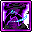

# 🏹 สายนักธนู (7 อาชีพ)

สายนักธนูมีความแม่นยำสูง รัศมีการยิงไกล และการปล่อยลูกศรออกมาอย่างต่อเนื่องจำนวนมหาศาล

***

### 1. Bowmaster (โบว์มาสเตอร์ - Explorer)

* **สเตตัสหลัก:** DEX | **อาวุธ:** ธนู (Bow)
* **สกิลฟาร์มหลัก:** Arrow Stream + Phoenix
* **สกิลบอส:** Hurricane (พายุลูกศรรัวไม่มีหยุด) + Inhuman Speed
* **สกิล 5th Job:** Storm of Arrows, Inhuman Speed, Quiver Barrage, Silhouette Mirage
* **🎯 แนะนำตั้งปุ่มบอท 1-4:**
  *   `[1]`&#x20;

      

      &#x20;**Arrow Stream** (สาดลูกธนูคลื่นวงกว้างด้านหน้า)
  *   `[2]`&#x20;

      

      &#x20;**Gritty Gust** (พายุพัดผลักมอนสเตอร์)
  *   `[3]`&#x20;

      

      &#x20;**Storm of Arrows** (พายุฝนธนูตกลงมาจากฟ้ากวาดทั้งจอ)
  *   `[4]`&#x20;

      

      &#x20;**Quiver Barrage** (ระเบิดลูกศรพิเศษหลากหลายสถานะ)

***

### 2. Marksman (มาร์คสแมน - Explorer)

* **สเตตัสหลัก:** DEX | **อาวุธ:** หน้าไม้ (Crossbow)
* **สกิลฟาร์มหลัก:** Piercing Arrow (ลูกศรแทงทะลุ ยิ่งโดนมอนเยอะยิ่งแรง)
* **สกิลบอส:** Snipe (กระสุนสไนเปอร์คริติคอล 100%)
* **สกิล 5th Job:** True Snipe, Split Shot, Repeating Crossbow Cartridge, Perfect Shot
* **🎯 แนะนำตั้งปุ่มบอท 1-4:**
  *   `[1]`&#x20;

      

      &#x20;**Piercing Arrow** (ยิงลูกศรทะลวงมอนสเตอร์เป็นแถวยาว)
  *   `[2]`&#x20;

      

      &#x20;**Split Shot** (ลูกศรแตกกระจายเป็นสะเก็ดระเบิด)
  *   `[3]`&#x20;

      

      &#x20;**Repeating Crossbow Cartridge** (สาดกระสุนหน้าไม้กล)
  *   `[4]`&#x20;

      

      &#x20;**True Snipe** (สไนเปอร์ล็อคเป้าถล่มบอส)

***

### 3. Pathfinder (พาธไฟน์เดอร์ - Explorer)

* **สเตตัสหลัก:** DEX | **อาวุธ:** Ancient Bow
* **สกิลฟาร์มหลัก:** Cardinal Burst + Cardinal Deluge (มาโครคอมโบธนูโบราณ)
* **สกิลบอส:** Cardinal Torrent + Ancient Astra + Relic Unbound
* **สกิล 5th Job:** Nova Blast, Raven Tempest, Obsidian Barrier, Relic Unbound
* **🎯 แนะนำตั้งปุ่มบอท 1-4:**
  *   `[1]`&#x20;

      

      &#x20;**Cardinal Burst** (ยิงธนูระเบิดวงกว้าง)
  *   `[2]`&#x20;

      

      &#x20;**Cardinal Deluge** (ลูกศรติดตามอัตโนมัติ)
  *   `[3]`&#x20;

      

      &#x20;**Raven Tempest** (พายุอีกาทมิฬบินกวาดทั้งแผนที่)
  *   `[4]`&#x20;

      

      &#x20;**Nova Blast** (ระเบิดโบราณอนุภาพทำลายล้างสูงสุด)

***

### 4. Wind Archer (วินด์ อาร์เชอร์ - Cygnus Knights)

* **สเตตัสหลัก:** DEX | **อาวุธ:** ธนู (Bow)
* **สกิลฟาร์มหลัก:** Fairy Turn (หมุนตัวสร้างพายุ) / Spiral Vortex
* **สกิลบอส:** Song of Heaven + Trifling Wind (ลูกศรสายลมติดตาม)
* **สกิล 5th Job:** Howling Gale, Merciless Winds, Gale Violent, Vortex Sphere
* **🎯 แนะนำตั้งปุ่มบอท 1-4:**
  *   `[1]`&#x20;

      

      &#x20;**Fairy Turn** (หมุนตัวปล่อยพายุลมรอบทิศทาง ฟาร์มเร็วมาก)
  *   `[2]`&#x20;

      

      &#x20;**Howling Gale** (พายุหมุนลูกใหญ่เดินทางกวาดมอนสเตอร์)
  *   `[3]`&#x20;

      

      &#x20;**Vortex Sphere** (ลูกบอลลมหมุนดูดมอนสเตอร์)
  *   `[4]`&#x20;

      

      &#x20;**Merciless Winds** (ลูกศรสายลมพุ่งกระจายทั่วแมพ)

***

### 5. Wild Hunter (ไวลด์ ฮันเตอร์ - Resistance)

* **สเตตัสหลัก:** DEX | **อาวุธ:** หน้าไม้ (Crossbow) ขี่เสือจากัวร์ (Jaguar)
* **สกิลฟาร์มหลัก:** Wild Arrow Blast (ยิงรัวขณะขี่เสือ) / Sonic Boom
* **สกิลบอส:** Wild Arrow Blast (โหมดยืนปักหลัก) + Jaguar Skills
* **สกิล 5th Job:** Jaguar Storm, Primal Fury, Wild Grenade, Nature's Belief
* **🎯 แนะนำตั้งปุ่มบอท 1-4:**
  *   `[1]`&#x20;

      

      &#x20;**Sonic Boom** (เสือคำรามคลื่นเสียงกวาดมอนสเตอร์)
  *   `[2]`&#x20;

      

      &#x20;**Wild Grenade** (ยิงลูกระเบิดกระจาย)
  *   `[3]`&#x20;

      

      &#x20;**Jaguar Storm** (เรียกฝูงเสือจากัวร์ทั้งฝูงมาช่วยรุมกัด)
  *   `[4]`&#x20;

      

      &#x20;**Primal Fury** (ฉีกกระชากด้วยกรงเล็บแห่งพงไพร)

***

### 6. Mercedes (เมอร์เซเดส - Heroes)

* **สเตตัสหลัก:** DEX | **อาวุธ:** Dual Bowguns (ธนูคู่)
* **สกิลฟาร์มหลัก:** Leaf Tornado (หมุนตัวกลางอากาศ) + Wrath of Enlil
* **สกิลบอส:** Ishtar's Ring (ระดมยิงลูกศรรวดเร็วดั่งพายุ)
* **สกิล 5th Job:** Spirit of Elluel, Sylphidia, Irkalla's Wrath, Royal Knights
* **🎯 แนะนำตั้งปุ่มบอท 1-4:**
  *   `[1]`&#x20;

      

      &#x20;**Leaf Tornado** /&#x20;

      

      &#x20;**Stunning Strikes** (พายุใบไม้หมุนกลางอากาศ)
  *   `[2]`&#x20;

      

      &#x20;**Wrath of Enlil** (คลื่นศรเอลฟ์ยักษ์ฟาดลงพื้น)
  *   `[3]`&#x20;

      

      &#x20;**Irkalla's Wrath** (ระดมยิงธนูคู่อัลตร้าสปีด)
  *   `[4]`&#x20;

      

      &#x20;**Royal Knights** (อัญเชิญกองทหารอัศวินเอลฟ์ช่วยฟัน)

***

### 7. Kain (เคน - Nova)

* **สเตตัสหลัก:** DEX | **อาวุธ:** Breath Shooter (หน้าไม้แขนมังกร)
* **สกิลฟาร์มหลัก:** Strike Arrow + Scattering Shot
* **สกิลบอส:** Dragon Fang + Falling Dust + Grip of Agony
* **สกิล 5th Job:** Dragon Burst, Fatal Blitz, Thanatos Descent, Grip of Agony
* **🎯 แนะนำตั้งปุ่มบอท 1-4:**
  *   `[1]`&#x20;

      

      &#x20;**Strike Arrow** (ยิงลูกศรทะลวงด้านหน้า)
  *   `[2]`&#x20;

      

      &#x20;**Scattering Shot** (สาดกระสุนสะท้อนชิ่งรอบตัว)
  *   `[3]`&#x20;

      

      &#x20;**Dragon Burst** (มังกรดำพ่นลำแสงเพลิงทลายมิติ)
  *   `[4]`&#x20;

      

      &#x20;**Grip of Agony** (กรงเล็บยมทูตขยี้ศัตรูทั้งจอ)
