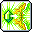

# 🏹 สายนักธนู (7 อาชีพ)

รวบรวมข้อมูลสกิลของ **สายนักธนู (7 อาชีพ)** อย่างละเอียดครบถ้วนทั้ง 7 อาชีพ ตั้งแต่ **คลาส 1 ถึง คลาส 5 (5th Job V-Matrix)** พร้อมภาพไอคอนสกิลแท้, ค่าดาเมจเปอร์เซ็นต์ (Damage %), จำนวนครั้งที่โจมตี (Hit), คูลดาวน์ (Cooldown), และจำนวนเป้าหมายสูงสุด

> 💡 **หมายเหตุ:** ค่าดาเมจ (%) และจำนวน Hit คำนวณที่เลเวลสูงสุด (Max Level) ตามข้อมูลไฟล์เกม Client WZ จริง

***

**สายนักธนู (7 อาชีพ) ได้แก่:**

1. [👉 1. Bowmaster (โบว์มาสเตอร์) (Explorer)](bowmaster.md)
2. [👉 2. Marksman (มาร์กสแมน) (Explorer)](marksman.md)
3. [👉 3. Pathfinder (พาธไฟน์เดอร์) (Explorer)](pathfinder.md)
4. [👉 4. Wind Archer (วินด์ อาร์เชอร์) (Cygnus Knights)](wind-archer.md)
5. [👉 5. Wild Hunter (ไวลด์ ฮันเตอร์) (Resistance)](wild-hunter.md)
6. [👉 6. Mercedes (เมอร์เซเดส) (Heroes)](mercedes.md)
7. [👉 7. Kain (เคน) (Nova)](kain.md)

***

## 1. Bowmaster (โบว์มาสเตอร์) (Explorer)

* **สเตตัสหลัก:** DEX | **อาวุธประจำตัว:** ธนู (Bow)

|                                              ไอคอน                                              |    คลาส    | ชื่อสกิล              | ดาเมจ (%) |   Hit  |  คูลดาวน์  | เป้าหมาย | บทบาท & จุดเด่น                                       |
| :---------------------------------------------------------------------------------------------: | :--------: | --------------------- | :-------: | :----: | :--------: | :------: | ----------------------------------------------------- |
|           | **คลาส 1** | **Arrow Blow**        |    345%   |    -   | ไม่มี (0s) |   4 ตัว  | ยิงลูกศรโจมตีมอนสเตอร์ด้านหน้า                        |
|           | **คลาส 2** | **Arrow Bomb**        |     -     |    -   |    8 วิ    |   6 ตัว  | ยิงลูกศรระเบิด สตั๊นมอนสเตอร์รอบเป้าหมาย              |
|          | **คลาส 3** | **Flame Surge**       |    400%   |  3 Hit | ไม่มี (0s) |   6 ตัว  | ยิงฝนศรเพลิงเผาผลาญศัตรูเป็นแนวกว้าง                  |
|                                           P4subTlucggC                                          | **คลาส 4** | **Hurricane**         |     -     |    -   |      -     |     -    | ยิงพายุลูกศรต่อเนื่องไม่หยุด สกิลบอสสัญลักษณ์แห่งเกม  |
|         | **คลาส 4** | **Arrow Stream**      |    350%   |  5 Hit | ไม่มี (0s) |   8 ตัว  | ยิงสาดห่ากระสุนลูกศร 8 ดอกกว้างทั้งจอ สกิลฟาร์มหลัก   |
|           | **คลาส 4** | **Sharp Eyes**        |     -     |    -   |   300 วิ   |     -    | เนตรอินทรี บัฟเพิ่ม Critical Rate และ Critical Damage |
|          |  **Hyper** | **Gritty Gust**       |    335%   | 12 Hit |    15 วิ   |  12 ตัว  | พายุศรยักษ์พัดกวาดมอนสเตอร์ทั้งฉาก                    |
|        |  **Hyper** | **Concentration**     |     -     |    -   |    90 วิ   |     -    | เพ่งสมาธิ ไม่ถูกยกเลิกการยิงและเพิ่มพลังโจมตี         |
|    | **คลาส 5** | **Storm of Arrows**   |    880%   |  1 Hit |    60 วิ   |     -    | มหาพายุฝนลูกศรตกจากฟ้าครอบคลุมทั้งหน้าจอ              |
|      | **คลาส 5** | **Inhuman Speed**     |     -     |    -   |   120 วิ   |     -    | ยิงศรเสริมด้วยความเร็วเหนือมนุษย์                     |
|     | **คลาส 5** | **Quiver Barrage**    |     -     |    -   |    16 วิ   |     -    | ยิงกระสุนศรพิเศษจากกระบอกธนูระเบิดต่อเนื่อง           |
|  | **คลาส 5** | **Silhouette Mirage** |    880%   | 12 Hit |    90 วิ   |  12 ตัว  | แยกร่างเงาหลอกล่อศัตรูและช่วยสาดลูกศร                 |

***

## 2. Marksman (มาร์กสแมน) (Explorer)

* **สเตตัสหลัก:** DEX | **อาวุธประจำตัว:** หน้าไม้ (Crossbow)

|                                                    ไอคอน                                                   |    คลาส    | ชื่อสกิล                         | ดาเมจ (%) |  Hit  |  คูลดาวน์  | เป้าหมาย | บทบาท & จุดเด่น                                               |
| :--------------------------------------------------------------------------------------------------------: | :--------: | -------------------------------- | :-------: | :---: | :--------: | :------: | ------------------------------------------------------------- |
|                      | **คลาส 1** | **Arrow Blow**                   |    345%   |   -   | ไม่มี (0s) |   4 ตัว  | ยิงลูกศรโจมตีมอนสเตอร์ด้านหน้า                                |
|                      | **คลาส 2** | **Iron Arrow**                   |    341%   | 2 Hit |    8 วิ    |   8 ตัว  | ยิงศรเหล็กพุ่งทะลวงเป็นเส้นตรง                                |
|                    | **คลาส 3** | **Bolt Rapture**                 |    975%   | 1 Hit | ไม่มี (0s) |   8 ตัว  | ยิงหน้าไม้ระเบิดคลื่นกระแทก                                   |
|                           | **คลาส 4** | **Snipe**                        |    465%   | 9 Hit |    5 วิ    |     -    | สไนเปอร์ลอบสังหาร ยิงนัดเดียวบอสสะเทือน ดาเมจมหาศาล           |
|                                                qCZq5ZvVFHVZ                                                | **คลาส 4** | **Piercing Arrow**               |     -     |   -   |      -     |     -    | ยิงศรเจาะเกราะ ยิ่งทะลุมอนสเตอร์ตัวหลังยิ่งแรงขึ้น            |
|                 |  **Hyper** | **High Speed Shot**              |    450%   | 9 Hit |    15 วิ   |  12 ตัว  | ยิงกระสุนความเร็วสูงทะลวงมอนสเตอร์ทั้งจอ                      |
|                        |  **Hyper** | **Bullseye**                     |     -     |   -   |    90 วิ   |     -    | เล็งจุดตาย เพิ่ม Ignore DEF 20% และ Crit Damage               |
|                    | **คลาส 5** | **True Snipe**                   |    880%   | 1 Hit |    60 วิ   |   1 ตัว  | เข้าสู่โหมดซุ่มยิงสไนเปอร์ เล็งเป้าหมายยิงด้วยมือ ดาเมจสุดยอด |
|                   | **คลาส 5** | **Split Arrow**                  |    880%   | 8 Hit |   150 วิ   |  10 ตัว  | ศรแตกตัวระเบิดเป็นห่ากระสุนเมื่อกระทบเป้าหมาย                 |
|                 | **คลาส 5** | **Charged Arrow**                |     -     |   -   |   150 วิ   |     -    | ชาร์จพลังศรหน้าไม้ ปล่อยคลื่นยักษ์กวาดทั้งแผนที่              |
|  | **คลาส 5** | **Repeating Crossbow Cartridge** |    715%   | 3 Hit |   180 วิ   |   6 ตัว  | บรรจุกระสุนหน้าไม้กล ยิง Snipe ต่อเนื่องรวดเร็ว               |

***

## 3. Pathfinder (พาธไฟน์เดอร์) (Explorer)

* **สเตตัสหลัก:** DEX | **อาวุธประจำตัว:** Ancient Bow

|                                              ไอคอน                                             |    คลาส    | ชื่อสกิล                          | ดาเมจ (%) |   Hit  |  คูลดาวน์  | เป้าหมาย | บทบาท & จุดเด่น                                |
| :--------------------------------------------------------------------------------------------: | :--------: | --------------------------------- | :-------: | :----: | :--------: | :------: | ---------------------------------------------- |
|     | **คลาส 1** | **Cardinal Deluge**               |    110%   |  4 Hit | ไม่มี (0s) |   4 ตัว  | ยิงศรวารีติดตามศัตรู                           |
|                                          tODVOQ94Ryp5                                          | **คลาส 2** | **Cardinal Burst**                |     -     |    -   |      -     |     -    | ยิงศรระเบิดคลื่นกระแทกด้านหน้า                 |
|                                          GQjqLcgi435W                                          | **คลาส 3** | **Cardinal Torrent**              |     -     |    -   |      -     |     -    | พุ่งทะยานกลางอากาศพร้อมยิงศรวนรอบตัว           |
|                                          R2L8x19SzlpS                                          | **คลาส 4** | **Cardinal Deluge Amplification** |     -     |    -   |      -     |     -    | อัปเกรดศรวารี 4 ดอกไล่ล่าศัตรูอัตโนมัติ        |
|                                          EIjSThWqHenl                                          | **คลาส 4** | **Cardinal Burst Amplification**  |     -     |    -   |      -     |     -    | อัปเกรดศรระเบิดพลังทำลายล้างวงกว้าง            |
|       | **คลาส 4** | **Combo Assault**                 |    350%   |  4 Hit | ไม่มี (0s) |   6 ตัว  | การโจมตีผสานโบราณ ฟันกวาดทั้งหน้าจอ            |
|                                          FRgZBARRxXFO                                          |  **Hyper** | **Ancient Astronaut**             |     -     |    -   |      -     |     -    | ปลดปล่อยพลังโบราณ ยิงลำแสงโบราณกวาดจอ          |
|                                          Y7twyPkAgkeI                                          |  **Hyper** | **Relic Evolution**               |     -     |    -   |      -     |     -    | ปลุกพลังโบราณขั้นสูงสุด บัฟเกจ Relic เต็มทันที |
|    | **คลาส 5** | **Ultimate Blast**                |   1000%   | 15 Hit |   100 วิ   |  15 ตัว  | ชาร์จพลัง Relic ยิงศรโบราณยักษ์ทะลวงมิติ       |
|     | **คลาส 5** | **Raven Tempest**                 |     -     |    -   |   120 วิ   |     -    | พายุอีกาโบราณหมุนวนกวาดมอนสเตอร์ไปทั่วแมพ      |
|  | **คลาส 5** | **Obsidian Barrier**              |     -     |    -   |   120 วิ   |     -    | กางม่านพลังหินออบซิเดียน ป้องกันดาเมจและโจมตี  |
|     | **คลาส 5** | **Relic Unbound**                 |    660%   | 12 Hit |    90 วิ   |   8 ตัว  | ปลดปล่อยเสาพลังโบราณ 7 เสาโจมตีต่อเนื่อง       |

***

## 4. Wind Archer (วินด์ อาร์เชอร์) (Cygnus Knights)

* **สเตตัสหลัก:** DEX | **อาวุธประจำตัว:** ธนู (Bow)

|                                             ไอคอน                                             |    คลาส    | ชื่อสกิล            | ดาเมจ (%) |   Hit  |  คูลดาวน์  | เป้าหมาย | บทบาท & จุดเด่น                                       |
| :-------------------------------------------------------------------------------------------: | :--------: | ------------------- | :-------: | :----: | :--------: | :------: | ----------------------------------------------------- |
|      | **คลาส 1** | **Breeze Arrow**    |    140%   |  3 Hit | ไม่มี (0s) |   5 ตัว  | ยิงศรสายลมพุ่งทะลวง                                   |
|        | **คลาส 2** | **Fairy Turn**      |    195%   |  3 Hit | ไม่มี (0s) |   6 ตัว  | หมุนตัวสะบัดผ้าคลุมสายลมปัดเป่าศัตรู                  |
|    | **คลาส 3** | **Sentient Arrow**  |    195%   |  2 Hit | ไม่มี (0s) |   6 ตัว  | ยิงลูกศรสายลมติดตามมอนสเตอร์                          |
|    | **คลาส 4** | **Song of Heaven**  |     -     |    -   |   900 วิ   |     -    | ยิงเพลงพิณสายลมต่อเนื่องรวดเร็ว สกิลบอสหลัก           |
|     | **คลาส 4** | **Spiral Vortex**   |    345%   |    -   | ไม่มี (0s) |   4 ตัว  | ยิงพายุหมุนเกลียวผลักศัตรูและระเบิด                   |
|     | **คลาส 4** | **Trifling Wind**   |    290%   |    -   | ไม่มี (0s) |     -    | เศษศรสายลมแตกตัวบินว่อนรอบตัวอัตโนมัติ                |
|           |  **Hyper** | **Monsoon**         |    430%   | 12 Hit |    30 วิ   |  15 ตัว  | ลมมรสุมพัดถล่มมอนสเตอร์ทั้งหน้าจอ                     |
|     |  **Hyper** | **Storm Bringer**   |    500%   |    -   |   200 วิ   |     -    | เรียกพายุแห่งซิกนัส ยิงศรยักษ์ตามหลังทุกการโจมตี      |
|     | **คลาส 5** | **Howling Gale**    |    550%   |  3 Hit |  10000 วิ  |  10 ตัว  | เสกพายุหมุนทอร์นาโด 2 ลูกวิ่งกวาดทั่วแผนที่           |
|  | **คลาส 5** | **Merciless Winds** |   1100%   | 10 Hit | ไม่มี (0s) |  10 ตัว  | กลุ่มก้อนศรสายลมรวมตัวและพุ่งกระแทกบอส                |
|     | **คลาส 5** | **Gale Violent**    |   1155%   |  5 Hit |   120 วิ   |   8 ตัว  | พายุสายลมรุนแรงหมุนระเบิดดาเมจมหาศาล                  |
|    | **คลาส 5** | **Vortex Sphere**   |   1430%   | 15 Hit |   6720 วิ  |  15 ตัว  | ลูกกลมพายุหมุนเคลื่อนที่ช้าๆ ดูดมอนสเตอร์เข้ามาฟาดฟัน |

***

## 5. Wild Hunter (ไวลด์ ฮันเตอร์) (Resistance)

* **สเตตัสหลัก:** DEX | **อาวุธประจำตัว:** Crossbow

|                                                ไอคอน                                               |    คลาส    | ชื่อสกิล             | ดาเมจ (%) |  Hit  |  คูลดาวน์  | เป้าหมาย | บทบาท & จุดเด่น                                  |
| :------------------------------------------------------------------------------------------------: | :--------: | -------------------- | :-------: | :---: | :--------: | :------: | ------------------------------------------------ |
|                                            NfSH3YJXi0sU                                            | **คลาส 1** | **Triple Shot**      |     -     |   -   |      -     |     -    | ขี่จากัวร์ยิงศร 3 ดอก                            |
|                                            tBv83BXnSoiJ                                            | **คลาส 2** | **Ricochet**         |     -     |   -   |      -     |     -    | ยิงศรสะท้อนเด้งไปมาระหว่างศัตรู                  |
|                                            vubLtJWYyh5A                                            | **คลาส 3** | **Enduring Fire**    |     -     |   -   |      -     |     -    | ยิงกระหน่ำกระสุนเพลิงต่อเนื่อง                   |
|                                            dWhzssw7ck8Q                                            | **คลาส 4** | **Wild Arrow Blast** |    300%   | 1 Hit | ไม่มี (0s) |   1 ตัว  | ปืนกลหน้าไม้สาดกระสุนไม่หยุด สกิลบอสหลัก         |
|                                            NC4QeDtyjGG2                                            | **คลาส 4** | **Sonic Boom**       |     -     |   -   |      -     |     -    | จากัวร์คำรามคลื่นเสียงโซนิคกวาดล้างศัตรู         |
|                                            FCfF1QqdYvQI                                            |  **Hyper** | **Flash Rain**       |     -     |   -   |      -     |     -    | ฝนศรส่องสว่างถล่มมอนสเตอร์ทั้งฉาก                |
|         |  **Hyper** | **Silent Rampage**   |     -     |   -   |   120 วิ   |     -    | สัญชาตญาณสัตว์ป่า เพิ่มดาเมจและอัตราติดสกิลเสริม |
|          | **คลาส 5** | **Jaguar Storm**     |     -     |   -   |   120 วิ   |     -    | เรียกฝูงจากัวร์ทั้ง 6 ตัวออกมารุมกัดขย้ำ         |
|           | **คลาส 5** | **Primal Fury**      |    550%   | 9 Hit |   120 วิ   |   6 ตัว  | การโจมตีร่วมกับจากัวร์ พุ่งกระโจนขย้ำบอส         |
|          | **คลาส 5** | **Wild Grenade**     |   1100%   | 1 Hit | ไม่มี (0s) |     -    | ยิงระเบิดจากัวร์เด้งไปมาและระเบิดทำดาเมจ         |
|  | **คลาส 5** | **Nature's Belief**  |   1320%   | 6 Hit |    90 วิ   |  12 ตัว  | ศรัทธาแห่งพงไพร อัญเชิญพลังธรรมชาติถล่มจอ        |

***

## 6. Mercedes (เมอร์เซเดส) (Heroes)

* **สเตตัสหลัก:** DEX | **อาวุธประจำตัว:** Dual Bowguns (ธนูคู่)

|                                                 ไอคอน                                                |    คลาส    | ชื่อสกิล              | ดาเมจ (%) |   Hit  |  คูลดาวน์  | เป้าหมาย | บทบาท & จุดเด่น                                       |
| :--------------------------------------------------------------------------------------------------: | :--------: | --------------------- | :-------: | :----: | :--------: | :------: | ----------------------------------------------------- |
|          | **คลาส 1** | **Speed Dual Shot**   |    135%   |    -   | ไม่มี (0s) |   3 ตัว  | ยิงธนูคู่ 2 จังหวะรวดเร็ว                             |
|              | **คลาส 2** | **Rising Rush**       |    450%   |    -   | ไม่มี (0s) |   8 ตัว  | เสยศัตรูลอยขึ้นฟ้าเพื่อต่อคอมโบกลางอากาศ              |
|          | **คลาส 3** | **Stunning Strike**   |    300%   |  4 Hit | ไม่มี (0s) |   8 ตัว  | ยิงลูกศรสตั๊นมอนสเตอร์เป็นแนวยาว                      |
|       | **คลาส 4** | **Ishtar's Ring**     |    220%   |  2 Hit | ไม่มี (0s) |     -    | รัวกระสุนธนูคู่ระดับแสง สกิลโจมตีบอสเดี่ยวอันดับหนึ่ง |
|            | **คลาส 4** | **Spikes Royale**     |    800%   |  3 Hit |    5 วิ    |  12 ตัว  | กระโดดตีลังกายิงลูกศรลงพื้น ระเบิดลด DEF บอส          |
|           | **คลาส 4** | **Lightning Edge**    |    420%   |  3 Hit |    30 วิ   |   8 ตัว  | พุ่งสไลด์ผ่านมอนสเตอร์ ลดดาเมจสะท้อน                  |
|           |  **Hyper** | **Wrath of Enlil**    |    460%   | 10 Hit |    8 วิ    |  10 ตัว  | ความโกรธาแห่งเอนลิล เรียกทูตสวรรค์ยิงศรยักษ์          |
|          |  **Hyper** | **Heroic Memories**   |     -     |    -   |    90 วิ   |     -    | ความทรงจำแห่งวีรบุรุษ เพิ่มพลังโจมตี                  |
|        | **คลาส 5** | **Spirit of Elluel**  |     -     |    -   |   120 วิ   |     -    | แยกร่างวิญญาณเอลฟ์ 2 ร่าง ยิงตามติดทุกสกิล            |
|  | **คลาส 5** | **Sylvidia's Flight** |     -     |    -   |    10 วิ   |     -    | ขี่ยูนิคอร์นซิวิเดีย วิ่งชนและพุ่งทะยานโจมตี          |
|    | **คลาส 5** | **Irkalla's Wrath**   |    715%   |  4 Hit | ไม่มี (0s) |   1 ตัว  | เรียกวิญญาณเอียร์คัลลายิงห่ากระสุนธนูคู่รัวนับร้อยฮิต |
|           | **คลาส 5** | **Royal Knights**     |    715%   |  3 Hit | ไม่มี (0s) |   1 ตัว  | เรียก 4 องครักษ์เอลฟ์ออกมาช่วยยิงคุ้มกัน              |

***

## 7. Kain (เคน) (Nova)

* **สเตตัสหลัก:** DEX | **อาวุธประจำตัว:** Breath Shooter

|                                              ไอคอน                                             |    คลาส    | ชื่อสกิล             | ดาเมจ (%) |  Hit  |  คูลดาวน์  | เป้าหมาย | บทบาท & จุดเด่น                            |
| :--------------------------------------------------------------------------------------------: | :--------: | -------------------- | :-------: | :---: | :--------: | :------: | ------------------------------------------ |
|       | **คลาส 1** | **Strike Arrow**     |    80%    | 5 Hit | ไม่มี (0s) |   4 ตัว  | ยิงศรเหล็กพุ่งทะลวง                        |
|                                          wWHq5z45mTVw                                          | **คลาส 2** | **Strike Arrow II**  |     -     |   -   |      -     |     -    | อัปเกรดศรเหล็กเพิ่มระยะและความแรง          |
|                                          Ir9eYdIlfT81                                          | **คลาส 3** | **Strike Arrow III** |     -     |   -   |      -     |     -    | ศรเหล็กยิงแตกตัวสร้างสะเก็ดดาเมจ           |
|                                          tgOMh2c6doxA                                          | **คลาส 4** | **Falling Dust**     |     -     |   -   |      -     |     -    | กระโดดขึ้นฟ้ายิงระเบิดฝุ่นควันลงพื้น       |
|       | **คลาส 4** | **Dragon Burst**     |    250%   | 8 Hit | ไม่มี (0s) |   6 ตัว  | ยิงกระสุนมังกรดำ 12 Hit รัวใส่บอส          |
|                                          Twy1Hk4a6DDl                                          |  **Hyper** | **Chasing Shot**     |     -     |   -   |      -     |     -    | ยิงศรตามล่าเป้าหมายรอบทิศทาง               |
|                                          twielSjGUAn5                                          |  **Hyper** | **Incarnation**      |     -     |   -   |      -     |     -    | จุติมังกรดำ เพิ่มพลังโจมตีและต้านทานสถานะ  |
|  | **คลาส 5** | **Dragonic Phalanx** |    760%   | 4 Hit |   200 วิ   |   8 ตัว  | กองทัพวิญญาณมังกรเดินหน้ากวาดมอนสเตอร์     |
|       | **คลาส 5** | **Fatal Blitz**      |   1375%   | 8 Hit | ไม่มี (0s) |  10 ตัว  | ระดมยิงประหารชีวิต รัวกระสุนมังกรดำไม่ยั้ง |
|  | **คลาส 5** | **Thanatos Descent** |     1%    | 1 Hit | ไม่มี (0s) |  10 ตัว  | ความตายมาเยือน แปลงร่างมังกรแห่งความตาย    |
|                                          CEKVfH2ZxbLE                                          | **คลาส 5** | **Grip of Agony**    |     -     |   -   |      -     |     -    | มือปีศาจขย้ำศัตรู ดึงดูดวิญญาณมาทำดาเมจ    |

***
