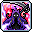
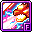
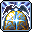
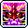

# 🔮 สายนักเวท (12 อาชีพ)

สายนักเวทมีสกิลโจมตีวงกว้างที่สุดในเกม สามารถเคลียร์มอนสเตอร์ได้รวดเร็วและเป็นราชาแห่งการฟาร์มด้วยระบบ `@autoplay`

***

### 1. Arch Mage Fire/Poison (เมจไฟ/พิษ - Explorer)

* **สเตตัสหลัก:** INT | **อาวุธ:** Wand / Staff
* **สกิลฟาร์มหลัก:** Flame Haze + Mist Eruption / Creeping Toxin
* **สกิลบอส:** Mist Eruption + Flame Sweep + Dot Punisher
* **สกิล 5th Job:** DoT Punisher, Poison Nova, Fury of Ifrit, Poison Chain
* **🎯 แนะนำตั้งปุ่มบอท 1-4:**
  *   `[1]`&#x20;

      

      &#x20;**Flame Sweep** (คลื่นเพลิงเผาผลาญด้านหน้า)
  *   `[2]`&#x20;

      

      &#x20;**Poison Chain** (พิษลามระเบิดต่อเนื่องทั้งแมพ)
  *   `[3]`&#x20;

      

      &#x20;**DoT Punisher** (อุกกาบาตเพลิงพิษพุ่งไล่ล่ามอน)
  *   `[4]`&#x20;

      

      &#x20;**Poison Nova** (ระเบิดควันพิษ 360 องศา)

***

### 2. Arch Mage Ice/Lightning (เมจน้ำแข็ง/สายฟ้า - Explorer)

* **สเตตัสหลัก:** INT | **อาวุธ:** Wand / Staff
* **สกิลฟาร์มหลัก:** Chain Lightning (สายฟ้าชิ่ง)
* **สกิลบอส:** Lightning Orb + Blizzard + Ice Age
* **สกิล 5th Job:** Ice Age, Bolt Barrage, Spirit of Snow, Jupiter Thunder
* **🎯 แนะนำตั้งปุ่มบอท 1-4:**
  *   `[1]`&#x20;

      

      &#x20;**Chain Lightning** (สายฟ้าชิ่งโดนมอนสเตอร์เป็นกลุ่ม)
  *   `[2]`&#x20;

      

      &#x20;**Blizzard** (หิมะตกถล่มทั้งหน้าจอ)
  *   `[3]`&#x20;

      

      &#x20;**Ice Age** (แช่แข็งพื้นทั้งแมพมอนสเตอร์เดินเหยียบแล้วตาย)
  *   `[4]`&#x20;

      

      &#x20;**Jupiter Thunder** (ลูกบอลสายฟ้าเดินไปข้างหน้า)

***

### 3. Bishop (บิชอป - Explorer)

* **สเตตัสหลัก:** INT | **อาวุธ:** Wand / Staff
* **สกิลฟาร์มหลัก:** Big Bang (รัศมีระเบิดกว้างมาก)
* **สกิลบอส:** Angel Ray + Peacemaker
* **สกิล 5th Job:** Benediction, Angel of Wisdom, Peacemaker, Divine Punishment
* **🎯 แนะนำตั้งปุ่มบอท 1-4:**
  *   `[1]`&#x20;

      

      &#x20;**Big Bang** (ระเบิดแสงศักดิ์สิทธิ์รอบตัวรัศมีกว้าง)
  *   `[2]`&#x20;

      

      &#x20;**Genesis** (ฝนดาวตกแสงสว่างกวาดทั้งจอ)
  *   `[3]`&#x20;

      

      &#x20;**Peacemaker** (ส่งนางฟ้าบินพุ่งทะลุจอ)
  *   `[4]`&#x20;

      

      &#x20;**Divine Punishment** (ลำแสงสวรรค์เผาผลาญศัตรู)

***

### 4. Blaze Wizard (เบลซ วิซาร์ด - Cygnus Knights)

* **สเตตัสหลัก:** INT | **อาวุธ:** Wand / Staff
* **สกิลฟาร์มหลัก:** Orbital Flame (ขว้างลูกไฟไป-กลับ)
* **สกิลบอส:** Orbital Flame + Blazing Extinction
* **สกิล 5th Job:** Orbital Inferno, Savage Flame, Inferno Sphere, Salamander Mischief
* **🎯 แนะนำตั้งปุ่มบอท 1-4:**
  *   `[1]`&#x20;

      

      &#x20;**Orbital Flame** (สแปมลูกไฟพุ่งไปข้างหน้า)
  *   `[2]`&#x20;

      

      &#x20;**Blazing Extinction** (ลูกไฟยักษ์กลิ้งกวาดมอนสเตอร์)
  *   `[3]`&#x20;

      

      &#x20;**Orbital Inferno** (ดาวเพลิงยักษ์พุ่งทะลุแมพ)
  *   `[4]`&#x20;

      

      &#x20;**Towering Inferno** (เสาเพลิงเผาทั้งหน้าจอ)

***

### 5. Battle Mage (แบทเทิล เมจ - Resistance)

* **สเตตัสหลัก:** INT | **อาวุธ:** Staff
* **สกิลฟาร์มหลัก:** Blow Skills (Finishing Blow) + Dark Shock
* **สกิลบอส:** Finishing Blow + Death (ยมทูต)
* **สกิล 5th Job:** Union Aura, Black Magic Altar, Grim Harvest, Abyssal Lightning
* **🎯 แนะนำตั้งปุ่มบอท 1-4:**
  *   `[1]`&#x20;

      

      &#x20;**Finishing Blow** (ฟาดไม้เท้าแห่งความมืด)
  *   `[2]`&#x20;

      

      &#x20;**Dark Genesis** (ลำแสงแห่งความมืดถล่มทั้งจอ)
  *   `[3]`&#x20;

      

      &#x20;**Grim Harvest** (ยมทูตยักษ์เกี่ยววิญญาณทั้งแมพ)
  *   `[4]`&#x20;

      

      &#x20;**Abyssal Lightning** (สายฟ้าแห่งความมืดสถิตพื้น)

***

### 6. Evan (อีวาน & มังกรมีร์ - Heroes)

* **สเตตัสหลัก:** INT | **อาวุธ:** Wand / Staff
* **สกิลฟาร์มหลัก:** Dragon Breath + Earth Circle (Breath of Earth)
* **สกิลบอส:** Dragon Dive + Thunder Circle (Dive of Thunder)
* **สกิล 5th Job:** Dragon Elemental, Wyrmking's Breath, Spiral of Mana, Elemental Radiance
* **🎯 แนะนำตั้งปุ่มบอท 1-4:**
  *   `[1]`&#x20;

      

      &#x20;**Circle of Mana** (บอลเวทมนตร์ยิงรัว)
  *   `[2]`&#x20;

      

      &#x20;**Dragon Breath** (มังกรพ่นไฟกว้างมาก)
  *   `[3]`&#x20;

      

      &#x20;**Spiral of Mana** (พายุหมุนมานาติดค้างในแมพ)
  *   `[4]`&#x20;

      

      &#x20;**Wyrmking's Breath** (มังกรยักษ์พ่นลำแสงทำลายล้าง)

***

### 7. Luminous (ลูมินัส - Heroes)

* **สเตตัสหลัก:** INT | **อาวุธ:** Shining Rod (ลูกแก้วแสง/มืด)
* **สกิลฟาร์มหลัก:** Reflection (แสงสะท้อนชิ่งข้ามแมพ - ฟาร์มดีที่สุดในเกม)
* **สกิลบอส:** Apocalypse / Ender (โหมด Equilibrium)
* **สกิล 5th Job:** Gate of Light, Aether Conduit, Baptism of Light and Darkness, Liberation Nova
* **🎯 แนะนำตั้งปุ่มบอท 1-4:**
  *   `[1]`&#x20;

      

      &#x20;**Reflection** (แสงชิ่งทั้งแมพ มอนสเตอร์ตายยกรัง)
  *   `[2]`&#x20;

      

      &#x20;**Apocalypse** (เวทมนตร์แห่งความมืดชาร์จหลอดแสงสว่าง)
  *   `[3]`&#x20;

      

      &#x20;**Gate of Light** (ประตูมิติแสงยิงเลเซอร์อัตโนมัติ)
  *   `[4]`&#x20;

      

      &#x20;**Baptism of Light and Darkness** (ดาบแสงมืดถล่มบอส)

***

### 8. Illium (อิลเลียม - Flora)

* **สเตตัสหลัก:** INT | **อาวุธ:** Lucent Gauntlet (ควบคุมลูกแก้ว Crystal)
* **สกิลฟาร์มหลัก:** Radiant Javelin + Radiant Orb (ชิ่งลูกแก้ว)
* **สกิลบอส:** Crystal Ignition (เลเซอร์เผา) + Wings of Glory
* **สกิล 5th Job:** Crystal Ignition, Gram Holder, Soul of Crystal, Crystalline Bastion
* **🎯 แนะนำตั้งปุ่มบอท 1-4:**
  *   `[1]`&#x20;

      

      &#x20;**Radiant Javelin** (ปาหอกแสงชิ่งมอนสเตอร์)
  *   `[2]`&#x20;

      

      &#x20;**Longinus Spear** (หอกยักษ์ทะลวงพื้นดิน)
  *   `[3]`&#x20;

      

      &#x20;**Gram Holder** (เรียกหุ่นยนต์ดาบยักษ์ช่วยฟาด)
  *   `[4]`&#x20;

      

      &#x20;**Crystal Ignition** (ยิงลำแสงเลเซอร์ต่อเนื่อง)

***

### 9. Lara (ลาร่า - Anima)

* **สเตตัสหลัก:** INT | **อาวุธ:** Wand
* **สกิลฟาร์มหลัก:** Essence Sprinkle + Dragon Vein Eruption (จุดธาตุระเบิด)
* **สกิลบอส:** Dragon Vein Absorption + Big Stretch
* **สกิล 5th Job:** Big Stretch, Land's Connection, Surging Essence, Winding Mountain Ridge
* **🎯 แนะนำตั้งปุ่มบอท 1-4:**
  *   `[1]`&#x20;

      

      &#x20;**Essence Sprinkle** (โปรยคลื่นพฤกษา)
  *   `[2]`&#x20;

      

      &#x20;**Dragon Vein Eruption** (สั่งระเบิดเส้นชีพจรปฐพี)
  *   `[3]`&#x20;

      

      &#x20;**Big Stretch** (ภูติยักษ์ยืดแขนกวาดมอนทั้งจอ)
  *   `[4]`&#x20;

      

      &#x20;**Winding Mountain Ridge** (เรียกภูติหินกลิ้งชนมอนสเตอร์)

***

### 10. Kinesis (คิเนซิส - Other World)

* **สเตตัสหลัก:** INT | **อาวุธ:** Psy-limiter (พลังจิตเทเลคิเนซิส)
* **สกิลฟาร์มหลัก:** Psychic Clutch (จับมอนสเตอร์ทุ่ม)
* **สกิลบอส:** Ultimate - Metal Press + Psychic Smash
* **สกิล 5th Job:** Psychic Tornado, Ultimate - Moving Matter, Ultimate - Mind Over Matter, Law of Gravity
* **🎯 แนะนำตั้งปุ่มบอท 1-4:**
  *   `[1]`&#x20;

      

      &#x20;**Psychic Clutch** (ยกและทุ่มมอนสเตอร์เป็นกลุ่ม)
  *   `[2]`&#x20;

      

      &#x20;**Ultimate - Metal Press** (เสกตู้เซฟ/ซากเหล็กตกลงมาทับ)
  *   `[3]`&#x20;

      

      &#x20;**Psychic Tornado** (พายุหมุนดูดมอนสเตอร์มารวมกัน)
  *   `[4]`&#x20;

      

      &#x20;**Law of Gravity** (สร้างสนามแรงโน้มถ่วงระเบิดมิติ)

***

### 11. Kanna (คันนะ - Sengoku)

* **สเตตัสหลัก:** INT | **อาวุธ:** Fan (พัดวิญญาณ)
* **สกิลฟาร์มหลัก:** Shikigami Haunting + Kishin Shoukan (เร่งการเกิดมอนสเตอร์)
* **สกิลบอส:** Vanquisher's Charm + Sengoku Force
* **สกิล 5th Job:** Yuki-onna Doji, Spirit's Domain, Liberated Spirit Circle, Ghost Yaksha Great Demon
* **🎯 แนะนำตั้งปุ่มบอท 1-4:**
  *   `[1]`&#x20;

      

      &#x20;**Shikigami Haunting** (พัดวิญญาณฟาดต่อเนื่อง)
  *   `[2]`&#x20;

      

      &#x20;**Kishin Shoukan** (เรียกผีแดง-ผีขาว ช่วยตีและขยายหลอดมอน)
  *   `[3]`&#x20;

      

      &#x20;**Spirit's Domain** (กางอาณาเขตหิมะยักษ์กวาดทั้งแมพ)
  *   `[4]`&#x20;

      

      &#x20;**Ghost Yaksha Great Demon** (ยักษ์ฟาดกระบองทั้งจอ)

***

### 12. Beast Tamer (บีสต์ เทมเมอร์ - Other World)

* **สเตตัสหลัก:** INT | **อาวุธ:** Scepter
* **สกิลฟาร์มหลัก:** Leopard Form (เสือชีตาห์กระโจนไว) / Hawk Form (นกบินทิ้งระเบิด)
* **สกิลบอส:** Bear Form (หมีทุบหนักหน่วง)
* **สกิล 5th Job:** Champ Charge, Cub Cavalry, Aerial Relief, Group Bear Hug
* **🎯 แนะนำตั้งปุ่มบอท 1-4:**
  *   `[1]`&#x20;

      

      &#x20;**Leopard's Paw** /&#x20;

      

      &#x20;**Macho Dance** (เสือกวาดมอนสเตอร์)
  *   `[2]`&#x20;

      

      &#x20;**Three-Point Pounce** (เสือกระโดดทุบพื้น)
  *   `[3]`&#x20;

      

      &#x20;**Cub Cavalry** (กองทัพลูกสัตว์วิ่งชนมอนสเตอร์ทั้งแมพ)
  *   `[4]`&#x20;

      

      &#x20;**Champ Charge** (รวมพลังสัตว์เทพถล่มจอ)
