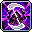
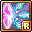

# 🔮 สายนักเวท (12 อาชีพ)

รวบรวมข้อมูลสกิลของ **สายนักเวท (12 อาชีพ)** อย่างละเอียดครบถ้วนทั้ง 12 อาชีพ ตั้งแต่ **คลาส 1 ถึง คลาส 5 (5th Job V-Matrix)** พร้อมภาพไอคอนสกิลแท้, ค่าดาเมจเปอร์เซ็นต์ (Damage %), จำนวนครั้งที่โจมตี (Hit), คูลดาวน์ (Cooldown), และจำนวนเป้าหมายสูงสุด

> 💡 **หมายเหตุ:** ค่าดาเมจ (%) และจำนวน Hit คำนวณที่เลเวลสูงสุด (Max Level) ตามข้อมูลไฟล์เกม Client WZ จริง

***

**สายนักเวท (12 อาชีพ) ได้แก่:**

1. [👉 1. Arch Mage (Fire/Poison) (นักเวทไฟ/พิษ) (Explorer)](arch-mage-fp.md)
2. [👉 2. Arch Mage (Ice/Lightning) (นักเวทน้ำแข็ง/สายฟ้า) (Explorer)](arch-mage-il.md)
3. [👉 3. Bishop (บิชอป) (Explorer)](bishop.md)
4. [👉 4. Blaze Wizard (เบลซ วิซาร์ด) (Cygnus Knights)](blaze-wizard.md)
5. [👉 5. Battle Mage (แบทเทิลเมจ) (Resistance)](battle-mage.md)
6. [👉 6. Evan (อีวาน) (Heroes)](evan.md)
7. [👉 7. Luminous (ลูมินัส) (Heroes)](luminous.md)
8. [👉 8. Illium (อิลเลียม) (Flora)](illium.md)
9. [👉 9. Lara (ลาร่า) (Anima)](lara.md)
10. [👉 10. Kinesis (คิเนซิส) (Other)](kinesis.md)
11. [👉 11. Kanna (คันนะ) (Sengoku)](kanna.md)
12. [👉 12. Beast Tamer (บีสต์ เทมเมอร์) (Other)](beast-tamer.md)

***

## 1. Arch Mage (Fire/Poison) (นักเวทไฟ/พิษ) (Explorer)

* **สเตตัสหลัก:** INT | **อาวุธประจำตัว:** คทา (Wand / Staff)

|                                            ไอคอน                                            |    คลาส    | ชื่อสกิล          | ดาเมจ (%) |   Hit  |  คูลดาวน์  | เป้าหมาย | บทบาท & จุดเด่น                                    |
| :-----------------------------------------------------------------------------------------: | :--------: | ----------------- | :-------: | :----: | :--------: | :------: | -------------------------------------------------- |
|      | **คลาส 1** | **Energy Bolt**   |    389%   |    -   | ไม่มี (0s) |   4 ตัว  | ยิงลูกบอลเวทมนตร์โจมตีศัตรู                        |
|        | **คลาส 2** | **Flame Orb**     |    381%   |  2 Hit | ไม่มี (0s) |   6 ตัว  | ลูกบอลเพลิงกลิ้งทะลวงเผาไหม้                       |
|                                         yBBPIWmd8M8p                                        | **คลาส 3** | **Explosion**     |     -     |    -   |      -     |     -    | ระเบิดเพลิงรอบตัว สกิลฟาร์มช่วงกลางเกม             |
|      | **คลาส 3** | **Poison Mist**   |    310%   |    -   |    20 วิ   |     -    | ปล่อยหมอกพิษปกคลุมพื้นที่ สร้างดีบัฟพิษสะสม        |
|         | **คลาส 4** | **Paralyze**      |    220%   |  7 Hit |    5 วิ    |   8 ตัว  | คลื่นพิษอัมพาต โจมตีมอนสเตอร์ด้านหน้าอย่างรวดเร็ว  |
|    | **คลาส 4** | **Mist Eruption** |    315%   | 12 Hit |    45 วิ   |  15 ตัว  | ระเบิดหมอกพิษทั้งหมด สร้างดาเมจมหาศาลตามจำนวนดีบัฟ |
|    | **คลาส 4** | **Meteor Shower** |    125%   | 10 Hit |    10 วิ   |  12 ตัว  | อุกกาบาตเพลิงถล่มจากฟ้า กวาดล้างทั้งหน้าจอ         |
|    |  **Hyper** | **Megiddo Flame** |    420%   | 15 Hit |    50 วิ   |   1 ตัว  | ลูกไฟปีศาจติดตามเป้าหมายเดี่ยว เผาผลาญบอส          |
|       |  **Hyper** | **Fire Auror**    |    400%   |  2 Hit | ไม่มี (0s) |  10 ตัว  | ออร่าเพลิงแผดเผามอนสเตอร์รอบตัวต่อเนื่อง           |
|   | **คลาส 5** | **DoT Punisher**  |     -     |    -   |    30 วิ   |     -    | ปล่อยฝูงลูกไฟเพลิงนรกไล่ล่าศัตรูรอบทิศทาง          |
|    | **คลาส 5** | **Poison Nova**   |   1400%   |  1 Hit |    10 วิ   |   8 ตัว  | ระเบิดวงแหวนฟองพิษขยายตัวรอบทิศทาง                 |
|  | **คลาส 5** | **Fury of Ifrit** |    440%   |  6 Hit |    75 วิ   |  12 ตัว  | อัญเชิญอีฟรีตปล่อยพายุเพลิงแผดเผาอย่างบ้าคลั่ง     |
|   | **คลาส 5** | **Poison Chain**  |    265%   |  4 Hit | ไม่มี (0s) |   8 ตัว  | โซ่พิษเชื่อมโยงมอนสเตอร์ เด้งลามไปทั่วทั้งแผนที่   |

***

## 2. Arch Mage (Ice/Lightning) (นักเวทน้ำแข็ง/สายฟ้า) (Explorer)

* **สเตตัสหลัก:** INT | **อาวุธประจำตัว:** คทา (Wand / Staff)

|                                             ไอคอน                                             |    คลาส    | ชื่อสกิล            | ดาเมจ (%) |   Hit  |  คูลดาวน์  | เป้าหมาย | บทบาท & จุดเด่น                                       |
| :-------------------------------------------------------------------------------------------: | :--------: | ------------------- | :-------: | :----: | :--------: | :------: | ----------------------------------------------------- |
|        | **คลาส 1** | **Energy Bolt**     |    389%   |    -   | ไม่มี (0s) |   4 ตัว  | ยิงลูกบอลเวทมนตร์โจมตีศัตรู                           |
|                                          37ifCi3XATCO                                         | **คลาส 2** | **Cold Beam**       |     -     |    -   |      -     |     -    | แท่งน้ำแข็งตกใส่หัวศัตรู แช่แข็งเป้าหมาย              |
|         | **คลาส 3** | **Ice Strike**      |    415%   |  4 Hit |    8 วิ    |   8 ตัว  | เสาน้ำแข็งผุดขึ้นมารอบตัว กวาดมอนสเตอร์               |
|                                          PtSXjDs8MdsD                                         | **คลาส 3** | **Glacier Chain**   |     -     |    -   |      -     |     -    | โซ่น้ำแข็งดึงมอนสเตอร์เข้ามาตรงหน้า                   |
|    | **คลาส 4** | **Chain Lightning** |    185%   | 10 Hit |    4 วิ    |   6 ตัว  | สายฟ้าชิ่งต่อเนื่องข้ามมอนสเตอร์ สกิลฟาร์มราชาแห่งเกม |
|           | **คลาส 4** | **Blizzard**        |    301%   | 12 Hit |    45 วิ   |  15 ตัว  | พายุหิมะถล่มทั้งหน้าจอ พร้อมดาเมจน้ำแข็งตามหลัง       |
|                                          cmHPwCZRW4DZ                                         | **คลาส 4** | **Infinity**        |     -     |    -   |      -     |     -    | เพิ่ม Magic ATT และ Final Damage ต่อเนื่องอย่างมหาศาล |
|      |  **Hyper** | **Lightning Orb**   |    150%   | 15 Hit |    60 วิ   |  15 ตัว  | บอลสายฟ้าปล่อยลำแสงไฟฟ้าช็อตบอสอย่างต่อเนื่อง         |
|           |  **Hyper** | **Ice Aura**        |     -     |    -   |    8 วิ    |  15 ตัว  | ออร่าน้ำแข็งปกป้องปาร์ตี้และลดความเร็วศัตรู           |
|          | **คลาส 5** | **Ice Age**         |    850%   |  5 Hit |    25 วิ   |     -    | แช่แข็งพื้นดินทั้งแผนที่ กลายเป็นลานน้ำแข็งทำลายล้าง  |
|     | **คลาส 5** | **Bolt Barrage**    |    650%   |  5 Hit |    10 วิ   |  10 ตัว  | ยิงพายุสายฟ้า 8 ทิศทาง กวาดมอนสเตอร์ทะลุจอ            |
|   | **คลาส 5** | **Spirit of Snow**  |    880%   |  9 Hit |   120 วิ   |  10 ตัว  | เรียกภูตหิมะยักษ์ออกมาช่วยถล่มเวทน้ำแข็ง              |
|  | **คลาส 5** | **Jupiter Thunder** |     -     |    -   |    15 วิ   |     -    | ลูกบอลสายฟ้าจูปิเตอร์ กลิ้งช็อตศัตรูอย่างรุนแรง       |

***

## 3. Bishop (บิชอป) (Explorer)

* **สเตตัสหลัก:** INT | **อาวุธประจำตัว:** คทา (Wand / Staff)

|                                              ไอคอน                                             |    คลาส    | ชื่อสกิล               | ดาเมจ (%) |   Hit  |    คูลดาวน์   | เป้าหมาย | บทบาท & จุดเด่น                                          |
| :--------------------------------------------------------------------------------------------: | :--------: | ---------------------- | :-------: | :----: | :-----------: | :------: | -------------------------------------------------------- |
|         | **คลาส 1** | **Energy Bolt**        |    389%   |    -   |   ไม่มี (0s)  |   4 ตัว  | ยิงลูกบอลเวทมนตร์โจมตีศัตรู                              |
|                | **คลาส 2** | **Heal**               |    490%   |    -   |      4 วิ     |   6 ตัว  | ฟื้นฟูเลือด HP เพื่อนทั้งปาร์ตี้และทำดาเมจ Undead        |
|          | **คลาส 2** | **Holy Arrow**         |     -     |    -   |     600 วิ    |     -    | ศรแสงศักดิ์สิทธิ์ยิงทะลวงมอนสเตอร์                       |
|         | **คลาส 3** | **Shining Ray**        |    304%   |  4 Hit |      6 วิ     |   6 ตัว  | ลำแสงศักดิ์สิทธิ์ส่องลงมาจากฟ้า กวาดศัตรู                |
|         | **คลาส 3** | **Holy Symbol**        |     -     |    -   |     330 วิ    |     -    | บัฟเพิ่มค่า EXP ที่ได้รับสูงสุด 50% สุดยอดบัฟแห่งเกม     |
|            | **คลาส 4** | **Big Bang**           |    405%   | 12 Hit |     45 วิ     |  15 ตัว  | ระเบิดแสงศักดิ์สิทธิ์วงกว้าง สกิลฟาร์มหลักของบิชอป       |
|           | **คลาส 4** | **Angel Ray**          |    225%   |  7 Hit |   ไม่มี (0s)  |   6 ตัว  | ยิงลำแสงเทวทูต ฮีลเพื่อนและทำดาเมจใส่บอสเดี่ยวรัวๆ       |
|             | **คลาส 4** | **Genesis**            |     -     |    -   | 1200-90\*x วิ |     -    | มหาเวทกำเนิดจักรวาล ถล่มทั้งหน้าจอ                       |
|        |  **Hyper** | **Heavens Door**       |   1000%   |  8 Hit |     90 วิ     |  15 ตัว  | ประตูสวรรค์ กวาดมอนสเตอร์ทั้งจอ + บัฟชุบชีวิตฟรี 1 ครั้ง |
|  |  **Hyper** | **Vengeance of Angel** |     -     |    -   |      1 วิ     |   1 ตัว  | แปลงร่างทูตสวรรค์ เพิ่มดาเมจ Angel Ray เพื่อตีบอส        |
|       | **คลาส 5** | **Benediction**        |   1100%   | 10 Hit |     60 วิ     |  15 ตัว  | อาณาเขตสวดมนต์ บัฟ Final Damage และฟื้นฟูทั้งปาร์ตี้     |
|    | **คลาส 5** | **Angel of Libra**     |   1760%   | 12 Hit |   ไม่มี (0s)  |  12 ตัว  | อัญเชิญทูตสวรรค์แห่งความสมดุล ช่วยโจมตีและบัฟดาเมจ       |
|        | **คลาส 5** | **Peacemaker**         |     -     |    -   |     30 วิ     |     -    | ปล่อยคัมภีร์ศักดิ์สิทธิ์ลอยไปด้านหน้าก่อนระเบิดแสง       |
|                                          BSsrec96KpTR                                          | **คลาส 5** | **Divine Punishment**  |     -     |    -   |       -       |     -    | ลำแสงลงทัณฑ์ศักดิ์สิทธิ์ ยิงเลเซอร์รัวถล่มบอส            |

***

## 4. Blaze Wizard (เบลซ วิซาร์ด) (Cygnus Knights)

* **สเตตัสหลัก:** INT | **อาวุธประจำตัว:** คทา (Wand / Staff)

|                                               ไอคอน                                               |    คลาส    | ชื่อสกิล                | ดาเมจ (%) |  Hit  |  คูลดาวน์  | เป้าหมาย | บทบาท & จุดเด่น                                   |
| :-----------------------------------------------------------------------------------------------: | :--------: | ----------------------- | :-------: | :---: | :--------: | :------: | ------------------------------------------------- |
|         | **คลาส 1** | **Orbital Flame**       |    210%   | 1 Hit | ไม่มี (0s) |   4 ตัว  | ลูกแก้วเพลิงหมุนพุ่งไปกลับ โจมตีรัวเร็ว           |
|                                            pelUEVRy6Ci1                                           | **คลาส 2** | **Orbital Flame II**    |     -     |   -   |      -     |     -    | อัปเกรดลูกแก้วเพลิง 2 ลูก                         |
|                                            h2V8x1TwNjgC                                           | **คลาส 3** | **Orbital Flame III**   |     -     |   -   |      -     |     -    | อัปเกรดลูกแก้วเพลิง 3 ลูกพร้อมกัน                 |
|                                            zY8BZeMgErAs                                           | **คลาส 4** | **Orbital Flame IV**    |     -     |   -   |      -     |     -    | ลูกแก้วเพลิงขั้น 4 พุ่ง 4 ลูกรัวๆ สกิลโจมตีหลัก   |
|    | **คลาส 4** | **Blazing Extinction**  |     -     | 3 Hit |    5 วิ    |   8 ตัว  | ดวงอาทิตย์เพลิงลอยไปข้างหน้า เผาผลาญทั้งแมพ       |
|    |  **Hyper** | **Dragon's Fury**       |    500%   | 6 Hit |    90 วิ   |   1 ตัว  | มังกรเพลิงพุ่งลงมาจากฟ้าถล่มศัตรู                 |
|             |  **Hyper** | **Cataclysm**           |    860%   | 7 Hit |   100 วิ   |  15 ตัว  | อุกกาบาตยักษ์ถล่มพื้นโลก พร้อมสถานะอมตะ           |
|      | **คลาส 5** | **Orbital Inferno**     |   1650%   | 6 Hit |    40 วิ   |  15 ตัว  | ลูกแก้วเพลิงยักษ์พุ่งช้าๆ เผาผลาญมอนสเตอร์ทั้งฉาก |
|         | **คลาส 5** | **Savage Flame**        |    550%   | 1 Hit | ไม่มี (0s) |   8 ตัว  | อสูรเพลิงจิ้งจอก ระเบิดพลังไฟรอบทิศทาง            |
|       | **คลาส 5** | **Inferno Sphere**      |   1210%   | 6 Hit | ไม่มี (0s) |   8 ตัว  | ทุ่มลูกบอลเพลิงยักษ์ระเบิดดาเมจมหาศาล             |
|  | **คลาส 5** | **Salamander Mischief** |     -     |   -   |    30 วิ   |     -    | ซาลาแมนเดอร์ไฟลอยโจมตีและเพิ่ม Magic ATT          |

***

## 5. Battle Mage (แบทเทิลเมจ) (Resistance)

* **สเตตัสหลัก:** INT | **อาวุธประจำตัว:** Staff

|                                              ไอคอน                                              |    คลาส    | ชื่อสกิล              | ดาเมจ (%) |   Hit  |  คูลดาวน์  | เป้าหมาย | บทบาท & จุดเด่น                                         |
| :---------------------------------------------------------------------------------------------: | :--------: | --------------------- | :-------: | :----: | :--------: | :------: | ------------------------------------------------------- |
|         | **คลาส 1** | **Triple Blow**       |    190%   |  3 Hit | ไม่มี (0s) |   5 ตัว  | ควงคทาฟาด 3 จังหวะ                                      |
|           | **คลาส 2** | **Quad Blow**         |    240%   |  4 Hit | ไม่มี (0s) |   5 ตัว  | ควงคทาฟาด 4 จังหวะรวดเร็ว                               |
|                                           jP2GW2ziUN97                                          | **คลาส 3** | **Finishing Blow**    |     -     |    -   |      -     |     -    | ฟาดคทาจังหวะสุดท้ายสร้างความเสียหายรุนแรง               |
|                                           fVH1oqDFntkZ                                          | **คลาส 4** | **Blow Finish**       |     -     |    -   |      -     |     -    | คอมโบฟาดคทาขั้นสุดยอด สกิลโจมตีหลัก                     |
|                                           ASyJOxmXFuEv                                          | **คลาส 4** | **Dark Genesis**      |     -     |    -   |      -     |     -    | เวทความมืดถล่มทั้งหน้าจอ พร้อมลดคูลดาวน์                |
|     |  **Hyper** | **Battle King Bar**   |    650%   |  2 Hit |    13 วิ   |   8 ตัว  | กระบองยักษ์ฟาดกวาดล้างมอนสเตอร์ทั้งจอ                   |
|     |  **Hyper** | **Master of Death**   |     -     |    -   | ไม่มี (0s) |     -    | ปลดปล่อยพลังความตาย เพิ่มดาเมจและออร่า                  |
|         | **คลาส 5** | **Union Aura**        |    600%   |    -   |    50 วิ   |   8 ตัว  | รวมออร่าทั้งหมดเป็นหนึ่งเดียว ฟาดฟันติดเคียวแห่งความตาย |
|  | **คลาส 5** | **Black Magic Altar** |   1100%   |  5 Hit |    90 วิ   |  10 ตัว  | ติดตั้งแท่นบูชามืด เชื่อมโยงสายฟ้าระเบิดดาเมจ           |
|       | **คลาส 5** | **Grim Harvest**      |    295%   | 15 Hit |    25 วิ   |  15 ตัว  | เคียวเก็บเกี่ยวดวงวิญญาณ ฟาดฟันทำลายล้างอัตโนมัติ       |
|  | **คลาส 5** | **Abyssal Lightning** |   1100%   |  8 Hit | ไม่มี (0s) |   6 ตัว  | สายฟ้าแห่งความมืดฟาดกระหน่ำทุกครั้งที่เทเลพอร์ต         |

***

## 6. Evan (อีวาน) (Heroes)

* **สเตตัสหลัก:** INT | **อาวุธประจำตัว:** Wand / Staff

|                                               ไอคอน                                              |    คลาส    | ชื่อสกิล               | ดาเมจ (%) |   Hit  |  คูลดาวน์  | เป้าหมาย | บทบาท & จุดเด่น                                 |
| :----------------------------------------------------------------------------------------------: | :--------: | ---------------------- | :-------: | :----: | :--------: | :------: | ----------------------------------------------- |
|         | **คลาส 1** | **Mana Burst I**       |    190%   |  2 Hit | ไม่มี (0s) |   4 ตัว  | ยิงเวทมนตร์ลูกแก้วมานา                          |
|                                           gj7kYY48C9z1                                           | **คลาส 2** | **Mana Burst II**      |     -     |    -   |      -     |     -    | ยิงคลื่นมานาระเบิดคู่                           |
|                                           0QyzauiB9j4O                                           | **คลาส 3** | **Mana Burst III**     |     -     |    -   |      -     |     -    | ลำแสงมานาทะลวง 3 สาย                            |
|                                           xA2S3SZZR6WT                                           | **คลาส 4** | **Mana Burst IV**      |     -     |    -   |      -     |     -    | พายุมานา 4 Hit สกิลฟาร์มหลักของอีวาน            |
|                                           nKbF5imX8m7b                                           | **คลาส 4** | **Dragon Breath**      |     -     |    -   |      -     |     -    | มังกรพ่นไฟเผาผลาญศัตรูด้านหน้า                  |
|   |  **Hyper** | **Summon Onyx Dragon** |    450%   |  7 Hit |   240 วิ   |  10 ตัว  | เรียกมังกรโอนิกซ์ออกมาช่วยต่อสู้เคียงข้าง       |
|        |  **Hyper** | **Dragon Master**      |    450%   |  7 Hit | ไม่มี (0s) |  10 ตัว  | ขี่หลังมังกรบินพ่นลำแสงเพลิงถล่มทั้งจออย่างอมตะ |
|   | **คลาส 5** | **Elemental Barrage**  |     -     |    -   |   180 วิ   |     -    | เวทมนตร์ 4 ธาตุประสานระเบิดกวาดล้างทั้งแมพ      |
|         | **คลาส 5** | **Dragon Slam**        |    770%   |  4 Hit |    30 วิ   |  10 ตัว  | มังกรกระแทกพื้นสร้างคลื่นพลังทำลายล้าง          |
|  | **คลาส 5** | **Elemental Radiance** |   1760%   | 12 Hit |   100 วิ   |  10 ตัว  | รวบรวมแก่นแท้แห่งธาตุ ปลดปล่อยลำแสงดาราศาสตร์   |
|                                           ere1heSzr9KH                                           | **คลาส 5** | **Spiral of Mana**     |     -     |    -   |      -     |     -    | วังวนมานาหมุนปั่นทำดาเมจต่อเนื่องไม่หยุด        |

***

## 7. Luminous (ลูมินัส) (Heroes)

* **สเตตัสหลัก:** INT | **อาวุธประจำตัว:** Shining Rod

|                                                    ไอคอน                                                    |    คลาส    | ชื่อสกิล                          | ดาเมจ (%) |  Hit  |  คูลดาวน์  | เป้าหมาย | บทบาท & จุดเด่น                                      |
| :---------------------------------------------------------------------------------------------------------: | :--------: | --------------------------------- | :-------: | :---: | :--------: | :------: | ---------------------------------------------------- |
|                    | **คลาส 1** | **Flash Shower**                  |    310%   | 1 Hit | ไม่มี (0s) |   5 ตัว  | ลำแสงดาราตกกระแทกศัตรู                               |
|                     | **คลาส 2** | **Sylvan Bolt**                   |    125%   |   -   | ไม่มี (0s) |   6 ตัว  | ยิงลูกศรแสงทะลวงมอนสเตอร์                            |
|                  | **คลาส 3** | **Spectral Light**                |    131%   | 4 Hit | ไม่มี (0s) |   8 ตัว  | ยิงเลเซอร์แสงต่อเนื่องรอบทิศทาง                      |
|                      | **คลาส 4** | **Reflection**                    |    400%   | 4 Hit |   330 วิ   |   8 ตัว  | ลำแสงสะท้อนชิ่งข้ามมอนสเตอร์ทั่วจอ สกิลฟาร์มเทพ      |
|                                                 N8hKnXJT70jO                                                | **คลาส 4** | **Apocalypse**                    |     -     |   -   |      -     |     -    | เปิดประตูนรกความมืดถล่มศัตรูวงกว้าง                  |
|                                                 ghrUbmLLzzAK                                                | **คลาส 4** | **Ender**                         |     -     |   -   |      -     |     -    | ใบมีดแสงดาเมจมหาศาล สกิลตีบอสหลักในสถานะ Equilibrium |
|                      |  **Hyper** | **Armageddon**                    |   1000%   | 3 Hit |   120 วิ   |  15 ตัว  | ดาบแห่งจุดจบ ปักตรึงบอสให้อยู่นิ่ง (Bind 10s)        |
|                        |  **Hyper** | **Equalize**                      |     -     |   -   |   150 วิ   |     -    | เข้าสู่สถานะ Equilibrium ทันที ยิง Ender รัวๆ        |
|                  | **คลาส 5** | **Gate of Light**                 |    720%   | 6 Hit |    5 วิ    |  12 ตัว  | เปิดประตูมิติแสงศักดิ์สิทธิ์ ยิงลำแสงทำลายล้าง       |
|                 | **คลาส 5** | **Aether Conduit**                |     -     |   -   |    20 วิ   |     -    | ลูกแก้วพลังงานแสงมืดปล่อยเลเซอร์กวาดจอ               |
|  | **คลาส 5** | **Baptism of Light and Darkness** |    770%   | 4 Hit |    10 วิ   |   6 ตัว  | พิธีล้างบาป ลำแสงผสานสองขั้วถล่มบอส 24 Hit           |
|                | **คลาส 5** | **Liberation Nova**               |    330%   | 7 Hit |    90 วิ   |   1 ตัว  | ปลดปล่อยพลังจักรวาลระเบิดดาเมจมหาศาล                 |

***

## 8. Illium (อิลเลียม) (Flora)

* **สเตตัสหลัก:** INT | **อาวุธประจำตัว:** Lucent Gauntlet

|                                              ไอคอน                                             |    คลาส    | ชื่อสกิล                   | ดาเมจ (%) |   Hit  |  คูลดาวน์  | เป้าหมาย | บทบาท & จุดเด่น                                           |
| :--------------------------------------------------------------------------------------------: | :--------: | -------------------------- | :-------: | :----: | :--------: | :------: | --------------------------------------------------------- |
|   | **คลาส 1** | **Radiant Javelin**        |    120%   |  2 Hit | ไม่มี (0s) |   1 ตัว  | ปาหอกแสงกระทบลูกแก้วคริสตัล                               |
|                                          AghUUeIQ9n5i                                          | **คลาส 2** | **Radiant Javelin II**     |     -     |    -   |      -     |     -    | อัปเกรดหอกแสงเพิ่มดาเมจและความเร็ว                        |
|                                          9UF8CiXvcLGr                                          | **คลาส 3** | **Radiant Javelin III**    |     -     |    -   |      -     |     -    | หอกแสงแตกตัวเด้งโจมตีมอนสเตอร์                            |
|                                          6TpagYxZzVRJ                                          | **คลาส 4** | **Radiant Javelin IV**     |     -     |    -   |      -     |     -    | หอกแสงขั้น 4 ชิ่งทะลวงศัตรู สกิลหลัก                      |
|                                          5jmo0XzMjFMF                                          | **คลาส 4** | **Reaction - Destruction** |     -     |    -   |      -     |     -    | สั่งคริสตัลระเบิดคลื่นทำลายล้างวงกว้าง                    |
|    | **คลาส 4** | **Longinus Spear**         |    500%   |  5 Hit |    30 วิ   |  10 ตัว  | หอกยักษ์เทพเจ้าเสียบทะลวงพื้นดิน                          |
|                                          dUc8wBTVoVGO                                          |  **Hyper** | **Longinus Zone**          |     -     |    -   |      -     |     -    | กางอาณาเขตหอกศักดิ์สิทธิ์ โจมตีพร้อมอมตะ                  |
|                                          n5BNIOI3Z1vC                                          |  **Hyper** | **Flash Mirage**           |     -     |    -   |      -     |     -    | แยกร่างเงาคริสตัลช่วยโจมตี                                |
|  | **คลาส 5** | **Crystal Ignition**       |   1320%   | 10 Hit | ไม่มี (0s) |  10 ตัว  | ยิงเลเซอร์คริสตัลต่อเนื่องละลายบอส                        |
|        | **คลาส 5** | **Gramholder**             |   1650%   |  4 Hit |   180 วิ   |  15 ตัว  | อัญเชิญหุ่นรบเวทมนตร์ยักษ์ฟาดฟันทั้งฉาก                   |
|   | **คลาส 5** | **Soul of Crystal**        |    660%   | 12 Hit |   120 วิ   |  15 ตัว  | เสกลูกแก้วคริสตัลเสริมอีก 1 ลูก เพิ่มการระเบิดเป็นสองเท่า |
|      | **คลาส 5** | **Crystal Gate**           |     -     |    -   |   180 วิ   |     -    | ติดตั้งประตูคริสตัลวาร์ปไปมาทั่วแผนที่                    |

***

## 9. Lara (ลาร่า) (Anima)

* **สเตตัสหลัก:** INT | **อาวุธประจำตัว:** Wand

|                                                 ไอคอน                                                 |    คลาส    | ชื่อสกิล                    | ดาเมจ (%) |  Hit  |  คูลดาวน์  | เป้าหมาย | บทบาท & จุดเด่น                                  |
| :---------------------------------------------------------------------------------------------------: | :--------: | --------------------------- | :-------: | :---: | :--------: | :------: | ------------------------------------------------ |
|         | **คลาส 1** | **Essence Sprinkle**        |    90%    | 4 Hit | ไม่มี (0s) |   5 ตัว  | โปรยพลังธรรมชาติโจมตีมอนสเตอร์ด้านหน้า           |
|  | **คลาส 2** | **Eruption: Heaving River** |     -     |   -   |    5 วิ    |     -    | ปลุกพลังแม่น้ำ คลื่นน้ำพุ่งทะลวงเป็นแนวยาว       |
|      | **คลาส 3** | **Eruption: Whirlwind**     |     -     |   -   |    60 วิ   |     -    | ปลุกพลังสายลม หมุนปั่นมอนสเตอร์กลางอากาศ         |
|   | **คลาส 4** | **Eruption: Sunrise Well**  |     -     |   -   | ไม่มี (0s) |     -    | ปลุกพลังภูเขาไฟ ระเบิดลาวาสร้างแอ่งไฟทำดาเมจ     |
|   | **คลาส 4** | **Dragon Vein Absorption**  |     -     |   -   |    60 วิ   |     -    | ดูดซับเส้นเลือดมังกรเพื่อรับบัฟและยิงกระสุนเวท   |
|                                              gR9uCRtmjSDJ                                             |  **Hyper** | **Vine Coil**               |     -     |   -   |      -     |     -    | เถาวัลย์ธรรมชาติมัดตรึงศัตรู (Bind บอส 10s)      |
|                                              tg7JJeCJJ8AA                                             |  **Hyper** | **Peerless Mountain**       |     -     |   -   |      -     |     -    | ภูผาตระหง่าน มอบบาเรียป้องกันดาเมจมหาศาล         |
|              | **คลาส 5** | **Big Stretch**             |     -     |   -   |    20 วิ   |     -    | ยืดเส้นสายธรรมชาติ ตบมอนสเตอร์ทั้งฉากอย่างรุนแรง |
|   | **คลาส 5** | **Land's Connection**       |    330%   | 5 Hit | ไม่มี (0s) |   1 ตัว  | เชื่อมต่อพลังผืนดิน ระเบิดคลื่นวิญญาณธรรมชาติ    |
|          | **คลาส 5** | **Surging Essence**         |     -     |   -   |    22 วิ   |     -    | ปล่อยคลื่นแก่นแท้แห่งชีวิตพุ่งทะลุหน้าจอ         |
|   | **คลาส 5** | **Winding Mountain Ridge**  |     -     |   -   |   180 วิ   |   7 ตัว  | เรียกภูผาวิ่งชนมอนสเตอร์อย่างต่อเนื่อง           |

***

## 10. Kinesis (คิเนซิส) (Other)

* **สเตตัสหลัก:** INT | **อาวุธประจำตัว:** PSY-limiter

|                                                 ไอคอน                                                |    คลาส    | ชื่อสกิล                     | ดาเมจ (%) |   Hit  |  คูลดาวน์  | เป้าหมาย | บทบาท & จุดเด่น                                      |
| :--------------------------------------------------------------------------------------------------: | :--------: | ---------------------------- | :-------: | :----: | :--------: | :------: | ---------------------------------------------------- |
|           | **คลาส 1** | **Kinetic Crash**            |     -     |    -   |    1 วิ    |   4 ตัว  | ใช้พลังจิตกระแทกมอนสเตอร์กระเด็น                     |
|                                             45k98HAeUxnG                                             | **คลาส 2** | **Mad Crash**                |     -     |    -   |      -     |     -    | ยกพื้นคอนกรีตฟาดศัตรูด้านหน้า                        |
|                                             zd0BiWkQoSEk                                             | **คลาส 3** | **Kinetic Grab**             |     -     |    -   |      -     |     -    | ยกมอนสเตอร์ 3 ตัวลอยขึ้นฟ้าเพื่อใช้ทุบ               |
|                                             rJJoUJ3lHpE9                                             | **คลาส 4** | **Psychic Grab**             |     -     |    -   |      -     |     -    | ยกมอนสเตอร์หรือซากรถ 5 ชิ้นลอย สกิลโจมตีหลัก         |
|                                             dDzacIIDMrfi                                             | **คลาส 4** | **Psychic Smash**            |     -     |    -   |      -     |     -    | ทุ่มซากรถและมอนสเตอร์ที่ยกลงพื้น ระเบิดรุนแรง        |
|  | **คลาส 4** | **Ultimate - Metal Press**   |   1000%   |  4 Hit |    30 วิ   |  15 ตัว  | เสกซากตู้เซฟเหล็กยักษ์ทับศัตรู ดาเมจมหาศาล           |
|                                             xnGpMMZYH3zr                                             |  **Hyper** | **Everpsychic**              |     -     |    -   |      -     |     -    | ดึงดูดวัตถุรอบเมืองเข้ามาบดขยี้ พร้อมสถานะอมตะ       |
|                                             rKom3BrlK8cn                                             |  **Hyper** | **Psychic Overdrive**        |     -     |    -   |      -     |     -    | ลดการใช้แต้มพลังจิต Psychic Point ลงครึ่งหนึ่ง       |
|         | **คลาส 5** | **Psychic Tornado**          |    800%   |  3 Hit | ไม่มี (0s) |   8 ตัว  | เสกพายุทอร์นาโดพลังจิต ดูดกลืนทุกสิ่งก่อนขว้างระเบิด |
|                                             W2ZyMJ5syHsJ                                             | **คลาส 5** | **Ultimate - Moving Matter** |     -     |    -   |      -     |     -    | เสกทรงกลมสสารพลังจิต กลิ้งบดขยี้บอสต่อเนื่อง         |
|          | **คลาส 5** | **Law of Gravity**           |    350%   |    -   |    25 วิ   |     -    | สร้างแรงโน้มถ่วงมหาศาลดูดบอสและระเบิดดาเมจ           |
|    | **คลาส 5** | **Ultimate - Mind Flay**     |   1320%   | 15 Hit | ไม่มี (0s) |  10 ตัว  | มีดพลังจิตนับร้อยเฉือนร่างศัตรูอย่างรวดเร็ว          |

***

## 11. Kanna (คันนะ) (Sengoku)

* **สเตตัสหลัก:** INT | **อาวุธประจำตัว:** Fan

|                                                 ไอคอน                                                |    คลาส    | ชื่อสกิล                   | ดาเมจ (%) |   Hit  |  คูลดาวน์  | เป้าหมาย | บทบาท & จุดเด่น                                         |
| :--------------------------------------------------------------------------------------------------: | :--------: | -------------------------- | :-------: | :----: | :--------: | :------: | ------------------------------------------------------- |
|       | **คลาส 1** | **Shikigami Haunting**     |    190%   |  2 Hit | ไม่มี (0s) |   4 ตัว  | ยิงวิญญาณชิกิงามิ 3 จังหวะ                              |
|    | **คลาส 2** | **Shikigami Haunting II**  |    130%   |  4 Hit | ไม่มี (0s) |   6 ตัว  | เพิ่มระยะและดาเมจวิญญาณชิกิงามิ                         |
|           | **คลาส 3** | **Kishin Shoukan**         |    220%   |  5 Hit | ไม่มี (0s) |   8 ตัว  | เรียกผีสองพี่น้อง ช่วยเพิ่มการเกิดของมอนสเตอร์ในแมพ     |
|    | **คลาส 4** | **Shikigami Haunting IV**  |    300%   |  5 Hit |    60 วิ   |   8 ตัว  | วิญญาณชิกิงามิขั้น 4 กวาดมอนสเตอร์เป็นแนวยาว            |
|  | **คลาส 4** | **Vanquisher's Charm**     |     -     |    -   |   900 วิ   |     -    | ยิงยันต์แปะบอสต่อเนื่อง 15 Hit รวดเร็ว                  |
|    |  **Hyper** | **Veritable Pandemonium**  |    670%   | 15 Hit |   120 วิ   |  15 ตัว  | กดทับวิญญาณ บังคับบอสหยุดนิ่ง (Bind 15s นานที่สุดในเกม) |
|      |  **Hyper** | **Princess's Vow**         |    500%   |  1 Hit | ไม่มี (0s) |  15 ตัว  | คำสาบานแห่งเจ้าหญิง เพิ่มดาเมจและค่าพลัง                |
|             | **คลาส 5** | **Yuki-musume**            |    350%   | 10 Hit | ไม่มี (0s) |   8 ตัว  | อัญเชิญเจ้าหญิงหิมะ ช่วยปล่อยเวทน้ำแข็งโจมตี            |
|    | **คลาส 5** | **Spirit's Domain**        |   1100%   | 12 Hit | ไม่มี (0s) |  12 ตัว  | กางอาณาเขตหินวิญญาณ ขยายตัวฮีลและเพิ่ม Final Damage     |
|  | **คลาส 5** | **Liberated Ghost Balrog** |     -     |    -   |   200 วิ   |     -    | อัญเชิญบาฮามุทวิญญาณยักษ์ทุบพื้นทำลายล้าง               |
|           | **คลาส 5** | **Sengoku Force**          |    440%   |  6 Hit |    60 วิ   |   1 ตัว  | เรียก 4 ขุนพลเซ็นโกคุออกมาช่วยโจมตีรอบตัว               |

***

## 12. Beast Tamer (บีสต์ เทมเมอร์) (Other)

* **สเตตัสหลัก:** INT | **อาวุธประจำตัว:** Scepter

|                                              ไอคอน                                             |       คลาส       | ชื่อสกิล             | ดาเมจ (%) |   Hit  |    คูลดาวน์    | เป้าหมาย | บทบาท & จุดเด่น                                   |
| :--------------------------------------------------------------------------------------------: | :--------------: | -------------------- | :-------: | :----: | :------------: | :------: | ------------------------------------------------- |
|                                          F5EevrHmBeWw                                          |     **Bear**     | **Paw Swipe**        |     -     |    -   |        -       |     -    | หมีตบกรงเล็บด้านหน้าต่อเนื่อง 4 จังหวะ            |
|         |     **Bear**     | **Fish Slap**        |     -     |    -   | ไม่มี (Toggle) |   1 ตัว  | เอาปลาทูน่ายักษ์ฟาดศัตรู                          |
|                                          DOcROVjIvzV1                                          | **Snow Leopard** | **Leopard Paw**      |     -     |    -   |        -       |     -    | เสือดาวกระโจนตบและพุ่งผ่านมอนสเตอร์               |
|  |     **Hawk**     | **Formation Attack** |     -     |    -   |      60 วิ     |     -    | นกอินทรีบินทิ้งระเบิดขนนกจากบนฟ้า                 |
|                                          Wb2XgCeXgL7m                                          |      **Cat**     | **Meow Heal**        |     -     |    -   |        -       |     -    | แมวเหมียวฮีลเพื่อนและมอบบัฟ EXP / Drop            |
|                                          hfOL0tOOs4Yr                                          |     **Hyper**    | **Team Roar**        |     -     |    -   |        -       |     -    | เสียงคำรามรวมพลัง 4 สัตว์เทพ บัฟอมตะและเพิ่มดาเมจ |
|                                          NW0ZXXvzHEIm                                          |     **Hyper**    | **All Together!**    |     -     |    -   |        -       |     -    | เรียกเพื่อนสัตว์ทุกตัวออกมาปาร์ตี้ทำลายล้าง       |
|      |    **คลาส 5**    | **Champ Charge**     |   1320%   | 15 Hit |      10 วิ     |  10 ตัว  | สัตว์ทั้ง 4 ตัววิ่งชนเป็นขบวนรถไฟทะลวงจอ          |
|       |    **คลาส 5**    | **Cub Cavalry**      |   2200%   |  5 Hit |   ไม่มี (0s)   |  15 ตัว  | ลูกสัตว์ตัวน้อยวิ่งออกมาช่วยถล่มศัตรู             |
|     |    **คลาส 5**    | **Aerial Relief**    |     -     |    -   |     120 วิ     |     -    | บอลลูนเพื่อนสัตว์บินโปรยดอกไม้และระเบิดดาเมจ      |
|    |    **คลาส 5**    | **Friend Barrier**   |    265%   |  6 Hit |      7 วิ      |   6 ตัว  | บาเรียเพื่อนสัตว์ ป้องกันสถานะและฮีลต่อเนื่อง     |

***
