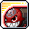
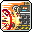
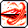
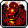
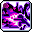

# ⚓ สายโจรสลัด (10 อาชีพ)

สายโจรสลัดมีเอกลักษณ์หลากหลายที่สุด ทั้งการต่อสู้ด้วยศิลปะการต่อสู้ระยะประชิด, การใช้ปืนใหญ่, การขับหุ่นยนต์ และเวทมนตร์อสูร

***

### 1. Buccaneer (บัคคาเนียร์ - Explorer)

* **สเตตัสหลัก:** STR | **อาวุธ:** สนับมือ (Knuckle) + พลังมังกรน้ำ (Lord of the Deep)
* **สกิลฟาร์มหลัก:** Lord of the Deep (มังกรน้ำหมุนรอบตัว แค่เดินผ่านมอนสเตอร์ก็ตาย - บอทสบายที่สุด!)
* **สกิลบอส:** Octopunch + Super Saiyan (Nautilus Strike)
* **สกิล 5th Job:** Lord of the Deep, Serpent Vortex, Meltdown, Howling Fist
* **🎯 แนะนำตั้งปุ่มบอท 1-4:**
  *   `[1]`&#x20;

      

      &#x20;**Spiral Assault** /&#x20;

      

      &#x20;**Octopunch** (ชกหมัดคลื่นมังกร)
  *   `[2]`&#x20;

      

      &#x20;**Serpent Vortex** (พุ่งทะลวงด้วยมังกรน้ำ)
  *   `[3]`&#x20;

      

      &#x20;**Nautilus Strike** (เรือดำน้ำนอติลุสยิงถล่มทั้งจอ)
  *   `[4]`&#x20;

      

      &#x20;**Howling Fist** (หมัดมังกรยักษ์คำรามทลายบอส)

***

### 2. Corsair (คอร์แซร์ - Explorer)

* **สเตตัสหลัก:** DEX | **อาวุธ:** ปืนพก (Gun) + กระสุน (Bullets)
* **สกิลฟาร์มหลัก:** Eight-Legs Easton (ปลาหมึกยักษ์ฟาดพื้น) + เรียกทหารเรือ (Broadside)
* **สกิลบอส:** Rapid Fire + Target Lock
* **สกิล 5th Job:** Bullet Barrage, Target Lock, Deadeye, Death Trigger
* **🎯 แนะนำตั้งปุ่มบอท 1-4:**
  *   `[1]`&#x20;

      

      &#x20;**Eight-Legs Easton** (หนวดปลาหมึกยักษ์ฟาดกวาดแมพ)
  *   `[2]`&#x20;

      

      &#x20;**Target Lock** (ล็อคเป้ายิงสไนเปอร์อัตโนมัติ)
  *   `[3]`&#x20;

      

      &#x20;**Bullet Barrage** (สาดกระสุนปืนกลรอบตัว 360 องศา)
  *   `[4]`&#x20;

      

      &#x20;**Nautilus Strike** (เรือรบยิงปืนใหญ่ถล่มจอ)

***

### 3. Cannoneer (แคนนอนเนียร์ - Explorer)

* **สเตตัสหลัก:** STR | **อาวุธ:** Hand Cannon (ปืนใหญ่แขน) + ลิงคู่หู
* **สกิลฟาร์มหลัก:** Cannon Bazooka (ลูกปืนใหญ่ระยะยิงไกลที่สุดในเกม)
* **สกิลบอส:** Cannon Barrage + The Nuclear Option (ขีปนาวุธนิวเคลียร์)
* **สกิล 5th Job:** Cannon of Mass Destruction, The Nuclear Option, Monkey Business, Poolmaker
* **🎯 แนะนำตั้งปุ่มบอท 1-4:**
  *   `[1]`&#x20;

      

      &#x20;**Cannon Bazooka** (ยิงลำแสงปืนใหญ่ทะลวงยาวสุดขอบจอ)
  *   `[2]`&#x20;

      

      &#x20;**Cannon of Mass Destruction** (กระสุนปืนใหญ่ยักษ์กลิ้งช้าๆ กวาดมอนทั้งแมพ)
  *   `[3]`&#x20;

      

      &#x20;**The Nuclear Option** (ยิงจรวดนิวเคลียร์ระเบิดทั้งจอ)
  *   `[4]`&#x20;

      

      &#x20;**Monkey Business** (ฝูงลิงปาระเบิดช่วยโจมตี)

***

### 4. Thunder Breaker (ธันเดอร์ เบรคเกอร์ - Cygnus Knights)

* **สเตตัสหลัก:** STR | **อาวุธ:** สนับมือ (Knuckle) + สายฟ้าและฉลาม
* **สกิลฟาร์มหลัก:** Thunderbolt (สายฟ้าฟาด) + Tidal Crash (คลื่นยักษ์)
* **สกิลบอส:** Annihilate (หมัดฉลามยักษ์)
* **สกิล 5th Job:** Primal Bolt, Lightning Cascade, Shark Wave, Phalanx Charge
* **🎯 แนะนำตั้งปุ่มบอท 1-4:**
  *   `[1]`&#x20;

      

      &#x20;**Thunderbolt** (สายฟ้าฟาดลงมาจากฟ้ารัศมีกว้าง)
  *   `[2]`&#x20;

      

      &#x20;**Tidal Crash** /&#x20;

      

      &#x20;**Sea Wave** (คลื่นยักษ์ซัดกวาดมอน)
  *   `[3]`&#x20;

      

      &#x20;**Lightning Cascade** (สายฟ้ากระหน่ำชิ่งทั่วหน้าจอ)
  *   `[4]`&#x20;

      

      &#x20;**Shark Wave** (ฉลามคลื่นสายฟ้าพุ่งทะลุจอ)

***

### 5. Mechanic (เมคานิก - Resistance)

* **สเตตัสหลัก:** DEX | **อาวุธ:** ปืน (Gun) + ขับหุ่นยนต์รบ (Metal Armor)
* **สกิลฟาร์มหลัก:** Heavy Salvo Plus + ติดตั้งป้อมปืน (Robo Launcher)
* **สกิลบอส:** AP Salvo Plus + Homing Beacon (มิสไซล์นำวิถี)
* **สกิล 5th Job:** Doomsday Device, Mobile Force, Full Metal Barrage, Mecha Carrier
* **🎯 แนะนำตั้งปุ่มบอท 1-4:**
  *   `[1]`&#x20;

      

      &#x20;**Heavy Salvo Plus** (สาดกระสุนปืนกลหุ่นยนต์)
  *   `[2]`&#x20;

      

      &#x20;**Homing Beacon** (ยิงมิสไซล์ติดตามอัตโนมัติหลายสิบลูก)
  *   `[3]`&#x20;

      

      &#x20;**Full Metal Barrage** (กราดยิงขีปนาวุธหมดแม็กกาซีน)
  *   `[4]`&#x20;

      

      &#x20;**Mecha Carrier** (เรือบรรทุกเครื่องบินทิ้งระเบิดทั่วแมพ)

***

### 6. Shade (เชด / อึนวอล - Heroes)

* **สเตตัสหลัก:** STR | **อาวุธ:** สนับมือ (Knuckle) + วิญญาณจิ้งจอก
* **สกิลฟาร์มหลัก:** Bomb Punch (หมัดวิญญาณระเบิด 4 จังหวะ)
* **สกิลบอส:** Spirit Claw + Soul Splitter (แยกร่างวิญญาณบอส)
* **สกิล 5th Job:** Spiritgate, True Spirit Claw, Ghost Park, Smashing Multiple
* **🎯 แนะนำตั้งปุ่มบอท 1-4:**
  *   `[1]`&#x20;

      

      &#x20;**Bomb Punch** (หมัดระเบิดวิญญาณคลื่นยักษ์)
  *   `[2]`&#x20;

      

      &#x20;**Soul Splitter** (แยกวิญญาณศัตรูเพิ่มดาเมจ 100%)
  *   `[3]`&#x20;

      

      &#x20;**True Spirit Claw** (กรงเล็บวิญญาณยักษ์ฉีกกระชากทั้งจอ)
  *   `[4]`&#x20;

      

      &#x20;**Spiritgate** (ประตูวิญญาณปล่อยสุนัขจิ้งจอกช่วยกัด)

***

### 7. Angelic Buster (แองเจลิก บัสเตอร์ - Nova)

* **สเตตัสหลัก:** DEX | **อาวุธ:** Soul Shooter (ปืนแหวนเวทมนตร์) - ไม่มีค่า MP (ใช้ Soul Recharge)
* **สกิลฟาร์มหลัก:** Celestial Roar (มังกรคำรามกวาดทั้งจอ)
* **สกิลบอส:** Trinity + Spotlight
* **สกิล 5th Job:** Spotlight, Sparkle Burst, Superstar Pop, Trinity Fusion
* **🎯 แนะนำตั้งปุ่มบอท 1-4:**
  *   `[1]`&#x20;

      

      &#x20;**Celestial Roar** (มังกรคำรามเสียงกึกก้องกวาดมอนสเตอร์)
  *   `[2]`&#x20;

      

      &#x20;**Sparkle Burst** (ริบบิ้นเวทมนตร์ระเบิดสะเก็ดดาว)
  *   `[3]`&#x20;

      

      &#x20;**Spotlight** (ส่องไฟสปอตไลท์คอนเสิร์ตเผามอนสเตอร์)
  *   `[4]`&#x20;

      

      &#x20;**Trinity Fusion** (พลังมังกรไอดอลระเบิดบอส)

***

### 8. Ark (อาร์ค - Flora)

* **สเตตัสหลัก:** STR | **อาวุธ:** สนับมือ (Knuckle) + แปลงร่างสัตว์ประหลาด (Specter State)
* **สกิลฟาร์มหลัก:** Basic Charge Drive + Scarlet / Gust / Abyssal Charge Drive
* **สกิลบอส:** Endless Pain + Infinity Spell
* **สกิล 5th Job:** Infinity Spell, Abyssal Recall, Devious Nightmare, Endlessly Starving Beast
* **🎯 แนะนำตั้งปุ่มบอท 1-4:**
  *   `[1]`&#x20;

      

      &#x20;**Basic Charge Drive** /&#x20;

      

      &#x20;**Grievous Wound** (กรงเล็บอสูรกวาดมอน)
  *   `[2]`&#x20;

      

      &#x20;**Abyssal Charge Drive** (คลื่นเวทมนตร์แห่งความมืด)
  *   `[3]`&#x20;

      

      &#x20;**Abyssal Recall** (ดึงมิติดำมืดระเบิดทั้งแมพ)
  *   `[4]`&#x20;

      

      &#x20;**Endlessly Starving Beast** (อสูรยักษ์พุ่งขึ้นมากัดกินหน้าจอ)

***

### 9. Jett (เจ็ทต์ - Regional)

* **สเตตัสหลัก:** DEX | **อาวุธ:** ปืน (Gun) + Core พลังคอสมิก
* **สกิลฟาร์มหลัก:** Starline One / Two / Three + Backup Beatdown
* **สกิลบอส:** Rapid Fire + Singularity Shock
* **สกิล 5th Job:** Gravity Crusher, Sub-orbital Bombardment, Allied Fury
* **🎯 แนะนำตั้งปุ่มบอท 1-4:**
  *   `[1]`&#x20;

      

      &#x20;**Starline** /&#x20;

      

      &#x20;**Backup Beatdown** (พุ่งควงปืนกวาดศัตรู)
  *   `[2]`&#x20;

      

      &#x20;**Planet Buster** (ทุบดาวเคราะห์ระเบิดพื้นดิน)
  *   `[3]`&#x20;

      

      &#x20;**Gravity Crusher** (สร้างหลุมดำดูดและระเบิดมอนสเตอร์)
  *   `[4]`&#x20;

      

      &#x20;**Allied Fury** (เรียกยานอวกาศเพื่อนร่วมทีมยิงถล่ม)

***

### 10. Mo Xuan (โม่ ซวน - Regional)

* **สเตตัสหลัก:** STR | **อาวุธ:** สนับมือ (Knuckle) + กำลังภายในศิลปะการต่อสู้จีน
* **สกิลฟาร์มหลัก:** Xuanwu / Qinglong Fist (หมัดสัตว์เทพกวาดมอน)
* **สกิลบอส:** Dragon Wave + Ultimate Strike
* **สกิล 5th Job:** Heaven and Earth Palm, Dragon Ascension, Divine Fist
* **🎯 แนะนำตั้งปุ่มบอท 1-4:**
  *   `[1]`&#x20;

      

      &#x20;**Qinglong Fist** (หมัดมังกรฟ้าซัดคลื่นลมปราณ)
  *   `[2]`&#x20;

      

      &#x20;**Xuanwu Stomp** (กระทืบพื้นคลื่นเต่าดำ)
  *   `[3]`&#x20;

      

      &#x20;**Heaven and Earth Palm** (ฝ่ามือสะท้านฟ้าสะเทือนดิน)
  *   `[4]`&#x20;

      

      &#x20;**Dragon Ascension** (มังกรทองพุ่งทะยานกวาดทั้งจอ)
