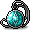
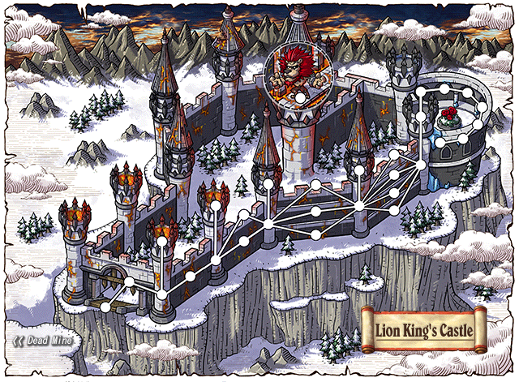
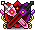
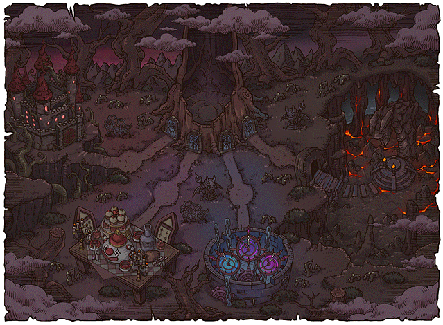
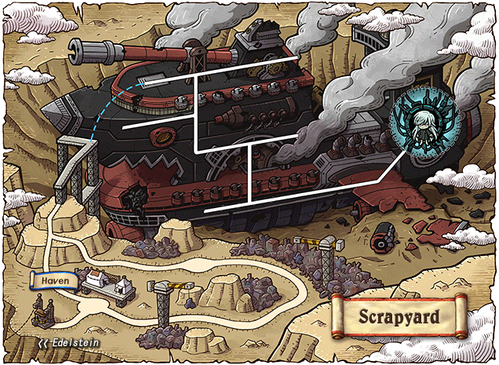
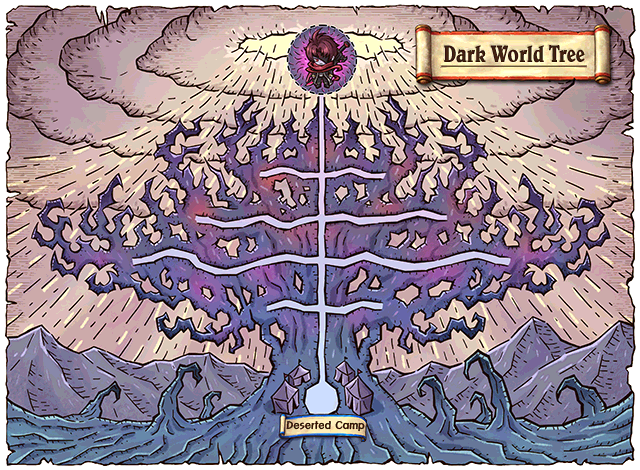
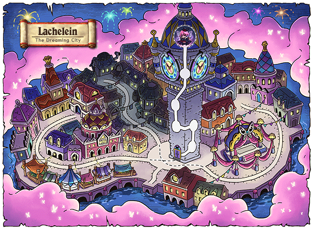
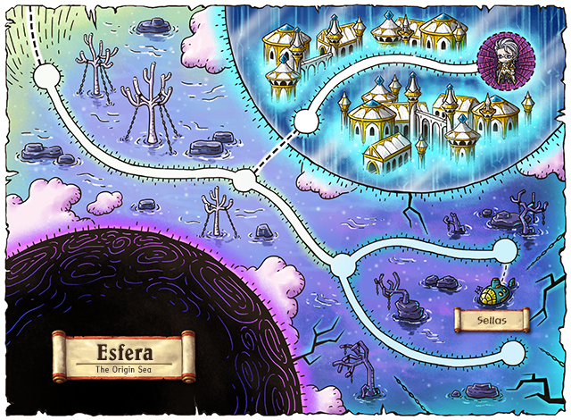

# 🏰 ข้อมูลบอส & ดันเจี้ยน (@bossinfo)

การล่าบอสคือหัวใจสำคัญที่สุดในการพัฒนาตัวละครของ **Clover Idle Story** เพื่อตามหาอุปกรณ์สวมใส่ระดับสูง เซ็ตประดับบอส อาวุธประจำสายอาชีพ ชิ้นส่วนแลกอุปกรณ์ และเงิน Meso มหาศาลสำหรับการตีบวกและรีโรลศักยภาพ

***

## ⏱️ 1. การตรวจสอบรอบบอสและการเข้าห้องบอส (`@boss` / `@bossinfo`)

* **คำสั่งเช็ครอบคูลดาวน์บอส:** พิมพ์ **`@boss`** หรือ **`@bossinfo`** ในช่องแชท
* **ระบบจะแสดงผล:**
  * รายการบอสทั้งหมดที่ตัวละครสามารถท้าทายได้
  * สถานะความพร้อม (พร้อมเข้าสู้ หรือ ต้องรอเวลารีเซ็ตอีกกี่ชั่วโมง/นาที)
  * รอบการรีเซ็ตบอส:
    * **บอสประจำวัน (Daily Bosses):** รีเซ็ตทุกเที่ยงคืน (00:00 น.) ของทุกวัน
    * **บอสประจำสัปดาห์ (Weekly Bosses):** รีเซ็ตทุกวันพฤหัสบดี เวลา 00:00 น.
    * **บอสประจำเดือน (Monthly Boss):** Black Mage รีเซ็ตทุกวันที่ 1 ของเดือน เวลา 00:00 น.
* **ระบบวาร์ปหน้าห้องบอส:** สามารถเปิดระบบ **Maple Guide `[ U ]`** หรือใช้ปุ่ม Boss UI บนหน้าจอ เพื่อเทเลพอร์ตไปยังหน้าห้องบอสได้ทันทีฟรี!

***

## 🏆 2. ตารางข้อมูลบอสและไอเทมดรอปเด่น (Boss Progression Ladder)

| ลำดับขั้นบอส                               | รายชื่อบอส & ความยาก              | เลเวลแนะนำ |     รอบรีเซ็ต    | ไอเทมดรอปเด่นที่สำคัญ                                                                            |
| ------------------------------------------ | --------------------------------- | :--------: | :--------------: | ------------------------------------------------------------------------------------------------ |
| **🔰 บอสประจำวัน (Daily Bosses)**          | **Normal Zakum**                  |    100+    |      รายวัน      | Aquatic Letter Eye, Condensed Power Crystal, Meso                                                |
|                                            | **Normal / Chaos Horntail**       |    130+    |      รายวัน      | Silver Blossom Ring, Dea Sidus Earring, Horntail Necklace _(Chaos ดรอป Chaos Horntail Necklace)_ |
|                                            | **Easy / Normal / Hard Hilla**    |    120+    |      รายวัน      | สัตว์เลี้ยง Dark Soul Pet _(ดรอปจาก Hard)_, Necro Set, กล่องหิน Soul                             |
|                                            | **Normal Root Abyss (4 บอส)**     |    130+    |      รายวัน      | เหรียญ Yggdrasil Rune, ปลดล็อคเงื่อนไขเข้าสู่โหมด Chaos                                          |
|                                            | **Easy / Normal / Hard Von Leon** |    130+    |      รายวัน      | Von Leon Set, เครื่องประดับ Ifia (สะสม 10 ชิ้นแลกเป็น **Noble Ifia's Ring**)                     |
|                                            | **Normal / Chaos Pink Bean**      |    160+    | รายวัน / สัปดาห์ | Golden Clover Belt, Pink Holy Cup _(Chaos ดรอป **Black Bean Ring**)_                             |
|                                            | **Easy / Normal Arkarium**        |    140+    |      รายวัน      | Mechanator Pendant, **Dominator Pendant** _(ดรอปเฉพาะ Normal เท่านั้น)_, Primal Essence          |
|                                            | **Easy / Normal Magnus**          |    130+    |      รายวัน      | Royal Black Metal Shoulder, Crystal Ventus Badge _(ดรอปจาก Normal ขึ้นไป)_, Nova Set             |
|                                            | **Easy / Normal Cygnus**          |    140+    |      สัปดาห์     | Dream Fragments, เซ็ตเกราะและอาวุธ Empress (Lv. 140)                                             |
|                                            | **Normal Papulatus**              |    155+    |      รายวัน      | Papulatus Clock Chair, เหรียญ Meso, ใบอัปเกรด                                                    |
| **⚔️ บอสสัปดาห์ระดับกลาง (Weekly Bosses)** | **Chaos Zakum**                   |    180+    |      สัปดาห์     | Chaos Zakum Helmet, Enraged Zakum Belt, เม็ดเงินก้อนโต                                           |
|                                            | **Chaos Root Abyss (CRA 4 บอส)**  |    180+    |      สัปดาห์     | **ชิ้นส่วน 4 บอสแลกเซ็ต Fafnir (CRA Lv.150)**, คริสตัลบอส Meso                                   |
|                                            | **Hard Magnus**                   |    190+    |      สัปดาห์     | เหรียญ Magnus Coin, **ผ้าคลุม Tyrant Cloak**, เข็มขัด Tyrant Belt                                |
|                                            | **Chaos Papulatus**               |    200+    |      สัปดาห์     | **Papulatus Mark (หน้ากากเวล 145 ดรอปเฉพาะ Chaos เท่านั้น)**                                     |
|                                            | **Guardian Angel Slime (N/C)**    |    210+    |      สัปดาห์     | **Guardian Angel Ring (แหวนเวล 160)**                                                            |
|                                            | **Lotus (Normal)**                |    210+    |      สัปดาห์     | Extraordinary Energy Core Grade S ➔ **แลกเซ็ต AbsoLab (สาย Haven)**                              |
|                                            | **Damien (Normal)**               |    210+    |      สัปดาห์     | Twisted Stigma Energy Piece ➔ **แลกเซ็ต AbsoLab (สาย World Tree)**                               |
| **🌌 บอสระดับสูง (End-Game Bosses)**       | **Lotus (Hard)**                  |    230+    |      สัปดาห์     | **Berserked (หน้ากากใบหน้าเวล 160 - Pitched Boss)**                                              |
|                                            | **Damien (Hard)**                 |    230+    |      สัปดาห์     | **Magic Eyepatch (ประดับตาเวล 160 - Pitched Boss)**                                              |
|                                            | **Lucid (Normal / Hard)**         |    235+    |      สัปดาห์     | Phantasma Shards ➔ **แลกเซ็ต Arcane Umbra**, **Dreamy Belt (เข็มขัดเวล 200)**                    |
|                                            | **Will (Normal / Hard)**          |    235+    |      สัปดาห์     | Arachno Shards ➔ **แลกเซ็ต Arcane Umbra**, **Cursed Spellbook (กระเป๋าเวล 160)**                 |
|                                            | **Gloom (Chaos)**                 |    245+    |      สัปดาห์     | **Endless Terror (แหวนเวล 200 - Pitched Boss)**                                                  |
|                                            | **Verus Hilla (Hard)**            |    250+    |      สัปดาห์     | **Source of Suffering (สร้อยคอเวล 200 - Pitched Boss)**                                          |
|                                            | **Darknell (Hard)**               |    255+    |      สัปดาห์     | **Commanding Force Earring (ต่างหูเวล 200 - Pitched Boss)**                                      |
|                                            | **Black Mage (บอสแห่งความมืด)**   |    255+    |  เดือนละ 1 ครั้ง | **Genesis Weapon (อาวุธเทพปลดผนึก)**, **Genesis Badge (ตราเหรียญเวล 200)**                       |
|                                            | **Chosen Seren (Hard)**           |    265+    |      สัปดาห์     | **Mitra's Rage (ตรา Emblem เวล 200 - Pitched Boss)**                                             |

***

## 💍 3. เซ็ตประดับบอสยอดนิยม (Boss Accessory Set)

เซ็ตประดับบอส (Boss Accessory Set) คืออุปกรณ์ประดับหลักสำหรับผู้เล่นตั้งแต่ระดับเริ่มต้นไปจนถึงระดับกลาง-สูง หาง่าย มีสเตตัสโบนัสสูง และมอบผลลัพธ์ของเซ็ตที่คุ้มค่ามาก

### 3.1 ตารางไอเทมประดับบอสทั้ง 14 ชิ้น พร้อมเลเวลสวมใส่

|                                                         ภาพไอคอน                                                         | ชื่อไอเทมประดับ                  |     ตำแหน่งสวมใส่    | เลเวลที่ต้องการ (Req Lv) | บอสที่ดรอปไอเทม              | จุดเด่นและคำแนะนำ                                                             |
| :----------------------------------------------------------------------------------------------------------------------: | -------------------------------- | :------------------: | :----------------------: | ---------------------------- | ----------------------------------------------------------------------------- |
|                  | **Aquatic Letter Eye Accessory** |    หน้ากากตา (Eye)   |        **Lv. 100**       | Normal / Chaos Zakum         | ประดับตาชิ้นแรกของทุกคน สเตตัสคุ้มค่า                                         |
|        | **Condensed Power Crystal**      |  ประดับใบหน้า (Face) |        **Lv. 110**       | Normal / Chaos Zakum         | ประดับหน้ายอดนิยม ส่อง Potential ติด 6-9% ง่าย                                |
|                | **Silver Blossom Ring**          |      แหวน (Ring)     |        **Lv. 110**       | Horntail (ทุกระดับ)          | แหวนสเตตัสเริ่มต้น ตีบวกดาวและศักยภาพได้                                      |
|                | **Noble Ifia's Ring**            |      แหวน (Ring)     |        **Lv. 120**       | Von Leon / Rose Garden       | รวมเครื่องประดับ Ifia 10 ชิ้นแลกกับ NPC Ifia ตีบวกได้ถึง 15+ ดาว              |
|  | **Royal Black Metal Shoulder**   |  หัวไหล่ (Shoulder)  |        **Lv. 120**       | Magnus (ทุกระดับ)            | หัวไหล่มาตรฐานสำหรับเก็บเซ็ตโบนัส                                             |
|                  | **Mechanator Pendant**           |   สร้อยคอ (Pendant)  |        **Lv. 120**       | Arkarium (Easy / Normal)     | สร้อยเส้นรองสำหรับใส่คู่กับ Dominator หรือ Horntail                           |
|        | **Chaos Horntail Necklace**      |   สร้อยคอ (Pendant)  |        **Lv. 120**       | **Chaos Horntail เท่านั้น**  | มี 3 Upgrade Slots ใช้ไข่ Dragon Egg บวก ATT ได้                              |
|              | **Crystal Ventus Badge**         |   ตราเหรียญ (Badge)  |        **Lv. 130**       | Magnus (Normal / Hard)       | ตราเหรียญบวก All Stat +10 และ ATT/M.ATT +5                                    |
|                    | **Dea Sidus Earring**            |   ต่างหู (Earring)   |        **Lv. 130**       | Horntail (Normal / Chaos)    | ต่างหูสเตตัสสูง สุ่มออพชั่นไฟ Rebirth Flame ได้สวย                            |
|                  | **Golden Clover Belt**           |    เข็มขัด (Belt)    |        **Lv. 140**       | Pink Bean (Normal / Chaos)   | เข็มขัดหลักสำหรับผู้เล่นช่วงกลางเกม                                           |
|                            | **Pink Holy Cup**                | กระเป๋าพกพา (Pocket) |        **Lv. 140**       | Pink Bean (Normal / Chaos)   | ใส่ในช่อง Pocket ได้รับ All Stat และ ATT สูง                                  |
|                    | **Dominator Pendant**            |   สร้อยคอ (Pendant)  |        **Lv. 140**       | **Normal Arkarium เท่านั้น** | **สร้อยคอที่ดีที่สุดในเซ็ต!** (Easy ไม่ดรอป) เป็น Boss Advantage ออพชั่นไฟสูง |
|                          | **Papulatus Mark**               |    หน้ากากตา (Eye)   |        **Lv. 145**       | **Chaos Papulatus เท่านั้น** | **ประดับตาเทพประจำเซ็ต!** (Normal ไม่ดรอป) ตีได้ถึง 20+ ดาว                   |
|                | **Guardian Angel Ring**          |      แหวน (Ring)     |        **Lv. 160**       | Guardian Angel Slime         | แหวนเลเวลสูง สามารถสวมใส่ร่วมกับเซ็ตได้                                       |

> 🌹 **สถานที่พบ NPC Ifia (การทำเควสต์แลก Noble Ifia's Ring):**
>
> * **แผนที่:** **Lion King's Castle : Rose Garden** (เข้าผ่านหอคอยที่ 5 ของปราสาทสิงโต El Nath)
> *   **NPC ประจำจุด:**
>
>     
>
>     **NPC Ifia**
> * **วิธีเดินทาง:** ใช้ Maple Guide `[ U ]` วาร์ปมายัง Lion King's Castle หรือเดินจาก El Nath ทะลุประตูหอคอยที่ 5 สู่ Rose Garden\
>   

***

### 3.2 เอฟเฟกต์โบนัสเซ็ต (Set Effects)

* **3 ชิ้น:** All Stat +10, Max HP/MP +5%, Weapon/Magic ATT +5
* **5 ชิ้น:** All Stat +10, Max HP/MP +5%, Weapon/Magic ATT +5
* **7 ชิ้น:** All Stat +10, Weapon/Magic ATT +10, **Ignore Enemy DEF +10%**
* **9 ชิ้น:** All Stat +15, Weapon/Magic ATT +10, **Boss Monster Damage +10%**

***

## 👑 4. เซ็ตประดับบอสระดับสุดยอด (Pitched Boss Set - End Game)

**Pitched Boss Set** คือสุดยอดเซ็ตประดับในตำนานของ MapleStory ที่ดรอปจากบอสระดับ Hard และ Chaos ชั้นนำเท่านั้น ทุกชิ้นเป็นไอเทมเลเวล 160 - 200 ที่มีสเตตัสพื้นฐานมหาศาล และเอฟเฟกต์เซ็ตที่เพิ่ม Critical Damage และ Boss Damage สูงสุดในเกม

|                                                       ภาพไอคอน                                                       | ชื่อไอเทมประดับ Pitched Boss |      ตำแหน่งสวมใส่     | เลเวลสวมใส่ (Req Lv) | บอสที่ดรอปไอเทม       |
| :------------------------------------------------------------------------------------------------------------------: | ---------------------------- | :--------------------: | :------------------: | --------------------- |
|                                | **Berserked**                |   ประดับใบหน้า (Face)  |      **Lv. 160**     | **Hard Lotus**        |
|                      | **Magic Eyepatch**           |     หน้ากากตา (Eye)    |      **Lv. 160**     | **Hard Damien**       |
|                  | **Cursed Spellbook**         |  กระเป๋าพกพา (Pocket)  |      **Lv. 160**     | **Hard Will**         |
|                            | **Dreamy Belt**              |     เข็มขัด (Belt)     |      **Lv. 200**     | **Hard Lucid**        |
|                      | **Endless Terror**           |       แหวน (Ring)      |      **Lv. 200**     | **Chaos Gloom**       |
|            | **Source of Suffering**      |    สร้อยคอ (Pendant)   |      **Lv. 200**     | **Hard Verus Hilla**  |
|  | **Commanding Force Earring** |    ต่างหู (Earring)    |      **Lv. 200**     | **Hard Darknell**     |
|                        | **Genesis Badge**            |    ตราเหรียญ (Badge)   |      **Lv. 200**     | **Black Mage**        |
|                      | **Mitra's Rage**             | ตราประจำอาชีพ (Emblem) |      **Lv. 200**     | **Hard Chosen Seren** |

* 🌟 **โบนัสเซ็ต Pitched Boss ที่โดดเด่น:**
  * เซ็ต 2 ชิ้น: All Stat +10, ATT/M.ATT +10, **Boss Damage +10%**
  * เซ็ต 3 ชิ้น: All Stat +10, ATT/M.ATT +10, **IED +10%**
  * เซ็ต 4 ชิ้น: All Stat +15, ATT/M.ATT +15, **Critical Damage +5%**
  * เซ็ต 5-9 ชิ้น: ดัน All Stat, ATT/M.ATT และ Boss Damage เพิ่มขึ้นแบบทวีคูณ!

***

## 🏛️ 5. ขั้นตอนและวิธีแลกอาวุธ & ชุดเซ็ตบอสที่ NPC


นอกจากการดรอปเป็นชิ้นอุปกรณ์สำเร็จรูปแล้ว ผู้เล่นยังสามารถสะสม **ชิ้นส่วนบอส (Shards)** หรือ **เหรียญแลกเปลี่ยน (Boss Coins)** เพื่อนำไปแลกซื้ออาวุธและชุดเกราะบอสที่ NPC ได้อย่างแน่นอน 100%:

***

### 🗡️ 5.1 เซ็ต Chaos Root Abyss (CRA - Fafnir Lv. 150)

เซ็ต Fafnir (CRA) ประกอบด้วย หมวก, เสื้อ, กางเกง และอาวุธประจำอาชีพ เป็นเซ็ตมาตรฐานยอดนิยมที่สุดในเกม

* **ชิ้นส่วนที่ใช้แลก (ดรอปจากบอส CRA):**
  * **Piece of Von Bon:** ใช้ **5 ชิ้น** แลก **หมวก CRA (Royal Hat)**
  * **Piece of Pierre:** ใช้ **5 ชิ้น** แลก **กางเกง CRA (Trixter Pants)**
  * **Piece of Crimson Queen:** ใช้ **5 ชิ้น** แลก **เสื้อ CRA (Eagle Eye Shirt)**
  * **Piece of Vellum:** ใช้ **15 ชิ้น** แลก **อาวุธ Fafnir Weapon**
* **วิธีและขั้นตอนการแลก:**
  1. สะสมชิ้นส่วนของบอสแต่ละตัวให้ครบตามจำนวนที่กำหนด
  2. เปิดช่องเก็บของ (Inventory `[ I ]`) ในหมวด **USE** หรือ **ETC**
  3. **ดับเบิ้ลคลิกที่ชิ้นส่วนบอสชิ้นนั้นๆ** (หรือคุยกับ NPC ในแผนที่ Colossus Root Abyss)
  4. หน้าต่างระบบจะแสดงรายการอาวุธหรือชุดเกราะตามสายอาชีพของคุณ สามารถคลิกเลือกชิ้นที่ต้องการเพื่อรับไอเทมได้ทันที!

> 🌳 **ข้อมูลแผนที่เมือง & NPC ประจำจุด:**
>
> * **แผนที่:** **Root Abyss : Colossal Root**
> *   **NPC ประจำจุด:**
>
>     
>
>     **NPC Oko** (ร้านค้าแลกเหรียญและของรางวัล Root Abyss)
> * **วิธีเดินทาง:** เดินทางจากทางเข้าลับใน **Sleepywood** หรือกด Maple Guide `[ U ]` เลือกวาร์ปมายัง Root Abyss ได้ทันที\
>   

***

### ⚙️ 5.2 เซ็ต AbsoLab (Lv. 160)

อุปกรณ์เซ็ต AbsoLab (หมวก, ถุงมือ, รองเท้า, ผ้าคลุม, หัวไหล่, อาวุธ) สามารถหาได้ผ่าน 2 เส้นทาง:

#### 📍 เส้นทางที่ 1: Scrapyard (Haven) - สายบอส Lotus

1. **วัตถุดิบที่ต้องใช้:**
   * **Diffusion-Line Energy Core Grade A:** ได้รับจากการทำเควสต์ประจำสัปดาห์ในเมือง Haven / Scrapyard
   * **Extraordinary Energy Core Grade S:** ดรอปจากการกำจัดบอส **Lotus** (Normal หรือ Hard)
2. **ขั้นตอนการแลก:**
   *   นำ **Grade S 1 ชิ้น + Grade A 20 ชิ้น** ไปผสมเป็น

       

       **AbsoLab Coin** 1 เหรียญ กับ NPC **One-Eye** ในแผนที่ Haven
   * ใช้ **AbsoLab Coin 2 เหรียญ** เพื่อแลกซื้อชิ้นส่วนชุดเกราะ (ถุงมือ, รองเท้า, ผ้าคลุม, หัวไหล่) กับ NPC **Three-Hands**
   * ใช้ **AbsoLab Coin 5 เหรียญ** เพื่อแลกซื้อ **อาวุธ AbsoLab Weapon** กับ NPC **Three-Hands**

> 🤖 **ข้อมูลแผนที่เมือง & NPC ประจำจุด (Scrapyard : Haven):**
>
> * **แผนที่:** **Scrapyard : Haven**
> *   **NPC ประจำจุด:** \*
>
>     ```
>     
>
>     &#x20;**One-Eye:** NPC สำหรับผสมเหรียญ AbsoLab Coin
>     ```
>
>     \*
>
>     ```
>     
>
>     &#x20;**Three-Hands:** NPC ร้านค้าจำหน่ายอุปกรณ์และอาวุธเซ็ต AbsoLab
>     ```
> * **วิธีเดินทาง:** นั่ง Danger Zone Taxi จากเมือง **Edelstein** หรือกด Maple Guide `[ U ]` วาร์ปตรงมายัง Haven ได้ทันที\
>   

#### 📍 เส้นทางที่ 2: Dark World Tree (Deserted Camp) - สายบอส Damien

1. **วัตถุดิบที่ต้องใช้:**
   * **Faint Stigma Spirit Stone:** ได้รับจากการทำเควสต์ประจำสัปดาห์ใน Dark World Tree (Deserted Camp)
   * **Twisted Stigma Energy Piece:** ดรอปจากการกำจัดบอส **Damien** (Normal หรือ Hard)
2. **ขั้นตอนการแลก:**
   *   นำ **Stigma Piece 1 ชิ้น + Spirit Stone 20 ชิ้น** ไปผสมเป็น

       

       **Stigma Coin** 1 เหรียญ กับ NPC **Quartermaster Sakaro** ใน Abandoned Camp
   * อัตราการแลก: 2 เหรียญสำหรับชุดเกราะ และ 5 เหรียญสำหรับอาวุธ

> 🌲 **ข้อมูลแผนที่เมือง & NPC ประจำจุด (Dark World Tree : Deserted Camp):**
>
> * **แผนที่:** **Dark World Tree : Deserted Camp**
> *   **NPC ประจำจุด:**
>
>     
>
>     **Quartermaster Sakaro:** NPC สำหรับผสมเหรียญ Stigma Coin และร้านค้าแลกชุด/อาวุธ AbsoLab
> * **วิธีเดินทาง:** เดินทางผ่านทางออกขวาของ **Sleepywood (Humid Swamp)** หรือกด Maple Guide `[ U ]` สู่ Deserted Camp\
>   

***

### 🌌 5.3 เซ็ต Arcane Umbra (Lv. 200)

สุดยอดอาวุธและชุดเกราะ End-Game ที่มีค่า Base ATT สูงที่สุดในเกม แลกได้ผ่าน 2 เมืองหลักใน Arcane River:

#### 📍 เส้นทางที่ 1: Lachelein (สายบอส Lucid)

* **วัตถุดิบ:**
  * **Butterfly Droplet Stone:** ดรอปจากการฟาร์มมอนสเตอร์ในแผนที่ Lachelein, Arcana, และ Morass
  * **Phantasma Shard:** ดรอปจากการกำจัดบอส **Lucid** (Normal หรือ Hard)
* **NPC ที่รับแลก:** NPC **Kanto** ในเมือง Lachelein
*   **อัตราแลกเหรียญ:** นำ **Phantasma Shard 1 ชิ้น + Butterfly Droplet 9 ชิ้น** ➔ แลกเป็น

    

    **Phantasma Coin** 1 เหรียญ

> 🎭 **ข้อมูลแผนที่เมือง & NPC ประจำจุด (Lachelein):**
>
> * **แผนที่:** **Lachelein : Lachelein Main Street**
> *   **NPC ประจำจุด:**
>
>     
>
>     **NPC Kanto:** ร้านค้าแลกเหรียญ Phantasma Coin และอาวุธ/เกราะ Arcane Umbra
> * **วิธีเดินทาง:** เดินทางผ่าน Arcane River (ต่อจาก Chu Chu Island) หรือวาร์ปผ่าน Maple Guide `[ U ]` (เลเวล 220+)\
>   

#### 📍 เส้นทางที่ 2: Esfera (สายบอส Will)

* **วัตถุดิบ:**
  * **Stone Cobweb Droplet:** ดรอปจากการฟาร์มมอนสเตอร์ในแผนที่ Esfera
  * **Arachno Shard:** ดรอปจากการกำจัดบอส **Will** (Normal หรือ Hard)
* **NPC ที่รับแลก:** NPC **Kanto** ในเมือง Esfera
*   **อัตราแลกเหรียญ:** นำ **Arachno Shard 1 ชิ้น + Cobweb Droplet 9 ชิ้น** ➔ แลกเป็น

    

    **Arachno Coin** 1 เหรียญ

> 🌊 **ข้อมูลแผนที่เมือง & NPC ประจำจุด (Esfera):**
>
> * **แผนที่:** **Esfera : Base Camp**
> *   **NPC ประจำจุด:**
>
>     
>
>     **NPC Kanto:** ร้านค้าแลกเหรียญ Arachno Coin และอาวุธ/เกราะ Arcane Umbra
> * **วิธีเดินทาง:** เดินทางผ่าน Arcane River (ต่อจาก Morass) หรือวาร์ปผ่าน Maple Guide `[ U ]` (เลเวล 235+)\
>   

#### 🛒 อัตราการแลกอุปกรณ์ Arcane Umbra:

* **ชุดเกราะ (หมวก, เสื้อสูท, ถุงมือ, รองเท้า, ผ้าคลุม, หัวไหล่):** ใช้ **12 เหรียญ** ต่อชิ้น
* **อาวุธประจำสายอาชีพ (Arcane Umbra Weapon):** ใช้ **24 เหรียญ** ต่อชิ้น

> 💡 **ทางลัดพิเศษใน Clover Idle Story:**\
> ผู้เล่นสามารถคลิกที่ปุ่ม **Quick Move** บนมุมซ้ายบนของหน้าจอในเมืองหลัก หรือตรวจสอบในร้านค้าด่วน เพื่อเข้าสู่หน้าต่างแลกเปลี่ยนอุปกรณ์บอสได้โดยตรงโดยไม่ต้องเสียเวลาเดินข้ามแผนที่!
