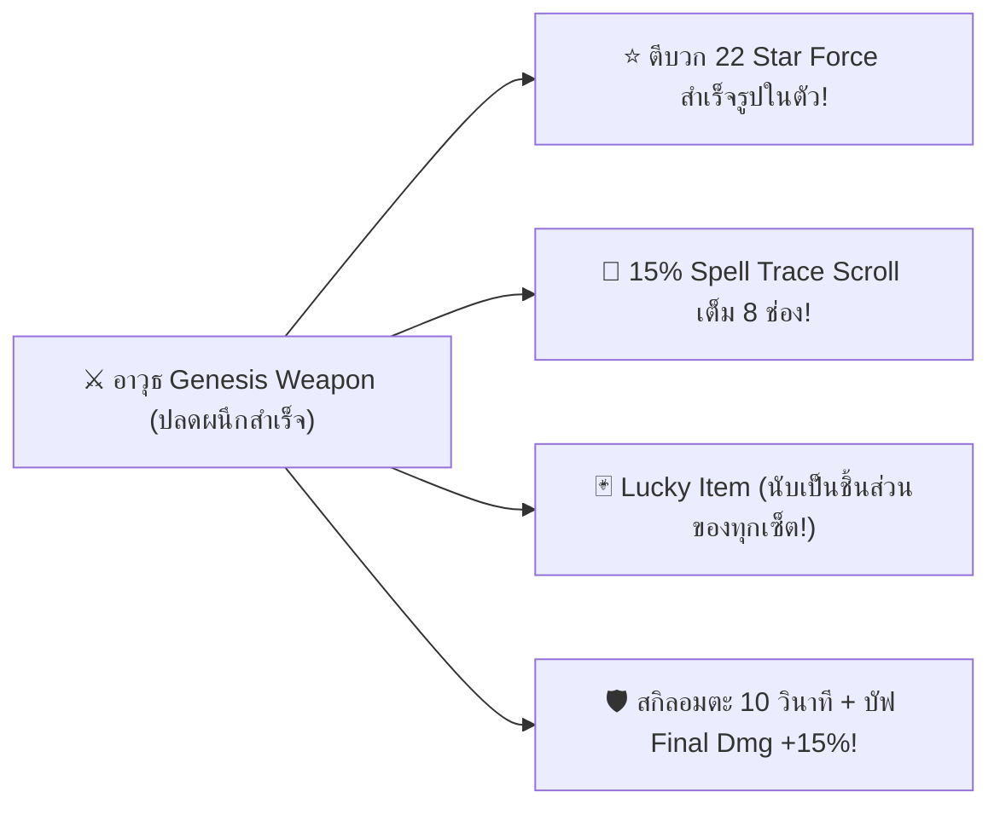
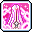
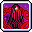

# ⚔️ การปลดผนึกอาวุธเทพ Genesis

อาวุธ **Genesis Weapon** คือสุดยอดอาวุธระดับสูงสุด (True End-Game Weapon) ของ MapleStory และ Clover Idle ที่ได้รับจากการพิชิตจอมเวทมนตร์ดำ **Black Mage** และผ่านบททดสอบการปลดผนึกพลัง **Liberation** ครบทั้ง 8 ด่าน เป็นอาวุธที่มาพร้อมกับสถานะตีบวกเต็มพิกัด **22 ดาว (22 Star Force)** ใบอัปเกรด 15% เต็มทุกช่อง และมอบ 2 สกิลระดับจักรวาลที่เปลี่ยนชีวิตการเล่นไปตลอดกาล!

***

## 👑 1. จุดเด่นและคุณสมบัติพิเศษของอาวุธ Genesis

เมื่อตัวละครปลดผนึกอาวุธ Genesis สำเร็จ อาวุธจะได้รับคุณสมบัติสุดโกงโดยอัตโนมัติ:

### สเตตัสและออพชั่นพื้นฐาน

* **เลเวลที่ต้องการ:** เลเวล 200 ขึ้นไป
* **สเตตัสหลัก:** **All Stat +150** (STR / DEX / INT / LUK)
* **พลังโจมตีพื้นฐาน:** **Weapon ATT / Magic ATT +340 ถึง +400+** (ขึ้นอยู่กับประเภทอาวุธ)
* **โบนัสนักล่าบอส:** **Boss Damage +30%** และ **Ignore Monster DEF +20%**
* **คุณสมบัติ Lucky Item (Joker Item):** อาวุธ Genesis จะทำหน้าที่เป็นชิ้นส่วนของเซ็ตอุปกรณ์ใดๆ ก็ตามที่ตัวละครกำลังสวมใส่อยู่ครบ 3 ชิ้นขึ้นไป (เช่น นับเป็นอาวุธ CRA 4 ชิ้น, นับเป็นอาวุธ Absolab 5 ชิ้น หรือ Arcane Umbra 5 ชิ้น เพื่อรับโบนัสเซ็ตสูงสุดพร้อมกัน!)

***

## 🌟 2. สุดยอด 2 สกิลประจำอาวุธ Genesis Weapon

อาวุธ Genesis เป็นเพียงอุปกรณ์ชนิดเดียวในเกมที่มอบสกิลกดใช้ระดับเทพ 2 สกิลลงในคีย์ลัดของตัวละคร:

|                                         ไอคอน                                         | ชื่อสกิล Genesis                                                                       | ผลลัพธ์และคุณสมบัติ                                                                                                                                                                          |    คูลดาวน์    | คำแนะนำในการใช้งาน                                                                                |
| :-----------------------------------------------------------------------------------: | -------------------------------------------------------------------------------------- | -------------------------------------------------------------------------------------------------------------------------------------------------------------------------------------------- | :------------: | ------------------------------------------------------------------------------------------------- |
|  | 
<strong>Aeonian Rise</strong> <strong>(พลังแห่งการปกป้องไร้กาลเวลา)</strong>
 | 
ได้รับสถานะ <strong>อมตะสมบูรณ์แบบ 10 วินาที (Invincibility)</strong> ป้องกันดาเมจทุกชนิด 100% แม้กระทั่งสกิลตาย One-Hit Kill ของบอส! <em>(หากกดซ้ำจะระเบิดดาเมจมหาศาลรอบตัว)</em>
 | **180 วินาที** | **สุดยอดสกิลเอาตัวรอดในการล่าบอสระดับสูงสุด** ใช้ยืนแลกดาเมจหรือหลบเมคานิกที่หลบไม่ได้อย่างสบายใจ |
|  | 
<strong>Tanadian Ruin</strong> <strong>(พลังแห่งการทำลายล้าง)</strong>
       | 
ได้รับบัฟ <strong>Final Damage +15% นาน 30 วินาที</strong> และทุกครั้งที่โจมตี จะมีสายฟ้าพลังแห่งการทำลายล้างระเบิดซ้ำใส่ศัตรูต่อเนื่อง
                                            |  **90 วินาที** | กดใช้ควบคู่กับสกิล Burst บัฟใหญ่ของคลาส 5 เพื่อระเบิดดาเมจบอสให้ละลายในพริบตา                     |

***

## 📜 3. เงื่อนไขและขั้นตอนภารกิจปลดผนึก 8 มหาบอส (Liberation Missions)

ในการปลดผนึกอาวุธ ตัวละครจะต้องเริ่มต้นจากการพิชิตบอส **Black Mage** ในปาร์ตี้เพื่อรับอาวุธเริ่มต้น:

1. ได้รับ **Sealed Genesis Weapon** (อาวุธเจเนซิสที่ถูกผนึก) ประจำสายอาชีพ
2.  ได้รับไอเทมวัตถุดิบ&#x20;

    

    &#x20;**Genesis Essence**
3. ตัวละครจะต้องเข้าไปทำภารกิจ **ท้าทายบอสระดับสูง 8 ด่านเพียงลำพัง (Solo Challenge)** ตามลำดับเดือนละ 1 ภารกิจ:

### ตารางภารกิจปลดผนึกบอสทั้ง 8 ด่าน

|   ลำดับด่าน   | บอสที่ต้องพิชิต | โหมดความยาก | เงื่อนไขและข้อจำกัดพิเศษในการสู้                          | รางวัลการปลดผนึกขั้น                         |
| :-----------: | --------------- | :---------: | --------------------------------------------------------- | -------------------------------------------- |
| **ด่านที่ 1** | **Von Leon**    |   **Hard**  | โซโล่คนเดียว สวมใส่ Sealed Genesis Weapon                 | ปลดล็อคโบนัส Stat ขั้นที่ 1                  |
| **ด่านที่ 2** | **Arkarium**    |  **Normal** | โซโล่คนเดียว สวมใส่ Sealed Genesis Weapon                 | ปลดล็อคโบนัส Stat ขั้นที่ 2                  |
| **ด่านที่ 3** | **Magnus**      |   **Hard**  | โซโล่คนเดียว + **ตัวละครโดนลด Final Damage -20%**         | ปลดล็อคโบนัส Stat ขั้นที่ 3                  |
| **ด่านที่ 4** | **Lotus**       |   **Hard**  | โซโล่คนเดียว + **ตัวละครโดนลด Final Damage -20%**         | ปลดล็อคโบนัส Stat ขั้นที่ 4                  |
| **ด่านที่ 5** | **Damien**      |   **Hard**  | โซโล่คนเดียว + **ตัวละครโดนลด Final Damage -20%**         | ปลดล็อคโบนัส Stat ขั้นที่ 5                  |
| **ด่านที่ 6** | **Will**        |   **Hard**  | โซโล่คนเดียว + **บอสมีค่า Max HP เพิ่มขึ้น**              | ปลดล็อคโบนัส Stat ขั้นที่ 6                  |
| **ด่านที่ 7** | **Lucid**       |   **Hard**  | โซโล่คนเดียว + **จำกัดจำนวนการใช้ขวดยา Potion**           | ปลดล็อคโบนัส Stat ขั้นที่ 7                  |
| **ด่านที่ 8** | **Verus Hilla** |   **Hard**  | โซโล่คนเดียว + **ลด Final Damage และจำกัดการฟื้นฟูเลือด** | **🎉 ปลดผนึกอาวุธ Genesis สมบูรณ์แบบ 100%!** |

***

## 🗡️ 4. แกลเลอรีอาวุธ Genesis ครบทุกสายอาชีพ

|                                        ภาพไอคอน                                       | ชื่ออาวุธ Genesis            | ประเภทอาวุธ        | อาชีพตัวอย่างที่ใช้งาน                                                        |
| :-----------------------------------------------------------------------------------: | ---------------------------- | ------------------ | ----------------------------------------------------------------------------- |
|  | **Genesis Two-Handed Sword** | ดาบสองมือ          | Hero, Paladin, Kaiser                                                         |
|  | **Genesis Dagger**           | มีดสั้น            | Shadower, Dual Blade                                                          |
|  | **Genesis Staff**            | ไม้เท้าเวทมนตร์    | Arch Mage (F/P, I/L), Bishop, Battle Mage, Evan, Luminous, Blaze Wizard, Lara |
|  | **Genesis Bow**              | คันธนู             | Bowmaster, Wind Archer                                                        |
|  | **Genesis Claw**             | กรงเล็บ            | Night Lord, Night Walker                                                      |
|  | **Genesis Lucent Gauntlet**  | สนับแขนแสง         | Adele                                                                         |
|  | **Genesis Soul Shooter**     | ปืนวิญญาณ          | Angelic Buster                                                                |
|  | **Genesis Chain**            | โซ่สังหาร          | Cadena                                                                        |
|  | **Genesis Ancient Bow**      | ธนูโบราณ           | Pathfinder                                                                    |
|  | **Genesis Crossbow**         | หน้าไม้            | Marksman, Wild Hunter                                                         |
|  | **Genesis Pistol**           | ปืนพก              | Corsair, Mechanic                                                             |
|  | **Genesis Siege Gun**        | ปืนใหญ่            | Cannoneer                                                                     |
|  | **Genesis Cane**             | ไม้เท้าโจร         | Phantom                                                                       |
|  | **Genesis Polearm**          | ง้าวโพลอาร์ม       | Aran                                                                          |
|  | **Genesis Katana**           | ดาบซามูไร          | Hayato                                                                        |
|  | **Genesis Fan**              | พัดเวทมนตร์        | Kanna, Ho Young                                                               |
|  | **Genesis Psy-limiter**      | อุปกรณ์ควบคุมจิต   | Kinesis                                                                       |
|  | **Genesis Desperado**        | ดาบปีศาจเดสเปอราโด | Demon Avenger                                                                 |
