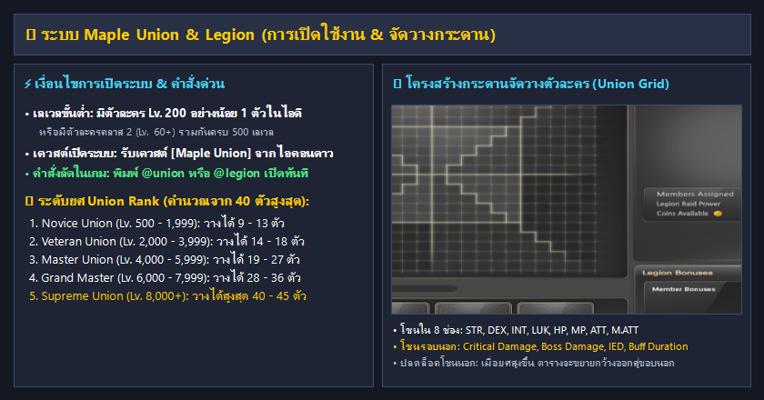
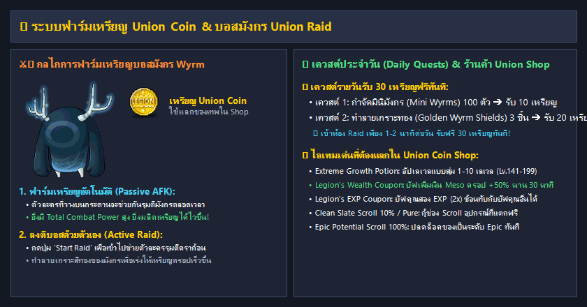

# ระบบ Union & Legion

ระบบ **Maple Union (Legion)** คือหนึ่งในระบบรากฐานที่สำคัญที่สุดของ **Clover Idle Story** โดยเป็นการนำตัวละครทั้งหมดที่มีในบัญชีมารวมพลังกัน จัดวางเป็นบล็อกจิ๊กซอว์ลงในตารางกระดาน เพื่อมอบค่าสเตตัสพิเศษมหาศาล (เช่น Critical Damage, Boss Damage, Ignore Enemy DEF, Buff Duration) ส่งต่อให้ **ทุกตัวละครในไอดี** ใช้งานร่วมกันได้อย่างถาวร!

***

## ⚡ 1. การเปิดใช้งานระบบ Union (System Unlock)

### 1.1 เงื่อนไขการเปิดระบบ

ผู้เล่นสามารถปลดล็อคระบบ Maple Union ได้ทันทีเมื่อผ่าน **เงื่อนไขข้อใดข้อหนึ่ง** ดังต่อไปนี้:

1. **มีตัวละครเลเวล 200 ขึ้นไปอย่างน้อย 1 ตัว** ภายในไอดี หรือ
2. **มีตัวละครคลาส 2 ขึ้นไป (เลเวล 60+) รวมกันครบ 500 เลเวลขึ้นไป** ในบัญชีเดียวกัน
3. รับเควสต์ปลดล็อคชื่อ **`[Maple Union] We Are Maple Union!`** จากไอคอนหลอดไฟหรือรูปดาวทางซ้ายของหน้าจอ เพื่อเปิดใช้งานระบบอย่างเป็นทางการ

### 1.2 วิธีเปิดหน้าต่างกระดาน Union ในเกม

* **คำสั่งพิมพ์ด่วน (แนะนำที่สุด):** พิมพ์คำสั่ง **`@union`** หรือ **`@legion`** ในช่องแชทเพื่อเปิดหน้าต่างทันที
* **ผ่านเมนูในเกม:** กดปุ่ม **Menu** หรือไอคอน **Setting** ที่แถบล่างขวา ➔ เลือกหัวข้อ **Maple Union** หรือตั้งปุ่มคีย์ลัดในหน้าต่างคีย์บอร์ด

***

### 1.3 ลำดับขั้นระดับยศ Union Rank (คำนวณจากเลเวลรวม 40 ตัวละครสูงสุด)

ระดับยศของ Union จะคำนวณจากผลรวมเลเวลของตัวละครที่มีเลเวลสูงสุด **40 ตัวแรก** ในบัญชี ยิ่งยศสูงขึ้น ตารางกระดานจะยิ่งขยายกว้างออก และสามารถส่งตัวละครลงไปวางได้มากขึ้น:

| ระดับยศ (Union Rank)            | เลเวลรวมที่ต้องการ (Total Level) | จำนวนตัวละครที่วางได้ (Attacker Slots) | เหรียญ Union Coin ในการเลื่อนขั้น |
| ------------------------------- | :------------------------------: | :------------------------------------: | :-------------------------------: |
| 🔰 **Novice Union I - V**       |          **500 - 1,999**         |             **9 - 13 ตัว**             |      ฟรี - เลื่อนขั้นตามเลเวล     |
| ⚔️ **Veteran Union I - V**      |         **2,000 - 3,999**        |             **14 - 18 ตัว**            |          130 - 370 เหรียญ         |
| 🛡️ **Master Union I - V**      |         **4,000 - 5,999**        |             **19 - 27 ตัว**            |          430 - 670 เหรียญ         |
| 👑 **Grand Master Union I - V** |         **6,000 - 7,999**        |             **28 - 36 ตัว**            |          730 - 970 เหรียญ         |
| 🌟 **Supreme Union I - V**      |         **8,000 ขึ้นไป**         |             **40 - 45 ตัว**            |           1,030+ เหรียญ           |

> 💡 **เป้าหมายเลเวลรวมแนะนำ (Milestones):**
>
> * **Union 6,000 (Grand Master):** จุดคุ้มค่าที่ปลดล็อคช่องตารางกระดานครบทุกโซน ทำให้สามารถลากบล็อกไปลงช่อง Critical Damage และ Boss Damage ได้เต็มพิกัด
> * **Union 8,000 (Supreme):** จุดสูงสุดของสาย End-Game ตัวละครวางได้ 40 ตัว สเตตัสเต็ม Max ทุกช่อง

***

## 🧩 2. โครงสร้างกระดานจัดวางตัวละคร (Union Grid Layout)

กระดาน Union แบ่งออกเป็น 2 ส่วนหลัก:

### 2.1 โซนชั้นใน 8 โซน (Inner Stats - สเตตัสพื้นฐาน)

เป็นช่องที่อยู่ติดกับจุดศูนย์กลางของกระดาน ประกอบด้วย:

* **STR, DEX, INT, LUK** (+5 ต่อช่อง)
* **Max HP, Max MP** (+250 ต่อช่อง)
* **Weapon ATT, Magic ATT** (+1 ต่อช่อง)
* _กฎการวาง:_ บล็อกตัวละครแรกต้องวางแตะจุดกึ่งกลาง และบล็อกถัดไปต้องวางต่อเชื่อมกันเสมอ

### 2.2 โซนชั้นนอก 8 โซน (Outer Stats - สเตตัสระดับเทพ ปลดล็อคตามยศ)

* 💥 **Critical Damage:** **+0.35% ต่อช่อง** _(ลงเต็ม 20 ช่องได้สูงสุด **+7.0%** สำคัญที่สุดในการดันดาเมจ!)_
* 👑 **Boss Monster Damage:** **+1.0% ต่อช่อง** _(ลงเต็ม 20 ช่องได้สูงสุด **+20.0%**)_
* 🛡️ **Ignore Enemy DEF (IED):** **+1.0% ต่อช่อง** _(ลงเต็ม 20 ช่องได้สูงสุด **+20.0%** เจาะเกราะบอสโหด)_
* ⏱️ **Buff Duration:** **+1.0% ต่อช่อง** _(ลงเต็ม 20 ช่องได้สูงสุด **+20.0%** ขยายเวลาบัฟสกิลและระเบิด)_
* 🎯 **Critical Rate:** **+1.0% ต่อช่อง** _(ลงเต็ม 20 ช่องได้สูงสุด **+20.0%**)_
* 📖 **Bonus EXP:** **+0.25% ต่อช่อง** _(ลงเต็ม 20 ช่องได้สูงสุด **+5.0%** ช่วยฟาร์มเลเวล)_
* ⚔️ **Damage to Normal Monsters:** **+1.0% ต่อช่อง** _(ช่วยให้สกิลกวาดมอนสเตอร์ตายใน 1 ที)_
* 🌀 **Knockback Resistance (Stance) / Status Resistance:** ป้องกันการกระเด็นและการติดสถานะ

***

## 🃏 3. สเตตัสบล็อกตัวละครครบทุกอาชีพ (Character Card / Block Effects)

ตัวละครแต่ละอาชีพที่นำมาวางบนกระดาน จะมอบสเตตัสโบนัสตามระดับคลาสของตัวเอง โดยแบ่งตามระดับเลเวล:

* **Rank B:** เลเวล 60 - 99
* **Rank A:** เลเวล 100 - 139
* **Rank S:** เลเวล 140 - 199 _(ระดับเริ่มต้นแนะนำสำหรับตัวฟาร์ม)_
* **Rank SS:** เลเวล 200 - 249 _(ระดับมาตรฐานยอดนิยม)_
* **Rank SSS:** เลเวล 250 ขึ้นไป

***

### 🔥 3.1 กลุ่มสเตตัสระดับเทพที่ต้องปั้นก่อน (Must-Have Priority Blocks)

| อาชีพ (Class)     | สายอาชีพ | สเตตัสบล็อกที่ได้รับ (Rank B / A / S / SS / SSS)                      | ความสำคัญ                                            |
| ----------------- | :------: | --------------------------------------------------------------------- | ---------------------------------------------------- |
| **Night Lord**    |    โจร   | **Critical Damage:** +1% / +2% / **+3%** / **+4%** / **+5%**          | **S-Tier สำคัญที่สุด!** ดาเมจพุ่งก้าวกระโดด          |
| **Marksman**      |  นักธนู  | **Critical Damage:** +1% / +2% / **+3%** / **+4%** / **+5%**          | **S-Tier สำคัญที่สุด!** ต้องมีคู่กับ Night Lord      |
| **Demon Avenger** |   นักรบ  | **Boss Damage:** +1% / +2% / **+3%** / **+5%** / **+6%**              | **S-Tier ล่าบอส** เพิ่มดาเมจบอสโดยตรง                |
| **Kanna**         |  นักเวท  | **Boss Damage:** +1% / +2% / **+3%** / **+5%** / **+6%**              | **S-Tier ล่าบอส** ดาเมจบอสโบนัส                      |
| **Blaster**       |   นักรบ  | **Ignore Enemy DEF (IED):** +1% / +2% / **+3%** / **+5%** / **+6%**   | **S-Tier ทะลุเกราะบอส**                              |
| **Luminous**      |  นักเวท  | **Ignore Enemy DEF (IED):** +1% / +2% / **+3%** / **+5%** / **+6%**   | **S-Tier ทะลุเกราะบอส**                              |
| **Mechanic**      |  โจรสลัด | **Buff Duration:** +5% / +10% / **+15%** / **+20%** / **+25%**        | **S-Tier ยืดเวลาบัฟ** บัฟสกิลและบัฟระเบิดอยู่นานขึ้น |
| **Mercedes**      |  นักธนู  | **Skill Cooldown Reduction:** -2% / -3% / **-4%** / **-5%** / **-6%** | **S-Tier ลดคูลดาวน์สกิล** ทำให้วนสกิลโจมตีได้ไวขึ้น  |
| **Zero**          |   พิเศษ  | **Bonus EXP:** +4% / +6% / **+8%** / **+10%** / **+12%**              | **S-Tier ฟาร์มเลเวล** เร่ง EXP ทั้งไอดี              |

***

### ⚔️ 3.2 กลุ่มอัตราคริติคอล, พลังโจมตี และสเตตัสพิเศษ

| อาชีพ (Class)           | สายอาชีพ | สเตตัสบล็อกที่ได้รับ (Rank B / A / S / SS / SSS)                             | คำอธิบาย                           |
| ----------------------- | :------: | ---------------------------------------------------------------------------- | ---------------------------------- |
| **Phantom**             |    โจร   | **Critical Rate:** +1% / +2% / **+3%** / **+4%** / **+5%**                   | ช่วยดันคริติคอลให้ครบ 100% ได้ง่าย |
| **Corsair**             |  โจรสลัด | **Summon Duration:** +4% / +6% / **+8%** / **+10%** / **+12%**               | เพิ่มระยะเวลาเรียกซัมมอนช่วยตี     |
| **Hayato**              |   นักรบ  | **Critical Damage:** +1% / +2% / +3% / **+5%** / +6%                         | เพิ่มคริติคอลเดเมจ                 |
| **Shade**               |  โจรสลัด | **Critical Damage:** +1% / +2% / **+3%** / **+5%** / **+6%**                 | เสริมคริติคอลเดเมจระดับสูง         |
| **Wild Hunter**         |  นักธนู  | **Damage on Attack (โอกาส 20%):** +4% / +8% / **+12%** / **+16%** / **+20%** | สุ่มเพิ่มดาเมจพิเศษขณะโจมตี        |
| **Silverpoint / Xenon** | โจร/สลัด | **STR, DEX, LUK:** +5 / +10 / **+20** / **+40** / **+50**                    | สเตตัสผสม 3 ค่า เหมาะกับตัวผสม     |

***

### 🛡️ 3.3 กลุ่ม Main Stat (STR / DEX / INT / LUK)

| สายสเตตัส                 | อาชีพในกลุ่ม                                                                   | สเตตัสบล็อกที่ได้รับ (Rank B / A / S / SS / SSS)               |
| ------------------------- | ------------------------------------------------------------------------------ | -------------------------------------------------------------- |
| **STR (สายพลัง)**         | Hero, Paladin, Dark Knight, Kaiser, Adele, Cannon Shooter, Ark                 | **STR:** +10 / +20 / **+40** / **+80** / **+100**              |
| **DEX (สายความคล่อง)**    | Bowmaster, Wind Archer, Pathfinder, Kain, Mercedes, Angelic Buster             | **DEX:** +10 / +20 / **+40** / **+80** / **+100**              |
| **INT (สายเวทมนตร์)**     | Arch Mage (F/P, I/L), Bishop, Blaze Wizard, Battle Mage, Illium, Lara, Kinesis | **INT:** +10 / +20 / **+40** / **+80** / **+100**              |
| **LUK (สายโชคชะตา)**      | Shadower, Dual Blade, Night Walker, Cadena, Hoyoung                            | **LUK:** +10 / +20 / **+40** / **+80** / **+100**              |
| **Max HP (สายพลังชีวิต)** | Mihile, Soul Master / Dawn Warrior                                             | **Max HP:** +250 / +500 / **+1,000** / **+2,000** / **+2,500** |
| **Max MP (สายพลังมานา)**  | Evan                                                                           | **Max MP:** +1% / +2% / **+3%** / **+4%** / **+5%**            |

***

## 🔗 4. ระบบ Link Skills ครบทุกอาชีพ (พร้อมภาพไอคอนแท้)

**Link Skill** คือสกิลประจำตัวที่ปลดล็อคเมื่อตัวละครถึง **เลเวล 70 (Level 1)** และ **เลเวล 120 (Level 2)** (บางอาชีพมี **Level 3** เมื่อถึงเลเวล 210) สามารถส่งต่อสกิลไปให้ตัวละครหลักใช้งานได้สูงสุด **12 สกิลพร้อมกัน**

***

### 🚀 4.1 สกิลสปีดฟาร์ม & เร่งเลเวล (Top 3 Must-Have Leveling Links)

|                                         ไอคอน                                        | สกิล Link               | อาชีพเจ้าของสกิล | ผลของสกิล (Level 1 / Level 2 / Level 3)                                                                                                                                | ความสำคัญ                                                          |
| :----------------------------------------------------------------------------------: | ----------------------- | :--------------: | ---------------------------------------------------------------------------------------------------------------------------------------------------------------------- | ------------------------------------------------------------------ |
|  | **Elven Blessing**      |   **Mercedes**   | 
• Lv.1: <strong>EXP +10%</strong> • Lv.2: <strong>EXP +15%</strong> • Lv.3: <strong>EXP +20%</strong> <em>(พร้อมสกิลกดวาร์ปกลับเมืองเอลฟ์ Elluel)</em>
 | **อันดับ 1 ในการเก็บเลเวล** ต้องปั้นเป็นตัวแรกของไอดี              |
|          | **Rune Persistence**    |     **Evan**     | 
• Lv.1: ระยะเวลาบัฟรูน <strong>+30%</strong> • Lv.2: ระยะเวลาบัฟรูน <strong>+50%</strong> • Lv.3: ระยะเวลาบัฟรูน <strong>+70%</strong>
                    | **อันดับ 2 ในการเก็บเลเวล** รูนคูณสอง EXP นานสะใจ                  |
|          | **Combo Kill Blessing** |     **Aran**     | 
• Lv.1: EXP จากลูกแก้วคอมโบ <strong>+400%</strong> • Lv.2: EXP จากลูกแก้วคอมโบ <strong>+650%</strong> • Lv.3: EXP จากลูกแก้วคอมโบ <strong>+900%</strong>
  | **อันดับ 3 เร่งเลเวลช่วงต้น** (Lv. 1-140 วิ่งเลเวลไวเหมือนติดสปีด) |

***

### 👑 4.2 สกิลสำหรับล่าบอส & เร่งดาเมจหลัก (Bossing & Damage Links)

|                                               ไอคอน                                              | สกิล Link                |  อาชีพเจ้าของสกิล  | ผลของสกิลที่ได้รับ (Level 2)                                 | คำอธิบายจุดเด่น                        |
| :----------------------------------------------------------------------------------------------: | ------------------------ | :----------------: | ------------------------------------------------------------ | -------------------------------------- |
|      | **Fury Unleashed**       |  **Demon Slayer**  | **Boss Damage +15%** _(Lv.3: +20%)_                          | ดาเมจตีบอสบวกตรงๆ มหาศาล               |
|    | **Wild Rage**            |  **Demon Avenger** | **Damage +10%** _(Lv.3: +15%)_                               | เพิ่มความเสียหายทั่วไปทุกรูปแบบ        |
|                | **Judgment**             |     **Kinesis**    | **Critical Damage +4%**                                      | เสริมคริติคอลเดเมจโดยตรง ดาเมจพุ่ง     |
|              | **Light Wash**           |    **Luminous**    | **Ignore Enemy DEF (IED) +15%** _(Lv.3: +20%)_               | เจาะเกราะบอส สำหรับบอสที่มี DEF 300%   |
|                | **Phantom Instinct**     |     **Phantom**    | **Critical Rate +15%** _(Lv.3: +20%)_                        | เพิ่มโอกาสติดคริติคอล 15%              |
|                    | **Noble Fire**           |      **Adele**     | **Boss Damage +4%** + โบนัสดาเมจตามจำนวนคนในปาร์ตี้          | เหมาะทั้งลุยเดี่ยวและลงตี้ล่าบอส       |
|                        | **Solus**                |       **Ark**      | **Damage +11%** สะสมสแต็กขณะต่อสู้                           | บัฟดาเมจต่อเนื่องตลอดการต่อสู้         |
|                  | **Tide of Battle**       |     **Illium**     | **Damage +12%** สะสมสแต็กเมื่อเคลื่อนที่                     | ดาเมจเพิ่มขึ้นขณะขยับตัวโจมตี          |
|                  | **Unfair Bargain**       |     **Cadena**     | **Damage +6%** ตีมอนติดสถานะผิดปกติ + โบนัสตีมอนเลเวลต่ำกว่า | เร่งดาเมจได้ดีกับสายดีบัฟ              |
|  | **Terms and Conditions** | **Angelic Buster** | **สกิลกดใช้: Damage +45%** นาน 10 วินาที _(คูลดาวน์ 90 วิ)_  | **สกิลกดเบิร์สดาเมจที่ดีที่สุดในเกม!** |
|                  | **Iron Will**            |     **Kaiser**     | **Max HP +15%** _(Lv.3: +20%)_                               | เหมาะสำหรับสายแทงค์และ Demon Avenger   |
|                    | **Hybrid Logic**         |      **Xenon**     | **All Stat +10%**                                            | เพิ่มสเตตัสรวมทุกค่า 10%               |
|                | **Bravado**              |     **Hoyoung**    | **IED +10%** และโจมตีศัตรูที่มี HP เต็มแรงขึ้น **+14%**      | ยอดเยี่ยมในการบอทฟาร์ม One-shot        |
|                      | **Nature's Friend**      |      **Lara**      | **Damage มอนสเตอร์ทั่วไป +5%** นาน 30 วินาที                 | ช่วยฟาร์มมอนตามแผนที่                  |
|                      | **Rhinne's Blessing**    |      **Zero**      | **ลดความเสียหายที่ได้รับ 15%** และ **IED +10%**              | ถึกขึ้นและเจาะเกราะบอส                 |
|                    | **Elementalism**         |      **Kanna**     | **Damage +10%**                                              | เพิ่มความเสียหายทั่วไป                 |
|                  | **Keen Edge**            |     **Hayato**     | **All Stat +25**, **ATT / Magic ATT +15**                    | บวกสเตตัสและพลังโจมตีตรงๆ              |
|                  | **Knight's Watch**       |     **Mihile**     | **สกิลกดใช้: ป้องกัน Knockback 100% (Stance)**               | สกิลยืนปักหลักโจมตี ไม่โดนผลัก         |
|                    | **Close Call**           |      **Shade**     | **โอกาส 10% รอดชีวิตจากการถูกโจมตีถึงตาย**                   | สกิลรอดตายฉุกเฉินตอนลงบอส              |

***

### 🛡️ 4.3 สกิลสายผสานข้ามตัวละคร (Stackable Links)

สกิลในกลุ่มนี้สามารถนำตัวละครสายเดียวกันมาซ้อนทับกัน เพื่อเพิ่มระดับเลเวลสกิลสูงสุดได้:

|                                           ไอคอน                                          | สกิล Link                  | กลุ่มอาชีพที่ใช้ผสาน                                                   | สเตตัสเมื่อสะสมครบระดับสูงสุด                                                                                                      |
| :--------------------------------------------------------------------------------------: | -------------------------- | ---------------------------------------------------------------------- | ---------------------------------------------------------------------------------------------------------------------------------- |
|             | **Invincible Belief**      | Hero, Paladin, Dark Knight                                             | **(สะสมสูงสุด Lv.6):** เมื่อ HP ต่ำกว่า 15% จะฟื้นฟูเลือดอัตโนมัติ 35% ต่อวินาที นาน 3 วินาที (คูลดาวน์ 410 วิ)                    |
|                | **Empirical Knowledge**    | F/P, I/L, Bishop                                                       | **(สะสมสูงสุด Lv.6):** โจมตีมีโอกาส 25% สแกนจุดอ่อนศัตรู เพิ่ม Damage +3% และ IED +3% ซ้อนทับได้ 3 สแต็ก (รวม Damage +9%, IED +9%) |
|              | **Adventurer's Curiosity** | Bowmaster, Marksman, Pathfinder                                        | **(สะสมสูงสุด Lv.6):** **Critical Rate +10%** และเพิ่มโอกาสบันทึกข้อมูล Monster Collection +35%                                    |
|               | **Thief's Cunning**        | Night Lord, Shadower, Dual Blade                                       | **(สะสมสูงสุด Lv.6):** เมื่อทำให้ศัตรูติดสถานะผิดปกติ จะเพิ่ม **Damage +18%** นาน 10 วินาที (คูลดาวน์ 20 วิ)                       |
|              | **Pirate's Blessing**      | Buccaneer, Corsair, Cannoneer                                          | **(สะสมสูงสุด Lv.6):** **All Stat +70**, Max HP/MP +1,225 และดูดซับความเสียหายที่ได้รับ 15%                                        |
|          | **Cygnus Blessing**        | Dawn Warrior, Blaze Wizard, Wind Archer, Night Walker, Thunder Breaker | **(สะสมสูงสุด Lv.10):** **Attack / Magic Attack +25**, Status Resistance +15 และต้านทานธาตุ +15%                                   |
|  | **Spirit of Freedom**      | Battle Mage, Wild Hunter, Mechanic, Blaster                            | **(สะสมสูงสุด Lv.8):** **อมตะหลังเกิดใหม่นานสูงสุด 8 วินาที** (สำคัญมากตอนลงบอสระดับสูง!)                                          |

***

## 🐉 5. ระบบบอสมังกร Union Raid & การฟาร์มเหรียญ Union Coin

เหรียญ **Union Coin** คือสกุลเงินพิเศษที่ใช้สำหรับเลื่อนระดับยศ Union และซื้อไอเทมบัฟพัฒนาตัวละครในร้านค้า Union Shop

### 5.1 กลไกการฟาร์มเหรียญ 2 รูปแบบ

1. **การฟาร์มเหรียญอัตโนมัติ (Passive AFK Earning):**
   * ตัวละครที่ผู้เล่นนำมาวางลงบนกระดาน Union จะถูกส่งเข้าไปรุมโจมตีบอสมังกร Wyrm ในห้องประลองตลอดเวลา แม้คุณจะออฟไลน์!
   * ความเร็วในการผลิตเหรียญขึ้นอยู่กับ **Total Combat Power (พลังโจมตีรวม)** ของตัวละครทั้งหมดที่วางบนกระดาน
   * ทุกๆ ความเสียหาย **100,000,000,000 (100 Billion)** ที่สร้างได้ จะดรอปเหรียญ Union Coin ให้ 1 เหรียญ
   * ผู้เล่นสามารถกดคุยกับ NPC หรือคลิกที่หน้าต่าง Union เพื่อรับเหรียญที่สะสมไว้ได้ตลอดเวลา
2. **การลงตีบอสด้วยตัวเอง (Active Union Raid):**
   * กดปุ่ม **"Start Raid"** ในหน้าต่าง Union เพื่อวาร์ปเข้าไปในห้องบอสดราก้อน
   * ตัวละครหลักของคุณสามารถช่วยตัวละครอื่นๆ รุมตีบอส ทำลายเกราะสีทองของดราก้อน และทำเควสต์รายวัน

***

### 5.2 เควสต์รายวันรับ 30 เหรียญฟรีทุกวัน (Daily Quests)

ในห้องบอส Union Raid จะมี NPC มอบเควสต์รายวัน 2 เควสต์ที่ทำง่าย ใช้เวลาเพียง 1 - 2 นาที:

* **เควสต์ที่ 1:** กำจัดลูกกระจ๊อกมังกร (Mini Wyrms) จำนวน 100 ตัว ➔ **รับฟรี 10 เหรียญ**
* **เควสต์ที่ 2:** ทำลายเกราะทองของดราก้อน (Golden Wyrm Shields) จำนวน 3 ชิ้น ➔ **รับฟรี 20 เหรียญ**
* 💡 **คำแนะนำ:** ทำทุกวันสะสมได้อย่างน้อย **วันละ 30 เหรียญฟรี** (สัปดาห์ละ 210 เหรียญ!)

***

### 🛒 5.3 ร้านค้า Union Coin Shop (ไอเทมคุ้มค่าน่าแลก)

สามารถเปิดร้านค้าได้โดยคุยกับ NPC **Dame Appropriation** หรือ **Mr. Bebe** ในห้อง Union:

| ไอเทมในร้านค้า                        | ผลประโยชน์ / คุณสมบัติ                                         | คำแนะนำการใช้งาน                                          |
| ------------------------------------- | -------------------------------------------------------------- | --------------------------------------------------------- |
| **Extreme Growth Potion**             | สุ่มเพิ่มเลเวล 1 - 10 เลเวลทันที (สำหรับตัวละคร Lv. 141 - 199) | **คุ้มค่าที่สุด!** ใช้ดันตัวรองขึ้นเลเวล 200 อย่างรวดเร็ว |
| **Legion's Wealth Coupon**            | บัฟเพิ่มเงิน Meso ดรอปจากมอนสเตอร์ **+50%** นาน 30 นาที        | **จำเป็นสำหรับสายบอทฟาร์มเงิน (`@bot`)** ดันรายได้มหาศาล  |
| **Legion's EXP Coupon**               | บัฟคูณสอง EXP (2x) นาน 30 นาที                                 | ซ้อนทับกับบัฟคูณ EXP อื่นๆ ได้ทุกชนิด ช่วยเร่งเลเวลไว     |
| **Clean Slate Scroll 10% / Pure**     | กู้ช่องอัปเกรด Scroll อุปกรณ์ที่อัปเกรดล้มเหลวกลับมา 1 ช่อง    | ประหยัดเงิน ไม่ต้องซื้อใบกู้ช่องราคาแพง                   |
| **Epic Potential Scroll 100%**        | ปลดล็อคศักยภาพอุปกรณ์เป็นระดับ **Epic** ทันที โอกาสสำเร็จ 100% | ใช้ตั้งต้นทำของสเตตัส 6% - 9%                             |
| **Powerful / Eternal Rebirth Flame**  | สุ่มค่า Bonus Stats สีเขียวให้กับอุปกรณ์ระดับสูง               | ใช้รีโรลหาไฟสวยๆ โดยไม่ต้องเสียเงิน Meso                  |
| **Master / Meister Craftsman's Cube** | ลูกเต๋าสุ่มศักยภาพ เลื่อนขั้นได้ถึง Unique และ Legendary       | ใช้ดันระดับศักยภาพอุปกรณ์ฟรี                              |
