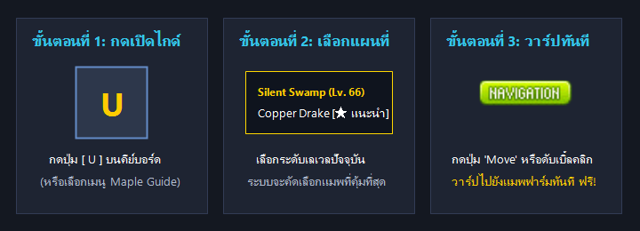
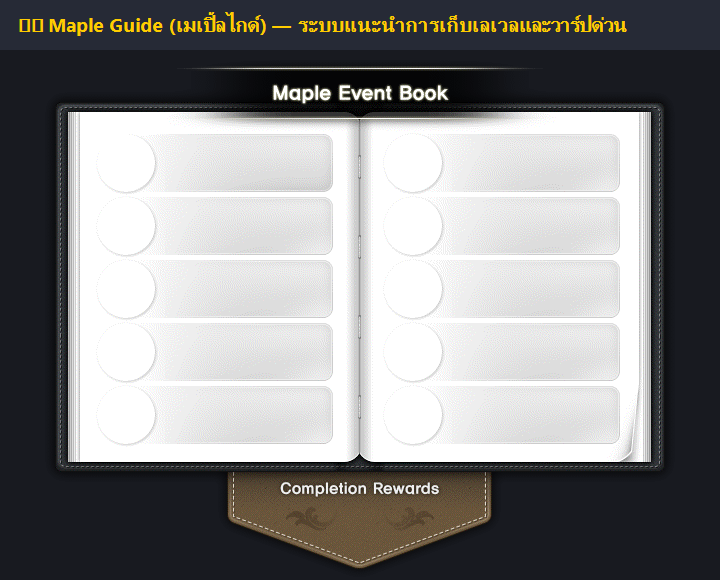

# 🗺️ คู่มือเก็บเลเวล 1-250 (Maple Guide)

**Maple Guide (เมเปิ้ลไกด์)** คือระบบนำทาง แนะนำสถานที่เก็บเลเวล และระบบวาร์ปด่วนอัจฉริยะที่ติดตั้งอยู่ภายในเกม **Clover Idle Story (KMS v232.2)** โดยระบบจะคัดสรรดันเจี้ยนและแผนที่ฟาร์มที่เหมาะสมกับเลเวลของผู้เล่นโดยอัตโนมัติ ช่วยให้คุณสามารถวาร์ปไปยังจุดเก็บเลเวลที่ดีที่สุดได้ทันทีโดยไม่ต้องเสียเวลาเดินข้ามทวีป!

***

## 🎮 ภาพประกอบและวิธีเปิดใช้งาน Maple Guide ในเกม



### 3 ขั้นตอนง่ายๆ ในการเปิดไกด์และวาร์ปทันที:

1. **ขั้นตอนที่ 1 (เปิดไกด์):** กดปุ่มตัวอักษร **`[ U ]`** บนคีย์บอร์ด (หรือคลิกไอคอนฟันเฟือง **Setting** หรือปุ่ม **Menu** ที่แถบขวาล่างของหน้าจอ แล้วเลือกหัวข้อ **Maple Guide**)
2. **ขั้นตอนที่ 2 (เลือกแผนที่):** ระบบจะแสดงรายการแผนที่และดันเจี้ยนที่เหมาะสมกับเลเวลปัจจุบันของคุณ สามารถคลิกเลือกสถานที่ที่ต้องการได้ทันที
3. **ขั้นตอนที่ 3 (วาร์ปฟรีทันที):** กดปุ่ม **"Move"** (หรือดับเบิ้ลคลิกที่รูปแผนที่) ตัวละครของคุณจะเทเลพอร์ตไปยังแผนที่เป้าหมายทันที ฟรีไม่มีค่าใช้จ่าย!

***

## 📖 หน้าต่างเต็มของระบบ Maple Guide (Content Stamp Book)



> 💡 **ระบบแสตมป์เนื้อหา (Content Stamp):**\
> เมื่อผู้เล่นกำจัดมอนสเตอร์หรือทำเควสต์ในแผนที่ที่ไกด์แนะนำครบตามเป้าหมาย จะได้รับ **"ตราประทับสีทอง (Gold Stamp)"** ซึ่งมีสิทธิพิเศษคือ **คุณสามารถกดวาร์ปกลับมายังแผนที่นั้นได้ตลอดเวลา แม้เลเวลจะเกินช่วงแนะนำไปแล้วก็ตาม!**

***

## ⚔️ เส้นทางเก็บเลเวล 1 - 250 ฉบับบอทฟาร์มไวที่สุด (`@bot`)

***

### 🔰 ช่วงที่ 1: เลเวล 1 – 30 (ก้าวแรกสู่โลกเมเปิ้ล)

|    ช่วงเลเวล    | แผนที่แนะนำ                     | มอนสเตอร์                   | วิธีเดินทาง / จุดเด่น                                                                      |
| :-------------: | ------------------------------- | --------------------------- | ------------------------------------------------------------------------------------------ |
|  **Lv. 1 - 10** | **แผนที่เริ่มเกมของแต่ละอาชีพ** | มอนสเตอร์เควสต์เนื้อเรื่อง  | ทำเควสต์ตามสายอาชีพเพื่อเรียนรู้สกิลเริ่มต้น                                               |
| **Lv. 10 - 30** | **Henesys: Golem's Temple**     | Stone Golem / Flaming Golem | เปิด Maple Guide วาร์ปไปยัง Henesys แล้วเดินไปดงโกเลม มอนสเตอร์เกิดเยอะ เหมาะกับสกิลคลาส 1 |

* 💡 **คำสั่งเปลี่ยนอาชีพ:** เมื่อเลเวล 10 และ 30 พิมพ์ **`@job`** ในช่องแชทเพื่อเปลี่ยนคลาสทันที

***

### 🌊 ช่วงที่ 2: เลเวล 30 – 60 (ดันเจี้ยนธีม & ชายหาดโกลด์บีช)

|    ช่วงเลเวล    | แผนที่แนะนำ                              | มอนสเตอร์              | วิธีเดินทาง / จุดเด่น                                                                                            |
| :-------------: | ---------------------------------------- | ---------------------- | ---------------------------------------------------------------------------------------------------------------- |
| **Lv. 30 - 60** | **Gold Beach: Seaside 2**                | ปู / ปลาดาว (Starfish) | **\[แนะนำอันดับ 1]** ผ่าน Maple Guide เลือก Gold Beach แผนที่เป็นเส้นตรงยาว มอนสเตอร์เกิดแน่น บอทฟาร์มได้สบายมาก |
| **Lv. 30 - 60** | **Riena Strait / Ellinel Fairy Academy** | มอนสเตอร์ตามเควสต์     | ทำเควสต์เนื้อเรื่องดันเจี้ยนธีม ได้รับทั้ง EXP ก้อนโตและอุปกรณ์สวมใส่เริ่มต้น                                    |

***

### 🌲 ช่วงที่ 3: เลเวล 60 – 100 (คลาส 3 สู่คลาส 4)

|     ช่วงเลเวล    | แผนที่แนะนำ                      | มอนสเตอร์                  | วิธีเดินทาง / จุดเด่น                                                                                     |
| :--------------: | -------------------------------- | -------------------------- | --------------------------------------------------------------------------------------------------------- |
|  **Lv. 60 - 75** | **Sleepywood: Silent Swamp**     | **Copper Drake (เดรกส้ม)** | **\[แมพระดับตำนาน]** วาร์ปผ่าน Maple Guide แผนที่แคบ 3 ชั้น มอนสเตอร์หนาแน่นที่สุด ฟาร์มเลเวลพุ่งไวมาก    |
|  **Lv. 75 - 85** | **Orbis: Stairway to the Sky I** | Cellion / Lioner / Grupin  | แผนที่บันไดสวรรค์ มีสปริงเด้ง มอนสเตอร์ให้ EXP สูง                                                        |
| **Lv. 85 - 100** | **Nihal Desert: Sahel 2**        | Sand Mole / Scorpion       | **\[แมพเส้นตรงยอดฮิต]** ทะเลทรายซาเฮล 2 พื้นที่แบนราบ 100% ตัวละครเปิด `@bot` วิ่งกวาดซ้าย-ขวาไม่มีตกแท่น |
| **Lv. 90 - 100** | **Magatia: Lab - Area C-2**      | Roid / Neo Huroid          | ห้องทดลองหุ่นยนต์ C-2 แมพแบน วิ่งกวาดมอนสเตอร์ง่าย                                                        |

* 💡 **คำสั่งเปลี่ยนอาชีพ:** เมื่อเลเวล 60 และ 100 พิมพ์ **`@job`** เพื่อเปลี่ยนเป็นคลาส 3 และคลาส 4

***

### ⭐ ช่วงที่ 4: เลเวล 100 – 140 (Star Force Maps แดนคูณ EXP)

> ⚠️ **ข้อควรรู้เกี่ยวกับ Star Force (★):**\
> มอนสเตอร์ในแผนที่ Star Force จะมีเลือดและพลังโจมตีสูงกว่าปกติ แต่ให้ **ค่าประสบการณ์ (EXP) สูงกว่ามอนสเตอร์ทั่วไป 3-5 เท่า!** ควรตีบวกดาวอุปกรณ์ให้ครบตามที่กำหนด

|     ช่วงเลเวล     | แผนที่แนะนำ                             | มอนสเตอร์                     |   Star Force (★)  | จุดเด่น                                                       |
| :---------------: | --------------------------------------- | ----------------------------- | :---------------: | ------------------------------------------------------------- |
| **Lv. 100 - 115** | **Minar Forest: Sky Nest II**           | Blood Harp (นกพิราบแดง)       |    **★ 5 ดาว**    | มอนสเตอร์หนาแน่นมาก ตีบวกดาวเพียง 5 ดาวก็ฟาร์มได้สบาย         |
| **Lv. 115 - 130** | **Ludibrium: Warped Path of Time 3/4**  | Dual Ghost Pirate (โจรสลัดผี) | **★ 26 - 28 ดาว** | หอคอยลูดีเบรียม มอนสเตอร์เกิดรวดเร็ว EXP มหาศาล               |
| **Lv. 130 - 140** | **El Nath: The Cave of Trial II / III** | Bain / Cerberus               | **★ 50 - 55 ดาว** | ดงถ้ำลาวาใต้เหมืองหิมะ มอนสเตอร์ตัวใหญ่ เลเวลพุ่งอย่างรวดเร็ว |

***

### 🔥 ช่วงที่ 5: เลเวล 140 – 200 (Hyper Skills สู่ 5th Job)

|     ช่วงเลเวล     | แผนที่แนะนำ                                     | มอนสเตอร์                             | Star Force (★) | จุดเด่น                                                                                                              |
| :---------------: | ----------------------------------------------- | ------------------------------------- | :------------: | -------------------------------------------------------------------------------------------------------------------- |
| **Lv. 140 - 160** | **Leafre: Black Wyvern's Nest**                 | Dark Wyvern (มังกรดำ)                 |  **★ 65 ดาว**  | รังมังกรดำในตำนาน แผนที่กว้าง มอนสเตอร์ให้ EXP สูงมาก                                                                |
| **Lv. 140 - 160** | **Temple of Time: Road of Oblivion**            | Chief Qualm Monk / Oblivion           |    ไม่ใช้ดาว   | ทางเดินแห่งความทรงจำ ทำเควสต์ทางผ่านเพื่อปลดล็อคบอส Pink Bean                                                        |
| **Lv. 160 - 180** | **Kerning Tower: 2F / 5F Cafe**                 | Enraged Espresso Machine / Steamer    |  **★ 80 ดาว**  | **\[จุดฟาร์มดีที่สุดช่วง 160+]** หอคอยเคอร์นิ่ง มอนสเตอร์เกิดถี่มาก เลเวลขึ้นไวที่สุด                                |
| **Lv. 180 - 190** | **Twilight Perion: Desolate Hills**             | Swollen Stump                         |    ไม่ใช้ดาว   | เพเรียนยามเย็น แผนที่กว้าง มอนสเตอร์เลือดเยอะ                                                                        |
| **Lv. 190 - 200** | **Twilight Perion: Forsaken Excavation Site 2** | Sinister Wooden Mask (หุ่นหน้ากากไม้) |    ไม่ใช้ดาว   | **\[แมพยอดฮิตอันดับ 1 ก่อนคลาส 5]** แผนที่ FES 2 มอนสเตอร์เกิดชุกชุม เปิด `@bot` ฟาร์มจนถึงเลเวล 200 ได้อย่างง่ายดาย |

***

### 🌌 ช่วงที่ 6: เลเวล 200 – 250 (Arcane River ดินแดนแม่น้ำแห่งสายธาร)

> 🔮 **ระบบ Arcane Force (ARC):**\
> เมื่อเปลี่ยนเป็น 5th Job (เลเวล 200) และทำเควสต์ปลดล็อคหิน **Arcane Symbol** คุณต้องมีค่า Arcane Force เท่ากับหรือมากกว่าที่แผนที่กำหนด หากค่า ARC สูงกว่ามอนสเตอร์ 1.5 เท่า ตัวละครจะสร้างดาเมจได้แรงขึ้นถึง **150%** และมอนสเตอร์จะโจมตีเข้าเพียง **1 ดาเมจ!**

|     ช่วงเลเวล     | ภูมิภาค               | แผนที่ฟาร์มแนะนำ                              | ค่า ARC ที่ต้องการ | จุดเด่นของแผนที่                                                                                        |
| :---------------: | --------------------- | --------------------------------------------- | :----------------: | ------------------------------------------------------------------------------------------------------- |
| **Lv. 200 - 210** | **Vanishing Journey** | **Below the Cave** (ถ้ำใต้หน้าผา)             |     **ARC 60**     | แผนที่ยอดนิยม มีแท่นยืน 2 ชั้น มอนสเตอร์หนาแน่น                                                         |
| **Lv. 210 - 220** | **Chu Chu Island**    | **Torrent Zone 3** / **Slurpy Forest Depths** |  **ARC 100 - 160** | ดงป่าลึกชูชูและล่องแพน้ำตก มอนสเตอร์ EXP สูงลิบลิ่ว                                                     |
| **Lv. 220 - 225** | **Lachelein**         | **Chicken Festival 2** / Revelation City 3    |     **ARC 210**    | เมืองแห่งความฝันราตรี เทศกาลไก่ 2 วิ่งกวาดเป็นวงกลมง่าย                                                 |
| **Lv. 225 - 230** | **Arcana**            | **Cavern Lower Path (CLP)**                   |     **ARC 360**    | **\[แผนที่ฟาร์มบอทอันดับ 1 ตลอดกาล]** ถ้ำล่างอาคาน่า พื้นราบเรียบ มอนสเตอร์เกิดติดๆ กัน ฟาร์มสบายที่สุด |
| **Lv. 230 - 235** | **Morass**            | **That Day in Trueffet 2 / 3**                |     **ARC 480**    | ปราสาทมรกตมอรัส มอนสเตอร์ตัวใหญ่ ให้ทั้งเงิน Meso และ EXP มหาศาล                                        |
| **Lv. 235 - 245** | **Esfera**            | **Mirror-touched Sea 2 / 7**                  |  **ARC 600 - 640** | ทะเลกระจกเอสเฟร่า แผนที่กว้าง ฟาร์มร่วมกับสกิลติดตั้ง 5th Job ช่อง 3-4                                  |
| **Lv. 245 - 250** | **Moonbridge**        | **Void Current 3** / Last Horizon             |  **ARC 730 - 760** | สะพานข้ามจันทรา ประตูสู่บอสยักษ์ Gloom มอนสเตอร์ระดับสูงสุดก่อนเข้าสู่อาณาจักร Grandis                  |

***

## 🏆 ตารางสรุปย่อเส้นทางเร่งรัด (Speedrun Roadmap 1 - 250)

```
Lv. 1-30     : เควสต์เนื้อเรื่องอาชีพ -> Henesys Golem Temple
Lv. 30-60    : Maple Guide -> Gold Beach (Seaside 2)
Lv. 60-75    : Maple Guide -> Sleepywood (Silent Swamp - Copper Drake)
Lv. 75-85    : Maple Guide -> Orbis (Stairway to the Sky I)
Lv. 85-100   : Maple Guide -> Sahel 2 (ทะเลทรายซาเฮล)
Lv. 100-115  : Minar Forest -> Sky Nest II (★ Star Force 5)
Lv. 115-130  : Ludibrium -> Warped Path of Time 3 (★ Star Force 26)
Lv. 130-145  : El Nath -> The Cave of Trial II/III (★ Star Force 55)
Lv. 145-165  : Leafre -> Black Wyvern's Nest (★ Star Force 65)
Lv. 165-180  : Kerning Tower -> 2F / 5F Cafe (★ Star Force 80)
Lv. 180-200  : Twilight Perion -> Forsaken Excavation Site 2 (FES 2)
Lv. 200-210  : Vanishing Journey -> Below the Cave (ARC 60)
Lv. 210-220  : Chu Chu Island -> Slurpy Forest / Torrent Zone 3 (ARC 100-160)
Lv. 220-225  : Lachelein -> Chicken Festival 2 (ARC 210)
Lv. 225-230  : Arcana -> Cavern Lower Path [CLP] (ARC 360)
Lv. 230-235  : Morass -> That Day in Trueffet 2 (ARC 480)
Lv. 235-245  : Esfera -> Mirror-touched Sea 2 (ARC 640)
Lv. 245-250  : Moonbridge -> Void Current 3 (ARC 760)
```

***

## 💡 เทคนิคระดับโปรสำหรับสายฟาร์มบอท (`@bot`) ใน Clover Idle

1. **เปิดใช้งาน**  [**Merchant Blessing**](../and-systems/merchant-blessing.md)**:**
   * ได้รับโบนัส **EXP +50%**, **Drop Rate +50%**, **Meso +50%**
   * ปลดล็อคเงื่อนไขในการเปิดใช้งานบอท `@bot` / `@autoplay`
2. **ติดตั้งสัตว์เลี้ยงดูดของทั้งแมพ (** [**Map-Wide AutoLoot**](../and-systems/pet-system.md)**):**
   * เก็บไอเทมและเงิน Meso ทั่วทั้งแมพทันทีที่มอนสเตอร์ตาย ตัวละครไม่ต้องเสียเวลาเดินเก็บของ
3. **จัดสกิลลงปุ่มลัดช่อง 1 ถึง 4 ตาม** [**คู่มือแนะนำ 50 อาชีพ**](../and-50-classes/classes-overview/)**:**
   * วางสกิลกวาดแมพหลักไว้ที่ช่อง `[1]`
   * วางสกิลคูลดาวน์สั้นไว้ที่ช่อง `[2]`
   * วางสกิลเคลียร์ทั้งหน้าจอ / สกิล 5th Job ไว้ที่ช่อง `[3]`
   * วางสกิลเรียกตัวช่วยโจมตี / ป้อมปืนไว้ที่ช่อง `[4]`
4. **กระเป๋าเต็ม พิมพ์ `@sale` ได้ทันที:**
   * ไม่ต้องวาร์ปกลับเมืองเพื่อขายของ เพียงพิมพ์ **`@sale`** ในช่องแชท หน้าร้านรับซื้อของจะเปิดขึ้นมาให้ขายไอเทมขยะแลกเป็นเงิน Meso ได้ทันที!
